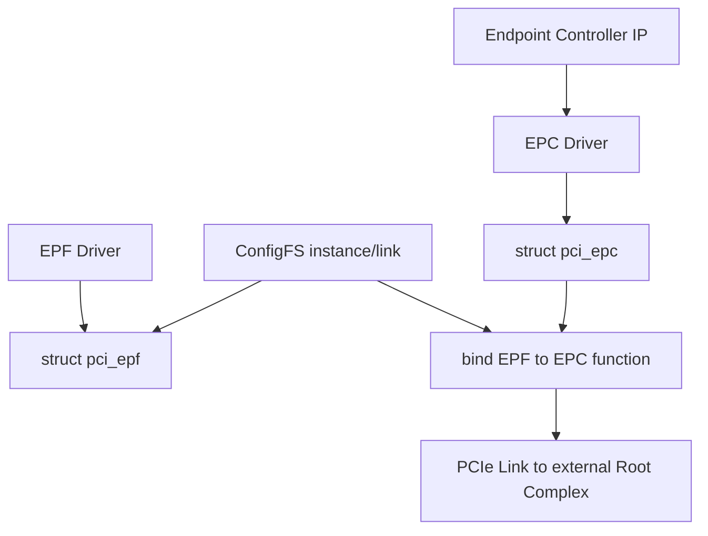
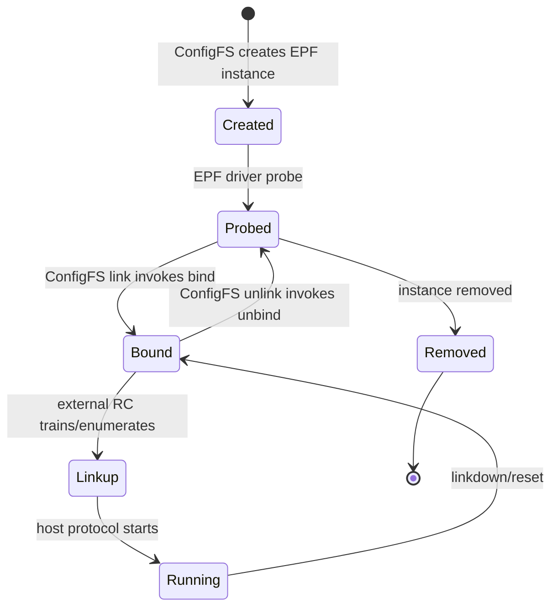
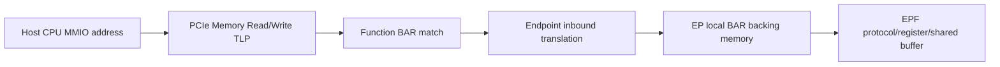
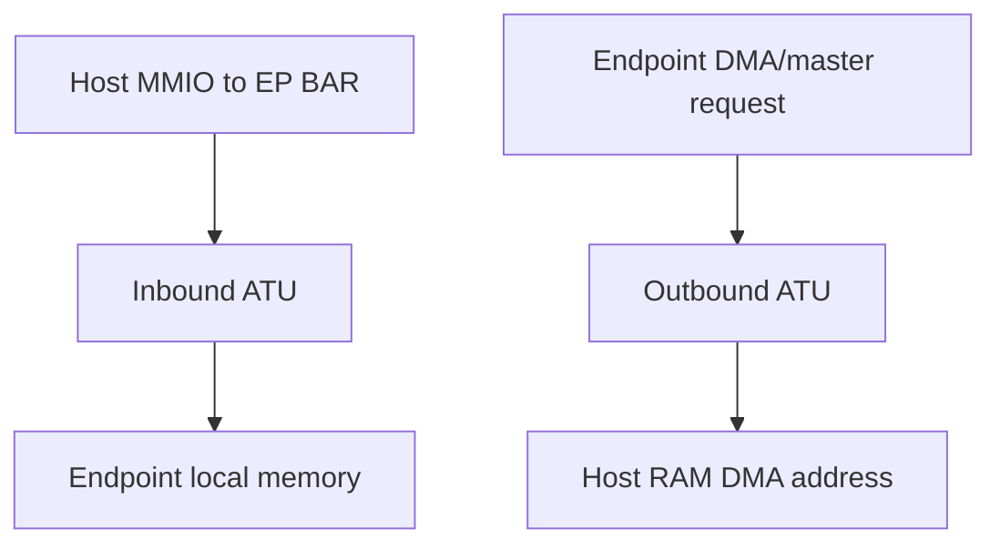
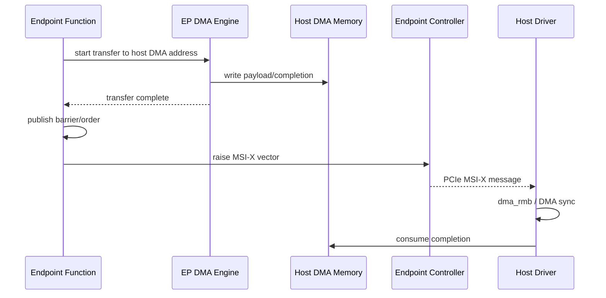
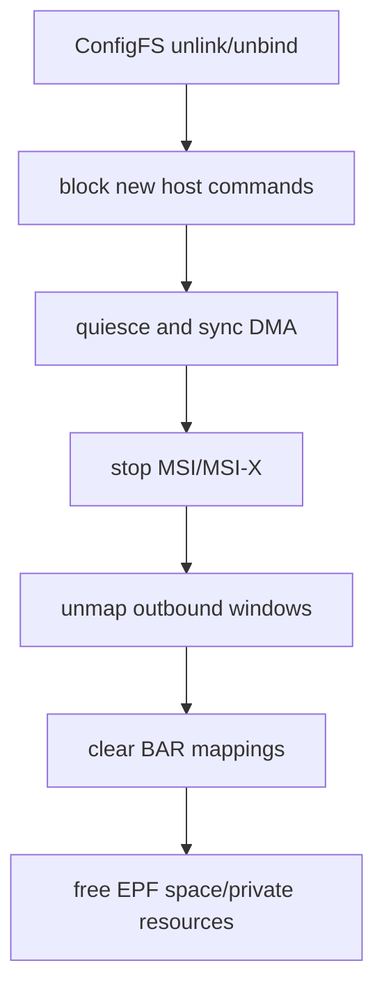

多数 PCIe Linux Driver 运行在 Root Complex 一侧，管理被枚举的 Endpoint。

但一些 SoC/FPGA 也能工作在 Endpoint 模式，让另一台 Host 把它枚举成网卡、加速器、共享内存或自定义设备。

Endpoint 侧需要完成：

- 构造 Configuration Header 和 Capability。
- 提供 BAR Backing Memory。
- 配置 Inbound/Outbound Address Translation。
- 响应 Linkup/Reset/Unbind。
- 向 Host 触发 Legacy/MSI/MSI-X Interrupt。
- 在 DMA 前确认 Host 提供的地址和所有权。

Linux PCI Endpoint Framework 把 Controller IP 与 Function 功能分开。

本文固定以 Linux 6.12 为基线。

## 一、Endpoint Framework 的三类角色

PCI Endpoint Controller（EPC）Driver 管理具体 EP Controller IP。

PCI Endpoint Function（EPF）Driver 实现一个可枚举 Function 的功能语义。

ConfigFS/用户配置把某个 EPF 实例绑定到某个 EPC Function Number。



EPC Driver 不应内置每个产品功能协议。

EPF Driver 不应直接操作某个控制器私有寄存器。

两者通过 `pci_epc_*` 公共 API 协作。

## 二、struct pci_epc 表示控制器能力与资源

`struct pci_epc` 由 EPC Driver 创建和注册。

它关联：

- `pci_epc_ops`：write_header、set_bar、clear_bar、map_addr、unmap_addr、raise_irq、start/stop 等。
- 最大 Function/Virtual Function 数。
- BAR 限制与 Features。
- Address Space 分配器。
- Controller Device 与 ConfigFS Group。

EPC Driver 在 probe 中取得寄存器、clock、reset、PHY、IRQ、Power Domain 与 ATU Window。

只有 Controller 硬件就绪后才注册 EPC。

remove 时先停止 Link/解绑 EPF，再注销 EPC 和释放寄存器。

## 三、struct pci_epf 表示一个 Function 实例

`struct pci_epf` 由 EPF Core/Driver 创建。

它保存：

- Function Name/Driver。
- `pci_epf_header` 配置头模板。
- BAR Descriptor/Backing Memory。
- 绑定的 EPC 与 Function Number。
- Primary/Secondary Interface（某些控制器支持）。
- Function 私有数据。

同一种 EPF Driver 可以创建多个实例，分别绑定不同 EPC 或 Function Number。

实例私有内存不能放在全局静态变量中，否则多个实例会互相覆盖。

## 四、EPF Driver 的 probe、bind 与 unbind

EPF Driver 典型 callback：

- `probe()`：为 EPF 实例分配软件私有对象。
- `bind()`：已选择 EPC/FN，配置 Header、BAR 与 Controller 资源。
- `unbind()`：撤销 Controller 资源和数据面。



probe 时通常还不知道绑定哪个 EPC，因此不能调用 EPC 硬件 API。

bind 才是 Controller Resource 的获取边界。

unbind 必须能在 Host 仍有 open driver、Link 已掉或 DMA 异常的情况下安全收敛。

## 五、Configuration Header 由 EPF 提供语义

EPF 使用 `struct pci_epf_header` 描述：

- Vendor/Device ID。
- Revision ID。
- Class Code/Programming Interface。

Subsystem 与 Capability 的支持方式取决于 Framework/API 和 Controller 能力。

bind 中通过 `pci_epc_write_header()` 把 Function Header 交给 EPC。

Host 枚举时读取的是 Controller 暴露的配置空间结果。

Class Code 会影响 Host 自动加载何种 Driver，不能随意填写。

自定义实验 Function 应使用合法 Vendor/Device ID 策略，避免冒充真实产品。

## 六、BAR 有三层含义

谈 Endpoint BAR 时必须区分：

1. Host 配置空间中的 BAR Register/Address。
2. Endpoint Controller 的 Inbound Translation Window。
3. Endpoint 本地 Backing Memory/Registers。

Host 为 BAR 分配 PCI Address。

Host 对该地址发 Memory TLP。

EPC 把 TLP 地址翻译到 EP 本地 Backing Memory。



`pci_epc_set_bar()` 配置这一 Host 可见窗口。

它不会自动给 Endpoint 一个可 DMA 到 Host RAM 的地址。

## 七、BAR Size、Alignment 与 Controller Feature

EPF 不能任意请求 BAR Size。

PCI BAR 一般要求 2 的幂和相应对齐，最小大小受类型/规范约束。

Controller 还可能限制：

- 哪些 BAR 可用。
- Fixed Size/Reserved BAR。
- 32-bit/64-bit。
- Prefetchable 属性。
- BAR Pair。
- 最小/最大 Inbound Window。

EPF 应通过 `pci_epc_get_features()` 获取 EPC Feature，并调整 BAR 设计。

如果 Controller 要求 1 MiB 对齐，而 Function 只申请 4 KiB，bind 应明确失败或按 Framework 规则调整，不能静默越界映射。

## 八、分配 BAR Backing Memory

Endpoint Framework 提供 `pci_epf_alloc_space()`/`pci_epf_free_space()` 等帮助 Function 分配适合 BAR 的空间。

返回 CPU 可访问地址和物理/Controller 所需信息由 API 管理。

BAR 内容可设计为：

- 版本与 Capability Register。
- Command/Status Ring。
- Doorbell/Interrupt Control。
- 小块 Shared Memory。

不要把无限大的数据 Buffer 都塞进 BAR。

BAR MMIO 适合控制面和有限共享窗口，大数据常用 DMA 到 Host Buffer。

## 九、Inbound 与 Outbound Translation 是两个方向

Inbound：Host 发 TLP 访问 EP BAR，转换到 EP Local Address。

Outbound：EP 发 Memory TLP 访问 Host 提供的 PCI Address。



`pci_epc_map_addr()`/`pci_epc_unmap_addr()` 管理 EP Local Address 到 PCI Address 的 Outbound Mapping（具体约束看 EPC）。

Host RAM Address 必须由 Host Driver 通过 DMA API 获得并通过双方协议传给 EP。

不能把 Host CPU Virtual Address 或任意 Physical Address写给 EP。

## 十、Host DMA Address 是不可信协议输入

Host Driver 可能通过 BAR Register/Command Descriptor 告诉 EP：

- DMA Address。
- Length。
- Direction。
- Request ID/Generation。

Endpoint 必须验证：

- Length 上限与对齐。
- Address 是否满足 EPC/DMAC 位宽。
- Range 加法不溢出。
- Request 状态与所有权。
- IOMMU/PASID 等高级模式是否真的协商。

EP 不能知道 Host IOMMU Mapping 的真实边界，只能依赖 Host Driver 的正确 DMA API 与协议隔离。

产品协议应使用 Capability、Queue Bounds 和认证/隔离降低错误/恶意 Host 风险。

## 十一、Endpoint DMA 的两种实现路径

有些 EPC 包含 DMA Engine。

有些 SoC 使用通用 DMAengine Controller。

还有些 EP 通过 CPU/PIO 访问 Window，仅适合小数据。

无论实现，状态机都应包含：

```text
HOST_OWNS_BUFFER
  -> EP maps outbound window
  -> EP DMA in flight
  -> EP unmaps window
  -> EP publishes completion
  -> HOST reclaims buffer
```

Completion 前必须确保 DMA 写完成并具有正确内存序。

Host 收到 MSI-X 后也要 `dma_rmb()`/DMA API 同步再读结果。

## 十二、MSI 与 MSI-X 的产生

Host 枚举时配置 MSI/MSI-X Capability、Message Address/Data 或 Table。

Endpoint Function 通过 EPC API 请求发中断：

```c
pci_epc_raise_irq(epc, func_no, vfunc_no,
		  PCI_IRQ_MSIX, interrupt_number);
```

Linux 6.12 的准确原型与枚举值以头文件为准。

EPF 不能假设 Host 已启用某种中断。

它应根据 EPC/Host 协议状态决定 Legacy、MSI 或 MSI-X。

MSI-X Vector Number、Queue 与 Host Driver IRQ Mapping 必须在双方协议中一致。

## 十三、中断发布前的数据可见性

EP DMA 写 Host Completion Buffer 后，必须先确保数据完成/可见，再 Raise MSI-X。

Host IRQ Handler 观察中断后，要按 DMA API 与共享协议读取 Completion。



如果中断先于数据可见，Host 会读到旧 completion，形成偶发错误。

## 十四、Linkup、Linkdown 与 Core Event

EPC Driver 在 Link 训练完成后通知 Endpoint Core/EPF。

EPF 可在 Linkup 后开放协议，但不能假设 Host 已完成枚举和 Driver Probe。

Host 何时写 Command/Enable/Queue Register 才是业务就绪信号。

Linkdown 时：

- 阻止新 EP DMA。
- 停止/取消在途 DMA。
- 清理 Outbound Mapping。
- 增加 generation。
- 不再 Raise Interrupt。
- 等待下一次 Host 初始化。

Linkup 与业务 Running 是两层状态。

## 十五、ConfigFS 绑定流程

典型 ConfigFS 语义：

1. 在 `pci_ep/functions/<driver>.<instance>` 创建 EPF Instance。
2. 配置 Vendor/Device/Class/BAR 等允许属性。
3. 在 `pci_ep/controllers/<epc>/` 下建立链接，把 EPF 绑定到 Function Number。
4. 根据 Controller 接口执行 start/link。

具体目录和属性以 Linux 6.12 Endpoint ConfigFS 文档为准。

ConfigFS 操作会触发 probe/bind/unbind，属于真实硬件生命周期，不是静态配置文件编辑。

删除链接前应先让 Host Driver 停止业务，避免 Surprise Removal 与 DMA。

## 十六、unbind 的正确顺序

EPF `unbind()`：

1. 标记 Function stopping，拒绝 Host 新命令。
2. 停止 timer/work/thread。
3. 停止并同步 DMA。
4. 确认不再访问 Host Memory。
5. 停止中断产生。
6. `pci_epc_unmap_addr()` 撤销所有 Outbound Window。
7. `pci_epc_clear_bar()` 撤销 Inbound BAR。
8. `pci_epf_free_space()` 释放 BAR Backing。
9. 清除 EPC/Function 关联与私有状态。



先 free BAR Backing 再 clear BAR，会让 Host TLP 访问已释放内存。

先 unmap Outbound 再停 DMA，会让在途 DMA 使用失效 Window。

## 十七、Reset 与 PERST#

外部 Host 可通过 PERST# 执行 Fundamental Reset，或触发 Hot Reset/FLR。

EPC Driver 负责检测硬件事件并通知 Framework。

EPF 必须把 reset 视为业务状态丢失：

- 停止 DMA。
- 清 Queue/Request。
- 增加 generation。
- 恢复 Header/BAR/Capability（按 EPC 行为）。
- 等待 Host 重新配置和启用。

不能在 PERST# Assert 时继续访问 Host Memory。

Host IOMMU Mapping 可能已经撤销。

## 十八、一个最小共享内存 Function 的协议

可定义 BAR0 Control Page：

```text
0x000 VERSION
0x004 CAPABILITY
0x008 COMMAND
0x00c STATUS
0x010 HOST_DMA_ADDR_LO
0x014 HOST_DMA_ADDR_HI
0x018 LENGTH
0x01c REQUEST_ID
0x020 GENERATION
0x024 DOORBELL
```

状态机：

1. Host 读取 Version/Capability。
2. Host 用 DMA API 分配/映射 Buffer。
3. Host 写 Address/Length/ID/Generation。
4. Host Barrier 后写 Doorbell。
5. EP 验证并执行 DMA。
6. EP 写 Status/Bytes，Barrier 后 Raise MSI-X。
7. Host 消费、unmap/free。

寄存器只是教学协议，真实产品需定义字节序、并发、超时、安全和 reset。

## 十九、EPC Driver 与 EPF Driver 的错误边界

EPC Driver 错误：

- ATU Window 编程不正确。
- BAR Feature/Alignment 报告错误。
- Link Event 丢失。
- Raise IRQ 实现错误。
- Controller PM/Reset 不完整。

EPF Driver 错误：

- Host 命令验证不足。
- DMA/Request 所有权错误。
- unbind 未同步 work/DMA。
- 中断与 Completion 可见顺序错误。
- generation/reset 协议不完整。

先用 Framework 自带 Test Function/Host Test Driver 验证 EPC，再调产品 EPF，可以缩小边界。

## 二十、性能设计

高吞吐 EPF 应考虑：

- Multi-queue 与多个 MSI-X。
- Descriptor Ring 而不是单命令寄存器。
- Outbound Window 数量/大小。
- DMA Engine 并发 Channel。
- Doorbell Batching。
- Host NUMA/IOMMU。
- BAR Control 与 DMA Data 分离。
- Queue Reset 与 Fault Isolation。

先测量 Controller/IP 的真实 Window、DMA 和 Link 能力，再决定 Queue 数。

## 二十一、验证矩阵

- Cold Boot、Host Reboot、EP Reboot。
- PERST# Assert/Deassert。
- ConfigFS bind/unbind 重复。
- Host Driver load/unload。
- Linkdown during DMA。
- Host timeout/reset during EP DMA。
- MSI/MSI-X Vector 数变化。
- IOMMU On/Off。
- Length/Address overflow 输入。
- Queue Full 与 generation wrap。
- Runtime/System PM（若 EPC 支持）。

每次都确认不再存在旧 DMA、旧 Mapping、旧 MSI 和已释放 BAR 访问。

## 二十二、Linux 6.12 源码入口

- `include/linux/pci-epc.h`
- `include/linux/pci-epf.h`
- `drivers/pci/endpoint/pci-epc-core.c`
- `drivers/pci/endpoint/pci-epf-core.c`
- `drivers/pci/endpoint/pci-ep-cfs.c`
- `drivers/pci/endpoint/functions/pci-epf-test.c`
- 具体 Controller 的 EPC Driver

以 Core API 调用边界追踪，不要从某个 Controller 寄存器文件反推所有 EPF 语义。

## 二十三、一手资料

- [Linux 6.12 PCI Endpoint Framework](https://www.kernel.org/doc/html/v6.12/PCI/endpoint/pci-endpoint.html)
- [Linux PCI Endpoint ConfigFS](https://docs.kernel.org/PCI/endpoint/pci-endpoint-cfs.html)
- [Linux stable Endpoint source](https://git.kernel.org/pub/scm/linux/kernel/git/stable/linux.git/tree/drivers/pci/endpoint?h=linux-6.12.y)
- [PCI-SIG specifications](https://pcisig.com/specifications)

## 二十四、小结

Linux PCI Endpoint Framework 用 EPC 隔离 Controller IP，用 EPF 表达 Function 协议，用 ConfigFS 组合实例。

EPF probe 管理实例软件对象，bind 取得 EPC/FN 后配置 Header、BAR 与数据面，unbind 逆序停止 DMA、IRQ、Window 和 Backing Memory。

BAR Address、Inbound Translation 与 EP Local Backing 是三层不同概念。

EP 访问 Host RAM 需要 Host Driver 通过 DMA API 提供 DMA Address，并由 Outbound Window/DMA Engine 使用。

`pci_epc_set_bar()` 不会生成 Host DMA Address。

MSI/MSI-X 只能在 Completion 数据可见后 Raise。

Linkup 不等于 Host Driver 已就绪，业务状态要由双方协议确认。

PERST#/Hot Reset/Linkdown 后所有旧 Host Mapping 与 Request 都应视为失效并增加 generation。

掌握这些所有权和地址域边界，才能从简单 Test Function 走向可靠的共享内存、加速器或高速采集 Endpoint。
