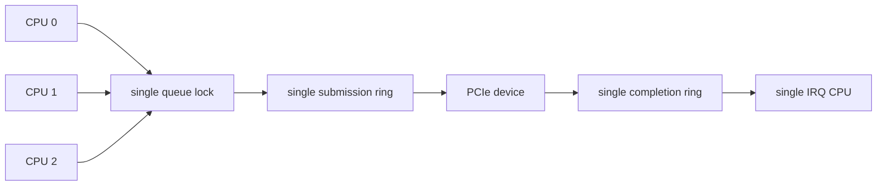
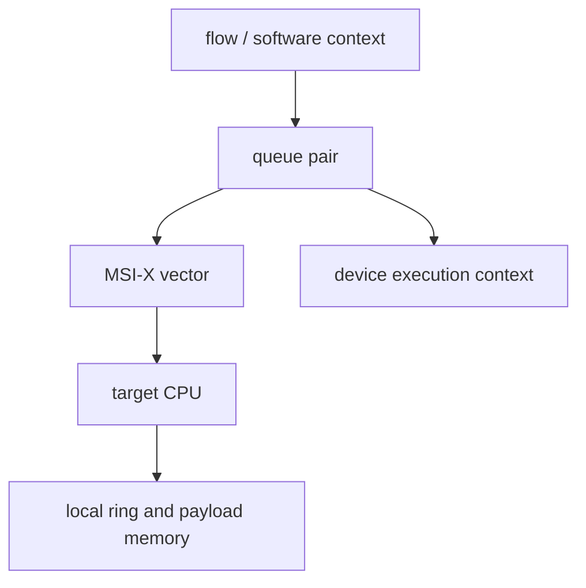
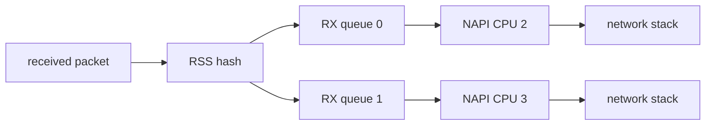
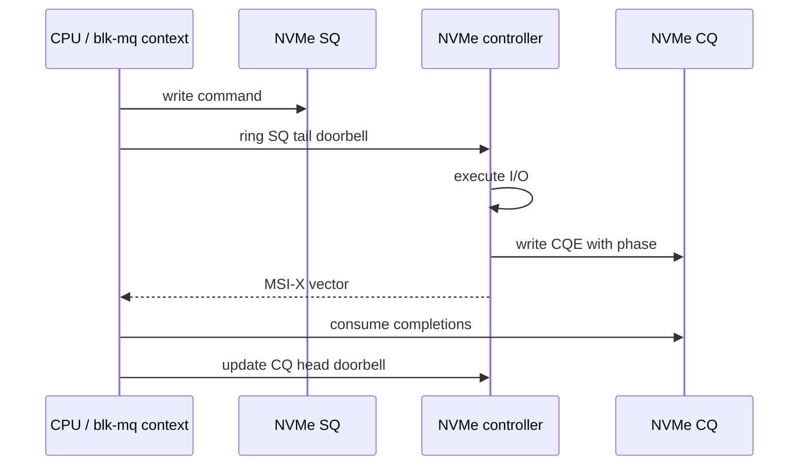
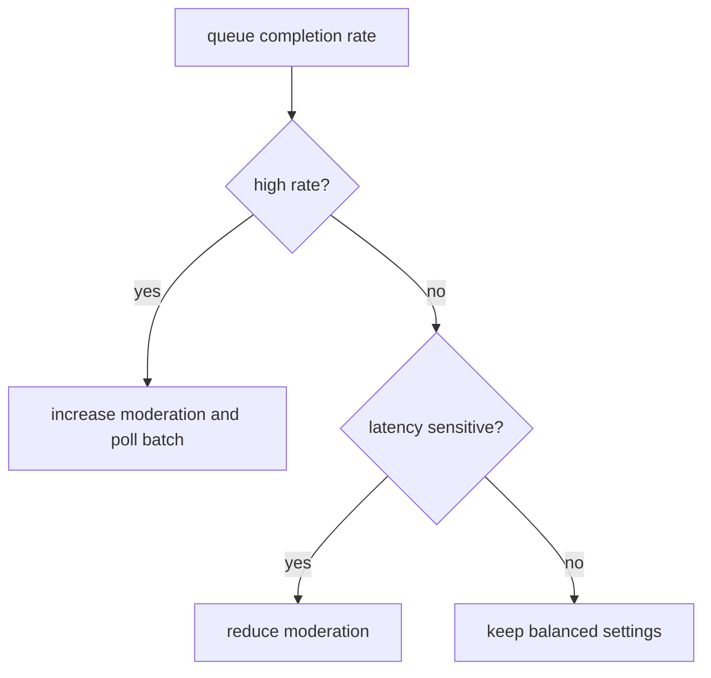
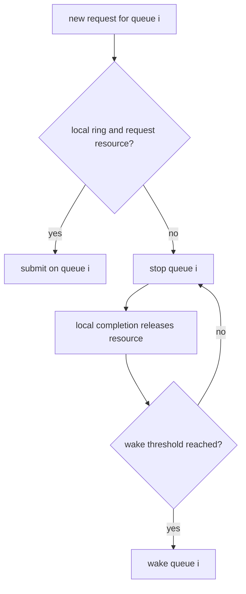

第 09 篇已经解释 Descriptor Ring 的正确性，第 13 篇也给出了 MPS、Tag、Credit 和 Queue Depth 的性能模型。但在多核系统上，即使单 Ring 已经跑满一个 CPU，增加 Link Speed 仍可能没有收益。问题变成：怎样把请求、Completion 和中断分散到多个 CPU，同时保持每条 Queue 的所有权和 Reset 边界？

Multi-Queue 不是简单复制数组。每个 Queue 需要 Descriptor、Producer/Consumer、Request Table、Doorbell、Vector、CPU Affinity、Memory Placement 和 Backpressure；Queue 之间还要共享 Device Reset、Admin Command 与全局 Resource。

本文以 Linux 6.12 为基线，用多队列网卡与 NVMe 作对照。设备只是说明同一架构模式的不同实现，私有寄存器和 Queue 数量不构成 PCIe 通用要求。

## 一、为什么单队列先卡在 CPU 而不是 Link

单队列通常只有一个 Producer Lock、一个 Completion Consumer 和一个 IRQ/Poll Context。多个 CPU 提交时争用同一 Cache Line，Completion 又集中到一个 CPU，最终某个 Core 满载而 PCIe Link 仍有空闲。



因此，增加 Queue 后，每个 CPU/Flow 可以使用独立 Ring 和 Vector，减少 Lock 与 Cache Line 迁移。但 Queue 数超过 Device Execution Slot、MSI-X Vector、CPU 或 Memory Bandwidth 后，继续增加只会扩大管理开销。

因此目标不是“Queue 越多越好”，而是让 Queue 数匹配并行工作单元，并使每条 Queue 的 Producer、Consumer 和 IRQ 尽量落在同一 CPU/NUMA Locality。

## 二、Queue、Vector、CPU 与 Memory 构成一个映射单元

一种常见设计把 Queue Pair、MSI-X Vector、Poll Context 和 CPU 一一对应：

```text
Queue 0 -> MSI-X 0 -> IRQ 120 -> CPU 2 -> NUMA node 0 memory
Queue 1 -> MSI-X 1 -> IRQ 121 -> CPU 3 -> NUMA node 0 memory
Queue 2 -> MSI-X 2 -> IRQ 122 -> CPU 8 -> NUMA node 1 memory
Admin   -> MSI-X 3 -> housekeeping CPU
```



这不是固定规范。Vector 不足时多个 Queue 可以共享一个 IRQ；CPU 少于 Queue 时可以轮转或合并；Admin Queue 常单独保留，因为它控制 Reset、Feature 和 Queue Creation，不能被繁忙数据 Queue 饿死。

映射变化要处理 CPU Hotplug 与 IRQ Affinity。若 CPU Offline 但 Queue 仍把 Completion 发向该 CPU，Linux IRQ Core可以迁移 IRQ，Driver/Poll/Upper-Layer Queue Mapping 也要同步更新。

## 三、网卡用 RSS、TX Queue 与 NAPI 分散流量

多队列 NIC 常用 RSS Hash 把 RX Flow 分配到不同 Hardware RX Queue，每个 Queue 由对应 NAPI Poll消费；TX 则根据 Socket/Flow/CPU 选择 Software/Hardware Queue。MSI-X Vector可以按 RX/TX Queue Pair分配。



NAPI 在高负载时关闭/抑制 IRQ 并按 Budget 批量消费，Ring Empty 后 Complete、Unmask 并 Recheck。因为 Flow Affinity 影响 Cache Locality，所以 RSS Indirection、IRQ Affinity、RPS/XPS 和应用 CPU 应一起设计。

并非所有网卡都提供一 Queue 一 Vector。上一章的 rtw88 只有一个 MSI/INTx Vector，依然用多个设备 TX Queue 与一个 NAPI RX Path；它说明 Device Protocol 能力决定实际映射，不能从“网卡”类别推断 MSI-X 架构。

## 四、NVMe 用 Submission/Completion Queue Pair 分散 I/O

NVMe Controller 通常提供 Admin Queue 和多个 I/O Submission/Completion Queue。Host 把 Command 写入 SQ，Doorbell 通知 Tail；Controller 执行后写 CQE并产生 MSI-X，Host 按 Phase Tag消费并更新 CQ Head Doorbell。



Linux Block Multi-Queue 把 Software Context/Hardware Queue 与 CPU 拓扑对应。与网卡相比，NVMe Completion 不走 NAPI 网络栈，但同样需要 Queue、Vector、CPU Affinity、Doorbell Batch 和 Backpressure。

这说明 Multi-Queue 是系统架构模式，不是某个子系统 API。网卡使用 `skb`/NAPI，NVMe 使用 Request/blk-mq；底层仍是 Descriptor/Command Ownership、Completion 和通知。

## 五、Queue 数量受多个上限共同约束

可用 Queue 数至少受 Device Max Queue、MSI-X Table Size、Driver Data Structure、CPU Online 数、IOMMU/Memory Resource 和 Upper-Layer Queue 能力限制。

```text
effective queues = min(
    device queue capacity,
    available interrupt vectors,
    driver supported queues,
    useful CPU parallelism,
    upper-layer queue mapping,
    memory / DMA resource budget)
```

Vector 不足时 Driver 可以共享或减少 Queue，而不是 Probe 失败；但若最少需要 Admin + Data 两类独立通知，则应把 `min_vecs` 设置为真正功能下限。

Queue Creation 还消耗 Coherent Ring、Request Table 和 Payload Pool。大规模 Queue 在空闲时也占用内存，因此产品要按工作负载动态选择或在 Probe 时使用合理上限。

## 六、Doorbell Batch 要尊重每 Queue 的可见性

Multi-Queue 通常为每条 Queue提供 Doorbell Offset。Producer 可以批量填多个 Descriptor，再用一次 `writel()` 发布新 Tail；不同 Queue 的 Doorbell 可以由不同 CPU 并发写，但必须避免落在同一 Cache/PCIe Write Combine 语义中产生错误合并。

```text
per queue submit
  -> reserve slots
  -> map payloads
  -> fill descriptors
  -> dma_wmb
  -> publish producer
  -> ring queue-specific doorbell
```

Batch 增大减少 MMIO/TLP，但增加低负载等待。可采用“Queue 从空变非空立即 Doorbell，持续 Burst 达阈值再 Batch”的策略；最终参数由吞吐与 P99 测量决定。

Doorbell 不携带 Descriptor 内容，所以锁只保护本 Queue Producer 并不自动保证 DMA 可见性。每条 Queue 仍需要正确 Barrier 和 Ownership Protocol。

## 七、DMA Mapping 和 NUMA 决定 Queue 是否真正本地化

若 Queue 0 的 IRQ 在 CPU 2，但 Ring/Payload 来自远端 NUMA Node，Completion 处理会跨 Socket 访问内存。高吞吐下，远程 Memory 和 Cache Line Transfer 可能比 PCIe TLP Header更昂贵。

Driver/Subsystem 可以根据 `dev_to_node()`、CPU Affinity 和 Memory Policy 分配 Ring/Pool，并让应用线程与 Queue 尽量同 Node。不能硬编码 CPU Number，因为 CPU Hotplug、Virtualization 和 BIOS 拓扑会变化。

IOMMU Mapping 也可能共享 IOVA Allocator/Lock。Per-Queue Page Pool、Long-Lived Mapping 和 Batch Unmap 能降低开销，但必须在 Queue Reset/Remove 时收回全部 ownership。

## 八、Interrupt Moderation 与 Poll Budget 按 Queue 调节

不同 Queue 流量不同，一个全局 Moderation 参数可能让低流量 Queue 延迟过高、繁忙 Queue IRQ 过多。硬件若支持 Per-Queue Moderation，Driver 可以根据 Packet/Completion Rate 动态调整。



动态调节必须有滞回，避免每个采样周期来回振荡。还要保存 P99 与 CPU，而不是只追求最少 IRQ；过度 Moderation 会把 Queueing Delay 推高。

Poll Budget 也应防止单 Queue 垄断 CPU。繁忙 Queue 用完 Budget 后继续调度，其他 Queue/Softirq 仍有运行机会，这属于系统公平性而不仅是设备吞吐。

## 九、backpressure 应局部化到拥塞 Queue

Queue Full、Request ID不足、DMA Mapping失败或 Device Credit不足时，应停止对应 Queue，而不是全设备停机。局部 `backpressure` 让其他 Queue 继续工作，减少 Head-of-Line Blocking。



Wake Threshold 不应等于一个 Free Slot，否则高并发下频繁 Stop/Wake。阈值还要考虑一次 Upper-Layer Batch 可能需要多个 Descriptor/SG Entry。

全局错误、Admin Queue失效或 Link Down 才需要 Device-Wide Quiesce。区分 Queue Local 与 Device Global Scope 是高可用设计的基础。

## 十、锁、Cache Line 与所有权应按 Queue 分片

理想情况下，每条 Queue 有独立 Producer Lock/Consumer Context和 Statistics。读多写少的全局配置可以共享，但高频 Producer、Consumer、Doorbell Record 不应放在同一 Cache Line。

False Sharing 常发生在相邻 Queue Structure 中：CPU 2 更新 Queue0 Producer，CPU 3 更新 Queue1 Producer，但两个字段位于同一 Cache Line，导致持续 Cache Ping-Pong。Alignment/Padding 要以实际 Cache Line 和数据布局验证。

Lockless Ring 只有在明确 Single Producer/Single Consumer、Memory Ordering 和 Wrap Contract 时才成立。为了“无锁”省掉必要 Ownership，同样会导致覆盖或丢 Completion。

## 十一、Queue Reset 与 Device Reset 使用不同 generation

支持 Queue Reset 的设备可以只停止一条 Queue、增加 Queue Generation、取消该 Queue Request 并重建 Ring，其他 Queue继续运行。Device Reset 则影响所有 Queue、IRQ、BAR Private State 和全局 Generation。

```text
queue-local fault
  -> block queue i
  -> stop/flush queue i
  -> generation[i]++
  -> rebuild queue i
  -> reject old generation completions
  -> wake queue i

device-global fault
  -> block all queues
  -> reset function/link as required
  -> device_generation++
  -> rebuild admin/data queues and vectors
```

Generation 仍不能替代硬件停止；它只防止旧 Completion被新 Request误收。Queue Reset API 和 Scope 必须由设备公开协议支持，Driver 不能假设写零某个 Index 就完成隔离。

## 十二、性能验证要按 Queue 收集而不是只看总吞吐

总吞吐正常可能掩盖某条 Queue 饥饿。至少记录每 Queue Submit/Complete、Occupancy、Stop/Wake、IRQ/Poll、Batch、Timeout、CPU、NUMA 和 Generation，再汇总到设备级 Link/AER/IOMMU。

如果 Queue0 满载而 Queue1空闲，应检查 Flow/CPU Mapping；所有 Queue均低 Occupancy但 Link 满，瓶颈在 PCIe/TLP；Queue均高 Occupancy但 Link低，可能是 Device Engine或 Completion Path。

压力场景包括均匀流、单热点 Queue、CPU Hotplug、NUMA Cross-Node、Vector不足降级、Queue Reset和 Device Reset。只测“所有 Queue 同时顺序读写”不足以验证产品路径。

## 十三、常见误解与审查重点

现在应当能够把一条高吞吐路径表示为 Queue Pair、MSI-X Vector、CPU、NUMA Memory和 Device Execution Context，并解释网卡 RSS/NAPI 与 NVMe blk-mq/CQ虽 API不同，却共享同一个 multi-queue 架构模式。

还应能说明 Doorbell Batch、Interrupt Moderation和 Queue Depth如何影响吞吐与P99，为什么 `backpressure` 应优先局部化，Queue Generation与 Device Generation怎样隔离不同Reset Scope。

## 十四、小结

Multi-Queue 通过分片 Ring、Vector、CPU、Memory和Lock提高并行度，但有效Queue数受设备、Vector、CPU、Upper Layer和Memory共同限制。正确设计同时处理Affinity、NUMA、Batch、Moderation、Backpressure、False Sharing和Reset Generation。

下一篇不再增加新机制，而是把全系列内容组织成故障决策树：设备完全看不到、BAR失败、Driver不绑定、IRQ不增长、DMA超时、IOMMU Fault和AER恢复失败时，分别从哪一层开始收集什么证据。

**一手资料**

- [Linux 6.12 MSI Driver Guide](https://www.kernel.org/doc/html/v6.12/PCI/msi-howto.html)
- [Linux Networking Scaling](https://docs.kernel.org/networking/scaling.html)
- [Linux NVMe host source](https://git.kernel.org/pub/scm/linux/kernel/git/stable/linux.git/tree/drivers/nvme/host?h=linux-6.12.y)
