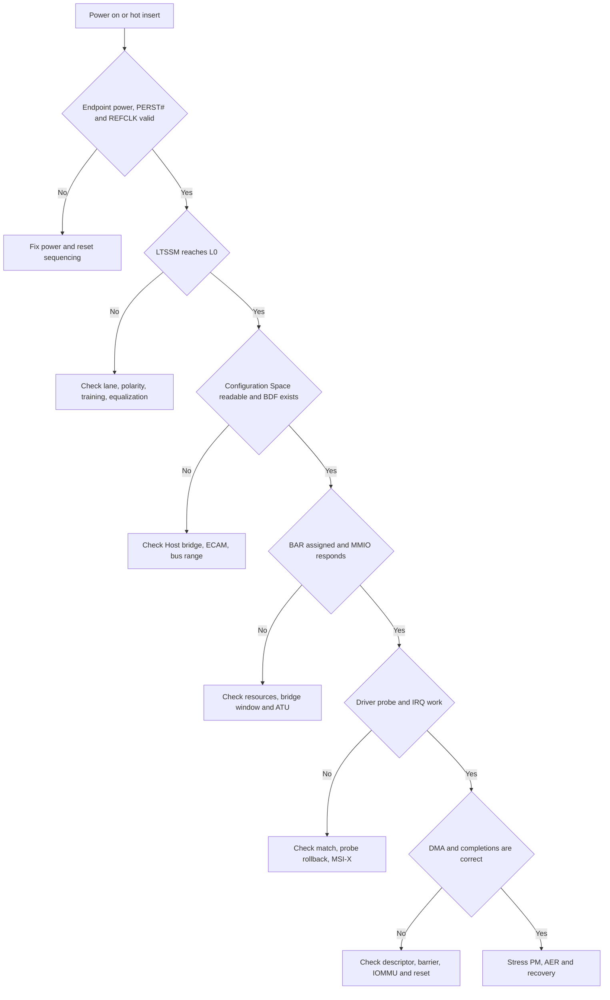
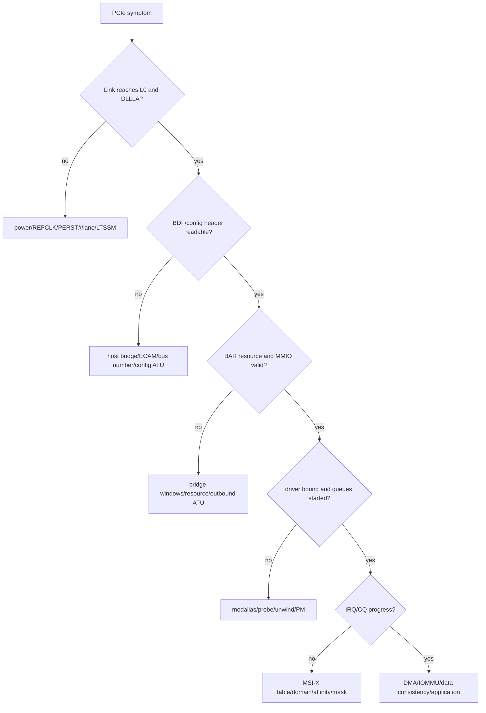
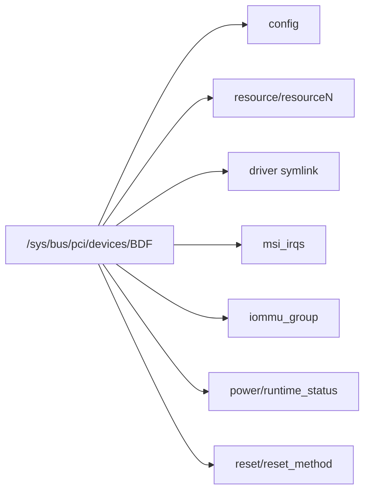
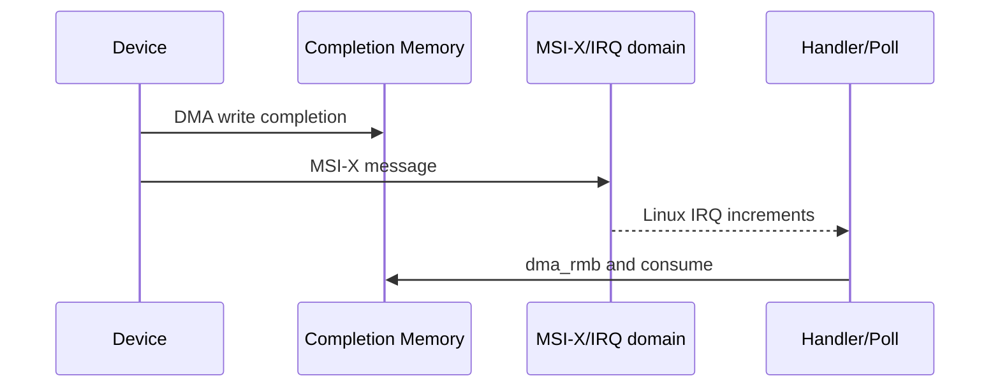
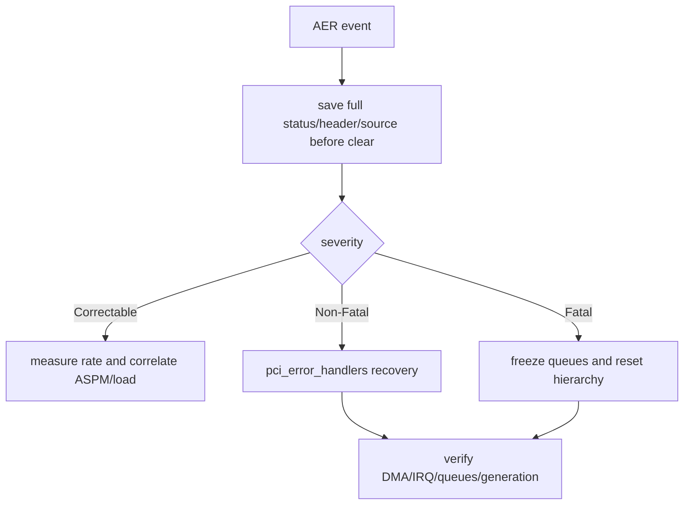

PCIe 故障常被一句“设备不工作”掩盖，但 `lspci` 看不到、BAR 读全 1、MSI-X 不增长、DMA 数据错误属于完全不同阶段。正确方法是为每层设置进入条件：上层证据未成立，不进入下层。

本文的 sysfs、trace、AER 与 IOMMU 工具路径固定以 Linux 6.12 为基线。

## 一、先用决策树确定故障层



保存环境：板卡/插槽、固件、内核、Device revision、拓扑、复现动作、最后正常版本。每次只改变一个变量，保留寄存器/日志时间线。

## 二、电源、PERST#、REFCLK、Lane 与 LTSSM

Endpoint 电源 rail 和时序必须满足器件要求；PERST# 释放前 REFCLK 通常应稳定，具体时序看平台/规范。AC-coupling capacitor 位置、TX/RX lane、polarity、lane reversal 和 bifurcation 必须与两端配置一致。

LTSSM 停在 Detect：receiver detect、电源、lane/open；Polling：训练序列、REFCLK、polarity/signal；Configuration：lane numbering/width；Recovery 循环：equalization、margin、目标速率过高。

能进入 L0 但 `LnkSta` 降速/降宽，先比较 `LnkCap`，再看 AER correctable/replay 和不同速率。强制 Gen1 用于定位 signal/training，不是最终修复。

`lspci` 完全看不到 Endpoint 时，普通 Endpoint Driver 未运行。此时不要修改 id_table 或 probe。

可以把 LTSSM 现象与检查对象对应：

| 现象 | 更可能的层 | 需要的证据 |
| --- | --- | --- |
| 一直 Detect | receiver detect、供电、lane open | 两端 LTSSM、RX detect、原理图/波形 |
| Polling 循环 | TS1/TS2、极性、时钟质量 | analyzer、错误计数、强制 Gen1 对比 |
| Configuration 失败 | lane numbering/width | lane map、bifurcation、两端配置 |
| L0/Recovery 反复 | signal/equalization/replay | LnkSta、AER、眼图/分析仪 |
| L0 但降宽 | 某些 lane 不可用 | per-lane 状态、连接器/焊接 |

PERST#/REFCLK 条件应由硬件测量或 controller status 证明，不能只根据 Linux probe 顺序推断。冷启动与热重启差异通常指向电源/reset/firmware 时序。

## 三、Host Bridge、Configuration Space 与 BDF

Link Up 后 Host 仍需 ECAM/indirect config access、正确 bus range 和 root bus。检查 RC driver/firmware日志、`lspci -tv`、Host Bridge resource。

Vendor ID 读 `0xffff` 可能表示不存在，也可能是 config request 超时/UR。对照 RC error status、LTSSM 和 protocol trace。Bridge 下游缺失检查 Secondary/Subordinate Bus、下游 Link 和热插拔扫描。

能看到 BDF 后记录 Header Type、Class、Command、Capability、LnkSta。此阶段已证明 config path，但不能证明 BAR MMIO 和 DMA path。

```bash
lspci -nn -s BDF
lspci -xxxx -s BDF
cat /sys/bus/pci/devices/BDF/config | xxd -g 4 | head
```

配置 dump 仅用于只读分析。检查 Vendor/Device/Class/Header、Command Memory/BusMaster、BAR、Capability pointer；多级拓扑还要检查 Bridge Primary/Secondary/Subordinate 与 window。配置读取偶发全 1 时，关联 RC Unsupported Request/Completion Timeout，而不是把结果当“设备不存在”。

## 四、BAR、Bridge Window 与 ATU

BAR unassigned/size异常：检查 sizing、Host `ranges`、64-bit/prefetchable window、Bridge window 和资源不足。`pci_resource_len()` 与硬件期望不匹配应让 probe 拒绝。

BAR 已分配，`pci_iomap()` 成功但 `readl()` 全 1/abort：依次核对 CPU resource、RC outbound ATU、PCI bus address、Endpoint BAR decode、EP inbound ATU 和内部寄存器 offset。

posted write 导致“写后立即读旧状态”时，使用安全 readback/状态完成。不要读 W1C/read-clear/FIFO 做 flush。

把 `lspci -vv -s BDF` 的 BAR 地址与 sysfs `resource`、Device Tree `ranges` 和 RC ATU register逐项对齐。地址至少有 CPU resource、PCI bus address、EP local target 三个视角；打印日志必须注明是哪一种。

若 BAR 小于硬件协议要求，可能是 Endpoint sizing mask 错；若 64-bit BAR 高位丢失，只在高地址平台失败；若 prefetchable BAR 被放进不支持的 Bridge window，资源可能无法分配。每种现象都在 probe 前发生。

## 五、驱动绑定、MSI-X 与软件并发

```bash
lspci -vv -s BDF
readlink /sys/bus/pci/devices/BDF/driver
cat /sys/bus/pci/devices/BDF/modalias
cat /proc/interrupts
dmesg -w
```

probe 未触发：ID/module/driver override；probe 返回失败：保留第一错误码并检查逆序回滚。设备在 driver bind 后立即发中断，需要在 start 前 request IRQ 且保持 source mask。

MSI-X 不增长：检查 vector enable/Table/PBA、设备 source、message write、interrupt remapping；增长但任务不完成：检查 queue mapping、CQ phase、`dma_rmb()` 和 poll budget。INTx storm 则检查 source deassert/W1C。

热插拔崩溃看 IRQ/work/timer/用户 fd 是否在释放后访问对象。增加 sleep 不是修复，使用 KASAN/lockdep 和 tracepoint 对齐 remove 与 callback。

中断排错用两个计数同时判断：Device event/source 计数和 Linux IRQ 计数。source 增、IRQ 不增，查 mask/Table/message/RC；IRQ 增、CQ 不增，查 queue mapping/order；CQ 增、用户不醒，查 poll/wait/UAPI。只看 `/proc/interrupts` 会跳过两端状态。

## 六、DMA、IOMMU fault 与数据一致性

IOMMU fault 提供 requester、IOVA、方向和 reason。回查 request ID/generation、mapping length/direction、descriptor 高低位/endian。关闭 IOMMU 只会隐藏越界。

无 fault 但数据旧/损坏：检查 DMA API direction、sync、`dma_wmb/dma_rmb`、Device completion 顺序、cache/coherency、length/SG。只在高地址失败看 DMA mask/descriptor address width。

timeout 后不能立即 unmap。先阻止新请求、停止 DMA、确认 idle/synchronize IRQ，再 unmap/reset。reset 后旧 completion 必须由 generation 丢弃。

DMA 数据错时保存一条请求的完整元数据：ID/generation、CPU buffer、DMA address、length/direction、SQ slot、doorbell、CQ status/bytes。用 IOMMU fault IOVA 或 CQ ID 回查，而不是全局打印所有 descriptor。

若关闭 IOMMU 后 fault 消失但数据仍偶发损坏，反而更支持越界/迟到 DMA。IOMMU 是检测器和隔离器，不是根因。若只在 non-coherent 架构失败，再核对 DMA API 与硬件 descriptor ordering，不直接加 cache flush 猜测。

## 七、AER、FLR 和恢复是否真正完成

AER 错误按 Correctable、Uncorrectable Non-Fatal、Fatal 分类。Receiver Error/Replay 与 Link 质量相关；Unsupported Request/Completion Timeout/Malformed TLP 更接近事务/路由/设备实现。

```bash
lspci -s BDF -vv | grep -A30 'Advanced Error'
dmesg | grep -Ei 'aer|pcie|iommu|timeout'
```

FLR/hot reset/slot reset 可能清配置和设备 ring。恢复不是 BDF 重新出现，而是：旧 DMA 停止、旧 mapping 收敛、新 generation/ring/vector 完成、业务请求重新通过、AER 不持续增长。

用 submitted/completed/failed/inflight、mapping count、reset count 和恢复时长证明闭环。仅打印“reset done”没有验收价值。

恢复测试至少覆盖：业务中 FLR、Link retrain/hot reset、runtime suspend、AER non-fatal/fatal（平台支持时）、进程异常退出和 device remove。每种恢复后执行相同最小 MMIO + DMA 校验，比较 generation、AER 和资源计数。

**参考资料**

- [Linux PCI Error Recovery](https://docs.kernel.org/PCI/pci-error-recovery.html)
- [Linux PCI Express Port Bus Driver Guide](https://docs.kernel.org/PCI/pciebus-howto.html)
- [PCI-SIG Specifications](https://pcisig.com/specifications)

## 八、把故障定位写成有进入条件的树



每个“是”都要有证据，不能凭预期跳层。

## 九、lspci 输出要同时看能力与当前状态

`lspci -s BDF -nnvv` 重点：

- `LnkCap`：最大能力。
- `LnkSta`：当前 Speed/Width、Training、DLLLA。
- `DevCap/DevCtl`：MPS/MRRS/Tag。
- `MSI/MSI-X`：Capability 与 Enable/Mask。
- `AER`：Status/Mask/Severity。
- `Kernel driver in use`。

Current 低于 Capability 可能是上游限制、Lane 配置、信号降级或政策。

配置空间全 1 时不要继续 `setpci` 写值。

`setpci` 适合受控读取/明确实验，不是猜寄存器的工具。

## 十、sysfs 把对象、资源、中断和 IOMMU 关联



`resource` 显示 PCI Core 分配，不证明 ATU/Device Register 正确。

`msi_irqs` 显示已建立 Linux IRQ，不证明 Device 已产生中断。

`iommu_group` 显示隔离拓扑，不证明每个 Descriptor Address 合法。

## 十一、IRQ 与 CQ 要成对检查



四种典型分界：

- CQ 无完成、IRQ 无增长：Device Queue/DMA/Link。
- CQ 有完成、IRQ 无增长：MSI-X/Mask/IRQ Domain。
- IRQ 增长、CQ 未消费：Handler/Poll/Memory Ordering。
- CQ 已消费、应用无数据：子系统/用户接口。

用 `/proc/interrupts`、Device Head/Tail、Ring Dump 和 tracepoint 关联。

## 十二、IOMMU Fault 是越权访问的直接记录

记录 Requester ID、IOVA、Direction/Permission、PASID、Fault Reason 和时间。

再查：

- 对应 Request/Descriptor。
- Mapping 建立与 unmap 时间。
- Length 是否越界。
- reset/remove generation。
- DMA Mask/SWIOTLB。

不要通过关闭 IOMMU 让 Fault 消失后就宣布修复。

No-IOMMU 只会把显式 Fault 变成潜在内存破坏。

## 十三、AER Header Log 与链路计数

AER Status 指出 Error Class，Header Log 可能保存触发 TLP Header。

Correctable Error 的增量速率、Replay、Bad DLLP 与 Receiver Error 可关联信号/ASPM。

Fatal/Non-Fatal 要进入 PCI Error Recovery 状态机。



恢复后要验证错误 bit 清理、Link State、BAR、Bus Master、MSI-X 与 Device Queue，而不只是 `lspci` 又看到 BDF。

## 十四、动态调试与 trace 的选择

dynamic_debug：打开 PCI Core、Host Controller 和 Device Driver 的特定 `pr_debug()`。

ftrace/function graph：观察 probe、PM、AER、IRQ/Work 调用时间。

tracepoint：记录 IRQ、DMA/Queue（若 Driver 提供）、PM 与调度。

perf：分析 CPU、softirq、cache、NUMA。

协议分析仪：观察 TLP/DLLP/Link Training。

示波器：观察 REFCLK、PERST#、Power、CLKREQ# 与信号完整性。

工具要针对待证明事实，不是全部同时开启制造噪声。

## 十五、建立可复现的故障包

保存：

- Kernel Version/Config/Command Line。
- Firmware/Device Revision。
- 完整拓扑 `lspci -t/-nnvv`。
- sysfs config/resource/driver/msi/iommu snapshot。
- dmesg 从 boot/link 到故障/恢复。
- Queue Head/Tail/Generation/Timeout。
- IRQ Counter 与 CPU Affinity。
- AER/IOMMU Fault 原文。
- 负载参数、数据校验和、复现概率。
- Board/Slot/Cable/Power 对照。

恢复动作前后都保存 snapshot，才能判断它改变了哪层状态。

## 十六、回归验收

- 冷启动/热重启各数百次。
- 不同 Speed/Width 强制对照。
- ASPM/L1SS on/off 对照。
- IOMMU on/off 只用于定位，最终要求安全配置通过。
- 满载 DMA + MSI-X 多队列。
- runtime/system suspend。
- FLR/AER/Hot Reset。
- Surprise Removal（硬件支持时）。
- 24h/72h P99、AER、IOMMU 与数据校验。

## 十七、一手资料

- [Linux 6.12 PCI driver API](https://www.kernel.org/doc/html/v6.12/driver-api/pci/pci.html)
- [Linux PCI AER HOWTO](https://docs.kernel.org/PCI/pcieaer-howto.html)
- [Linux PCI sysfs ABI](https://docs.kernel.org/PCI/sysfs-pci.html)
- [Linux stable PCI source](https://git.kernel.org/pub/scm/linux/kernel/git/stable/linux.git/tree/drivers/pci?h=linux-6.12.y)
- [PCI-SIG specifications](https://pcisig.com/specifications)

## 十八、小结

PCIe 排错必须按电气与 LTSSM、配置访问、BAR/ATU、驱动/IRQ、DMA/IOMMU、AER/reset 逐层推进。每层都有明确证据和停止条件，不能跨层猜测。

下一篇站到 Endpoint 与 Root Complex 两侧，把硬件 Link Bring-up、配置/BAR/ATU 和 Linux Endpoint Framework 放进同一条链。
