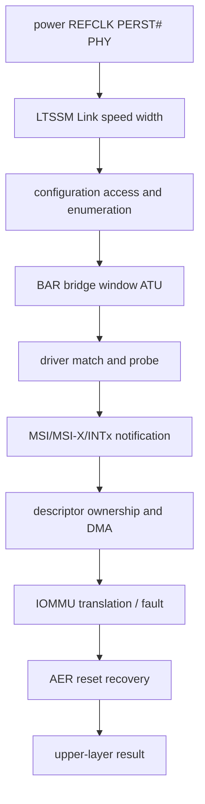
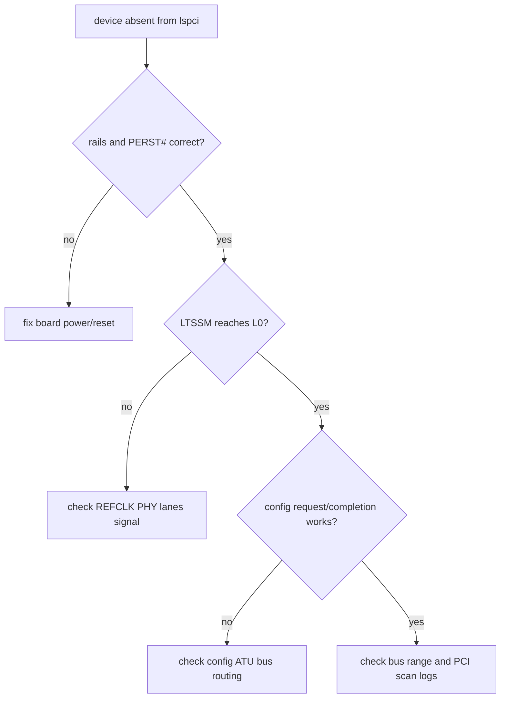
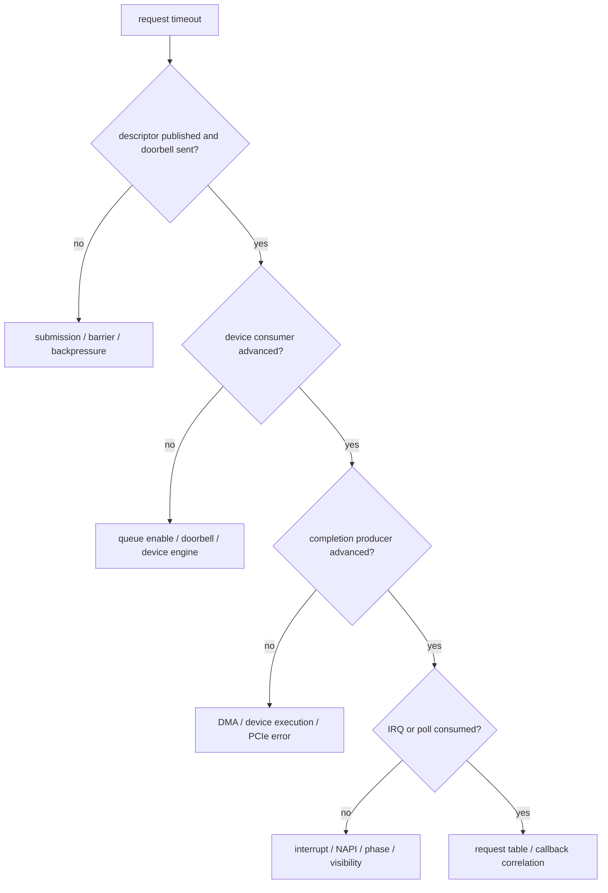

PCIe 故障最浪费时间的做法，是不确定失败层就同时修改 Device Tree、Driver ID、MPS、ASPM、IRQ 和 DMA。一次偶然恢复后，团队既不知道根因，也无法判断量产环境是否会复发。

系统化调试先把现象放回全链路：供电/Link、配置枚举、Resource、Driver Match、IRQ、DMA/IOMMU、AER/Recovery。每一层只回答一个事实，并用证据决定是否进入下一层；上游条件未成立时，不调下游代码。

本文以 Linux 6.12 为基线，按七类常见现象组织决策树。命令只是取证工具，真正重点是每条输出能证明什么、不能证明什么，以及怎样与 BDF、Queue、Request ID 和时间线关联。

## 一、故障第一次出现在哪一层

一个请求从硬件到业务至少经过以下层次：



调试规则是找“最后一个被证明正常的层”和“第一个没有证据的层”。例如 `lspci` 能看到设备，说明 Link/Config/Enumeration 至少曾成功；它不证明 BAR Memory Path、IRQ 或 DMA。`/proc/interrupts` 增长证明 CPU 收到通知，也不证明 Completion/Payload 正确。

因为每个工具视角不同，所以负面结果也有边界。`lspci` 没有设备可能是 Link Down，也可能是 Config ATU；协议分析仪没看到 TLP可能是探头位置不覆盖；Driver Log 没打印 Probe可能只是模块未加载。

## 二、先保存一份不会变化的基础快照

在修改任何参数前，记录 Kernel、Driver/Firmware、SoC/Board Revision、BDF、Topology、Link、Resource、Driver Binding、IRQ、IOMMU Group、PM Policy 和错误日志。

```bash
# 保存环境、拓扑、配置、绑定和 IRQ 基线；BDF 替换为目标 Function。
uname -a
lspci -tv
lspci -nn -s 0000:01:00.0
lspci -s 0000:01:00.0 -vv
readlink /sys/bus/pci/devices/0000:01:00.0/driver
cat /sys/bus/pci/devices/0000:01:00.0/resource
cat /proc/interrupts
dmesg -T
```

命令中的 BDF 必须替换为目标 Function。若 BDF 会在重启后变化，记录物理槽位、VID/DID、Subsystem ID 和序列号，避免比较了不同设备。

日志使用统一时间基准。Kernel `dmesg`、应用日志、Analyzer 和板端串口若时区/Clock不同，无法判断 AER、Reset、Timeout 和业务请求的先后。

## 三、现象一：设备完全看不到

`lspci -tv` 没有目标 Device 时，功能驱动尚无对象。先检查 Endpoint 供电、REFCLK、PERST#、Lane/PHY、Controller Clock/Reset、LTSSM 和 Config ATU。



正面证据包括电源/Clock 波形、PERST# 时序、LTSSM 到 L0、Config Read Request 与 Completion、Host Bridge 注册和扫描日志。负面证据如“Driver ID 已添加”没有意义，因为 Match 尚未发生。

`echo 1 > /sys/bus/pci/rescan` 只重新执行软件扫描，不会修复 Reference Clock、Reset、PHY 或 ATU。若 Rescan 偶然成功，应调查时序和状态交接，而不是把 Rescan 写成启动脚本。

## 四、现象二：设备可见但 BAR 访问失败

`lspci` 能读配置空间，BAR 也显示地址，但 Driver `readl()` 全 1、Abort 或读错值，说明 Config Path 已成功，问题移动到 Memory Decode、Bridge Window、Host `ranges`、RC address translation、Endpoint BAR/Inbound Translation 或寄存器 Offset。

```bash
lspci -s BDF -vv
cat /sys/bus/pci/devices/BDF/resource
cat /proc/iomem
```

先核对 Command Memory Space Enable、BAR Index/Length/Flags、每级 Bridge Memory/Prefetchable Window 和 Linux Resource Ownership。`pci_iomap()` 成功只证明 CPU 建立 Mapping，不证明 TLP 到达设备。

嵌入式 RC 再检查 CPU Physical Window、Outbound ATU Base/Limit/Target；EP 侧检查 BAR Hit 与 Inbound Mapping。因为 Configuration 与 Memory 可能走不同 ATU，所以不能用 `lspci` 成功替代 Memory Path 证据。

不要用 `devmem` 或脚本盲读未知 BAR。Read-Clear、FIFO 和 W1C Register可能改变设备；需要访问时只读公开手册定义的安全 Offset，并确保没有功能驱动并发拥有 Resource。

## 五、现象三：设备可见但驱动不绑定

设备目录存在、`lspci -k` 没有目标 Driver 时，检查 modalias、模块、ID Table、Blacklist 和 Probe Error：

```bash
# 将 BDF 替换为目标设备，区分“未匹配”和“Probe 返回错误”。
DEV=/sys/bus/pci/devices/BDF
cat "$DEV/modalias"
readlink "$DEV/driver"
lspci -nnk -s BDF
modinfo <module-name>
dmesg -T | grep -i -E 'pci|probe|<module-name>'
```

没有 Driver Link可能是根本未 Match，也可能 Probe 被调用但返回错误。Dynamic Debug或临时 Trace可以区分两者；只看 `lsmod` 不能证明该 Device 已绑定。

若 Probe 失败，按第 05 篇状态机查第一处返回错误：Enable、Region Busy、BAR Mapping、DMA Mask、IRQ Vector或设备私有初始化。不要为了绕过错误把返回值改成 0，因为这会向上层发布半初始化对象。

## 六、现象四：IRQ 计数不增长或只增长一次

先把设备事件、设备 Interrupt Status/Mask、MSI/MSI-X/INTx 配置、Root/IRQ Domain、Linux Handler分开。`/proc/interrupts` 不增，可能是设备没产生事件、Vector被 Mask、Message未路由或 IRQ 绑错；计数增但 Queue不动，则更像 Handler/Completion问题。

```bash
grep -E '<driver>|MSI|PCI' /proc/interrupts
lspci -s BDF -vv
cat /proc/irq/<irq>/smp_affinity_list
```

INTx 只触发一次后风暴/停住，检查 Level Source是否清除与 Deassert；MSI/MSI-X 只触发一次，检查 W1C Status、Vector Mask/PBA 和 Unmask/Recheck竞态。设备私有 Status必须按公开协议解释。

IRQ Count 正常仍不能证明数据正常。Handler应记录 Queue、Vector、Cause、Producer/Consumer和 Request ID，才能判断它是否消费了正确 Completion。

## 七、现象五：DMA 请求超时

Timeout 只说明软件未按时看到 Completion。先检查请求是否真正提交、Doorbell是否到达、Device Producer/Consumer是否前进、IRQ/Poll是否运行、Completion Owner/Phase是否可见。



比较 Descriptor中的 DMA Address、Length、Direction、Request ID与 Driver Mapping记录。若 Address被截断、字节序错误或在 Completion前 Unmap，IOMMU可能 Fault，无 IOMMU平台则可能内存破坏。

不要在 Timeout后立即 Free Buffer。因为 ownership可能仍属于 Device，所以先停止 Queue/Function、确认 DMA隔离，再 Unmap/Free。延长 Timeout只能改变观察窗口，不能修复 ownership错误。

## 八、现象六：出现 IOMMU fault

IOMMU Fault是很强的地址证据，通常包含 Requester/BDF、IOVA、Read/Write、Reason和可能的 PASID。先把 Fault IOVA与 Descriptor、Map/Unmap Timeline对齐。

```text
device / requester
iova
read or write
mapping lifetime
queue and request id
generation
descriptor bytes as seen by device
```

IOVA与已 Unmap地址相同，优先查 Stop/Teardown；高位/低位异常，查 Descriptor Width/Endian/Mask；地址正确但 Permission错误，查 DMA Direction和 Mapping Permission；PASID Fault则查 Process Binding与退出顺序。

Fault发生后不要只关闭 IOMMU。IOMMU把潜在内存破坏转换成可定位异常，关闭它可能让症状消失却留下数据损坏。正确修复应落到 Mapping和 Device访问生命周期。

## 九、现象七：AER 增长或恢复失败

`lspci -vv` 与 Kernel Log用于读取 AER Correctable/Uncorrectable、Severity、Source和 Header Log。持续 Receiver Error/Replay更接近 Link质量，Completion Timeout可能来自Request路径，Surprise Down则要检查 Link/Power/Removal。

```bash
lspci -s BDF -vv
dmesg -T | grep -i -E 'aer|pcie|fatal|non-fatal|corrected'
```

恢复失败时按阶段检查 `error_detected()` 是否阻止新提交，旧DMA是否隔离，选择的 FLR/Secondary Bus Reset/Hot Reset Scope是否正确，`slot_reset()`是否重建 Ring/IRQ，`resume()`是否最后开放请求。

设备执行 `FLR` 后重新出现在 `lspci`，只证明 Function配置路径恢复，不证明业务恢复。必须验证新Request、IRQ、DMA和Generation，同时确认旧 Completion未作用到新请求。

## 十、动态调试与 Trace 要围绕一个问题启用

Dynamic Debug可以打开 PCI Core或 Driver的选定日志，Ftrace/Tracepoint可以记录 IRQ、PM、IOMMU和函数调用。不要一开始打开所有子系统，否则日志量会改变时序并掩盖关键事件。

```bash
mount -t debugfs none /sys/kernel/debug 2>/dev/null || true
echo 'file drivers/pci/* +p' > /sys/kernel/debug/dynamic_debug/control
```

实际 Pattern应收窄到目标文件/函数，测试后恢复。Trace中每条事件至少携带 BDF/Queue/Request或能通过时间关联，否则“函数执行过”仍不能解释哪个业务请求失败。

协议分析仪、示波器、内核 Trace和应用日志位于不同层。建立统一 Trigger或 Marker，例如Host写一个公开 Debug Sequence到安全寄存器，才能对齐线上TLP与软件时间线。

## 十一、故障证据包应让另一位工程师复现判断

一个合格证据包包含环境、拓扑、配置、复现步骤、期望/实际、完整时间线、原始输出和改动差异。不要只保存裁剪截图，因为缺少上下文的 `lspci`/AER行可能无法判断 BDF、Mask和前后事件。

```text
environment.md        kernel, driver, firmware, board, workload
topology.txt           lspci -tv and physical slot map
config-space.txt       lspci -nnvvxxxx for authorized target
resources.txt          sysfs resource, iommu group, driver link
interrupts-before.txt  /proc/interrupts
interrupts-after.txt
kernel.log             complete timestamped interval
request-trace.csv      queue, id, dma, length, state, generation, time
```

若包含敏感系统地址或固件信息，分享前按组织策略脱敏；但脱敏不能删除用于关联同一 Request的相对信息。

## 十二、修复后必须做回归而不是只复现一次成功

回归矩阵至少覆盖冷启动、热重启、模块 Rebind、低负载 ASPM/Runtime PM、高负载、多队列、IOMMU On/Off（若平台支持）、Error Injection/Reset和长稳。

每个场景验证设备可见、BAR/Driver、IRQ、DMA Data、AER/IOMMU、资源泄漏和P99。因为很多Bug来自第二次Reset或关闭路径，所以只测试首次Probe无法覆盖生命周期。

改动一次只改变一个假设，并保留 Before/After。若关闭 ASPM后问题消失，下一步仍要定位 CLKREQ、L1SS、Wake Latency或Driver Timeout，而不是把全局关闭省电当成最终结论。

## 十三、常见误解与审查重点

现在应当能够从现象选择起点：设备不可见查硬件/Link/Config，BAR失败查 Resource/ATU，Driver不绑定查Match/Probe，IRQ不增查通知路径，DMA超时查ownership和Queue，IOMMU fault查IOVA生命周期，AER恢复失败查Quiesce/Reset/Rebuild。

还应能说明 `lspci -vv`、`/proc/interrupts`、IOMMU Fault、AER Header和协议分析仪各自能证明什么，为什么任何单一输出都不能替代完整数据路径证据。

## 十四、小结与系列收尾

PCIe 调试不是命令清单，而是沿依赖链寻找第一个缺失证据。供电、REFCLK、PERST#和LTSSM建立Link，配置扫描创建`pci_dev`，BAR/ATU建立MMIO，Driver建立IRQ/DMA，IOMMU约束地址，AER/Reset维护异常生命周期。

至此18篇形成闭环：拓扑/TLP → 枚举/配置 → BAR/地址 → PCI Core/Driver → Explorer → IRQ → DMA/Ring/IOMMU → PM/AER/性能 → rtw88案例 → RC/EP/Endpoint Framework → Multi-Queue → 分层调试。设备案例始终服务于通用PCIe接口理解，而不取代接口本身。

**一手资料**

- [Linux 6.12 PCI driver API](https://www.kernel.org/doc/html/v6.12/driver-api/pci/pci.html)
- [Linux PCIe AER HOWTO](https://docs.kernel.org/PCI/pcieaer-howto.html)
- [Linux IOMMU userspace API](https://docs.kernel.org/userspace-api/iommu.html)
- [Linux Dynamic Debug](https://docs.kernel.org/admin-guide/dynamic-debug-howto.html)
