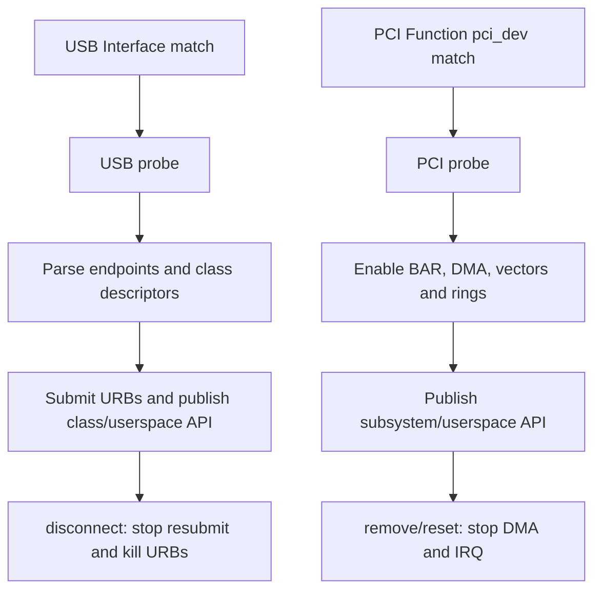
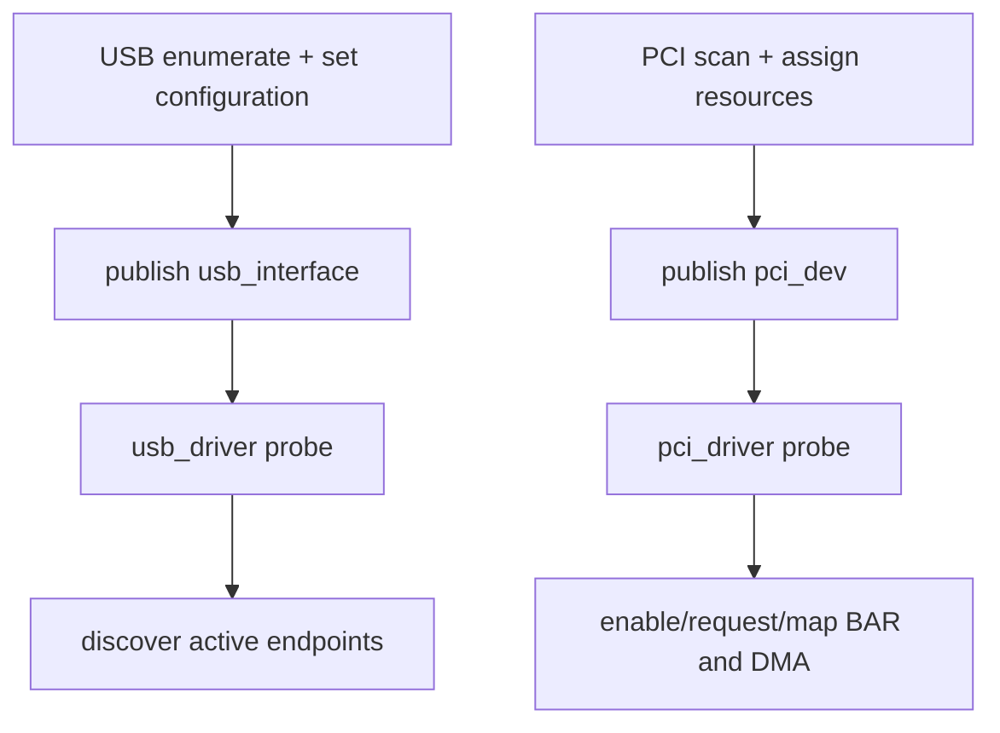
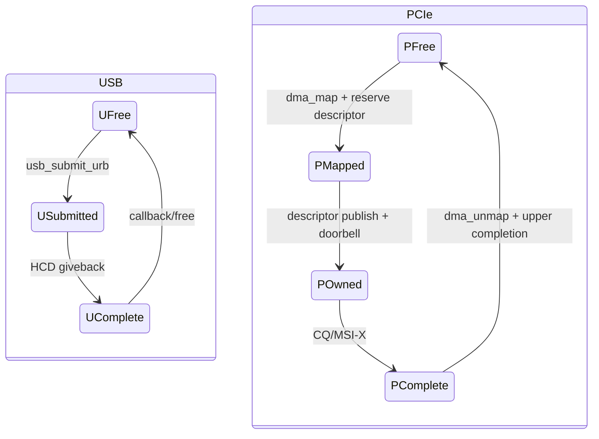
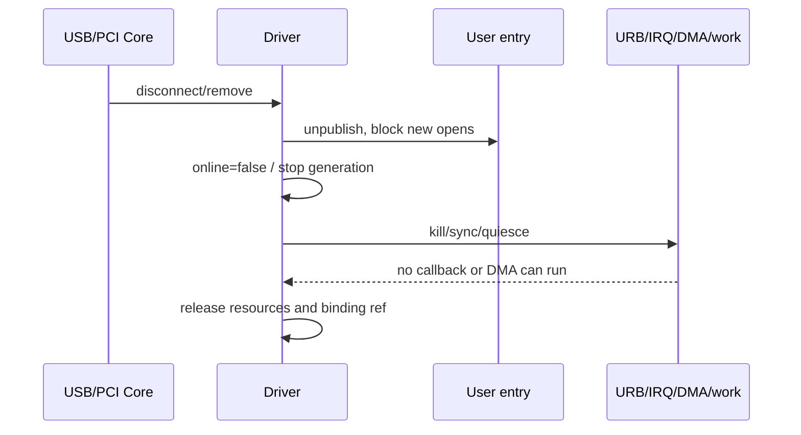
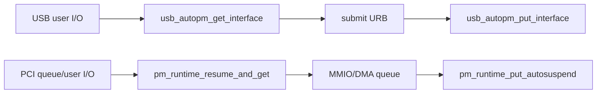

Linux USB 与 PCI 驱动都接入 Driver Core，也都有 ID table、probe 和 teardown callback。但传给驱动的对象、异步请求和硬件停止条件不同。有效比较应关注对象与所有权，而不是把 API 名字排成对照表。

本文的 API、回调和电源管理合同固定以 Linux 6.12 为基线。

## 一、被匹配的对象不同

USB Interface Driver 的 probe 接收 `struct usb_interface *`。一个物理 `usb_device` 可包含多个 Interface，并由不同驱动分别绑定。驱动解析当前 Alternate 的 Endpoint，再提交 URB。

PCI Driver 的 probe 接收 `struct pci_dev *`，通常对应一个 PCI Function。它拥有配置空间、BAR resource、MSI/MSI-X Capability 和 DMA requester identity。

因此 USB Driver 不能默认独占整个 Device；PCI Function Driver 也不能默认拥有同一 slot 的其他 Function/PF/VF。

## 二、probe 的输入前提和发布顺序不同

USB probe 前，Host 已完成 EP0 枚举、设置 Configuration、解析 descriptor 并创建 Interface。probe 主要验证 Class/vendor 布局、Endpoint 和协议状态。

PCI probe 前，Link/config scan、BDF、BAR sizing/resource 已完成，但 device decode、bus master、DMA mask、mapping、vector 和内部 ring 仍需驱动启用。

两者都应最后发布用户入口。USB 在 URB pool/设备协议就绪后 `usb_register_dev()`/注册子系统；PCI 在 BAR/DMA/IRQ/hardware READY 后注册 misc/net/block/accelerator。

| probe 阶段 | USB Interface Driver | PCI Function Driver |
| --- | --- | --- |
| 进入前 | 地址/配置/Interface 已建立 | BDF/BAR resource 已建立 |
| 驱动验证 | Descriptor、Endpoint、Class/Vendor 协议 | Revision、BAR size、Capability、设备 ID |
| 异步资源 | URB pool、anchor、wait queue | DMA ring、mapping、MSI-X、request table |
| 硬件启动 | Class request/提交接收 URB | reset、ring base、queue enable、doorbell |
| 发布入口 | tty/V4L2/block/char 等 | net/block/char/accelerator 等 |

USB `probe()` 失败通常不影响其他 Interface；PCI Function probe 失败则该 Function 整体无驱动。复合设备/多 Function 的错误域不同。

## 三、URB 与 DMA Descriptor 的所有权边界

USB Interface Driver 把 URB 交给 usbcore/HCD，HCD 管理 Host Controller DMA。提交后 URB/buffer 直到 completion/kill 才归驱动。

PCI Driver 直接使用 DMA API map payload，把 DMA address 写入设备 descriptor，doorbell 后 Device 成为 owner，completion 后 unmap/recycle。

USB 取消使用 unlink/kill/anchor；PCI 通常使用 queue abort/reset/generation。共同原则是：异步对象未收敛前不能释放 buffer/context。

## 四、disconnect 与 remove/reset 的停止语义

USB 外部拔出很常见。disconnect 清 intfdata、撤销用户入口、置 disconnected、`usb_kill_anchored_urbs()`、停止 RX pool，再由 kref/reference count 等待 open file。

PCI remove 需要先撤销入口、停止 queue/DMA、flush posted write、synchronize IRQ/work、unmap/free ring，再释放 BAR/device。AER/FLR 可能保留 `pci_dev` 并要求重建硬件，不一定执行 remove。

两者的 reference count 都只保护软件内存，不证明硬件可访问。open fd 持有对象时，I/O 仍要检查 disconnected/dead/generation。

一个容易混淆的迁移是“保留 open fd 穿过 reset”。USB reset 后同一个 `usb_interface` 可能继续存在，但 Endpoint/协议状态需恢复；PCI FLR 后 `pci_dev` 仍存在，但 BAR/queue/MSI-X 设备状态可能丢失。文件对象可保留，硬件请求必须在 READY 重新建立后才恢复。

## 五、同步、runtime PM 和错误回滚

USB completion 常在不可睡眠上下文，disconnect 与 completion/resubmit 竞争；PCI hard IRQ/poll 与 reset/remove 竞争。锁和状态机应围绕资源 ownership，而不是围绕 API 函数名。

USB runtime PM 常用 Interface autopm get/put，suspend 停 URB、resume 重提；PCI runtime PM 可能进入 D-state，保存/恢复配置与 ring。两者都必须阻止用户请求跨越未恢复硬件。

错误回滚均按获取逆序。devm/managed API 可以减少释放代码，但不能代替硬件 quiesce。测试要注入 probe 每个阶段失败，检查已取得资源是否收敛。

## 六、源码阅读入口与设计迁移

USB 从 `drivers/usb/core/driver.c`、`urb.c`、目标 class driver 进入；PCI 从 `drivers/pci/pci-driver.c`、`probe.c`、MSI/DMA/IOMMU 和目标驱动进入。

把 USB 驱动迁到 PCIe 时，不能把 URB 换成 descriptor 就结束，还要新增 BAR/BusMaster/IOMMU/reset；把 PCIe 迁到 USB 时，不能让 Device 主动 DMA Host memory，要适应 Host schedule/Endpoint/Class。

### 一份统一的 teardown 审计表

1. 是否先撤销用户/子系统入口，阻止新 open/submit？
2. 是否设置 dead/disconnected，并唤醒阻塞线程？
3. 是否停止硬件产生新事件？
4. 是否同步取消 URB 或停止 DMA queue？
5. 是否等待 IRQ/completion/work/timer？
6. 是否在最后异步访问结束后才释放 buffer/mapping/BAR？
7. open fd/reference 最终是否收敛？

USB 与 PCIe 的 API 不同，但这七项都必须回答。测试应在每个步骤插入延迟/故障，覆盖 teardown 竞态。

**参考资料**

- [Linux USB Host Side API](https://docs.kernel.org/driver-api/usb/usb.html)
- [How To Write Linux PCI Drivers](https://docs.kernel.org/PCI/pci.html)

## 七、probe 的前置条件不同

USB `probe(usb_interface, id)` 被调用前：Device 已枚举、Configuration 已激活、当前 Alternate Setting 有效、Endpoint 已由 usbcore 解析。

PCI `probe(pci_dev, id)` 被调用前：Function 已扫描、BAR Resource 已分配、Capability 已识别，但 Device Memory/Bus Master/IRQ 尚需驱动启用。

因此 USB Driver 不应自行分配 Device Address，PCI Driver 不应自行递归扫描 Bus。

## 八、异步请求对象的所有权

USB 用 URB 表示交给 HCD 的 Transfer。

PCIe Device Driver 常自定义 Descriptor/Request Object，并用 DMA API 把 Payload 暴露给 Device。

两者都要求：提交后不能提前释放 Buffer，取消/Reset 后确认硬件不再访问，再回收。

## 九、用户接口发布与外部引用

USB 字符驱动常通过 `usb_register_dev()` 发布 minor。

PCIe 自定义驱动可通过 cdev/misc、netdev、block、DRM、VFIO 等发布。

共同规则：所有锁、队列和私有状态完整后才发布；teardown 先撤销入口，阻止新 open。

open file 可能跨越 USB disconnect 或 PCI remove。

私有对象用 kref/refcount 延长内存寿命，同时 online 标志阻止硬件访问。

“对象仍在”与“Device 可 I/O”必须分开。

## 十、disconnect 与 remove 的硬件事实

USB disconnect 常在物理拔出后到来，Endpoint 已不可用，驱动必须能不访问硬件完成清理。

PCI remove 可能是有序 unbind，也可能来自 Hotplug/Surprise Down；同样不能假设 MMIO 总可读。

USB 使用 `usb_kill_anchored_urbs()` 等取消。

PCIe 先停止 Device DMA/Interrupt，再 `synchronize_irq()`、unmap/free Ring。

## 十一、Reset Callback 的差异

USB Interface Driver 可有 `pre_reset`、`post_reset`、`reset_resume`。

PCI Driver 可有 `pci_error_handlers`，并通过 PCI Core Reset API 参与 FLR/Bus Recovery。

USB Reset 会重建 Device/Endpoint 协议状态，必要时重新比较 Descriptor。

PCI Reset 恢复 Configuration State 后，Driver 还要重建 BAR 内 Queue、MSI-X 私有状态与 Bus Master。

两者都不应重新注册已经存在的用户接口，而应复用 `stop_hw`/`init_hw`/`start_io` helper。

## 十二、Runtime PM 获取对象不同

USB Interface Driver 常用 `usb_autopm_get_interface()` 与 put。

PCI Driver 通过通用 `pm_runtime_*` 对 `&pdev->dev` 管理，并结合 `pci_save_state/pci_restore_state` 与 D-state。

PM 引用必须覆盖真实活动寿命，不能 submit 后立即 put 而请求仍在途。

## 十三、错误回滚对照

| 步骤 | USB 失败回滚 | PCIe 失败回滚 |
| --- | --- | --- |
| 私有对象 | free/kref put | free/devm cleanup |
| 传输缓冲 | free URB/coherent | unmap/free DMA Ring |
| 中断 | kill URB | free IRQ/vector |
| 用户入口 | usb_deregister_dev/子系统注销 | cdev/netdev/block/DRM 注销 |
| 地址资源 | usbcore 拥有 Endpoint | iounmap/release regions |
| 设备 enable | usbcore 管理配置 | pci_disable_device |

错误标签按获取顺序逆序，不以总线类型改变。

## 十四、锁与执行上下文

USB URB completion 和 PCI IRQ/NAPI 都常在不可睡眠上下文。

两者都应快速消费状态、唤醒/投递 work，并避免同步控制请求。

USB completion 中不能 `usb_control_msg()`。

PCI hard IRQ 中不能执行可能睡眠的 reset/PM 流程。

Threaded IRQ/workqueue 将恢复动作转到可睡眠上下文，并在 teardown 中同步取消。

## 十五、源码阅读对照

USB：

- `drivers/usb/core/driver.c`
- `drivers/usb/core/urb.c`
- `include/linux/usb.h`

PCIe：

- `drivers/pci/pci-driver.c`
- `drivers/pci/pci.c`
- `include/linux/pci.h`

一手资料：

- [Linux 6.12 USB driver API](https://www.kernel.org/doc/html/v6.12/driver-api/usb/writing_usb_driver.html)
- [Linux 6.12 PCI driver API](https://www.kernel.org/doc/html/v6.12/driver-api/pci/pci.html)
- [Linux USB power management](https://docs.kernel.org/driver-api/usb/power-management.html)
- [Linux PCI error recovery](https://docs.kernel.org/PCI/pci-error-recovery.html)
- [PCI-SIG specifications](https://pcisig.com/specifications)

## 十六、典型 API 不应做机械一一对应

`usb_submit_urb()` 没有一个通用 PCIe 等价函数。

PCIe Function Driver 根据硬件 ABI 填 Descriptor、Barrier、Doorbell。

`usb_kill_urb()` 也没有一个自动停止所有 PCIe DMA 的总线 API。

PCIe Driver 必须命令 Device Queue Stop，并在必要时 FLR/Reset。

同理，`pci_iomap()` 不是 USB Endpoint 的等价物；USB Driver 不直接映射 Device 寄存器窗口。

对照 API 时必须先写出它改变的对象和所有权状态。

## 十七、最小停止合同对照

USB：online=false、停止 completion 重提交、kill anchor、取消 work、唤醒 file、put refs。

PCIe：online=false、停止上层 Queue、quiesce DMA、mask/sync IRQ、取消 work、unmap/free Ring、release resources。

两者都要求 stop 幂等，并能被 suspend、reset、remove/error unwind 复用。

但复用的是底层停止 helper，不是重复执行用户接口 register/unregister。

## 十八、审查问题清单

- 哪个对象是 Driver 绑定单位？
- 哪个动作是用户可见发布点？
- 请求发布后谁拥有 Buffer？
- timeout 是否可能仍在硬件访问？
- reset 前如何阻止新请求？
- disconnect/remove 后 open fd 如何退出？
- PM 引用覆盖到哪个完成点？
- 最后一个 callback 在什么同步点之后不再运行？

审查者还应要求代码画出错误回滚标签的资源集合，证明每项只释放一次。

任何不能回答“最后一次硬件访问发生在哪里”的 teardown，都还不完整。

同样要标出用户入口撤销与最终内存释放之间由哪个引用计数连接。

这条连接决定热拔后旧文件句柄能否安全返回错误。

## 十九、小结

USB 驱动围绕 `usb_interface`、Endpoint、URB 和 disconnect；PCIe 驱动围绕 `pci_dev`、BAR、DMA Ring、IRQ 和 remove/reset。两者共享 Driver Core 和“先停止异步硬件再释放对象”的原则，但资源和恢复单位不同。
