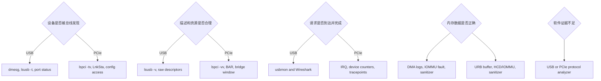
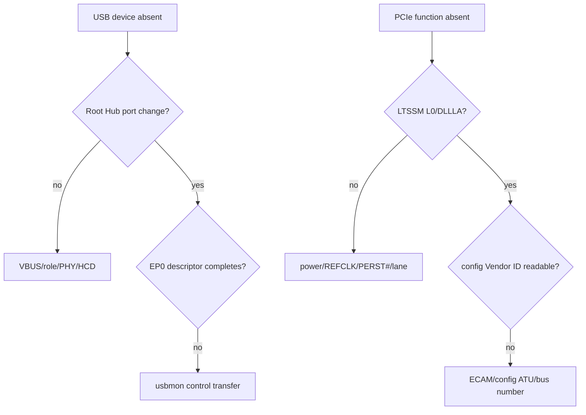
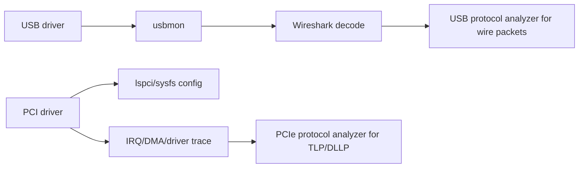
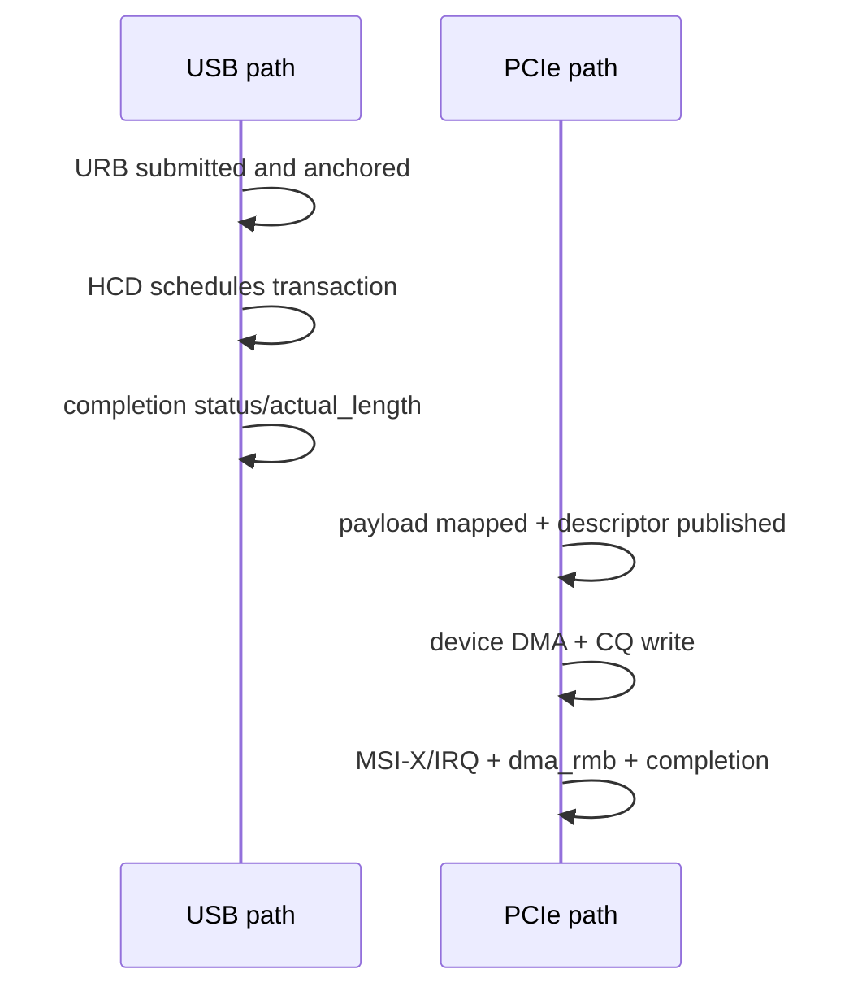
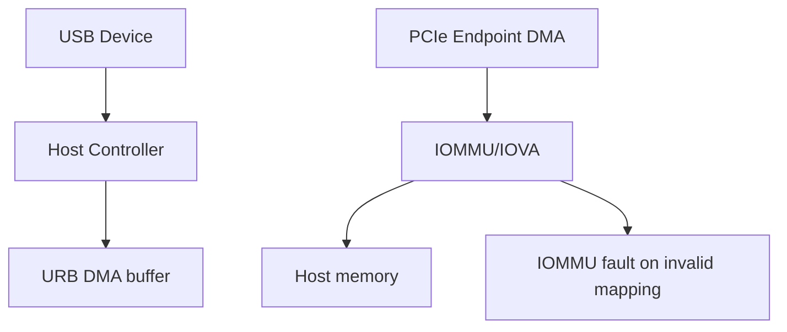

调试工具的价值不在数量，而在它能证明哪一层。usbmon 能证明 Host 提交/完成了哪些 USB 请求；`lspci -vv` 能证明 PCIe 配置与 Link 状态；二者都不能单独证明设备内部状态或用户程序正确。

本文所有 Linux 工具路径和错误语义固定以 Linux 6.12 为基线。

## 一、先确定要证明的事实



每次只问一个可判定问题，再选择工具。没有连接证据时不先抓应用；没有 DMA completion 时不先调算法。

## 二、发现、描述和配置工具

USB：`dmesg -w` 看 connect/reset/error，`lsusb -t` 看树/速度/Interface Driver，`lsusb -v` 看 descriptor。sysfs modalias/driver 证明 Interface 是否创建和绑定。

PCIe：`lspci -tv` 看 RC/Switch/Endpoint，`lspci -vv -s BDF` 看 `LnkSta`、BAR、Command、MSI-X、AER。sysfs `resource/config/driver/iommu_group` 证明资源和 ownership。

USB discovery snapshot：

```bash
dmesg | tail -n 200
lsusb -t
lsusb -v -d vid:pid
```

PCIe discovery snapshot：

```bash
lspci -tv
lspci -vv -s BDF
cat /sys/bus/pci/devices/BDF/resource
readlink /sys/bus/pci/devices/BDF/iommu_group
```

快照要包含测试前后差值。PCIe AER/IRQ 计数和 USB reset/error 日志若只截取故障后一行，很难判断是原因还是恢复结果。

这些工具读取的是内核已知状态。`lsusb -v` 解析失败要回原始 descriptor；`lspci` BAR 正常不证明 ATU/寄存器响应。

## 三、单次协议和传输发生了什么

USB 使用 usbmon：

```bash
sudo modprobe usbmon
sudo cat /sys/kernel/debug/usb/usbmon/0u
```

记录 URB submit/complete、pipe、length、status；Wireshark 进一步解码 Setup、MSC CBW/CSW、UVC 等。usbmon 看不到 PHY 波形和 Device 内部逻辑。

PCIe 普通 Linux 没有等价的通用 TLP 抓包。依靠 Device/RC counters、AER、driver tracepoint、IRQ/CQ 日志；需要 TLP/header/credit/replay 时使用硬件 protocol analyzer 或 IP 内置 trace。

## 四、中断、DMA 与地址转换

USB/PCIe 都用 `/proc/interrupts` 证明 IRQ 到达，但 USB Interface URB completion 还经过 HCD，PCIe MSI-X 常直接对应设备 queue。

DMA 调试记录 request ID、DMA address、length、direction、generation、map/unmap。IOMMU fault 提供 requester/IOVA/access；回查 request table。关闭 IOMMU 不是定位完成。

KASAN 查越界/UAF，lockdep 查锁，kmemleak 查泄漏，perf 查 CPU/cache。工具结果要与总线证据同时间线对齐。

### 同一个“超时”如何分层

USB Bulk timeout：usbmon 中请求是否提交；Device 是持续 NAK、STALL 还是无响应；HCD 是否 giveback；Class 协议是否缺启动命令；runtime PM 是否挂起。

PCIe request timeout：SQ doorbell 是否写；Device consumer 是否前进；DMA/IOMMU fault；CQ 是否写但 MSI-X 未到；IRQ 到但 poll 未消费；Completion Timeout/AER 是否增长。

二者都叫 timeout，但 USB 由 Host schedule/Endpoint 响应驱动，PCIe 由共享 ring/Device requester 驱动。工具选择必须从协议模型出发。

## 五、dynamic_debug、tracepoint 和 protocol analyzer

dynamic_debug 适合临时打开 usbcore/HCD/PCI driver 调试日志；tracepoint/ftrace 适合低侵入构建 submit/completion/IRQ/work 时间线。大量 printk 会改变竞态和延迟。

protocol analyzer 在软件证据矛盾时使用：USB 看 packet/handshake/SOF；PCIe 看 LTSSM、TLP/DLLP、ACK/NAK/replay/credit。它证明线上的事实，但仍需软件日志解释哪个请求对应哪个 packet。

## 六、证据矩阵和恢复验收

| 问题 | USB 证据 | PCIe 证据 |
| --- | --- | --- |
| 物理/链路 | port/速度、分析仪 | LTSSM/LnkSta/AER、分析仪 |
| 身份/拓扑 | descriptor、Interface | config/BDF/Bridge |
| 请求 | usbmon URB | driver/device TLP/queue counter |
| 中断 | HCD/IRQ/completion | MSI-X/IRQ/CQ |
| 内存 | URB buffer、IOMMU | DMA mapping、IOMMU fault |
| 恢复 | reset/clear halt/disconnect | FLR/AER/generation/reset |

恢复验收不是日志出现 success，而是旧异步对象收敛、新请求通过、错误计数不继续增长。USB 检查 anchored URB/buffer；PCIe 检查 mapping/ring/generation。

建议为每次严重故障保存“最小证据包”：环境版本、拓扑、触发时间、总线状态、请求 ID、IRQ/URB/DMA 时间线、错误计数、恢复动作和恢复后最小测试。证据包能让硬件、固件、内核和应用团队讨论同一事件，而不是交换截图。

**参考资料**

- [Linux USB Host Side API](https://docs.kernel.org/driver-api/usb/usb.html)
- [Linux PCI Error Recovery](https://docs.kernel.org/PCI/pci-error-recovery.html)

## 七、发现阶段的证据路径



USB `lsusb` 出现说明枚举至少获得身份；PCIe `lspci` 出现说明配置扫描创建了 Function。

两者都不证明功能 Driver Probe 成功。

## 八、协议工具能看到什么

usbmon 记录 URB Submit/Complete 的 Host 软件视角，Wireshark 解码 Control/Class 数据。

PCIe `lspci/setpci` 读取配置空间，不抓 TLP。

PCIe Protocol Analyzer 才观察 TLP/DLLP/LTSSM。



软件抓包与线级分析互补。

usbmon 看不到 PHY Eye，PCIe Analyzer 也看不到 Linux kref/Queue Lock。

## 九、配置、资源与驱动绑定矩阵

| 待证明事实 | USB | PCIe | 不能证明 |
| --- | --- | --- | --- |
| 身份 | `lsusb -v`/sysfs descriptor | `lspci -nn`/config | Driver 业务可用 |
| 驱动绑定 | Interface `driver`/modalias | Function `driver`/modalias | 数据路径正确 |
| 通道资源 | Endpoint Descriptor | BAR resource/MSI Capability | 硬件已启动 |
| PM 状态 | `power/runtime_status` | D-state/ASPM/runtime status | 恢复一定可靠 |
| 错误状态 | URB status | AER Status/Header Log | 单一根因 |

## 十、异步数据路径的等价检查



USB 问：URB 是否 submit、HCD 是否 giveback、status/actual_length、是否错误重提交。

PCIe 问：Descriptor 是否发布、DMA Mapping 是否有效、CQ 是否完成、MSI-X 是否到达、是否消费。

两者都要将 Request ID/时间与用户操作关联。

## 十一、中断证据的差异

USB Interrupt Endpoint 在 usbmon 中仍是周期 URB，由 HCD IRQ 完成。

PCIe MSI-X 在 `/proc/interrupts` 有 Function Driver IRQ，Device 主动发 Message。

USB 用户 Driver 通常不直接 request Host Controller IRQ。

PCIe Driver 直接 `request_irq()`/`request_threaded_irq()`。

所以“Interrupt 不增长”在 USB 应先查 URB/HCD 调度，在 PCIe 查 MSI-X Table/IRQ Domain/Device Cause。

## 十二、DMA 与地址翻译证据

USB Device 的数据由 Host Controller DMA 到 URB Buffer，usbcore/HCD 管理映射。

PCIe Endpoint 自己作为 Requester，Function Driver 管理 Payload Mapping。



PCIe IOMMU Fault 常直接给 Requester/IOVA。

USB HCD DMA Fault 则指向 Host Controller Device，请继续用 URB/Endpoint Context定位是哪个 USB Transfer。

## 十三、动态调试与 tracepoint

两者都可使用 dynamic_debug、ftrace、KASAN/KCSAN/lockdep。

USB 重点文件：usbcore、HCD、Class Driver。

PCIe 重点文件：PCI Core、Host Bridge、Function Driver、IRQ/IOMMU/AER。

开启范围要窄并记录时间基准。

全局 `+p` 可能产生海量日志、改变时序并掩盖问题。

## 十四、恢复动作的证明范围

USB clear halt 只恢复一个 Endpoint；Device Reset 影响全部 Interface。

PCIe FLR 影响一个 Function；Secondary Bus Reset 影响下游层级。

恢复后必须验证：

- 旧请求已结束。
- 新 generation 建立。
- PM/配置/资源恢复。
- 用户接口仍正确。
- 无旧 DMA/Completion。

“重载后正常”只说明更大范围状态被重建。

## 十五、建立共同故障记录格式

```text
时间/触发操作
  -> 最后一个成功层
  -> 第一个失败层
  -> 内核对象和状态
  -> 异步 Request/Queue ID
  -> 原始错误与工具输出
  -> 恢复动作
  -> 恢复后逐层验收
```

对 USB 保存 Bus/Port/Device/Interface/Endpoint。

对 PCIe 保存 Segment/BDF/Bus Tree/BAR/Queue/Vector。

## 十六、一手资料

- [Linux 6.12 usbmon](https://www.kernel.org/doc/html/v6.12/usb/usbmon.html)
- [Linux PCI sysfs ABI](https://docs.kernel.org/PCI/sysfs-pci.html)
- [Linux PCI AER HOWTO](https://docs.kernel.org/PCI/pcieaer-howto.html)
- [Linux dynamic debug](https://docs.kernel.org/admin-guide/dynamic-debug-howto.html)
- [PCI-SIG specifications](https://pcisig.com/specifications)

## 十七、工具输出也要保存原始值

不要只保存截图中的结论。

保留 usbmon 原始 submit/complete 行、完整 `lspci -nnvvxxxx`、AER Status/Header Log、IOMMU Fault、Queue Head/Tail 与 `/proc/interrupts` 增量。

原始值允许后续重新解码，也能避免工具版本或人工摘要丢失字段。

## 十八、时间基准必须统一

内核日志、trace、协议分析仪、示波器和用户程序可能使用不同 Clock。

通过明确触发事件、GPIO/Marker、统一 monotonic timestamp 或同步采集建立对齐。

如果无法对齐，就不能声称某个 AER/URB Error 一定对应某次用户请求。

## 十九、负面证据的边界

“没有看到日志”可能是动态调试未开启、Ring Buffer 覆盖、错误路径未打印或事件根本未发生。

负面证据必须先证明观测点有效，例如用已知成功请求验证 tracepoint/IRQ Counter 确实工作。

同样，抓包中没有错误不代表硬件无误：USB/PCIe Link Layer 可能已经重试并向上层隐藏。

应同时观察重试、Receiver Error、Replay、短包和队列延迟等质量指标。

证据链最终要能被另一台机器、另一块板和另一个内核版本重复采集。

复现实验还应保留成功样本作为对照，避免只在失败日志中寻找所有差异。

成功与失败使用同一采集脚本，比较才有意义。

## 二十、小结

USB 调试更容易直接观察 Host 调度传输，PCIe 调试更多依赖配置、Link、设备 queue 与硬件分析。工具不能替代分层问题；先定义要证明的事实，再采集互相独立的证据。
