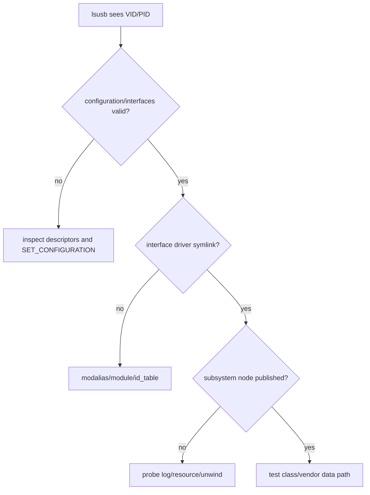
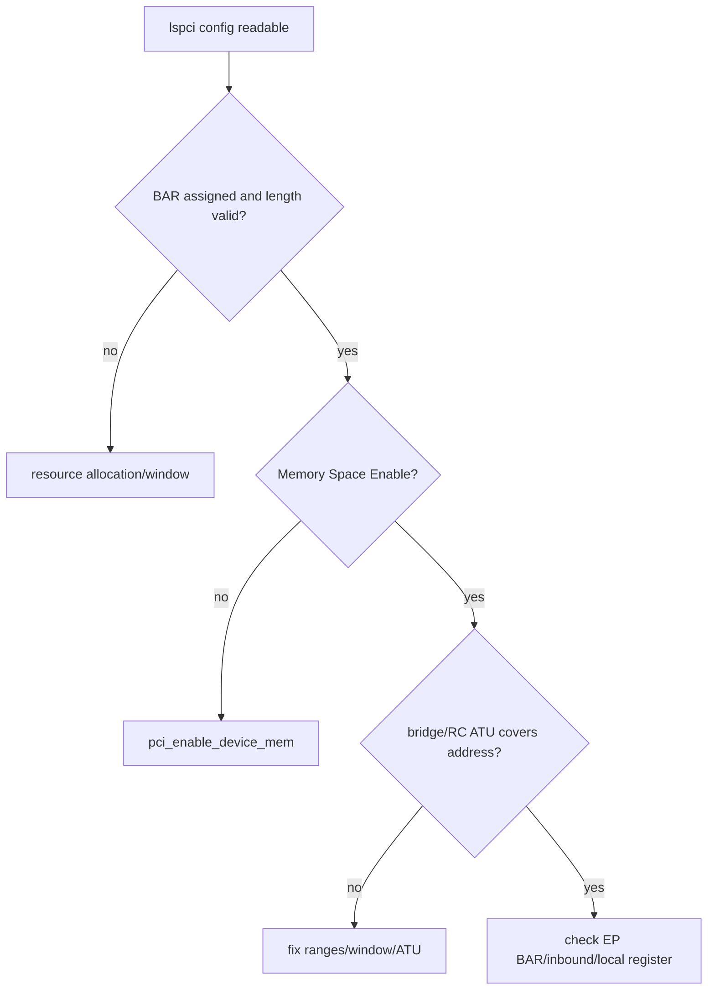
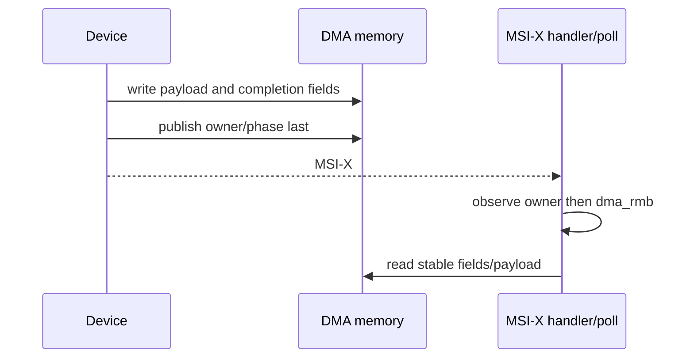
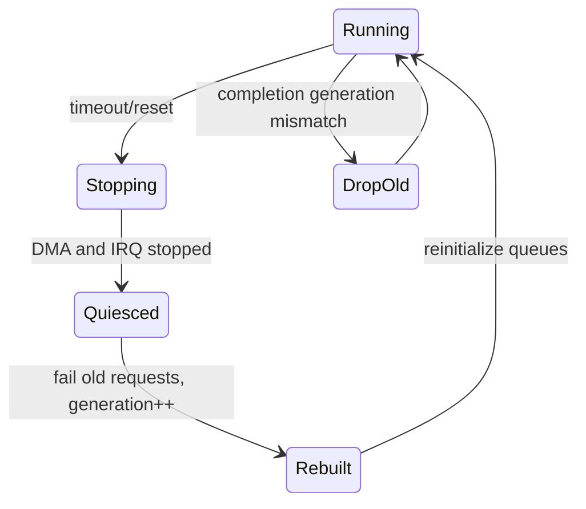

USB/PCIe 面试真正考察的不是命令清单，而是能否从现象判断当前层次、指出内核对象和异步所有权，并给出可验证证据。下面每题包含常见错误答案、正确推导和工程证据链。

所有问题以 Linux 6.12 对象、API 与错误恢复语义为基线。

## 一、回答技术问题的四层结构

1. 先定义对象和当前阶段，不急于报 API 名。
2. 沿协议/源码路径说明状态变化和所有权。
3. 指出并发、错误和停止边界。
4. 给出能证伪判断的日志、trace、寄存器或实验。

回答“可能是驱动问题”没有价值；回答“因为 `lsusb -t` 已出现 Interface 且 modalias 正确，枚举已完成，下一步验证 driver match/probe 返回码”才形成证据链。

## 二、USB 场景

**问题：USB Device 插入后 `probe()` 不进入，如何定位？**

错误答案：检查 `id_table`，重新加载模块。

正确推导：先确认 Host 是否检测连接、EP0 能否读取 Device/Configuration Descriptor、`SET_ADDRESS/SET_CONFIGURATION` 是否完成、目标 `usb_interface` 是否创建。只有 sysfs modalias 存在后才检查 ID/竞争驱动。`dmesg`、`lsusb -t/-v`、usbmon 分别证明阶段。

进一步追问“为什么驱动绑定 Interface 而不是 Device”：复合 Device 可包含 CDC/HID/UVC 等多个功能，Linux 允许不同 Interface 由不同 Driver 管理；若需要伙伴 Interface，必须通过 IAD/Union 等关系找到并显式 claim。

**问题：`usb_submit_urb()` 返回 0 后能否立刻复用 buffer？**

错误答案：可以，数据已经提交给 USB。

正确推导：返回 0 只表示 usbcore/HCD 接受异步 URB。HCD/DMA 仍可访问 URB、buffer 和 context，直到 completion 或同步 `usb_kill_urb()` 完成。提前复用会造成数据竞争/UAF。

还应说明引用：`usb_free_urb()` 只是 put，不能自动保护外部 buffer/context；Anchor 跟踪动态 URB，disconnect 先阻止 resubmit，再 kill。Completion context 不能执行随意睡眠操作。

**问题：Bulk IN 收到 short packet 是错误吗？**

错误答案：Bulk 必须收满请求长度。

正确推导：short 常表示本次 transfer 提前结束，是合法边界；`actual_length` 给实际数据。只有业务协议要求固定长度时设置 `URB_SHORT_NOT_OK`。要区分 short、ZLP、stall 和 timeout。

**问题：disconnect 为什么要 `usb_kill_anchored_urbs()` 和 kref？**

错误答案：拔出后 usbcore 会自动释放所有驱动内存。

正确推导：disconnect 可与 completion、work、open fd 并发。先阻止新提交，kill anchor 等待 URB/callback 收敛；kref 保护仍被 file 持有的软件对象。引用计数不代表硬件仍存在，I/O 还要检查 disconnected。

**问题：CherryUSB CDC 能枚举但 OUT 数据收不到？**

错误答案：增大 USB 任务 stack。

正确推导：枚举证明 EP0/descriptor 基本正确。继续检查 `SET_CONFIGURATION` 后 OUT Endpoint 是否 open、是否提前 `usbd_ep_start_read()`、DCD 是否上报准确 completion、DMA/cache invalidate、Class callback 是否重新排队。Host usbmon 与 MCU event counter对齐。

## 三、PCIe 场景

**问题：`lspci` 看不到 Endpoint，是 Linux PCI Driver ID 错吗？**

错误答案：先增加 `pci_device_id`。

正确推导：Driver match 发生在配置枚举后。完全无 BDF 应查 power、PERST#、REFCLK、LTSSM、RC config access、bus range。只有 `lspci` 已显示 Vendor/Device 后才进入 match/probe。

**问题：BAR 已分配但 `readl()` 全 1？**

错误答案：`pci_iomap()` 失败或寄存器 offset 错。

正确推导：iomap 成功只证明 CPU 建立映射。沿 CPU resource -> RC outbound ATU -> PCI bus address -> Endpoint BAR decode -> EP inbound ATU -> internal target 检查，同时确认 Command Memory Space Enable、Link/AER 和安全 offset。

**问题：MSI-X 计数增长但任务不完成，说明什么？**

错误答案：中断正常，问题在用户程序。

正确推导：只证明 message 到达 Linux IRQ。检查 vector-queue mapping、CQ phase/producer、设备是否先写 completion、Host `dma_rmb()`、request ID/generation、poll budget 和 DMA unmap。通知路径正常不等于数据路径完成。

证据顺序：Device completion counter、MSI-X source/vector counter、`/proc/interrupts`、driver IRQ counter、CQ producer/phase、request table。每一步都能缩小丢失位置。

**问题：系统 free memory 很多，`dma_alloc_coherent()` 为什么失败？**

错误答案：内核内存碎片，重启即可。

正确推导：coherent allocation 受 DMA mask、连续/页表/CMA/IOMMU、地址范围和 size/alignment 影响；free memory 总量不是充分条件。检查 mask、IOMMU/SWIOTLB/CMA 日志和队列设计，避免每请求大块 coherent。

**问题：压力下出现 IOMMU fault，应关闭 IOMMU 吗？**

错误答案：关闭后能跑说明 IOMMU 性能问题。

正确推导：fault 给 requester、IOVA、方向。回查 request ID、mapping length/direction/generation，常见是越界、unmap 后迟到 DMA、地址截断或 reset 未停。关闭 IOMMU 可能把可见 fault 变成静默内存破坏。

恢复时不能只清 fault：先冻结 queue、停止 DMA、确认 idle、处理旧 mapping、reset/generation、重建 ring，再恢复。若 IOVA 已重用，迟到 DMA 甚至可能不 fault 而破坏新 buffer。

**问题：FLR/reset 后为什么需要 generation？**

错误答案：清空 Ring index 就够了。

正确推导：旧 completion/迟到 DMA 可能在 index 重用后出现。Request ID + generation/phase 区分 reset 前后对象；reset 必须先停止 DMA、同步 IRQ、unmap 旧 mapping，再重建 queue。Generation 防止 ABA，但不能替代硬件 quiesce。

## 四、跨总线工程问题

**问题：USB URB 与 PCIe DMA Descriptor 的共同点和差异？**

共同点：都是异步请求，提交后 buffer ownership 转移，completion/cancel 后才能释放，并需处理 hotplug/reset。

差异：URB 交给 usbcore/HCD，Host Controller 管理总线/DMA；PCIe descriptor 由 Function Driver 直接写 DMA address，Endpoint 主动 DMA。取消分别依赖 kill/unlink/anchor 与 queue abort/reset/generation。

**问题：如何选择 USB 或 PCIe？**

从控制权、拓扑、吞吐/延迟、热插拔、标准 Class、DMA 安全、软件生态和成本回答。外部跨平台设备优先 USB；板内主动 DMA、多队列低延迟优先 PCIe。不能只比较标称速率。

**问题：如何证明 error recovery 真正完成？**

错误答案：日志打印 reset success、设备节点重新出现。

正确推导：旧异步对象全部收敛，mapping/buffer/IRQ/work 回基线，新 generation 请求通过，错误计数不持续增长，用户 fd 获得一致错误/恢复语义。USB 检查 anchored URB/Endpoint；PCIe 检查 DMA Ring/AER/IOMMU。

### 常见追问如何继续展开

| 起始问题 | 合理追问 | 回答必须覆盖 |
| --- | --- | --- |
| USB 为什么有四种 Transfer | short/ZLP/NAK 如何解释 | 调度、可靠性、消息边界 |
| Descriptor 错会怎样 | Linux 保存在哪些对象 | `usb_host_config/interface/endpoint` |
| PCIe Read 为什么慢 | 如何提高 | Completion RTT、tag、MRRS、credit |
| MPS 越大越好吗 | 风险是什么 | 路径能力、buffer/replay、公平性 |
| Ring full 怎么办 | 加深 Ring 是否够 | 背压、P99、内存、停止成本 |
| MSI-X 为什么适合多队列 | 中断到了为何没完成 | queue mapping、ordering、CQ phase |
| IOMMU 有何代价 | 如何优化 | map/unmap、IOTLB、pool、安全窗口 |
| reset 为什么复杂 | 清寄存器不行吗 | quiesce、迟到 DMA、generation |

面试中应先画出对象/状态，再回答 API。面对未知硬件寄存器，明确“需要设备协议确认”比编造行为更专业；能给出验证命令和反例，比背一个固定答案更有价值。

**参考资料**

- [Linux USB Host Side API](https://docs.kernel.org/driver-api/usb/usb.html)
- [How To Write Linux PCI Drivers](https://docs.kernel.org/PCI/pci.html)
- [Dynamic DMA Mapping Guide](https://docs.kernel.org/core-api/dma-api-howto.html)

## 五、场景一：USB 能看到 VID/PID，却没有功能节点

错误答案：重装用户程序或直接改功能驱动数据收发。

正确分层：VID/PID 可见说明 EP0 枚举至少读取 Device Descriptor；还需确认 Configuration、Interface、modalias、Driver Match、probe 和子系统发布。

追问：复合设备为何可由多个 Driver 同时管理？回答 `usb_interface` 是常见绑定单位，不是整个 `usb_device`。

## 六、场景二：PCIe lspci 可见，BAR 读全 1

错误答案：设备已枚举，所以一定是 Driver `readl()` 写错。

正确推导：Configuration Transaction 与 Memory Transaction 可走不同窗口。检查 BAR Resource、Command Memory Enable、每级 Bridge Window、RC Outbound ATU、EP Inbound ATU 与 Device Power/Link。

追问：为什么不能用普通指针解引用？因为 `__iomem` 需要 I/O accessor、字节序和顺序语义。

## 七、场景三：DMA 完成中断到了，数据还是旧的

错误答案：在 IRQ Handler 加 `msleep(1)`。

正确推导：检查 Device 是否先 DMA 写数据/Completion 再发 MSI-X，Driver 是否观察 Owner/Phase 后执行 `dma_rmb()`，Streaming Mapping 是否 sync/unmap，CPU 是否在 DeviceOwned 阶段提前读。

追问：coherent memory 为何仍要 barrier？一致性不等于 CPU/Device 发布顺序。

## 八、场景四：设备 reset 后偶发完成了错误请求

错误答案：把 request_id 清零即可。

正确推导：旧 Completion 可能延迟到 reset 后，ID 已被新请求复用。reset 要停止提交、quiesce DMA、同步 IRQ、失败旧请求、清 CQ/SQ、增加 generation，再重新开放。

追问：generation 若不在硬件 Completion 中是否足够？不一定；还需 tag 设计、CQ 清理和硬件 reset 保证。

## 九、场景五：打开省电后空闲首包超时

错误答案：永久关闭所有电源管理。

正确推导：USB 检查 autosuspend、remote wakeup、URB 重提交、Link PM；PCIe 检查 runtime resume、D-state、ASPM/L1SS、CLKREQ#、REFCLK 与 Device Queue 重建。

追问：关闭 ASPM 后稳定能证明什么？只能把问题收敛到链路空闲/时钟/恢复相关，不能单独证明 ASPM Core Bug。

## 十、系统设计题的回答框架

### 需求

带宽、P99、队列数、热插拔、功耗、安全、恢复时间和硬件成本。

### 对象

USB：Device/Interface/Endpoint/URB。

PCIe：Function/BAR/DMA Ring/MSI-X/IOMMU。

### 状态机

probe/start/submit/complete/stop/reset/remove/PM。

### 所有权

Buffer、Request、User Handle、DMA Mapping、IRQ/Work。

### 证据

usbmon/sysfs/dmesg 或 lspci/AER/IOMMU/Queue/IRQ。

### Tradeoff

吞吐与延迟、功耗与恢复、零拷贝与 Pinning、安全与复杂度。

## 十一、更多高质量追问

### 为什么 USB Bulk 不等于 PCIe DMA？

Bulk 是 Host Controller 调度的 USB Transfer；PCIe DMA 是 Endpoint 作为 Requester 访问 Host Memory。

### 为什么 MSI-X 适合多队列？

Vector 可独立 mask、affinity 和映射 Queue，减少共享 Handler 与锁竞争。

### IOMMU Fault 后能否直接重试？

先确定 Mapping 生命周期、Descriptor 地址、Length 和 Device DMA 是否已停止；盲重试可能继续越权。

### disconnect/remove 后 open fd 怎么办？

撤销新入口，私有对象由 kref 保持，online=false 让旧 fd 返回 ENODEV/HUP，最后 close 释放。

### Short Packet 是错误吗？

USB Bulk IN 中可表示正常 Transfer 边界，业务协议决定是否满足消息长度。

### MRRS 越大越好吗？

不一定，还受 Tag、Completion、Credit、Memory 和路径能力影响。

## 十二、证据化回答示例

不要说：“我觉得是中断问题。”

应说：“CQ Phase 已有效且 Device Head 前进，但 `/proc/interrupts` 对应 MSI-X Vector 不增长；下一步读取 MSI-X Capability/Table Mask 与 Device Cause，并用临时 Poll 验证完成数据面。若 IRQ 增长但 Poll 未消费，再查 Handler/NAPI 状态。”

不要说：“换线好了就是线的问题。”

应说：“换线使 Receiver Error/Replay 归零且链路从 Gen1 x1 恢复到 Gen3 x4，说明问题与物理链路质量相关；仍需交叉 Slot/设备并测 REFCLK/PERST#/Eye，确认具体根因。”

## 十三、一手资料

- [Linux 6.12 USB driver API](https://www.kernel.org/doc/html/v6.12/driver-api/usb/usb.html)
- [Linux 6.12 PCI driver API](https://www.kernel.org/doc/html/v6.12/driver-api/pci/pci.html)
- [Linux DMA API](https://docs.kernel.org/core-api/dma-api.html)
- [Linux PCI error recovery](https://docs.kernel.org/PCI/pci-error-recovery.html)
- [PCI-SIG specifications](https://pcisig.com/specifications)

## 十四、小结

高质量回答必须把概念、源码入口、异步所有权和验证证据连接起来。USB 重点是枚举、Interface、URB 和 disconnect；PCIe 重点是配置/BAR、DMA、MSI-X、IOMMU 和 reset。背 API 只能回答第一层，工程判断取决于能否证明状态变化。
