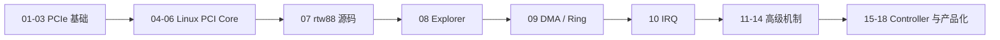

本系列以野火 Linux PCI 子系统章节的学习骨架为主要参考：先建立基础概念，再进入子系统架构、核心结构、核心函数、真实驱动、Explorer、DMA 和 IRQ；随后扩展 Linux 6.12 的 IOMMU、PM、AER、性能、RC/EP 与系统调试。

| 阶段 | 文章 |
| --- | --- |
| PCIe 基础 | 01 PCIe 定义/历史/拓扑/Link/TLP；02 配置空间/BDF/枚举；03 BAR/三类空间/ATU/MMIO |
| Linux PCI Core | 04 子系统四层架构；05 核心结构；06 核心函数与 Driver 生命周期 |
| 源码与实践主干 | 07 Linux 6.12 `rtw88`；08 PCI Explorer；09 DMA/Descriptor/Ring；10 INTx/MSI/MSI-X/IRQ |
| 系统机制 | 11 IOMMU/SVA；12 PM/ASPM/CLKREQ；13 AER/Reset；14 TLP 性能 |
| Controller 与产品化 | 15 RK356x RC/EP Bring-up；16 Endpoint Framework；17 Multi-Queue；18 系统化调试 |

## 一、学习依赖

前 10 篇是必须按顺序阅读的主干。11～18 可以按工作需要选择，但仍假设读者已经理解配置空间、BAR、核心 API、DMA 和 IRQ。

## 二、内容和代码原则

- Linux API、结构体和源码固定到 Linux 6.12。
- 野火用于教学顺序、概念覆盖和案例组织，正文重新表达并明确引用。
- 代码重新编写或使用标注为“简化注释版”的 Linux 官方源码片段。
- 非简单代码块使用中文注释解释状态、所有权、错误回滚和清理。
- 设备私有寄存器和 Workaround 不推广为 PCIe 标准。
- 参考输出、理论演算和实机结果明确区分。

## 三、主要资料

- [野火 Linux PCI 子系统章节](https://doc.embedfire.com/linux/rk356x/driver/zh/latest/linux_driver/subsystem_pci_subsystem.html)
- [Linux 6.12 PCI driver API](https://www.kernel.org/doc/html/v6.12/driver-api/pci/pci.html)
- [PCI-SIG Specifications](https://pcisig.com/specifications)
