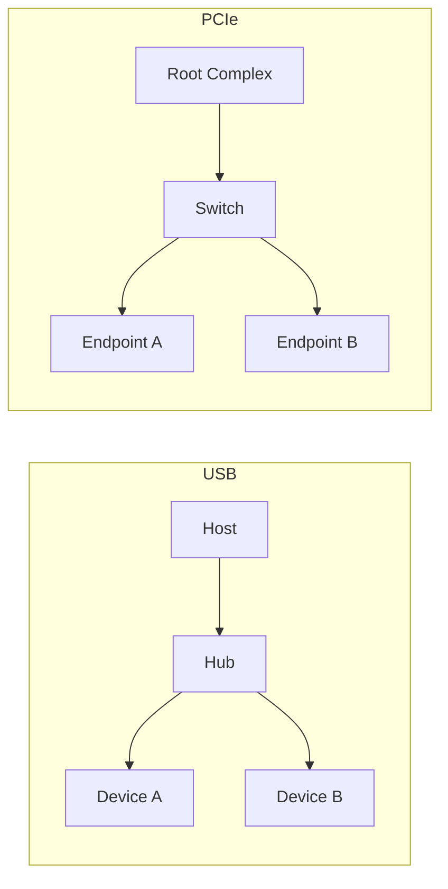

USB 和 PCIe 都是嵌入式 Linux、智能硬件、AI 加速和高速外设开发中常见的总线。但它们的设计思想完全不同。

USB 更偏外设接入、即插即用和标准类设备；PCIe 更偏高速互联、资源映射、DMA 和复杂设备控制。理解二者的差异，有助于我们在学习驱动开发时建立清晰的能力边界。

## 一、USB 和 PCIe 的工程定位

USB 的典型场景是：

- 键盘鼠标
- U 盘
- USB 摄像头
- USB 转串口
- USB 声卡
- 开发板 gadget

PCIe 的典型场景是：

- SSD
- 网卡
- GPU
- NPU/AI 加速卡
- FPGA
- 高速采集卡

可以简单理解：

- USB 解决“外设怎么方便接入”
- PCIe 解决“高速设备怎么高效互联”

## 二、拓扑结构对比

USB 是 Host 主导的树形拓扑，中间可以有 Hub。

PCIe 是 Root Complex 主导的点对点拓扑，中间可以有 Switch。



两者都由主机侧组织系统，但 USB 更强调设备即插即用，PCIe 更强调资源分配和高速通路。

## 三、设备识别方式对比

USB 通过描述符识别设备：

- Device Descriptor
- Configuration Descriptor
- Interface Descriptor
- Endpoint Descriptor

PCIe 通过配置空间识别设备：

- Vendor ID
- Device ID
- Class Code
- BAR
- Capabilities

这决定了两类驱动的第一步完全不同。

## 四、资源模型对比

USB 的核心资源是接口和端点。

PCIe 的核心资源是 BAR、中断和 DMA。

| 维度 | USB | PCIe |
|---|---|---|
| 识别信息 | 描述符 | 配置空间 |
| 数据通道 | Endpoint | DMA / MMIO |
| 控制接口 | Control Transfer | MMIO Register |
| 中断机制 | Interrupt Transfer 不是 CPU 中断 | INTx / MSI / MSI-X |
| 典型数据模型 | URB | Descriptor Ring / DMA |

## 五、驱动生命周期对比

USB 驱动：

1. 设备插入
2. 枚举描述符
3. 匹配 interface
4. 调用 probe
5. 解析 endpoint
6. 提交 URB
7. disconnect 清理

PCIe 驱动：

1. 设备上电
2. 链路训练
3. 枚举配置空间
4. 分配 BAR
5. 匹配 pci_driver
6. probe 映射资源
7. 配置 DMA 和中断
8. remove 清理

## 六、数据传输模型对比

USB 驱动通常围绕 URB 组织传输；PCIe 驱动通常围绕 DMA ring 和 MMIO doorbell 组织传输。

USB 更像“把一个个传输请求提交给总线调度”；PCIe 更像“主机和设备共享队列，设备直接 DMA 搬数据”。

## 七、调试工具对比

USB 常用：

```bash
lsusb
lsusb -v
lsusb -t
usb-devices
usbmon
dmesg -w
```

PCIe 常用：

```bash
lspci
lspci -vv
lspci -xxx
setpci
cat /proc/interrupts
dmesg -w
```

## 八、学习路线建议

如果你从 Linux 驱动入门，USB 更适合先建立“枚举、匹配、端点、传输”的概念；如果你目标是 GPU/NPU/FPGA/高速网卡/SSD 驱动，PCIe、DMA 和 IOMMU 必须深入掌握。

## 九、小结

USB 和 PCIe 都是总线，但它们关注点不同：

- USB：描述符、接口、端点、URB、类驱动、gadget
- PCIe：配置空间、BAR、MMIO、中断、DMA、IOMMU

二者放在一起学，能帮助我们建立更完整的 Linux 驱动总线视角。

> 🏷️ USB / PCIe / 总线模型 / Linux驱动 / DMA / URB

---

## 初学者扩展讲解


## 用一条主线区分 USB 和 PCIe

初学者经常把 USB 和 PCIe 都理解成“外设接口”，但在驱动开发里，它们的关注点完全不同。USB 是 Host 主导的外设接入体系，强调描述符、接口、端点和 URB；PCIe 是高速互连体系，强调配置空间、BAR、MMIO、中断、DMA 和 IOMMU。

可以用一个类比理解：USB 更像“外设主动报上自己的功能菜单”，系统读取描述符以后决定让哪个类驱动或厂商驱动接管；PCIe 更像“设备挂在高速总线上，系统给它分配地址窗口和中断资源”，驱动通过寄存器和 DMA 队列与设备协作。

## 为什么两者调试方法差异很大

USB 的第一问题通常是“设备有没有枚举、描述符是否正确、接口有没有绑定驱动、URB 有没有完成”。所以 USB 工具围绕 `lsusb`、`lsusb -v`、`lsusb -t` 和 `usbmon` 展开。你要看的重点是 VID/PID、class/subclass/protocol、endpoint 地址、传输类型、最大包长和 URB 状态。

PCIe 的第一问题通常是“链路有没有起来、配置空间能不能读、BAR 有没有分配、中断有没有触发、DMA 地址是否正确”。所以 PCIe 工具围绕 `lspci`、`lspci -vv`、`setpci`、`/proc/interrupts`、IOMMU 日志和驱动 trace 展开。你要看的重点是链路速率、链路宽度、BAR 地址、MSI/MSI-X、Bus Master、DMA mask 和 IOMMU fault。

## 从驱动入口看差异

USB 驱动的入口常常是 `struct usb_driver`，匹配表是 `struct usb_device_id`，`probe()` 参数是 `struct usb_interface *`。这说明 Linux 往往把 USB 设备的某个接口交给驱动管理，而不是永远把整个设备交给一个驱动。

PCIe 驱动的入口通常是 `struct pci_driver`，匹配表是 `struct pci_device_id`，`probe()` 参数是 `struct pci_dev *`。驱动拿到的是一个 PCIe function，然后申请 BAR、映射 MMIO、设置 DMA 能力、申请中断并初始化设备。

## 从数据通路看差异

USB 数据通路以 URB 为核心。驱动构造 URB，指定 endpoint、buffer、长度和回调，提交给 USB core。USB core 再交给 Host Controller Driver，最后由硬件按 USB 协议调度传输。完成后，驱动在回调中处理结果。

PCIe 数据通路通常以 DMA ring 或 descriptor queue 为核心。驱动分配 DMA buffer 和描述符，把 DMA 地址写入设备寄存器或队列，设备通过 PCIe Memory Transaction 直接访问内存，完成后通过 MSI/MSI-X 通知 CPU。驱动再在中断或轮询路径中回收完成项。

## 初学者如何安排学习顺序

建议先学 USB，再学 PCIe。USB 的描述符和端点模型更容易通过真实设备观察，插拔设备就能看到枚举过程；PCIe 涉及链路训练、配置空间、DMA 和 IOMMU，对硬件平台和内核基础要求更高。但如果目标是 NPU/GPU/网卡/NVMe/采集卡这类高速设备驱动，PCIe 必须深入掌握。

学习时不要只看文章。USB 至少实际观察一次 U 盘、USB 串口或 USB 摄像头；PCIe 至少实际观察一次 NVMe 或网卡的 `lspci -vv` 输出。把命令输出和文章概念对应起来，学习效果会明显提升。


## 面向初学者的阅读方法

刚开始学习这类驱动文章时，最容易犯的错误，是把每一个名词都当成孤立知识点去背。实际工程里，驱动不是由名词堆起来的，而是一条从硬件连接、总线枚举、内核匹配、资源申请、数据传输到用户态验证的完整链路。读这一篇时，建议先抓住三件事：第一，这个机制解决什么问题；第二，Linux 内核用什么对象表达它；第三，出现故障时应该从哪一层开始查。

例如看到“枚举”，不要只记住它叫 enumeration，而要理解为：系统需要先发现设备、识别设备能力、给设备分配地址或资源，然后才可能让具体驱动接管。看到“驱动匹配”，也不要只背 `probe()`，而要继续追问：是谁触发 `probe()`？匹配表里放了什么？设备还没有出现时驱动会不会执行？驱动执行以后第一步应该申请什么资源？这些问题连起来，才是真正能在板子上排错的知识。

## 从硬件到软件的完整路径

一条外设链路通常可以分成五层。第一层是硬件层，包括供电、时钟、复位、信号线、连接器和外设本身。第二层是总线层，也就是 USB、PCIe、I2C、SPI 这类协议如何发现设备、传输数据。第三层是内核框架层，Linux 会把设备抽象成 `struct device`、总线对象、驱动对象和资源对象。第四层是具体驱动层，驱动负责把通用框架和具体芯片寄存器、端点、队列、描述符连接起来。第五层是用户态验证层，包括命令行工具、测试程序、日志和性能统计。

初学者排错时不要一上来就怀疑驱动代码。设备没有被系统看到时，驱动代码通常还没有执行；驱动没有绑定时，可能是匹配表或描述符问题；驱动绑定了但不能传输时，才更可能进入 buffer、DMA、中断、同步和协议细节。按照这个顺序排查，可以避免在错误层面浪费时间。

## 建议准备的实验环境

学习 USB/PCIe 驱动，最好准备一台 Linux 主机、一块支持外设扩展的开发板，以及至少一个真实设备。USB 方向可以从 U 盘、USB 串口、USB 摄像头、USB 网卡开始；PCIe 方向可以从 NVMe、PCIe 网卡、PCIe 转串口卡、FPGA PCIe Endpoint 或开发板自带 PCIe 插槽开始。没有 PCIe 硬件时，也可以先通过 `lspci` 观察 PC 上已有设备，理解配置空间、BAR 和驱动绑定。

每次实验都建议记录四类信息：硬件连接照片或说明、内核版本和设备树/配置、关键命令输出、问题现象和解决过程。驱动学习的进步往往不是来自“看懂一段代码”，而是来自反复把现象、日志、源码和硬件状态对应起来。

## 常用观察命令

无论是 USB 还是 PCIe，都建议养成先看系统状态的习惯：

```bash
uname -a
dmesg -w
lsmod
cat /proc/interrupts
cat /proc/iomem
```

`uname -a` 用来确认内核版本；`dmesg -w` 用来实时观察设备插拔、枚举和驱动 probe 日志；`lsmod` 用来看模块是否加载；`/proc/interrupts` 用来看中断是否触发；`/proc/iomem` 可以帮助理解 MMIO 资源分配。不要小看这些基础命令，很多现场问题并不是复杂 bug，而是设备没枚举、驱动没加载、资源没分配或中断没到。

## 初学者最容易混淆的点

第一，不要把“用户态能看到设备节点”等同于“驱动完全正常”。设备节点只说明某个驱动创建了接口，真正的数据通路还要看读写、ioctl、mmap、poll、DMA 和中断是否正常。

第二，不要把“驱动 probe 成功”等同于“硬件已经工作”。probe 成功通常只代表资源申请和初始化基本完成，后续传输仍可能因为时钟、复位、buffer、协议状态或固件问题失败。

第三，不要把“命令没有报错”等同于“性能达标”。高速设备还要统计吞吐、延迟、CPU 占用、内存拷贝次数、DMA 是否真正生效，以及异常恢复是否可靠。

## 推荐的验证闭环

一篇驱动文章学完以后，不建议只停留在阅读层面。至少做一个小闭环：先用命令确认设备存在，再找到它绑定的驱动，然后观察内核日志，再做一次最小读写或传输测试，最后故意制造一个小错误，例如拔掉设备、改错匹配 ID、禁用模块或调整 buffer 数量，观察系统如何报错。只有经历过“正常路径”和“异常路径”，才能真正理解驱动框架为什么这样设计。
