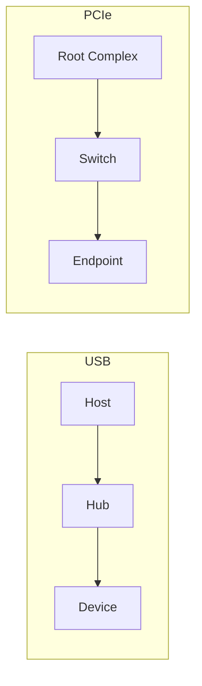

USB 和 PCIe 都由主机侧建立拓扑、发现设备并绑定驱动，但它们解决的问题不同。USB 面向可插拔外设和标准 Class，以 Host 调度 endpoint 传输；PCIe 面向内存语义的高速互连，以 Root Complex 路由 TLP、BAR、DMA 和消息中断。

本篇不重复两条主线细节，而是比较同一个工程问题在两种总线中由什么对象和协议承担。

## Host 与 Root Complex 都是根，但控制粒度不同

USB Host 控制总线时间。Device 不能任意发送事务，Host Controller 根据 control/bulk/interrupt/isochronous endpoint 调度 token。Hub 扩展端口，Device 是树叶。

PCIe Root Complex 连接 CPU/内存与 fabric。Link 进入 L0 后，Endpoint 可以作为 requester 发 Memory Read/Write、MSI 等 TLP，Switch 按地址/BDF 路由。RC 不为每个 DMA packet轮询 endpoint。

两者都支持 hotplug，但 USB 从设计上普遍假设频繁插拔；PCIe hotplug 需要 slot controller、power、PERST#、attention 与 OS 协同，很多嵌入式链路实际固定连接。

## 枚举输入：描述符与配置空间

USB Device 通过 EP0 `GET_DESCRIPTOR` 返回变长描述符树，Host 分配 USB address、选择 Configuration，并为 Interface 注册驱动对象。设备功能由 Device/Interface/Endpoint/Class descriptor 表达。

PCIe function 的 Configuration Space 可由 BDF 访问，包含 VID/DID/Class、BAR 和 Capability。RC/PCI core 递归 bridge、分配 bus number 与 resource，再为 `pci_dev` 匹配驱动。

USB 描述符由 Device 固件在控制传输中返回，可能短包/STALL；PCIe 配置空间由硬件/Endpoint Controller 响应 Configuration TLP。两者都会因格式错误无法绑定，但故障证据完全不同。

## 数据通道：Endpoint/URB 与 BAR/DMA Queue

USB endpoint 是由描述符声明的协议通道。Host driver 构造 URB 交给 usbcore/HCD，控制器按总线调度完成后回调。即使是 USB Device 向 Host 发数据，也要等 Host IN token。

PCIe BAR 是 Host 到设备的 MMIO 窗口，DMA 是 Endpoint 到内存的主动 transaction。高吞吐驱动常用 descriptor ring、doorbell、completion queue 和 MSI-X；设备在获得 DMA 地址后可主动读写。

因此 USB “interrupt endpoint”不是 CPU interrupt；PCIe MSI/MSI-X 才是设备通过 Memory Write 触发 IRQ。USB URB buffer 与 PCIe DMA buffer都需要异步生命周期，但 ownership 的调度者不同。

## 资源模型：带宽调度与地址空间

USB periodic endpoint 受 frame/microframe 带宽、interval 和 max packet约束，Hub/TT 和 Host Controller 参与调度。Bulk 使用剩余带宽，追求可靠但无固定延迟。

PCIe 主要分配 bus number、BAR/bridge window、MSI vector 和 DMA IOVA。性能受 Link width/speed、MPS/MRRS、credit、outstanding 和内存系统影响。它不把每个 endpoint 带宽写成 Host 周期表。

USB 配置错误常见 endpoint/altsetting带宽不足；PCIe 资源错误常见 BAR aperture、MSI vector、DMA mask/IOMMU mapping。

## 错误与恢复的基本单位不同

USB 可在单个 URB 上报告 STALL、short packet、protocol error，也可 reset endpoint/device；拔出后 interface disconnect、在途 URB 被 shutdown/cancel。

PCIe 通过 Completion Status、AER、Link state、IOMMU fault 和设备 queue status报告。恢复可能是 queue reset、FLR、hot reset、secondary bus reset 或 slot power cycle。

USB 类协议常有自己的 reset（如 MSC BOT reset）；PCIe driver 也有设备自定义 reset。总线可靠不替代设备协议恢复。

## 选择总线看设备行为，不只看峰值带宽

需要低成本外接、线缆供电、标准 HID/MSC/UVC/UAC、跨 OS 即插即用，USB 更合适。需要低延迟 MMIO、大量主动 DMA、多队列和高带宽板内连接，PCIe 更合适。

MCU 作为 Device/Host 常使用 USB，因为控制器和协议栈资源可控；NPU/FPGA/高速 NIC/SSD 常使用 PCIe。某些设备同时提供 USB 控制/兼容接口和 PCIe 高速数据接口，驱动要定义一致的固件与 reset 协议。

## 小结

USB Host 与 PCIe Root Complex 都建立主机侧拓扑，但 USB 用描述符、Interface、Endpoint 和 URB 实现 Host 调度的外设接入；PCIe 用配置空间、BAR、TLP、DMA 和 MSI-X 实现内存语义高速互连。比较两者时应围绕枚举、资源、数据所有权、hotplug 和错误恢复，而不是只用“USB 慢、PCIe 快”概括。
