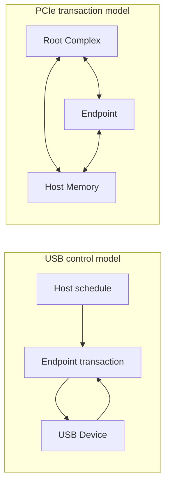

USB 和 PCIe 都能连接高速外设，也都支持设备发现、驱动绑定、热插拔和电源管理，但它们暴露给软件的基本抽象不同。USB 是 Host 调度的设备/Endpoint 传输总线；PCIe 是 Root Complex 路由、接近内存语义的点对点互连。

比较的目的不是判断谁“更先进”，而是理解为什么同一个工程问题在两条总线上要使用不同协议和驱动结构。

## 一、根节点的控制方式不同

USB Host 拥有总线调度权，Device 只能响应 token。即使键盘“主动”上报，仍是 Host 周期性轮询 Interrupt Endpoint。Hub 扩展树，但不改变 Host 控制权。

PCIe Root Complex 建立 fabric 与地址路由，Endpoint 可以作为 requester 主动发 DMA Memory Read/Write，也可以响应 CPU/RC 的 Memory/Configuration Request。PCIe Link 全双工并允许多个 outstanding transaction。

因此 USB Device 无法任意选择总线发送时刻；PCIe Endpoint 则可在 credit/tag/ordering 允许时发起事务。

## 二、发现输入是描述符与 Configuration Space

USB Device 从地址 0 的 EP0 返回 Device/Configuration/Interface/Endpoint descriptor，Host 发送 `SET_ADDRESS`、`SET_CONFIGURATION`，再按 Interface class/ID 绑定驱动。

PCIe Endpoint 在独立 Configuration Space 中提供 Vendor/Device/Class、Header、BAR 和 Capability。RC 按 BDF 探测，递归扫描 Bridge，分配 bus number、BAR 和 bridge window，再创建 `pci_dev`。

USB 描述符更多表达功能协议与 Endpoint；PCIe 配置空间更多表达 Function 身份、地址资源和总线能力。USB Class 可直接决定用户 API，PCIe BAR 内部业务协议通常由设备/厂商定义。

## 三、数据通道是 URB 与 BAR + DMA Queue

USB Host Driver 创建 URB，指定 pipe/Endpoint、buffer、length 和 completion，HCD 把它调度为 Control/Bulk/Interrupt/Isochronous transaction。带宽由 Host schedule 和 Endpoint 类型决定。

PCIe Driver 用 BAR/MMIO 配置设备，通过 DMA descriptor ring 发布 buffer，doorbell 通知设备，MSI-X 通知 completion。数据主体通常直接在 Host memory 与 Device 间搬运。

USB 也可能使用 Host Controller DMA，但 DMA 地址由 HCD 管理，Interface Driver 看到 URB；PCIe Function 自己是 DMA requester，Function Driver 直接使用 Linux DMA API 管理 mapping。

## 四、资源、带宽和错误恢复单位不同

USB 资源包括 Device address、Interface、Endpoint、周期带宽、URB 和 Host Controller schedule。拔出时 `disconnect()` 需要 kill URB；reset/clear halt 常以 Device/Endpoint 为单位。

PCIe 资源包括 BDF、BAR/window、vector、DMA mapping、tag/credit 和 queue。remove/reset/AER recovery 需要停止 bus mastering/DMA、同步 IRQ、重建 ring/generation。

USB error recovery 常见 EP0 reset、Endpoint stall/clear、Class reset；PCIe error recovery 常见 Link retrain、FLR/hot reset、AER callback。两者都要求异步请求收敛，但硬件边界不同。

## 五、hotplug、电源与安全模型不同

USB 从设计上强调外部热插拔和标准 Class。供电、端口 reset、suspend/resume、remote wakeup 是常见路径；用户随时拔线必须是驱动正常生命周期。

PCIe 也支持 hotplug，但很多嵌入式 Endpoint 固定焊接。Surprise removal 更危险，因为 Endpoint 可能正在 DMA。IOMMU group/IOVA 为 PCIe requester 提供隔离；USB Interface Driver 的 DMA 通常由 HCD 隔离管理。

USB Device 只能在 Host 安排的 buffer/transaction 中传输；PCIe Endpoint 具备更直接的 memory requester 能力，因此错误/恶意 DMA 的安全影响更大。

## 六、如何选择

选择 USB：外部可插拔、跨平台标准 Class、线缆距离/供电/成本重要、Device 不需要共享内存式访问。选择 PCIe：板内/机内高吞吐低延迟、设备需要主动 DMA、多队列并发、BAR/MMIO 控制和高带宽扩展。

| 维度 | USB | PCIe |
| --- | --- | --- |
| 根控制者 | Host Controller 调度所有 transaction | RC 建立 fabric，Endpoint 可主动请求 |
| 发现 | EP0 descriptor 与 Configuration | BDF、Configuration Space、Bridge scan |
| 数据抽象 | Endpoint + Transfer + URB | Address + TLP + DMA Queue |
| 通知 | Host 周期调度/URB completion | INTx/MSI/MSI-X message |
| 资源 | Address、Interface、Endpoint、周期带宽 | BAR、window、tag/credit、vector、IOVA |
| 热插拔 | 常规设计目标 | 平台可选，surprise removal 风险更高 |
| 标准功能 | HID/CDC/MSC/UVC/UAC 等 Class | 配置机制标准，业务协议多由设备定义 |
| 安全边界 | Device 只能响应 Host 安排传输 | Endpoint 可主动 DMA，需要 IOMMU 隔离 |

### 同一个 AI/FPGA 设备如何做选择

若设备每次上传少量配置、下载结果，要求外接/跨平台且无需内核专用驱动，USB Bulk + vendor protocol/libusb 可能足够。Host 控制所有传输，固件实现 EP0 和有限 Endpoint，系统集成成本较低。

若设备持续访问大块 Host memory、需要多 queue/低 P99 和并行 outstanding，PCIe 更合适。它需要 BAR、DMA descriptor、MSI-X、IOMMU/reset 协议，硬件/驱动复杂度更高。

还可将 USB 用于维护/升级，PCIe 用于运行时数据；但两条通路必须有一致的 reset/firmware ownership，避免 USB 正在升级时 PCIe DMA 仍运行。

控制面可以 USB、数据面 PCIe；也可以 PCIe 控制 + 网络数据。关键是业务语义、带宽/延迟、拓扑、软件生态、热插拔和安全边界，而不是只比较峰值数字。

**参考资料**

- [USB 2.0 Specification - USB-IF](https://www.usb.org/document-library/usb-20-specification)
- [PCI-SIG Specifications](https://pcisig.com/specifications)

## 七、小结

USB 以 Host/Endpoint/Transfer 为核心，PCIe 以 RC/Endpoint/Transaction/Address 为核心。Descriptor 与 Configuration Space、URB 与 DMA Ring、disconnect 与 remove/reset 不能机械一一对应。

下一篇从 Linux Driver Core 视角比较两类驱动对象和所有权迁移。
