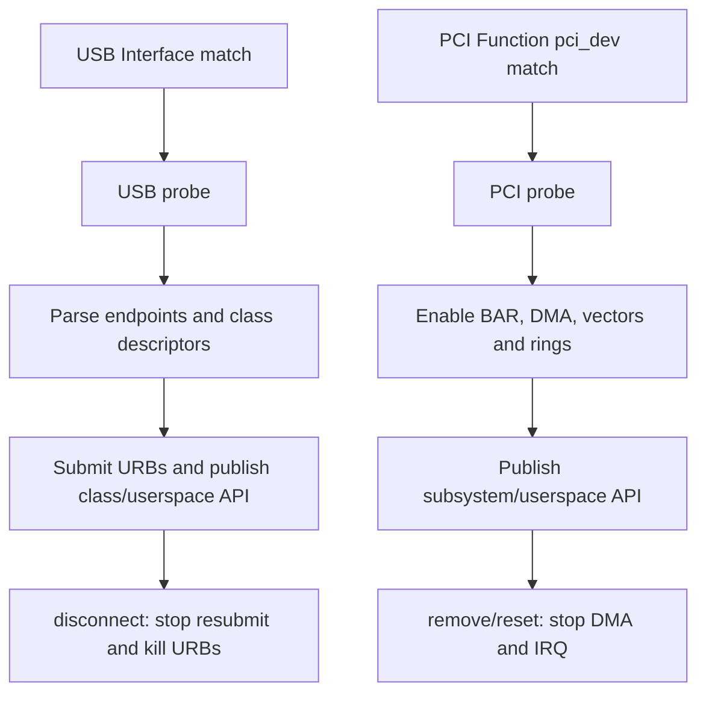

Linux USB 与 PCI 驱动都接入 Driver Core，也都有 ID table、probe 和 teardown callback。但传给驱动的对象、异步请求和硬件停止条件不同。有效比较应关注对象与所有权，而不是把 API 名字排成对照表。

## 一、被匹配的对象不同

USB Interface Driver 的 probe 接收 `struct usb_interface *`。一个物理 `usb_device` 可包含多个 Interface，并由不同驱动分别绑定。驱动解析当前 Alternate 的 Endpoint，再提交 URB。

PCI Driver 的 probe 接收 `struct pci_dev *`，通常对应一个 PCI Function。它拥有配置空间、BAR resource、MSI/MSI-X Capability 和 DMA requester identity。

因此 USB Driver 不能默认独占整个 Device；PCI Function Driver 也不能默认拥有同一 slot 的其他 Function/PF/VF。

## 二、probe 的输入前提和发布顺序不同

USB probe 前，Host 已完成 EP0 枚举、设置 Configuration、解析 descriptor 并创建 Interface。probe 主要验证 Class/vendor 布局、Endpoint 和协议状态。

PCI probe 前，Link/config scan、BDF、BAR sizing/resource 已完成，但 device decode、bus master、DMA mask、mapping、vector 和内部 ring 仍需驱动启用。

两者都应最后发布用户入口。USB 在 URB pool/设备协议就绪后 `usb_register_dev()`/注册子系统；PCI 在 BAR/DMA/IRQ/hardware READY 后注册 misc/net/block/accelerator。

| probe 阶段 | USB Interface Driver | PCI Function Driver |
| --- | --- | --- |
| 进入前 | 地址/配置/Interface 已建立 | BDF/BAR resource 已建立 |
| 驱动验证 | Descriptor、Endpoint、Class/Vendor 协议 | Revision、BAR size、Capability、设备 ID |
| 异步资源 | URB pool、anchor、wait queue | DMA ring、mapping、MSI-X、request table |
| 硬件启动 | Class request/提交接收 URB | reset、ring base、queue enable、doorbell |
| 发布入口 | tty/V4L2/block/char 等 | net/block/char/accelerator 等 |

USB `probe()` 失败通常不影响其他 Interface；PCI Function probe 失败则该 Function 整体无驱动。复合设备/多 Function 的错误域不同。

## 三、URB 与 DMA Descriptor 的所有权边界

USB Interface Driver 把 URB 交给 usbcore/HCD，HCD 管理 Host Controller DMA。提交后 URB/buffer 直到 completion/kill 才归驱动。

PCI Driver 直接使用 DMA API map payload，把 DMA address 写入设备 descriptor，doorbell 后 Device 成为 owner，completion 后 unmap/recycle。

USB 取消使用 unlink/kill/anchor；PCI 通常使用 queue abort/reset/generation。共同原则是：异步对象未收敛前不能释放 buffer/context。

## 四、disconnect 与 remove/reset 的停止语义

USB 外部拔出很常见。disconnect 清 intfdata、撤销用户入口、置 disconnected、`usb_kill_anchored_urbs()`、停止 RX pool，再由 kref/reference count 等待 open file。

PCI remove 需要先撤销入口、停止 queue/DMA、flush posted write、synchronize IRQ/work、unmap/free ring，再释放 BAR/device。AER/FLR 可能保留 `pci_dev` 并要求重建硬件，不一定执行 remove。

两者的 reference count 都只保护软件内存，不证明硬件可访问。open fd 持有对象时，I/O 仍要检查 disconnected/dead/generation。

一个容易混淆的迁移是“保留 open fd 穿过 reset”。USB reset 后同一个 `usb_interface` 可能继续存在，但 Endpoint/协议状态需恢复；PCI FLR 后 `pci_dev` 仍存在，但 BAR/queue/MSI-X 设备状态可能丢失。文件对象可保留，硬件请求必须在 READY 重新建立后才恢复。

## 五、同步、runtime PM 和错误回滚

USB completion 常在不可睡眠上下文，disconnect 与 completion/resubmit 竞争；PCI hard IRQ/poll 与 reset/remove 竞争。锁和状态机应围绕资源 ownership，而不是围绕 API 函数名。

USB runtime PM 常用 Interface autopm get/put，suspend 停 URB、resume 重提；PCI runtime PM 可能进入 D-state，保存/恢复配置与 ring。两者都必须阻止用户请求跨越未恢复硬件。

错误回滚均按获取逆序。devm/managed API 可以减少释放代码，但不能代替硬件 quiesce。测试要注入 probe 每个阶段失败，检查已取得资源是否收敛。

## 六、源码阅读入口与设计迁移

USB 从 `drivers/usb/core/driver.c`、`urb.c`、目标 class driver 进入；PCI 从 `drivers/pci/pci-driver.c`、`probe.c`、MSI/DMA/IOMMU 和目标驱动进入。

把 USB 驱动迁到 PCIe 时，不能把 URB 换成 descriptor 就结束，还要新增 BAR/BusMaster/IOMMU/reset；把 PCIe 迁到 USB 时，不能让 Device 主动 DMA Host memory，要适应 Host schedule/Endpoint/Class。

### 一份统一的 teardown 审计表

1. 是否先撤销用户/子系统入口，阻止新 open/submit？
2. 是否设置 dead/disconnected，并唤醒阻塞线程？
3. 是否停止硬件产生新事件？
4. 是否同步取消 URB 或停止 DMA queue？
5. 是否等待 IRQ/completion/work/timer？
6. 是否在最后异步访问结束后才释放 buffer/mapping/BAR？
7. open fd/reference 最终是否收敛？

USB 与 PCIe 的 API 不同，但这七项都必须回答。测试应在每个步骤插入延迟/故障，覆盖 teardown 竞态。

**参考资料**

- [Linux USB Host Side API](https://docs.kernel.org/driver-api/usb/usb.html)
- [How To Write Linux PCI Drivers](https://docs.kernel.org/PCI/pci.html)

## 七、小结

USB 驱动围绕 `usb_interface`、Endpoint、URB 和 disconnect；PCIe 驱动围绕 `pci_dev`、BAR、DMA Ring、IRQ 和 remove/reset。两者共享 Driver Core 和“先停止异步硬件再释放对象”的原则，但资源和恢复单位不同。
