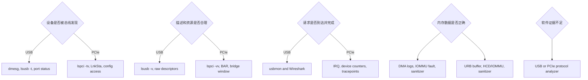

调试工具的价值不在数量，而在它能证明哪一层。usbmon 能证明 Host 提交/完成了哪些 USB 请求；`lspci -vv` 能证明 PCIe 配置与 Link 状态；二者都不能单独证明设备内部状态或用户程序正确。

## 一、先确定要证明的事实



每次只问一个可判定问题，再选择工具。没有连接证据时不先抓应用；没有 DMA completion 时不先调算法。

## 二、发现、描述和配置工具

USB：`dmesg -w` 看 connect/reset/error，`lsusb -t` 看树/速度/Interface Driver，`lsusb -v` 看 descriptor。sysfs modalias/driver 证明 Interface 是否创建和绑定。

PCIe：`lspci -tv` 看 RC/Switch/Endpoint，`lspci -vv -s BDF` 看 `LnkSta`、BAR、Command、MSI-X、AER。sysfs `resource/config/driver/iommu_group` 证明资源和 ownership。

USB discovery snapshot：

```bash
dmesg | tail -n 200
lsusb -t
lsusb -v -d vid:pid
```

PCIe discovery snapshot：

```bash
lspci -tv
lspci -vv -s BDF
cat /sys/bus/pci/devices/BDF/resource
readlink /sys/bus/pci/devices/BDF/iommu_group
```

快照要包含测试前后差值。PCIe AER/IRQ 计数和 USB reset/error 日志若只截取故障后一行，很难判断是原因还是恢复结果。

这些工具读取的是内核已知状态。`lsusb -v` 解析失败要回原始 descriptor；`lspci` BAR 正常不证明 ATU/寄存器响应。

## 三、单次协议和传输发生了什么

USB 使用 usbmon：

```bash
sudo modprobe usbmon
sudo cat /sys/kernel/debug/usb/usbmon/0u
```

记录 URB submit/complete、pipe、length、status；Wireshark 进一步解码 Setup、MSC CBW/CSW、UVC 等。usbmon 看不到 PHY 波形和 Device 内部逻辑。

PCIe 普通 Linux 没有等价的通用 TLP 抓包。依靠 Device/RC counters、AER、driver tracepoint、IRQ/CQ 日志；需要 TLP/header/credit/replay 时使用硬件 protocol analyzer 或 IP 内置 trace。

## 四、中断、DMA 与地址转换

USB/PCIe 都用 `/proc/interrupts` 证明 IRQ 到达，但 USB Interface URB completion 还经过 HCD，PCIe MSI-X 常直接对应设备 queue。

DMA 调试记录 request ID、DMA address、length、direction、generation、map/unmap。IOMMU fault 提供 requester/IOVA/access；回查 request table。关闭 IOMMU 不是定位完成。

KASAN 查越界/UAF，lockdep 查锁，kmemleak 查泄漏，perf 查 CPU/cache。工具结果要与总线证据同时间线对齐。

### 同一个“超时”如何分层

USB Bulk timeout：usbmon 中请求是否提交；Device 是持续 NAK、STALL 还是无响应；HCD 是否 giveback；Class 协议是否缺启动命令；runtime PM 是否挂起。

PCIe request timeout：SQ doorbell 是否写；Device consumer 是否前进；DMA/IOMMU fault；CQ 是否写但 MSI-X 未到；IRQ 到但 poll 未消费；Completion Timeout/AER 是否增长。

二者都叫 timeout，但 USB 由 Host schedule/Endpoint 响应驱动，PCIe 由共享 ring/Device requester 驱动。工具选择必须从协议模型出发。

## 五、dynamic_debug、tracepoint 和 protocol analyzer

dynamic_debug 适合临时打开 usbcore/HCD/PCI driver 调试日志；tracepoint/ftrace 适合低侵入构建 submit/completion/IRQ/work 时间线。大量 printk 会改变竞态和延迟。

protocol analyzer 在软件证据矛盾时使用：USB 看 packet/handshake/SOF；PCIe 看 LTSSM、TLP/DLLP、ACK/NAK/replay/credit。它证明线上的事实，但仍需软件日志解释哪个请求对应哪个 packet。

## 六、证据矩阵和恢复验收

| 问题 | USB 证据 | PCIe 证据 |
| --- | --- | --- |
| 物理/链路 | port/速度、分析仪 | LTSSM/LnkSta/AER、分析仪 |
| 身份/拓扑 | descriptor、Interface | config/BDF/Bridge |
| 请求 | usbmon URB | driver/device TLP/queue counter |
| 中断 | HCD/IRQ/completion | MSI-X/IRQ/CQ |
| 内存 | URB buffer、IOMMU | DMA mapping、IOMMU fault |
| 恢复 | reset/clear halt/disconnect | FLR/AER/generation/reset |

恢复验收不是日志出现 success，而是旧异步对象收敛、新请求通过、错误计数不继续增长。USB 检查 anchored URB/buffer；PCIe 检查 mapping/ring/generation。

建议为每次严重故障保存“最小证据包”：环境版本、拓扑、触发时间、总线状态、请求 ID、IRQ/URB/DMA 时间线、错误计数、恢复动作和恢复后最小测试。证据包能让硬件、固件、内核和应用团队讨论同一事件，而不是交换截图。

**参考资料**

- [Linux USB Host Side API](https://docs.kernel.org/driver-api/usb/usb.html)
- [Linux PCI Error Recovery](https://docs.kernel.org/PCI/pci-error-recovery.html)

## 七、小结

USB 调试更容易直接观察 Host 调度传输，PCIe 调试更多依赖配置、Link、设备 queue 与硬件分析。工具不能替代分层问题；先定义要证明的事实，再采集互相独立的证据。
