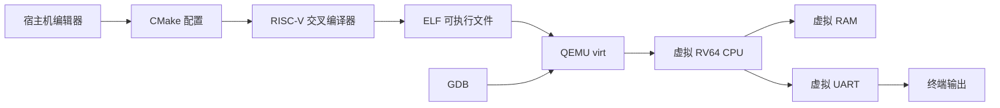
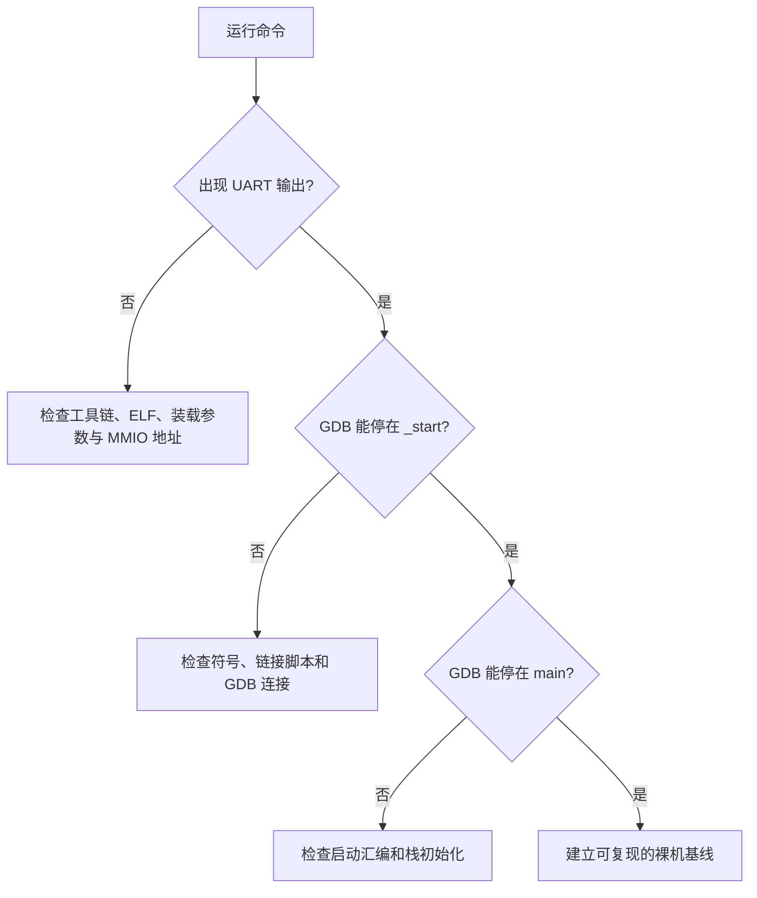
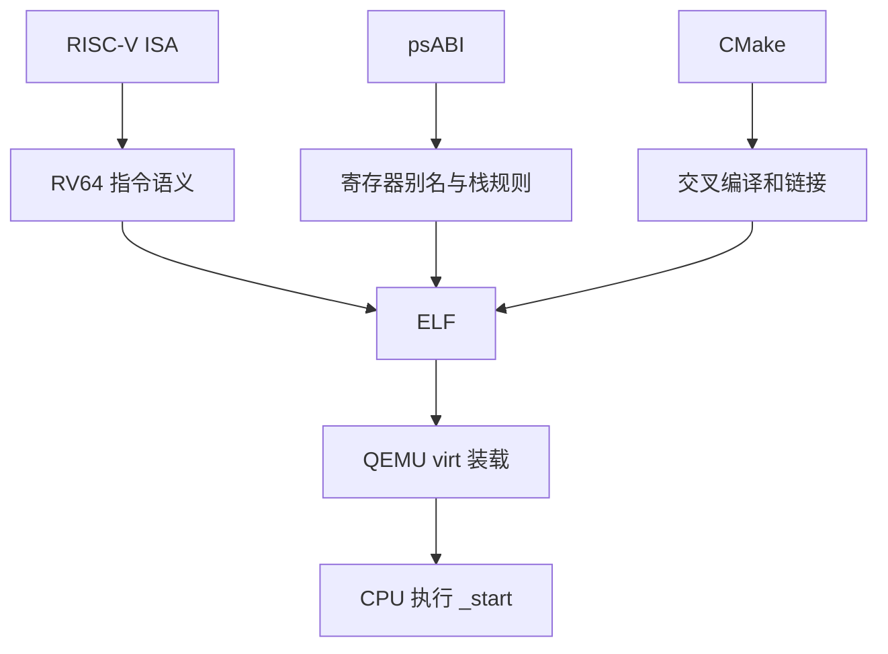
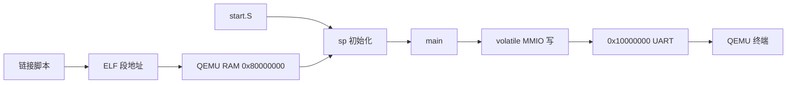
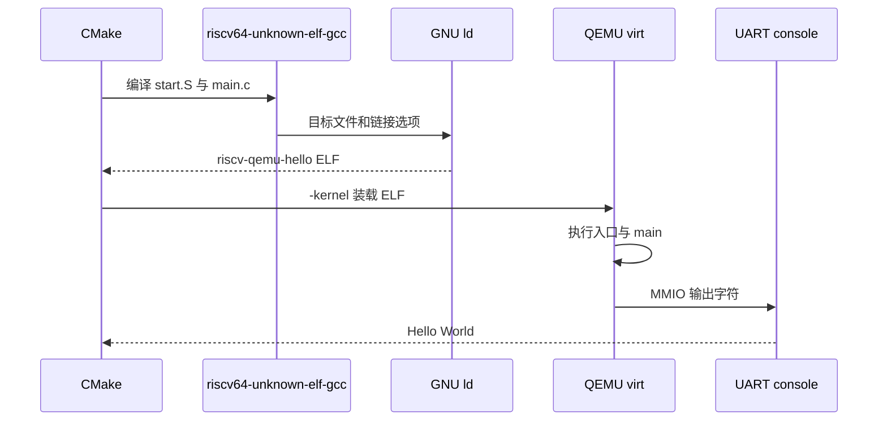
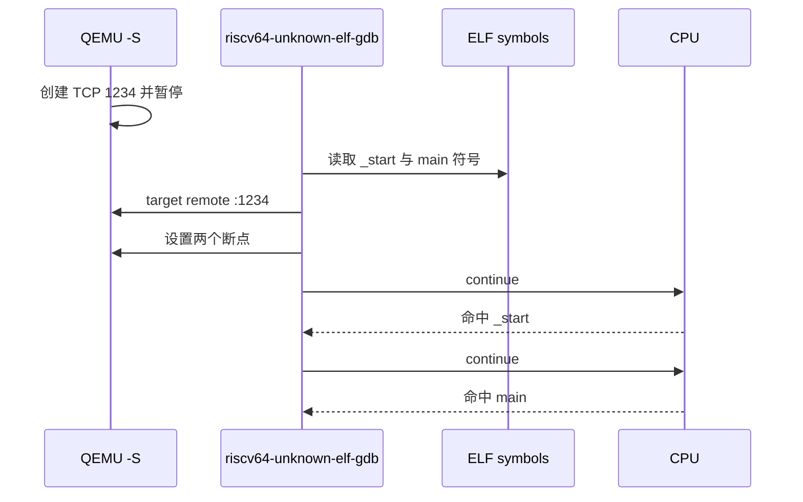
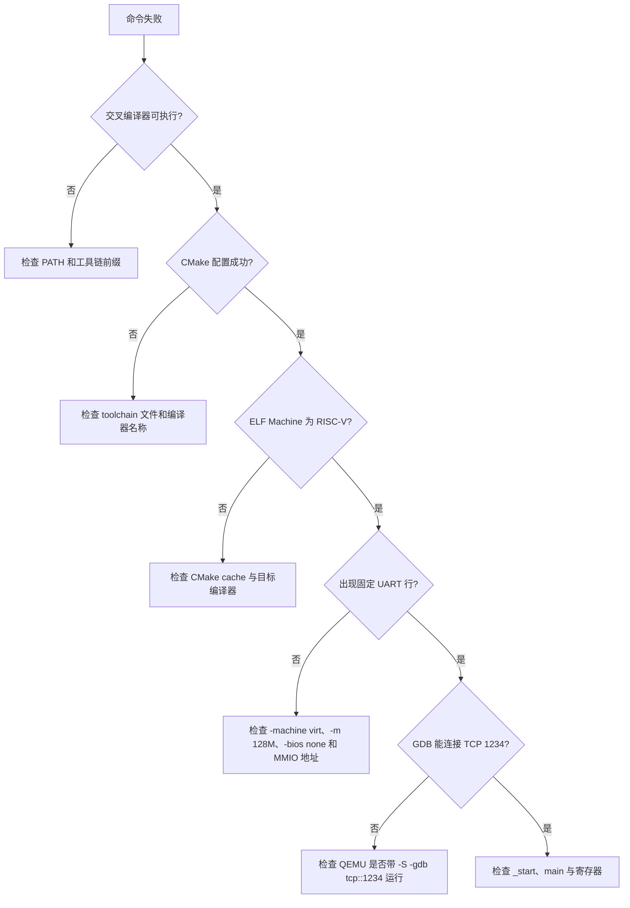

学习一套新处理器架构，最容易卡在两端。

一端是只看规范和寄存器表，知道名词却没有程序真的跑起来。

另一端是直接把现成工程编译成功，却不知道 ELF 是怎样被装载、入口从哪里开始执行、串口字符经过了哪些层。

本章建立一个很小但完整的 RISC-V 实验闭环。

它不需要开发板。

你会在 QEMU 的 virt 虚拟平台上，用 CMake 交叉编译一个 RV64 裸机 ELF，让它通过虚拟 UART 打印一行字符，再用 GDB 停在启动入口和 C 语言 main 函数。

这个闭环是所有裸机、中断、链接和操作系统实验的共同起点。

## 1. 先定义这次实验能证明什么

本章的目标不是把 QEMU 当成真实芯片的替代品。

它的价值是用一个可重复的环境，把处理器、内存、串口和调试器连成可观察的链路。

**QEMU system emulation** 是系统级模拟器。

它模拟一台机器可见的 CPU、RAM、UART 和启动路径，而不是只在宿主操作系统里翻译一段用户态程序。

这与在 PC 上运行普通 Linux 可执行文件不同。

对于熟悉 Cortex-M 的读者，可以把它理解为一块可以随时重建、随时暂停、随时接入调试器的虚拟开发板。

本章选择的 **virt** 是 QEMU 提供的通用 RISC-V 虚拟平台。

它不是任何一家芯片厂商的评估板。

因此，文中出现的 RAM 地址、UART 地址和命令行选项只对 QEMU virt 有效，不能直接搬到 STM32、Zynq 或实际 RISC-V SoC。

**RV64** 表示通用整数寄存器宽度 XLEN 为 64 位的 RISC-V 执行环境。

它和 ARM 中区分 AArch64、AArch32 的思路相近。

本章程序使用 RV64 的基础整数指令和常见扩展，不依赖浮点、操作系统或 C 标准库。

一次成功的实验至少要留下四类证据。

| 证据 | 观察方法 | 它证明什么 |
| --- | --- | --- |
| 工具链存在 | 查看编译器和 QEMU 版本 | 宿主机具备构建和运行条件 |
| ELF 正确 | readelf 查看架构和入口 | 链接器生成了 RISC-V 可执行文件 |
| 串口输出 | QEMU 终端显示固定字符串 | CPU 已经执行到 C 代码并访问 UART |
| GDB 断点 | 停在 _start 和 main | 启动入口、栈初始化与 C 入口都可观察 |

只看到一行 Hello World 还不够。

它说明结果可能正确，却没有把装载地址、入口符号和栈指针暴露出来。

GDB 断点会补上这部分证据。

这套实验能证明软件路径通了。

它不能证明真实板卡的时钟树、引脚复用、供电时序、PCB 信号完整性或外部串口电平正确。

把模拟器验证和硬件验证分开记录，能避免把两类故障混在一起。

## 2. 认识 QEMU virt、RV64 与最小工具链

RISC-V 是 **ISA**，即指令集架构。

ISA 规定指令、寄存器和异常模型的可见语义。

它与 ARMv8-A 的角色相近，不规定某个厂商的 UART 引脚在哪里，也不规定电路板如何布线。

**ABI** 是应用二进制接口。

ABI 规定 C 函数调用时参数、返回值、寄存器保存和栈对齐等约定。

它和 ARM 的 AAPCS 属于同一类规则。

同样的 C 源码只有在编译器、汇编代码和链接器都遵守同一种 ABI 时，函数调用才可靠。

RISC-V 的 x0 到 x31 是整数寄存器的硬件编号。

ABI 为它们定义了容易阅读的别名。

例如 x0 叫 zero，恒为零；x1 叫 ra，通常保存返回地址；x2 叫 sp，是栈指针；x10 到 x17 叫 a0 到 a7，用于传递前八个整数参数。

本章启动代码只直接使用 sp。

RISC-V [ELF psABI](https://riscv-non-isa.github.io/riscv-elf-psabi-doc/) 规定，标准 ABI 代码在过程执行期间必须保持栈指针对齐。

这里把栈顶设为 16 字节对齐的 RAM 末端，足以让最小 C 入口安全地开始执行。

**ELF** 是可执行与链接格式。

它包含目标架构、入口地址、代码段、只读数据段和调试符号。

在 Cortex-M 工程中，常见的 .elf、.bin、.hex 也是同一套概念的不同产物表现。

本章把 ELF 直接交给 QEMU。

QEMU 依据 ELF 的段和入口信息将程序装入虚拟内存。

准备工具时，先确认三个可执行文件。

~~~bash
riscv64-unknown-elf-gcc --version
qemu-system-riscv64 --version
riscv64-unknown-elf-gdb --version
~~~

示例采用 riscv64-unknown-elf 作为 GNU 工具链前缀。

不同发行版可能使用 riscv64-elf、riscv-none-elf 或其他前缀。

不要通过重命名可执行文件解决差异。

应在 CMake 配置时传入实际前缀，例如：

~~~bash
cmake -S . -B build -DCMAKE_TOOLCHAIN_FILE=cmake/toolchain-riscv.cmake -DRISCV_TOOLCHAIN_PREFIX=riscv-none-elf
~~~

编译器名称中的 unknown-elf 表示目标程序不假定 Linux、glibc 或任何特定操作系统。

这与 ARM 裸机常用的 arm-none-eabi 工具链相对应。

QEMU 的 RISC-V 文档说明了 virt 机器支持的固件启动方式和设备描述。

开始实验前，保存 [QEMU RISC-V system emulator 文档](https://qemu.readthedocs.io/en/master/system/target-riscv.html) 与 [virt 平台文档](https://qemu.readthedocs.io/en/master/system/riscv/virt.html) 的链接。

升级 QEMU 后，优先以这些资料和 qemu-system-riscv64 -machine help 的实际输出为准。

## 3. 建立一套可复用的 CMake 工程

将工程建成下面的形状。

每个文件都只负责一件事。

~~~text
riscv-qemu-lab/
├── CMakeLists.txt
├── cmake/
│   └── toolchain-riscv.cmake
├── linker/
│   └── qemu-virt.ld
└── src/
    ├── start.S
    └── main.c
~~~

CMake 的 toolchain 文件告诉构建系统目标不是宿主机。

这一步相当于在 ARM 工程里选择 arm-none-eabi-gcc、芯片架构和裸机编译模式。

~~~cmake
set(CMAKE_SYSTEM_NAME Generic)
set(CMAKE_SYSTEM_PROCESSOR riscv64)
set(CMAKE_TRY_COMPILE_TARGET_TYPE STATIC_LIBRARY)

set(RISCV_TOOLCHAIN_PREFIX riscv64-unknown-elf CACHE STRING "RISC-V GNU toolchain prefix")
set(CMAKE_C_COMPILER ${RISCV_TOOLCHAIN_PREFIX}-gcc)
set(CMAKE_ASM_COMPILER ${RISCV_TOOLCHAIN_PREFIX}-gcc)
set(CMAKE_OBJCOPY ${RISCV_TOOLCHAIN_PREFIX}-objcopy)
~~~

CMakeLists.txt 定义 ELF 目标和每个源文件共享的编译、链接约束。

-march=rv64imac 选择 RV64 基础整数指令、乘除法、原子指令和压缩指令。

-mabi=lp64 选择 64 位 long 与指针的整数 ABI。

这组 ABI 不使用硬件浮点参数传递，因此示例没有要求 F 或 D 浮点扩展。

-ffreestanding 告诉编译器，不应假定标准宿主运行时存在。

-nostdlib 则阻止链接器自动引入 C 标准库启动文件和系统库。

~~~cmake
cmake_minimum_required(VERSION 3.20)
project(riscv_qemu_hello C ASM)

add_executable(riscv-qemu-hello
  src/start.S
  src/main.c
)

target_compile_options(riscv-qemu-hello PRIVATE
  -march=rv64imac
  -mabi=lp64
  -mcmodel=medany
  -ffreestanding
  -fno-stack-protector
  -ffunction-sections
  -fdata-sections
  -Wall
  -Wextra
)

target_link_options(riscv-qemu-hello PRIVATE
  -nostdlib
  -Wl,-T,${CMAKE_CURRENT_SOURCE_DIR}/linker/qemu-virt.ld
  -Wl,--gc-sections
)
~~~

-mcmodel=medany 允许编译器以适合该虚拟 RAM 区间的方式生成地址访问。

不要在尚未理解链接地址时随意切换 code model。

如果程序变大或迁移到其他机器，先通过链接脚本、反汇编和实际装载地址确认差异。

链接脚本将 ELF 的可装载段放进 QEMU virt 的 RAM。

本例显式让 QEMU 使用 128 MiB RAM，并把 RAM 起点定义为 0x80000000。

它还保留 .text.init，使入口汇编不会被 --gc-sections 删除。

~~~ld
ENTRY(_start)

MEMORY
{
  RAM (rwx) : ORIGIN = 0x80000000, LENGTH = 128M
}

SECTIONS
{
  . = ORIGIN(RAM);

  .text : {
    KEEP(*(.text.init))
    *(.text .text.*)
  } > RAM

  .rodata : { *(.rodata .rodata.*) } > RAM
  .data : { *(.data .data.*) } > RAM

  .bss (NOLOAD) : {
    __bss_start = .;
    *(.bss .bss.* COMMON)
    __bss_end = .;
  } > RAM

  . = ALIGN(16);
  __stack_top = ORIGIN(RAM) + LENGTH(RAM);
}
~~~

这份最小启动代码完成两件事。

第一件是将 sp 设置到链接脚本给出的栈顶。

第二件是调用 C 函数 main。

它没有清零 .bss，也没有复制 .data。

当前示例没有依赖未初始化的全局数据，因此可以保持最小。

一旦程序开始使用这类数据，应在跳入 main 前补齐对应的运行时初始化，而不是依赖碰巧为零的内存状态。

~~~asm
.section .text.init
.globl _start
.type _start, @function

_start:
    la sp, __stack_top
    call main
1:
    wfi
    j 1b
~~~

wfi 是等待中断指令。

在这里它只让 main 返回后的 CPU 进入低功耗等待循环，避免落入未知内存。

这和 Cortex-M 裸机程序常见的 while (1) 加 __WFI() 有相同意图。

main.c 通过 **MMIO**，即内存映射 I/O，向虚拟 UART 的发送寄存器写字符。

MMIO 的含义是把外设寄存器映射成内存地址。

它与 ARM 上通过 volatile 指针访问 USART 数据寄存器的方式一致。

QEMU virt 的第一个 UART 基地址在本实验中是 0x10000000。

这个地址来自 virt 机器的设备布局，不是 RISC-V ISA 定义的通用地址。

~~~c
#include <stdint.h>

#define QEMU_VIRT_UART0_BASE 0x10000000UL

static volatile uint8_t *const uart0 =
    (volatile uint8_t *)QEMU_VIRT_UART0_BASE;

static void uart_putc(char character)
{
    *uart0 = (uint8_t)character;
}

static void uart_puts(const char *text)
{
    while (*text != '\0')
        uart_putc(*text++);
}

int main(void)
{
    uart_puts("Hello from RISC-V on QEMU virt!\r\n");

    for (;;)
        __asm__ volatile ("wfi");
}
~~~

volatile 的作用是禁止编译器把 UART 写操作当成可删除的普通内存写。

它不能替代并发同步、缓存维护或外设状态检查。

为了把例子聚焦在启动链路，uart_putc 没有轮询发送 FIFO 状态。

当你开始发送大量数据时，应按 QEMU 虚拟 UART 模型和控制器寄存器定义加入发送就绪检查。

## 4. 构建、装载并观察第一行串口输出

在工程根目录执行配置和构建。

~~~bash
cmake -S . -B build -DCMAKE_TOOLCHAIN_FILE=cmake/toolchain-riscv.cmake
cmake --build build
~~~

构建成功后，先不要急着运行。

查看 ELF 头部，确认 Class、Machine 和入口地址。

~~~bash
riscv64-unknown-elf-readelf -h build/riscv-qemu-hello
~~~

输出中的 Machine 应显示 RISC-V。

Entry point address 应来自链接脚本中 _start 所在的 .text 区间。

再查看反汇编。

~~~bash
riscv64-unknown-elf-objdump -d build/riscv-qemu-hello
~~~

在 _start 附近应能看到设置 sp 的地址计算和跳转到 main 的 call。

在 main 附近应能找到写入 0x10000000 的相关指令。

反汇编不是为了逐字节背诵机器码。

它用于把 CMake 选项、链接脚本和最终指令联系起来。

接着启动 QEMU。

-bios none 显式禁用默认固件选择，避免把裸机 ELF 和 OpenSBI 或其他固件启动路径混在同一次实验中。

-nographic 将图形输出关闭，并把串口控制台连接到当前终端。

~~~bash
qemu-system-riscv64 -machine virt -m 128M -bios none -nographic -kernel build/riscv-qemu-hello
~~~

预期输出只有一行：

~~~text
Hello from RISC-V on QEMU virt!
~~~

程序随后停在 wfi 循环。

按 Ctrl+A 后再按 X 可以退出 nographic 终端模式。

如果终端出现 QEMU monitor，而不是串口文本，先确认是否误输入了 QEMU 的切换快捷键。

QEMU 的 [命令行文档](https://qemu.readthedocs.io/en/master/system/invocation.html) 说明了 machine、BIOS、串口和 GDB 选项的通用行为。

命令行随版本变化时，不要从不明来源复制缺少 -machine 或 -bios 参数的短命令。

先明确每个参数负责哪一层，再对照当前版本帮助信息。

## 5. 用 ELF 和 GDB 验证程序真的从入口运行

**GDB** 是 GNU 调试器。

它通过 QEMU 暴露的远程调试协议读取寄存器、设置断点和单步执行。

这相当于 ARM 开发中 J-Link 或 ST-Link 提供的调试通道，只是链路变成了本机 TCP 端口。

先在第一个终端启动暂停状态的 QEMU。

-S 表示 CPU 在开始执行前暂停。

-gdb tcp::1234 让 QEMU 在 TCP 1234 端口提供调试服务。

QEMU 将 -s 定义为该端口的简写，但这里使用完整形式，便于看清端口的来源。

~~~bash
qemu-system-riscv64 -machine virt -m 128M -bios none -nographic -S -gdb tcp::1234 -kernel build/riscv-qemu-hello
~~~

在第二个终端启动对应架构的 GDB。

~~~gdb
riscv64-unknown-elf-gdb build/riscv-qemu-hello
(gdb) target remote :1234
(gdb) break _start
(gdb) break main
(gdb) continue
(gdb) info registers sp pc
(gdb) x/8i $pc
(gdb) continue
(gdb) info registers sp pc
(gdb) x/8i $pc
~~~

第一次 continue 应停在 _start。

此时 pc 位于入口汇编附近。

检查 sp，确认它已经按链接脚本指向 RAM 高地址一侧。

第二次 continue 应停在 main。

此时 pc 位于 C 函数入口，sp 仍保持 ABI 要求的对齐。

若断点地址和预期不同，不要先怀疑 QEMU。

先用 readelf、objdump 和 GDB 的 info files 对照 ELF 的入口、段地址与符号表。

调试时观察两个寄存器就足以建立最初的方向感。

| 寄存器 | ABI 名称 | 此处的用途 |
| --- | --- | --- |
| x2 | sp | 指向当前函数可用栈顶 |
| pc | program counter | 指向正在执行的指令地址 |

不要把 x2 和 ARM 的 MSP 完全等同。

它们都可承担栈指针角色，但异常模型、特权级切换和运行时约定并不相同。

本章只验证常规函数入口的栈建立。

中断或异常发生时的保存现场规则应在对应实验中独立验证。

### 常见失败：先按证据分层定位

没有工具、ELF 错误、QEMU 没有输出与 GDB 连接失败是四类不同问题。

按下图从外到内排查，能避免在错误层级上修改代码。

| 现象 | 首先检查 | 不要立刻做的事 |
| --- | --- | --- |
| 找不到 riscv64-unknown-elf-gcc | 实际工具链前缀和 PATH | 把宿主 gcc 当成交叉编译器 |
| CMake 试编译失败 | CMAKE_TOOLCHAIN_FILE 路径 | 删除 build 目录中的所有文件再猜测 |
| readelf 显示非 RISC-V | 编译器缓存和 build 目录 | 用 host ELF 交给 qemu-system-riscv64 |
| QEMU 无串口文本 | ELF 入口、-bios none、UART 地址 | 先改写一套复杂 UART 驱动 |
| GDB 拒绝连接 | QEMU 是否仍在运行、端口参数 | 在没有调试 stub 时反复重启 GDB |
| main 前 sp 异常 | start.S 与 __stack_top | 直接跳过启动代码改 C 函数 |

当某个命令失败时，保存完整输出。

特别是 CMake 的首次配置日志、readelf 头部、QEMU 启动参数和 GDB 的 target remote 报错。

这些信息比“程序没跑起来”的描述更能定位责任边界。

### 本章练习

1. 将输出字符串改成自己的项目名，重新构建并确认终端文本随之变化。
2. 使用 objdump 搜索 _start 与 main，记录两个符号附近的第一条指令。
3. 在 CMakeLists.txt 中为目标添加 -O0，再改为 -O2，比较两次 ELF 的大小和反汇编差异。
4. 用 GDB 在 _start 停住后读取 sp，再继续到 main，确认栈指针在进入 C 代码前已经被初始化。
5. 将 QEMU 命令中的 -m 128M 暂时改为其他值，并解释为什么链接脚本和机器 RAM 大小必须保持一致。
6. 移除 -bios none 后重新观察启动现象，并用 QEMU 文档解释固件选择为何会改变实验边界。

练习的重点不是得到唯一的终端截图。

重点是让每次修改都产生一个能被 ELF、串口或 GDB 观察到的差异。

### 本章里程碑

- [ ] 能说清楚 ISA、ABI、ELF、交叉编译和系统级模拟分别解决什么问题。
- [ ] 能解释 QEMU virt 与实际开发板验证的边界。
- [ ] 能用 CMake toolchain 文件切换到 RISC-V GNU 工具链。
- [ ] 能在链接脚本中定位 RAM 起点、代码段和栈顶。
- [ ] 能从 start.S 追踪到 main，再追踪到 UART MMIO 写入。
- [ ] 能用 readelf 确认 ELF 的架构和入口。
- [ ] 能用 GDB 在 _start 与 main 设置并命中断点。

### 本章验收

完成本章后，以下条件应同时成立：

- [ ] riscv64-unknown-elf-gcc、qemu-system-riscv64 和 riscv64-unknown-elf-gdb 均能输出版本信息。
- [ ] CMake 使用 toolchain-riscv.cmake 成功生成 riscv-qemu-hello。
- [ ] readelf 显示该 ELF 的 Machine 为 RISC-V。
- [ ] QEMU 终端准确输出 Hello from RISC-V on QEMU virt!。
- [ ] GDB 能连接到 TCP 1234。
- [ ] _start 与 main 两个断点均能命中。
- [ ] 在 main 入口观察到的 sp 已经是初始化后的、按 ABI 对齐的栈指针。
- [ ] 你能指出本实验尚未覆盖的真实硬件验证项目。

当这些条件都有可保存的证据时，RISC-V 裸机工程就不再是一组陌生命令。

你已经拥有一条可反复运行、可单步观察、可逐步扩展的起跑线。

> 🏷️ RISC-V · QEMU · RV64 · CMake · 裸机 · UART · GDB · 交叉编译
