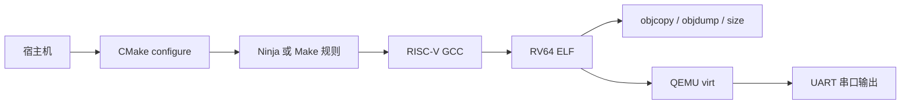
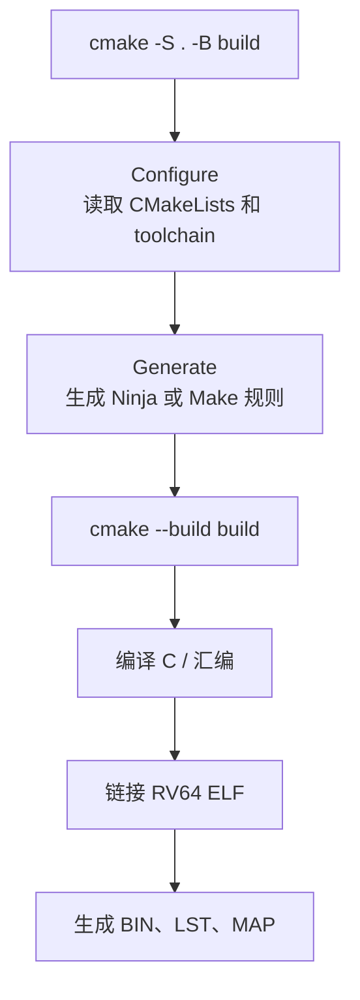
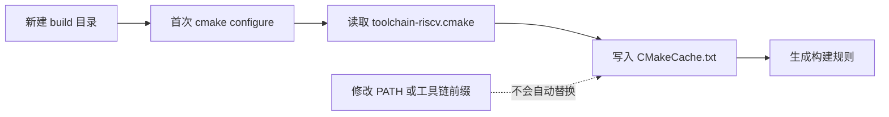
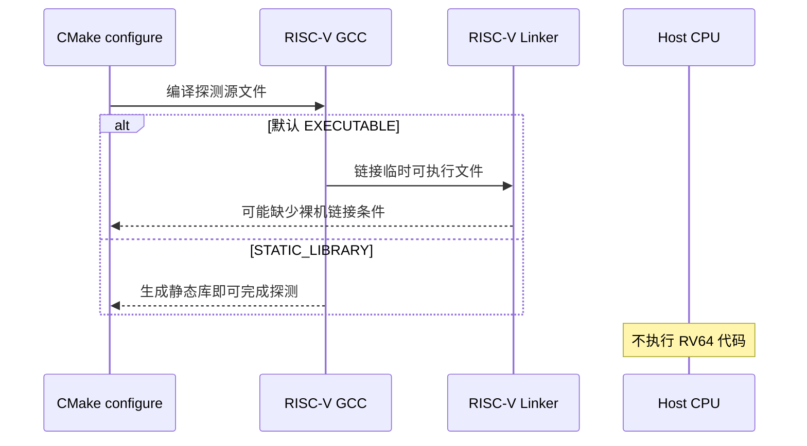
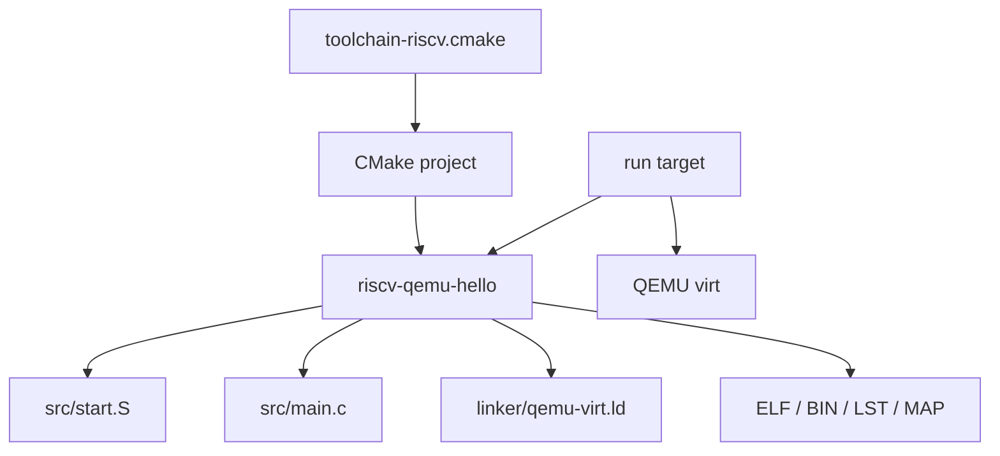
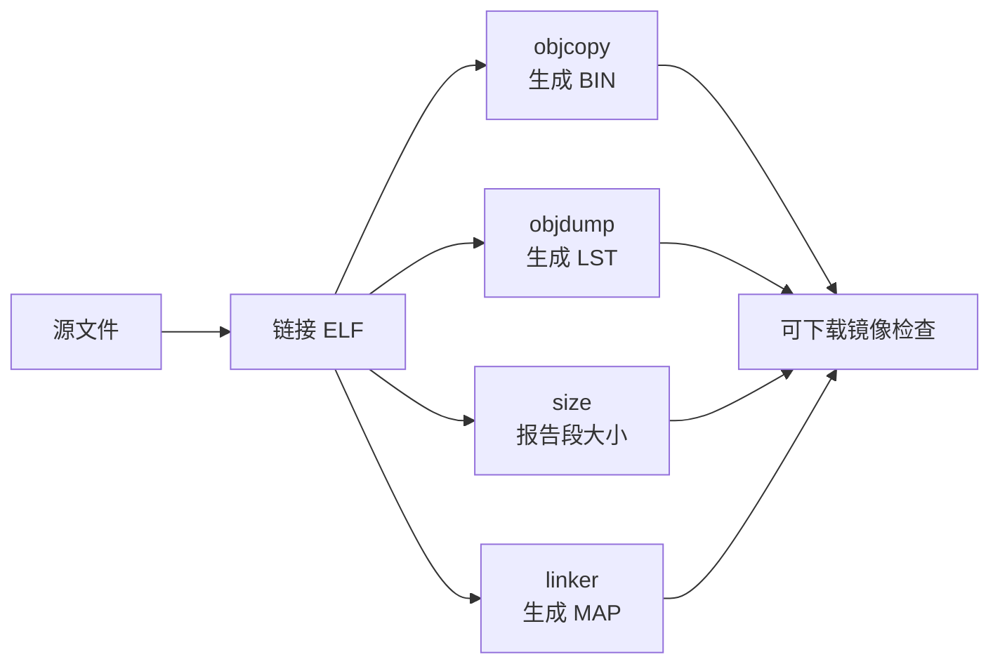
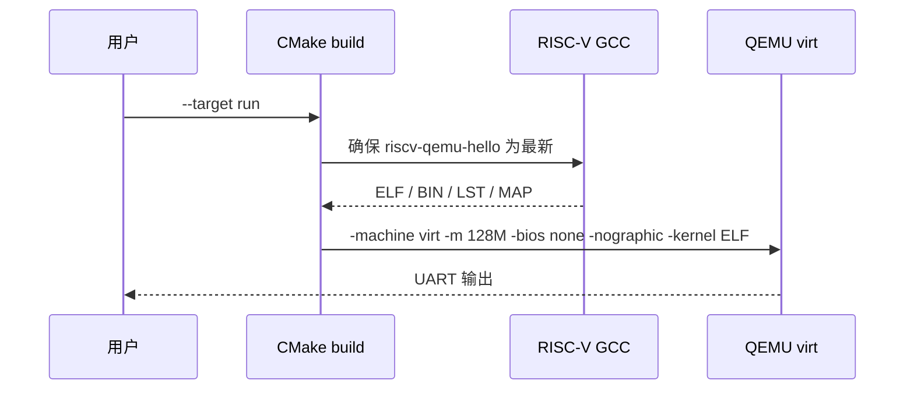
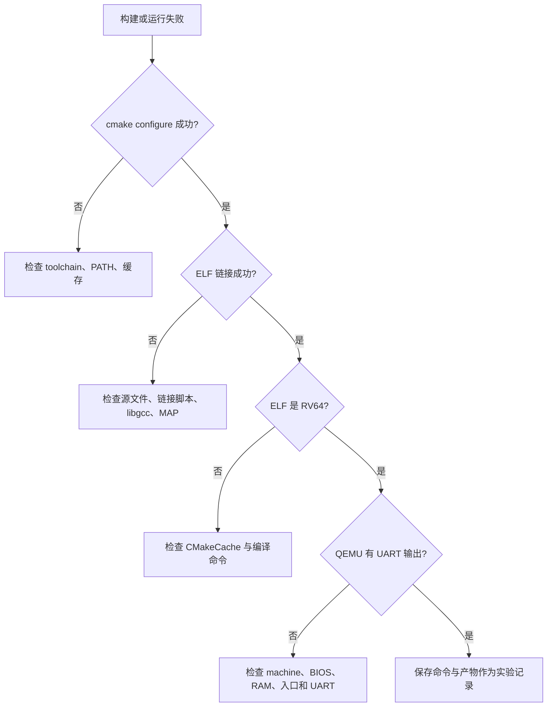

第 01 篇已经让一个 RV64 裸机 ELF 在 QEMU virt 的串口上输出字符。

那份工程刻意保持最小。

最小工程适合验证启动链路，却很容易在第二个源文件、第二种编译选项、第二个实验目标出现重复和隐式依赖。

本篇的任务是把它整理成可持续使用的 CMake 工程。

这里的“工程化”不是堆积复杂的目录和宏。

它意味着每个结论都有明确的归属：哪一个文件选择目标工具链，哪一个 target 承担编译和链接选项，哪一个命令生成可检查的产物，哪一个命令负责启动 QEMU。

完成后，你应当能从一个空的构建目录重复得到相同类型的 ELF、BIN、反汇编清单和 QEMU 启动行为，并能定位配置、编译、链接和运行阶段的错误。

## 1. 先定义这份构建系统解决什么问题

CMake 不是编译器，也不是链接器。

它的职责是根据声明生成宿主构建工具需要的规则。

在交叉编译场景中，这个边界尤其重要：CMake 在宿主机上执行，生成的程序却面向 RISC-V 目标机。

因此，不能把“宿主机可以运行一个测试程序”当作交叉工具链可用的前提。

本篇使用的项目边界如下：

| 层次 | 负责对象 | 本篇中的例子 |
| --- | --- | --- |
| 宿主层 | CMake、Ninja 或 Make、QEMU | 配置项目、驱动构建、模拟目标机 |
| 工具链层 | RISC-V GCC、objcopy、objdump、size | 将 C/汇编变成目标 ELF 并导出检查产物 |
| 目标层 | RV64 裸机程序 | `start.S`、`main.c`、链接脚本 |
| 机器层 | QEMU `virt` | RAM、UART、无固件裸机启动 |



一个清晰的构建系统必须让这条链路可见。

例如，`CMAKE_C_COMPILER` 属于工具链层；`-march` 和 `-mabi` 属于某一个目标；`-machine virt` 属于运行该目标的机器层。

不要把这些设置随意放入一个全局变量或 shell 别名中。

### 本篇验收点

| 验收项 | 可观察证据 |
| --- | --- |
| CMake 使用交叉工具链 | `CMakeCache.txt` 中的 C 编译器是 RISC-V GCC |
| 编译器探测不依赖目标可执行文件 | 配置阶段不会尝试在宿主机运行 RV64 ELF |
| 编译选项只作用于裸机目标 | `compile_commands.json` 中能看到该目标的 `-march` 与 `-mabi` |
| 链接产物可检查 | 构建目录出现 ELF、BIN、映射文件和反汇编清单 |
| QEMU 启动参数可复现 | `cmake --build build --target run` 使用显式机器、内存和 BIOS 参数 |

这五项比“命令没有报错”更可靠。

## 2. CMake 的三个阶段：配置、生成与构建

先区分三个常被混在一起的动作。



`cmake -S . -B build` 触发配置和生成。

它读取项目根目录的 `CMakeLists.txt`，也会在创建构建目录的早期读取工具链文件。

`cmake --build build` 才执行编译器、汇编器、链接器与自定义命令。

这一区分直接决定排错路径：

| 现象 | 优先检查阶段 | 典型原因 |
| --- | --- | --- |
| 找不到交叉编译器 | 配置 | PATH、工具链前缀或工具链文件 |
| CMake 尝试运行 RV64 文件 | 配置 | `try_compile` 目标类型仍是可执行文件 |
| `-march` 参数无效 | 构建 | 编译器版本、架构字符串或选项位置 |
| 找不到 `main` 或入口符号 | 链接 | 源文件列表、启动汇编、链接脚本 |
| QEMU 没有串口输出 | 运行 | ELF、机器参数、BIOS、内存布局或 UART 代码 |

CMake 官方文档说明，`CMAKE_TOOLCHAIN_FILE` 指向的文件会在一次新的配置中很早被读取，用来声明编译器、工具与目标平台信息。[CMAKE_TOOLCHAIN_FILE 文档](https://cmake.org/cmake/help/latest/variable/CMAKE_TOOLCHAIN_FILE.html)

这带来一个重要规则：**更换交叉工具链时，优先新建构建目录。**

工具链选择会写入缓存。

在已经配置过的 `build/` 中只修改环境变量，往往仍然会继续使用旧的编译器路径。



建议从一开始就用不同目录区分构建配置：

```text
riscv-qemu-lab/
├── CMakeLists.txt
├── CMakePresets.json
├── cmake/
│   ├── toolchain-riscv.cmake
│   └── dump-disassembly.cmake
├── linker/
│   └── qemu-virt.ld
├── src/
│   ├── start.S
│   └── main.c
└── build/
    └── qemu-rv64-debug/
```

`build/` 是构建产物目录，不应作为源码的一部分维护。

## 3. 用工具链文件声明“为谁编译”

工具链文件只回答一个问题：**这次配置所产出的程序面向什么系统与工具链？**

它不应该承载某个实验的源文件、UART 地址或 QEMU 启动参数。

在 `cmake/toolchain-riscv.cmake` 中写入：

```cmake
set(CMAKE_SYSTEM_NAME Generic)
set(CMAKE_SYSTEM_PROCESSOR riscv64)

# CMake 的编译器探测只编译静态库，避免链接无法在宿主机运行的 RV64 测试程序。
set(CMAKE_TRY_COMPILE_TARGET_TYPE STATIC_LIBRARY)

set(RISCV_TOOLCHAIN_PREFIX "riscv64-unknown-elf" CACHE STRING
    "Prefix of the RISC-V bare-metal GNU toolchain")

set(CMAKE_C_COMPILER "${RISCV_TOOLCHAIN_PREFIX}-gcc" CACHE FILEPATH
    "RISC-V C compiler")
set(CMAKE_ASM_COMPILER "${RISCV_TOOLCHAIN_PREFIX}-gcc" CACHE FILEPATH
    "RISC-V assembler driver")
set(CMAKE_OBJCOPY "${RISCV_TOOLCHAIN_PREFIX}-objcopy" CACHE FILEPATH
    "RISC-V objcopy")
set(CMAKE_OBJDUMP "${RISCV_TOOLCHAIN_PREFIX}-objdump" CACHE FILEPATH
    "RISC-V objdump")
set(CMAKE_SIZE "${RISCV_TOOLCHAIN_PREFIX}-size" CACHE FILEPATH
    "RISC-V size")

set(CMAKE_EXECUTABLE_SUFFIX ".elf")
```

`CMAKE_SYSTEM_NAME` 设为 `Generic`，意图是告诉 CMake 这不是宿主操作系统上的常规可执行程序。

`CMAKE_SYSTEM_PROCESSOR` 则把目标处理器明确为 `riscv64`。

这两个变量是项目的配置语义，不是向 GCC 传递 ISA 选项的替代品。

真正的 `-march=rv64imac` 与 `-mabi=lp64` 仍应由目标编译选项声明。

### 为什么设置 `CMAKE_TRY_COMPILE_TARGET_TYPE`

许多 CMake 项目在配置阶段会调用 `try_compile()` 来测试编译器或特性。

默认情况下，它会尝试生成一个可执行文件。

对裸机交叉工具链而言，链接一个临时可执行程序往往需要链接脚本、启动代码或系统库；即使链接成功，也不能在 x86 宿主机上运行。

把目标类型设为 `STATIC_LIBRARY` 后，探测只需完成编译和归档，不再依赖最终链接。



[CMAKE_TRY_COMPILE_TARGET_TYPE 文档](https://cmake.org/cmake/help/latest/variable/CMAKE_TRY_COMPILE_TARGET_TYPE.html) 将 `STATIC_LIBRARY` 定义为跳过链接的探测方式，专门适合需要自定义链接参数或链接脚本的交叉工具链。

### 用缓存变量适配不同工具链前缀

不同发行版不一定把工具命名为 `riscv64-unknown-elf-gcc`。

有些环境使用 `riscv64-elf-gcc` 或 `riscv-none-elf-gcc`。

本工程把前缀暴露为缓存变量，而不是硬编码到每个 CMake 文件：

```powershell
cmake -S . -B build/qemu-rv64-debug `
  -G Ninja `
  -DCMAKE_TOOLCHAIN_FILE=cmake/toolchain-riscv.cmake `
  -DRISCV_TOOLCHAIN_PREFIX=riscv64-unknown-elf `
  -DCMAKE_EXPORT_COMPILE_COMMANDS=ON
```

PowerShell 的反引号仅用于续行。

在 Bash 中可改用反斜杠，或写成单行命令。

配置结束后，先检查缓存，而不是立刻相信终端摘要：

```powershell
Select-String -Path build/qemu-rv64-debug/CMakeCache.txt `
  -Pattern 'CMAKE_(C|ASM)_COMPILER:|RISCV_TOOLCHAIN_PREFIX|CMAKE_TRY_COMPILE_TARGET_TYPE'
```

预期能看到 RISC-V GCC 的名称或绝对路径、选择的前缀，以及静态库探测方式。

如果编译器前缀发生变化，使用一个新的构建目录重新配置：

```powershell
cmake -S . -B build/qemu-rv64-alt `
  -G Ninja `
  -DCMAKE_TOOLCHAIN_FILE=cmake/toolchain-riscv.cmake `
  -DRISCV_TOOLCHAIN_PREFIX=riscv-none-elf
```

不要把旧缓存中的编译器路径与新前缀混在一起解释。

## 4. 用 target 表达裸机程序的编译与链接规则

项目根的 `CMakeLists.txt` 负责把源文件、选项和产物连接为一个具体 target。

最关键的原则是：**选项属于 target，而不是全局命令行。**

这样同一工程中可以同时存在不同 ISA、不同 ABI 或不同板级实验，彼此不会静默污染。



以下是一个可直接放在项目根目录的骨架。

```cmake
cmake_minimum_required(VERSION 3.20)

project(riscv_qemu_lab LANGUAGES C ASM)

set(RISCV_ARCH "rv64imac" CACHE STRING "RISC-V ISA string")
set(RISCV_ABI "lp64" CACHE STRING "RISC-V ABI string")
set(QEMU_MACHINE "virt" CACHE STRING "QEMU machine")
set(QEMU_MEMORY "128M" CACHE STRING "QEMU RAM size")
set(QEMU_BIOS "none" CACHE STRING "QEMU BIOS image or none")
set(QEMU_SYSTEM_RISCV64 "qemu-system-riscv64" CACHE FILEPATH
    "QEMU RISC-V system emulator")

add_executable(riscv-qemu-hello
    src/start.S
    src/main.c
)

target_compile_options(riscv-qemu-hello PRIVATE
    -march=${RISCV_ARCH}
    -mabi=${RISCV_ABI}
    -mcmodel=medany
    -ffreestanding
    -fno-builtin
    -ffunction-sections
    -fdata-sections
    -Wall
    -Wextra
    -Werror
)

target_link_options(riscv-qemu-hello PRIVATE
    -nostdlib
    -Wl,-T,${CMAKE_CURRENT_SOURCE_DIR}/linker/qemu-virt.ld
    -Wl,--gc-sections
    -Wl,-Map,${CMAKE_CURRENT_BINARY_DIR}/riscv-qemu-hello.map
    -Wl,--build-id=none
)

target_link_libraries(riscv-qemu-hello PRIVATE gcc)
```

这里出现了四类设置。

| 设置 | 作用 | 不能替代什么 |
| --- | --- | --- |
| `RISCV_ARCH` | 选择 ISA 扩展集合 | 不能替代链接脚本的内存布局 |
| `RISCV_ABI` | 选择调用约定与数据模型 | 不能替代 CMake 的目标系统声明 |
| `-ffreestanding` | 告知编译器程序不是受宿主标准库托管 | 不能自动提供启动代码或 UART 驱动 |
| `-nostdlib` | 不自动链接宿主 C 运行时 | 不能消除 GCC 辅助例程的需求 |

`target_link_libraries(... gcc)` 的含义是显式请求 GCC 的低层辅助库。

对于只有简单字节访问的演示程序，它有时并不触发实际符号；但在 64 位除法、复杂整数运算或编译器生成辅助调用时，省略它可能造成未定义符号。

是否需要它，应由链接错误和 map 文件验证，而不是凭印象删除。

### `-march`、`-mabi` 与代码模型为什么要成组出现

`rv64imac` 表示 64 位基础整数 ISA 与 `M`、`A`、`C` 扩展。

`lp64` 表示 `long` 和指针为 64 位的 ABI。

二者必须与工具链所支持的目标组合一致。

`-mcmodel=medany` 影响编译器生成访问符号时的地址模型；它并不是“让任意地址都自动可用”的开关。

链接脚本、加载地址、汇编中的地址取法依然必须彼此匹配。

执行一次构建后，可用编译数据库检查这些参数是否真正传给目标：

```powershell
cmake --build build/qemu-rv64-debug
Select-String -Path build/qemu-rv64-debug/compile_commands.json `
  -Pattern 'start\.S|main\.c|march=rv64imac|mabi=lp64'
```

如果没有 `compile_commands.json`，确认配置命令包含 `-DCMAKE_EXPORT_COMPILE_COMMANDS=ON`。

## 5. 把产物检查纳入构建规则

一个 ELF 能被构建，不代表它已经适合交给 QEMU。

至少还需要检查其大小、反汇编和二进制镜像。

不建议把这些动作写入一串临时 shell 命令，因为不同终端对重定向、路径空格和失败返回值的行为并不相同。

更稳妥的做法是用 CMake 的自定义命令把产物与目标绑定。



`objcopy` 可以直接生成二进制镜像；`objdump` 的输出需要写入一个文件。

不要在 `add_custom_command()` 的 `COMMAND` 行里写 `>`，因为 CMake 通常不会为该命令启动 shell，重定向符会被当作普通参数。

为反汇编创建一个小型 CMake 脚本 `cmake/dump-disassembly.cmake`：

```cmake
if(NOT DEFINED TOOL OR NOT DEFINED INPUT OR NOT DEFINED OUTPUT)
    message(FATAL_ERROR "TOOL, INPUT and OUTPUT are required")
endif()

execute_process(
    COMMAND "${TOOL}" -d -S "${INPUT}"
    OUTPUT_FILE "${OUTPUT}"
    RESULT_VARIABLE dump_result
)

if(NOT dump_result EQUAL 0)
    message(FATAL_ERROR "objdump failed with code ${dump_result}")
endif()
```

再把它绑定到 ELF target：

```cmake
add_custom_command(TARGET riscv-qemu-hello POST_BUILD
    COMMAND "${CMAKE_OBJCOPY}" -O binary
        "$<TARGET_FILE:riscv-qemu-hello>"
        "$<TARGET_FILE_DIR:riscv-qemu-hello>/riscv-qemu-hello.bin"
    COMMAND "${CMAKE_COMMAND}"
        -DTOOL=${CMAKE_OBJDUMP}
        -DINPUT=$<TARGET_FILE:riscv-qemu-hello>
        -DOUTPUT=$<TARGET_FILE_DIR:riscv-qemu-hello>/riscv-qemu-hello.lst
        -P "${CMAKE_CURRENT_SOURCE_DIR}/cmake/dump-disassembly.cmake"
    COMMAND "${CMAKE_SIZE}" -A "$<TARGET_FILE:riscv-qemu-hello>"
    COMMENT "Generating inspectable RISC-V artifacts"
    VERBATIM
)
```

`POST_BUILD` 的语义是：当目标发生构建时，在链接结束后执行这些命令。

它不意味着每次执行 `cmake --build` 都必然重新生成清单。

目标已经是最新状态时，构建工具可以正确地跳过整个 target。

[add_custom_command 文档](https://cmake.org/cmake/help/latest/command/add_custom_command.html) 明确区分了生成文件的形式和绑定 target 的构建事件形式；这里使用的是后者。

构建完成后，观察构建目录：

```powershell
Get-ChildItem build/qemu-rv64-debug -Filter 'riscv-qemu-hello.*' |
  Select-Object Name, Length

riscv64-unknown-elf-readelf -h build/qemu-rv64-debug/riscv-qemu-hello.elf
riscv64-unknown-elf-readelf -l build/qemu-rv64-debug/riscv-qemu-hello.elf
```

应当看到 `.elf`、`.bin`、`.lst` 与 `.map`。

`readelf -h` 的 `Class` 应为 `ELF64`，`Machine` 应为 `RISC-V`。

`readelf -l` 用来核对可加载段和入口地址是否与链接脚本、QEMU RAM 布局相容。

## 6. 把 QEMU 启动变成一个 CMake target

已经能构建和检查后，仍然没有理由反复手打启动命令。

把 QEMU 启动定义为依赖 ELF 的 `run` target，可以保证运行前先完成构建。

在 `CMakeLists.txt` 的末尾加入：

```cmake
add_custom_target(run
    COMMAND "${QEMU_SYSTEM_RISCV64}"
        -machine "${QEMU_MACHINE}"
        -m "${QEMU_MEMORY}"
        -bios "${QEMU_BIOS}"
        -nographic
        -kernel "$<TARGET_FILE:riscv-qemu-hello>"
    DEPENDS riscv-qemu-hello
    USES_TERMINAL
    COMMENT "Running RV64 ELF on QEMU ${QEMU_MACHINE}"
)
```

运行方式变成：

```powershell
cmake --build build/qemu-rv64-debug --target run
```



`-machine`、`-m`、`-bios` 与 `-kernel` 均被显式写出。

这不是为了让命令更长，而是为了让实验边界可以被审阅。

QEMU 的 RISC-V 系统模拟文档说明，RISC-V 系统模拟需要选择机器模型；对于 `virt`，`-bios none` 表示不自动装入固件，由调用方提供所需镜像。[QEMU RISC-V system emulator 文档](https://qemu.readthedocs.io/en/master/system/target-riscv.html)

本实验中的链接脚本应当继续把 RAM 起点设为 `0x80000000`，并且 QEMU RAM 大小与链接布局保持一致。

如果某次实验改用 OpenSBI 或 Linux，不应复用这个裸机 `run` target 后只删除 `-bios none`。

那已经是不同的启动模型，应当建立一个名称不同、参数独立的 target。

### 使用 Preset 固化常用配置

命令行缓存变量可以工作，但团队成员很容易漏掉其中一个。

`CMakePresets.json` 允许把可重复的配置命名：

```json
{
  "version": 4,
  "configurePresets": [
    {
      "name": "qemu-rv64-debug",
      "displayName": "QEMU RV64 bare-metal debug",
      "generator": "Ninja",
      "binaryDir": "${sourceDir}/build/qemu-rv64-debug",
      "cacheVariables": {
        "CMAKE_BUILD_TYPE": "Debug",
        "CMAKE_TOOLCHAIN_FILE": "${sourceDir}/cmake/toolchain-riscv.cmake",
        "CMAKE_EXPORT_COMPILE_COMMANDS": "ON",
        "RISCV_TOOLCHAIN_PREFIX": "riscv64-unknown-elf",
        "RISCV_ARCH": "rv64imac",
        "RISCV_ABI": "lp64",
        "QEMU_MACHINE": "virt",
        "QEMU_MEMORY": "128M",
        "QEMU_BIOS": "none"
      }
    }
  ],
  "buildPresets": [
    {
      "name": "qemu-rv64-debug",
      "configurePreset": "qemu-rv64-debug"
    }
  ]
}
```

随后可使用：

```powershell
cmake --preset qemu-rv64-debug
cmake --build --preset qemu-rv64-debug
cmake --build build/qemu-rv64-debug --target run
```

Preset 并不是 CMake 的另一个构建系统。

它只是将原本散落在命令行的配置值保存为带名字的配置，仍然由同一个 `CMakeLists.txt` 和同一个工具链文件解释。

## 7. 让构建目录成为调试证据

遇到构建问题时，先确定问题属于哪一层，再打开对应产物。



### 配置失败：工具链未被找到

先在同一个终端检查工具是否可见：

```powershell
Get-Command riscv64-unknown-elf-gcc
Get-Command riscv64-unknown-elf-objdump
Get-Command qemu-system-riscv64
```

若命令名称不同，不要修改每一个 `CMakeLists.txt`。

只修改 `RISCV_TOOLCHAIN_PREFIX`，并在新的 build 目录中重新配置。

### 链接失败：未定义符号或内存溢出

先打开 map 文件：

```powershell
Select-String -Path build/qemu-rv64-debug/riscv-qemu-hello.map `
  -Pattern 'Memory Configuration|\.text|\.data|\.bss|undefined reference'
```

`undefined reference to __...` 可能来自 GCC 辅助例程、启动代码或链接脚本符号。

`region RAM overflowed` 则说明输入段总大小超过链接脚本定义的 RAM 区间。

这两类错误的修复方向完全不同，不能同时用“增加 RAM”掩盖。

### 运行失败：QEMU 没有串口文本

按以下顺序缩小范围：

```powershell
riscv64-unknown-elf-readelf -h build/qemu-rv64-debug/riscv-qemu-hello.elf
riscv64-unknown-elf-objdump -d build/qemu-rv64-debug/riscv-qemu-hello.elf |
  Select-Object -First 60

qemu-system-riscv64 -machine virt -m 128M -bios none -nographic `
  -kernel build/qemu-rv64-debug/riscv-qemu-hello.elf
```

先确认 ELF 的架构和入口附近指令，再确认 QEMU 启动参数，最后才检查 UART 写寄存器的代码。

如果使用 `run` target 与手工命令的现象不同，打印构建工具实际执行的命令：

```powershell
cmake --build build/qemu-rv64-debug --target run --verbose
```

不要在未看到实际参数前猜测 CMake 是否替换了变量。

## 8. 一套可重复的日常操作

将实验日常动作压缩成下面的顺序：

```text
1. 选择或新建构建目录
2. 以 toolchain 文件完成 configure
3. 构建 ELF 和检查产物
4. 检查 ELF 头、程序头、MAP 和反汇编
5. 通过 run target 启动 QEMU
6. 保存失败时的缓存、完整命令和第一条错误
```

对应命令如下：

```powershell
cmake --preset qemu-rv64-debug
cmake --build --preset qemu-rv64-debug

riscv64-unknown-elf-readelf -h build/qemu-rv64-debug/riscv-qemu-hello.elf
riscv64-unknown-elf-size -A build/qemu-rv64-debug/riscv-qemu-hello.elf

cmake --build build/qemu-rv64-debug --target run
```

若尚未使用 Preset，使用等价的 `cmake -S`、`-B`、`-DCMAKE_TOOLCHAIN_FILE` 配置命令即可。

重要的是配置值被明确记录，而不是它们从哪一种界面输入。

### 练习

1. 将 `RISCV_ARCH` 改为工具链明确支持的另一种 RV64 ISA 字符串，比较 `compile_commands.json` 与 ELF 属性的变化。
2. 将 `QEMU_MEMORY` 改为 `64M`，保持链接脚本 RAM 起点不变，解释这一改变影响的是哪一层设置。
3. 暂时移除 `-Wl,--gc-sections`，比较 ELF 的 `size -A` 输出与 map 文件中保留的段。
4. 在 `main.c` 中加入一个未调用函数，确认它是否出现在反汇编清单中，并说明结论依赖哪些编译与链接选项。
5. 故意把 `RISCV_TOOLCHAIN_PREFIX` 改为不存在的名称，在新 build 目录中配置，记录 CMake 最早报错的位置。
6. 用 `cmake --build ... --target run --verbose` 保存完整 QEMU 命令，并与手工命令逐项比对。

### 发布前自检

- [ ] 工具链文件只声明目标系统和工具，不混入实验源文件。
- [ ] 每个裸机编译与链接选项都通过 target API 绑定。
- [ ] `CMAKE_TRY_COMPILE_TARGET_TYPE` 为 `STATIC_LIBRARY`。
- [ ] 新工具链或新前缀使用新的构建目录进行配置。
- [ ] ELF、BIN、LST、MAP 都能在构建目录中找到。
- [ ] `readelf -h` 显示目标为 ELF64 RISC-V。
- [ ] `run` target 包含 `virt`、内存大小、`-bios none` 与 `-nographic`。
- [ ] 失败记录包含 CMakeCache、构建命令和首条错误，而非只保存终端截图。

构建系统的价值不在于替代对 RISC-V 启动、链接和外设的理解。

它把这些理解变成可复查的输入、规则和产物，使每次实验的差异都能被定位。

> 🏷️ RISC-V · QEMU · RV64 · CMake · 交叉编译 · 裸机 · ELF · 构建系统
