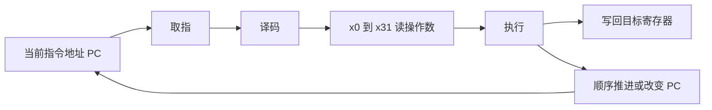
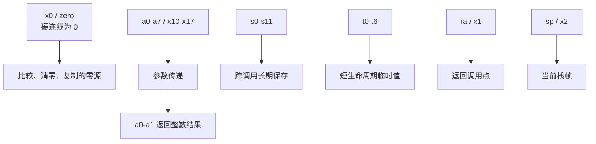
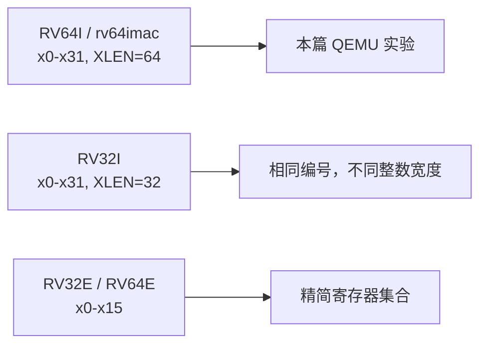
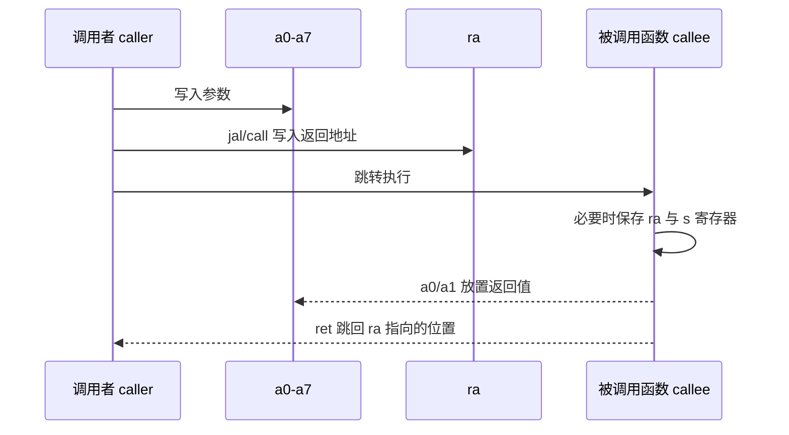
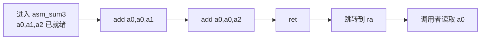
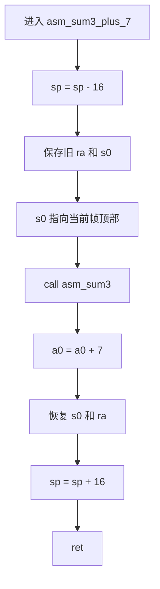
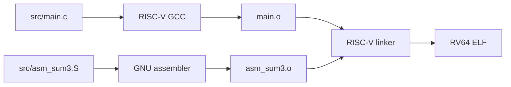
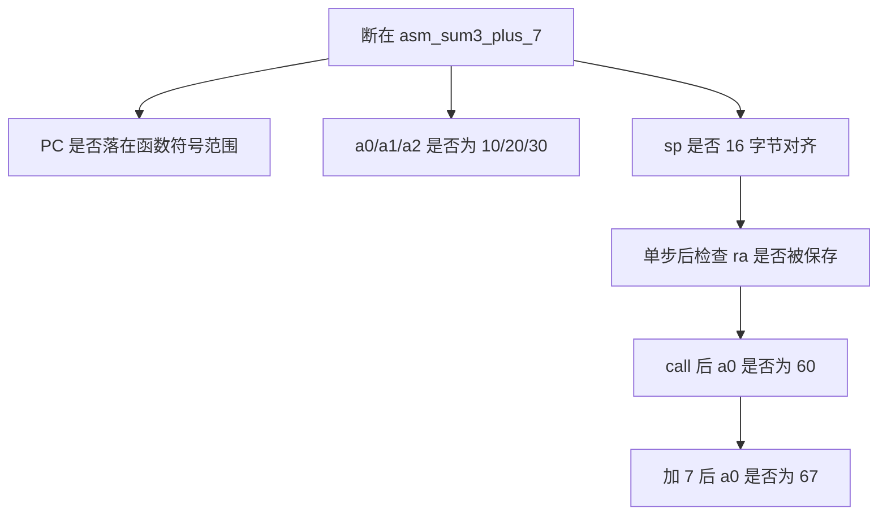
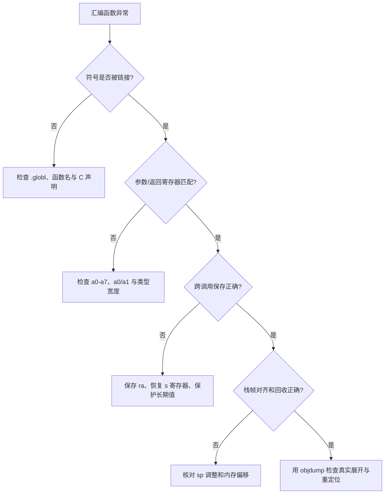

第 01 篇把裸机 ELF 启动到 QEMU virt。

第 02 篇把编译、链接和启动命令收进可重复的 CMake 规则。

当程序停在 `_start`、`main` 或某个异常地址时，真正决定你能否继续定位问题的，是能否读懂寄存器和反汇编。

本篇不把汇编当成需要背诵的助记符表。

它要建立一条可观察的链路：**硬件提供整数寄存器和 PC，psABI 规定函数间如何使用它们，汇编器把源文本转换为指令，GDB 与 objdump 展示最终结果。**

实验仍然采用 `rv64imac`、LP64 ABI 与 QEMU `virt`。

讨论范围集中在整数寄存器、函数调用和 GNU 汇编器；浮点、向量寄存器和特权 CSR 保留给各自的实验场景。

## 1. 先分清硬件寄存器、ABI 别名与调试器显示

RISC-V 基础整数 ISA 定义 32 个整数寄存器，编号为 `x0` 到 `x31`。

在 RV64 中，整数寄存器宽度 `XLEN` 为 64 位。

除此之外还有程序计数器 `pc`，它保存当前指令地址。

`pc` 是独立的用户可见状态，不是 `x32`，也不能作为普通 `add` 的寄存器操作数。



基础 ISA 只给出寄存器编号与指令编码。

它没有把 `x1` 在硬件上钉死为“返回地址寄存器”，也没有把 `x2` 在硬件上钉死为“栈指针”。

任意可写的 `x` 寄存器都可以出现在大量指令字段中。

RISC-V 官方 ISA 文档明确指出，基础整数 ISA 没有专用的栈指针或返回地址硬件寄存器；这些用途由软件约定赋予。[RISC-V 基础整数 ISA](https://docs.riscv.org/reference/isa/v20260120/unpriv/rv32.html)

psABI 在这个硬件基础上定义常见别名和函数调用规则。

因此，下面三种写法描述的是同一个物理寄存器：

```text
x10        硬件编码编号
a0         psABI 中的参数/返回值别名
$a0        GDB 命令中常见的寄存器引用形式
```

其中 `$a0` 只是 GDB 表达式语法。

汇编源文件中通常写 `a0`，指令编码最终仍然是 `x10`。

### RV64 整数寄存器全景

```text
编号        ABI 别名       典型角色                 跨函数调用保持
x0          zero           永远为 0                 不适用
x1          ra             返回地址                 否
x2          sp             栈指针                   是
x3          gp             全局指针                 固定使用
x4          tp             线程指针                 固定使用
x5-x7       t0-t2          临时寄存器               否
x8-x9       s0/fp, s1      被调用者保存             是
x10-x17     a0-a7          参数，a0-a1 也放返回值  否
x18-x27     s2-s11         被调用者保存             是
x28-x31     t3-t6          临时寄存器               否
pc          pc             当前指令地址             指令流决定
```

`x0` 有一个硬件保证：任何写入都会被丢弃，读出永远得到零。

这使得比较零、清零寄存器与构造某些伪指令都不必额外保存常量零。

例如，真实指令 `add x5, x6, x0` 把 `x6` 的值复制到 `x5`。

汇编器通常允许把它写成 `mv t0, t1`，但 `mv` 是更易读的伪指令拼写。



RISC-V ABIs 规范给出了整数寄存器别名、`gp` 与 `tp` 的不可随意分配属性，以及每一组寄存器是否需要跨调用保持。[RISC-V psABI 整数寄存器约定](https://riscv-non-isa.github.io/riscv-elf-psabi-doc/)

### 不要把 RV64、RV32 与 RVE 混为一谈

本实验的 `rv64imac` 使用完整的 32 个整数寄存器，且 `XLEN=64`。

RV32 使用同样的 `x0` 到 `x31` 编号，但每个整数寄存器宽度为 32 位。

RVE 是另一种精简寄存器配置，只保留 `x0` 到 `x15`。

如果你在某个嵌入式芯片的手册中看到 `RV32E` 或 `RV64E`，不能照搬本篇中 `s2`、`a7`、`t6` 等寄存器的可用性假设。



在排查汇编时，先用 ELF 属性和实际编译选项确认目标 ISA 与 ABI：

```powershell
riscv64-unknown-elf-readelf -h build/qemu-rv64-debug/riscv-qemu-hello.elf
riscv64-unknown-elf-readelf -A build/qemu-rv64-debug/riscv-qemu-hello.elf
```

不要只根据源文件后缀猜测程序是 RV32 还是 RV64。

## 2. psABI：函数之间必须共同遵守的寄存器协议

汇编函数不是孤立运行的。

它既要与 C 函数交换参数和返回值，也可能调用别的汇编函数或库函数。

psABI 的作用正是让独立编译的目标文件能够在链接后仍然正确协作。



### 调用者保存与被调用者保存不是“谁更重要”

寄存器保存责任按生命周期划分。

| 组别 | 代表寄存器 | 谁承担保存责任 | 适合保存什么 |
| --- | --- | --- | --- |
| 调用者保存 | `ra`、`a0-a7`、`t0-t6` | 调用者若调用后仍需该值，则调用前自行保存 | 短期中间值、参数、临时地址 |
| 被调用者保存 | `s0-s11` | 被调用函数若要改写，返回前必须恢复 | 跨多个调用仍然需要的局部状态 |
| 固定或专用 | `zero`、`gp`、`tp` | 不应随意改写 | 常量零、平台全局状态、线程状态 |
| 栈状态 | `sp` | 函数返回前必须恢复 | 当前栈帧边界 |

“调用者保存”不等于函数可以不顾数据丢失地改写。

它表示被调用函数不承诺恢复该组寄存器。

如果调用者把一个长寿命局部值放在 `t0`，再执行 `call`，调用返回后就不能假设 `t0` 仍然是原来的值。

同理，`a0` 到 `a7` 用于传参，`a0` 与 `a1` 也用于整数返回值；它们不适合作为调用前后都必须保留的私有变量。

### 参数、返回值与 `ra`

基础整数调用约定提供八个整数参数寄存器 `a0-a7`。

对于宽度不超过 `XLEN` 的标量，前八个参数依次进入这些寄存器；可用寄存器耗尽后才按约定放入栈中。

前两个参数寄存器 `a0` 和 `a1` 同时承担整数返回值位置。

下面的 C 原型：

```c
#include <stdint.h>

extern int64_t asm_sum3(int64_t left, int64_t middle, int64_t right);

int64_t use_asm_sum(void)
{
    return asm_sum3(10, 20, 30);
}
```

调用 `asm_sum3` 时，调用者准备的寄存器语义是：

```text
a0 = 10       第 1 个参数 left
a1 = 20       第 2 个参数 middle
a2 = 30       第 3 个参数 right
ra = 调用点之后的地址
```

返回时：

```text
a0 = 60       int64_t 返回值
pc = ra        继续执行调用点之后的指令
```

`ra` 由跳转并链接指令写入。

如果一个函数在使用 `ra` 之前再次调用其他函数，新的调用会覆盖它。

因此，非叶子函数通常需要把自己的 `ra` 保存到栈中。

psABI 还要求过程入口处的栈指针保持 16 字节对齐。

这在只处理整数的演示中也必须遵守，因为同一 ABI 下的其他函数可能需要更严格对齐的局部对象或寄存器保存区。

## 3. 叶子函数：不调用别人时，汇编可以很小

叶子函数不再调用其他函数。

它可以直接使用参数寄存器计算，并将结果写回 `a0`。

在 `src/asm_sum3.S` 中写入：

```asm
    .section .text
    .align 2
    .globl asm_sum3
    .type asm_sum3, @function

asm_sum3:
    add a0, a0, a1
    add a0, a0, a2
    ret

    .size asm_sum3, .-asm_sum3
```

这段函数没有建立栈帧，也没有保存 `ra`。

原因不是 `ra` 不重要，而是它没有执行另一次调用，`ra` 在整个函数执行期间都保持着调用者留下的返回地址。



### 每一条源语句不一定对应一条机器指令

这段代码中的两个 `add` 是 RV64I 的真实算术指令。

`ret` 则是汇编器接受的伪指令形式，常规语义等价于：

```asm
jalr x0, 0(ra)
```

`jalr` 的目标地址来自 `ra`，目标寄存器指定为 `x0`，所以不需要再保存新的链接地址。

为了把汇编器别名还原为更接近指令编码的形式，使用：

```powershell
riscv64-unknown-elf-objdump -d -M no-aliases `
  build/qemu-rv64-debug/riscv-qemu-hello.elf
```

从输出中确认 `ret` 显示为相应的 `jalr` 形式。

不要把任何一款工具链的反汇编排版当作 ABI 规则本身。

ABI 规定的是可观察行为和保存责任；汇编器别名、链接松弛与反汇编显示会因工具链和选项而变化。

### `.section`、`.globl`、`.type` 与 `.size` 的分工

| 指令 | 作用 | 对链接/调试的意义 |
| --- | --- | --- |
| `.section .text` | 选择代码段 | 链接脚本通常把它放入可执行代码区域 |
| `.align 2` | 按 4 字节边界对齐当前位置 | 适合基础 32 位指令入口的保守对齐 |
| `.globl asm_sum3` | 导出全局符号 | C 目标文件和链接器能引用该函数 |
| `.type ..., @function` | 标记 ELF 符号类型 | 让符号表、反汇编与调试器识别函数边界 |
| `.size ..., .-asm_sum3` | 标注函数长度 | 改善符号范围和反汇编阅读体验 |

`.align 2` 的含义由 GNU 汇编器目标相关语义解释为对齐幂次；这里目标是 4 字节边界。

启用压缩指令扩展 `C` 后，指令本身可以是 16 位，但函数入口的对齐策略仍应服从项目链接脚本、跳转目标和工具链约定。

不应仅凭“支持 RVC”就无条件删除所有入口对齐。

## 4. 非叶子函数：保存 `ra`、`s0` 与栈帧

现在增加一个函数，它先调用 `asm_sum3`，再给结果加上常量。

这个函数不是叶子函数。

它若直接 `call asm_sum3` 而不保存 `ra`，自己的返回地址会被新的调用覆盖，最终无法回到 C 调用者。

```asm
    .section .text
    .align 2
    .globl asm_sum3_plus_7
    .type asm_sum3_plus_7, @function

asm_sum3_plus_7:
    addi sp, sp, -16
    sd   ra, 8(sp)
    sd   s0, 0(sp)
    addi s0, sp, 16

    call asm_sum3
    addi a0, a0, 7

    ld   s0, 0(sp)
    ld   ra, 8(sp)
    addi sp, sp, 16
    ret

    .size asm_sum3_plus_7, .-asm_sum3_plus_7
```

这段代码分配 16 字节栈空间，因此 `sp` 在调整前后都保持 16 字节对齐。

它保存旧的 `ra` 和旧的 `s0`，因为函数会改写它们：`call` 改写 `ra`，`addi s0, sp, 16` 改写 `s0`。



### 用地址看栈帧，而不是只背保存顺序

假设函数入口时：

```text
sp = 0x80003ff0
```

执行 `addi sp, sp, -16` 后：

```text
sp = 0x80003fe0
```

内存布局是：

```text
更高地址
0x80003fe8    保存的 ra        fp - 8
0x80003fe0    保存的旧 s0      fp - 16
              ^ 当前 sp
0x80003ff0    当前 s0 / fp
更低地址
```

`addi s0, sp, 16` 使 `s0` 指向调用本函数前的栈顶。

这与 psABI 的可选帧指针约定兼容：若使用帧指针，它必须在 `x8/s0`，并且仍然是被调用者保存寄存器。

但是，**帧指针是可选的。**

优化后的函数可能不使用 `s0`，而是只用 `sp` 和固定偏移访问局部对象。

调试器能否稳定回溯还依赖调试信息与 CFI，不应仅凭是否看见 `s0` 断定函数“是否有栈帧”。

### 两个常见错误

| 错误 | 表面现象 | 根因 | 修复方向 |
| --- | --- | --- | --- |
| 非叶子函数未保存 `ra` | `ret` 跳回函数内部或异常地址 | `call` 已覆盖原返回地址 | 在调用前保存并在返回前恢复 `ra` |
| 改写 `s0` 后未恢复 | C 调用者某个局部状态异常 | 破坏被调用者保存约定 | 恢复原 `s0`，或改用临时寄存器 |
| 栈空间不是 16 的倍数 | 某些函数调用后出现难以复现问题 | `sp` 对齐被破坏 | 栈分配与回收使用相同的 16 字节倍数 |
| 把长期值放在 `t0` 后调用函数 | 调用返回后数据变成未知值 | `t0` 是调用者保存 | 入栈保存或使用并恢复 `s` 寄存器 |

## 5. GNU 汇编源文件的基本语法

在 GNU 工具链中，建议把需要预处理器的汇编文件命名为 `.S`，把不需要 C 预处理器的纯汇编文件命名为 `.s`。

本篇的示例不依赖宏展开，`.S` 仍可与 CMake 的 C/ASM target 一起构建。



### 标签、注释和数据定义

下面是可在裸机项目中使用的基本结构：

```asm
    .section .rodata
message:
    .asciz "register lab\r\n"

    .section .data
    .align 3
counter:
    .dword 0

    .section .text
    .globl tiny_loop
    .type tiny_loop, @function
tiny_loop:
    # GNU as 风格注释：这是一条汇编器注释
    li t0, 3
1:
    addi t0, t0, -1
    bnez t0, 1b
    ret
    .size tiny_loop, .-tiny_loop
```

命名标签 `message:` 和 `counter:` 适合跨较大范围引用。

数字标签 `1:` 适合短循环。

`1b` 表示“向后寻找最近的数字标签 1”，`1f` 则表示“向前寻找最近的数字标签 1”。

这种写法可以避免为只出现一次的小循环发明全局符号。

`.asciz` 在字符串末尾自动加入零字节；`.dword` 在 RV64 数据布局中表达一个 64 位数据项；`.align 3` 用来让该对象按 8 字节边界开始。

数据对齐是对象布局的一部分，不能从指令对齐规则推导出来。

### 四类必须区分的文本

| 类别 | 例子 | 由谁处理 |
| --- | --- | --- |
| 指令 | `add a0, a0, a1` | 汇编器编码为 ISA 指令 |
| 伪指令 | `li t0, 3`、`ret` | 汇编器展开为一条或多条指令 |
| 汇编器指令 | `.globl`、`.section` | 汇编器控制符号与段 |
| 链接重定位表达 | `la t0, message` | 汇编器与链接器共同解析目标地址 |

GNU `as` 的 RISC-V 文档列出用于可重定位地址的修饰表达式，并说明存在更易使用的伪指令形式。[GNU as RISC-V modifiers](https://sourceware.org/binutils/docs/as/RISC_002dV_002dModifiers.html)

把这四类文本混在一起，是阅读反汇编时最常见的困惑来源。

## 6. 伪指令：写得简洁，不等于只有一条机器指令

伪指令是汇编器提供的源级便利写法。

它的展开取决于立即数大小、目标地址、代码模型、位置无关要求与链接松弛。

应该记住用途，而不是承诺某一行永远展开成固定字节序列。


### `li`：把常量装入寄存器

```asm
li t0, 0
li t1, 2047
li t2, 0x12345678
```

`li` 表达“把常量放入寄存器”。

对于能放进单条算术立即数指令的数值，汇编器可以选择简单展开。

较大的常量需要组合多条指令；在 RV64 中，某些 64 位常量还会经历更多移位和加法步骤。

因此，不能根据源文件行数推断性能或代码大小。

### `la`：把符号地址装入寄存器

```asm
la t0, message
```

`la` 装载的是 `message` 的地址，不是字符串的第一个字符值。

该地址通常不能在汇编阶段完全确定，需要伴随重定位信息进入目标文件，再由链接器确定或调整。

要区分：

```asm
la t0, message       # t0 = &message
lbu t1, 0(t0)        # t1 = message[0] 的无符号字节值
```

### `call` 与 `ret`：函数控制流的源级表达

```asm
call asm_sum3
ret
```

`call` 的目标是函数符号，语义是跳转并把返回地址写入 `ra`。

在链接后的代码中，它常能看到由 `auipc` 与 `jalr` 组成的地址计算与间接跳转，也可能在可达条件满足时被松弛为更短形式。

`ret` 的语义是通过 `ra` 返回，不保存新的链接地址。

在带有链接松弛的最终 ELF 中，最可信的证据是：

```powershell
riscv64-unknown-elf-objdump -dr -M no-aliases `
  build/qemu-rv64-debug/riscv-qemu-hello.elf
```

### 其他高频别名

| 源级写法 | 典型语义 | 阅读反汇编时可能看到 |
| --- | --- | --- |
| `mv rd, rs` | 复制寄存器 | `addi rd, rs, 0` |
| `nop` | 不改变架构状态 | `addi x0, x0, 0` |
| `not rd, rs` | 按位取反 | `xori rd, rs, -1` |
| `neg rd, rs` | 二进制补码取负 | `sub rd, x0, rs` |
| `j label` | 不保留返回地址的跳转 | `jal x0, label` 或等价形式 |
| `beqz rs, label` | 寄存器等于零时跳转 | `beq rs, x0, label` |
| `bnez rs, label` | 寄存器不等于零时跳转 | `bne rs, x0, label` |

表中的“可能看到”是帮助理解语义，不是对特定版本 binutils 输出的逐字承诺。

反汇编时使用 `-M no-aliases` 能减少别名对照带来的干扰；保留默认别名则更适合快速理解控制流。

## 7. 从 C 到汇编，再回到 GDB

把汇编函数加入第 02 篇建立的 CMake target：

```cmake
add_executable(riscv-qemu-hello
    src/start.S
    src/main.c
    src/asm_sum3.S
)
```

在 C 中声明符号：

```c
#include <stdint.h>

extern int64_t asm_sum3(int64_t left, int64_t middle, int64_t right);
extern int64_t asm_sum3_plus_7(int64_t left, int64_t middle, int64_t right);

static volatile int64_t result_sum;
static volatile int64_t result_plus;

void register_lab(void)
{
    result_sum = asm_sum3(10, 20, 30);
    result_plus = asm_sum3_plus_7(10, 20, 30);
}
```

`volatile` 在这里用于让最小裸机演示的结果可被调试器稳定观察。

它不是通用的同步原语，也不替代原子操作、内存屏障或并发设计。

如果从 C++ 调用汇编符号，应使用 `extern "C"` 避免 C++ 名字改编与汇编导出符号不匹配：

```cpp
extern "C" long asm_sum3(long left, long middle, long right);
```

### 在 QEMU 中连接 GDB

第一个终端让 QEMU 在执行前暂停：

```powershell
qemu-system-riscv64 -machine virt -m 128M -bios none -nographic `
  -S -gdb tcp::1234 `
  -kernel build/qemu-rv64-debug/riscv-qemu-hello.elf
```

第二个终端启动对应的交叉 GDB：

```text
riscv64-unknown-elf-gdb build/qemu-rv64-debug/riscv-qemu-hello.elf
```

在 GDB 中执行：

```text
set disassemble-next-line on
target remote :1234
break asm_sum3_plus_7
continue

info registers pc ra sp s0 a0 a1 a2
x/4gx $sp
disassemble /m asm_sum3_plus_7
```

初次命中断点时，观察三个维度：



继续单步：

```text
si
info registers pc ra sp s0 a0 a1 a2
si
x/2gx $sp
continue
```

在 `call asm_sum3` 前，保存到栈中的 `ra` 应当是返回 C 调用者所需的旧地址。

在 `call` 执行后，寄存器 `ra` 会变成从 `asm_sum3` 返回到 `asm_sum3_plus_7` 的地址。

这就是为什么非叶子函数必须在调用前保存自己的 `ra`。

### 用 GDB 验证返回值

在 `asm_sum3` 返回后或 `asm_sum3_plus_7` 的 `ret` 前设置断点：

```text
break *asm_sum3_plus_7+20
continue
print/d $a0
print/x $a0
```

地址偏移会随着编译器、汇编器、RVC 编码和链接松弛改变。

更稳妥的做法是先执行：

```text
disassemble asm_sum3_plus_7
```

再根据当前反汇编中 `addi a0, a0, 7` 或恢复序言的位置设置断点。

不要把某一次 `+20` 的偏移抄进固定脚本。

## 8. 出错时按“约定层”定位

汇编错误有时不会在链接阶段报错。

它可能表现为函数返回后随机跳转、只在优化等级改变时失败，或 GDB 显示的局部变量不可信。

按下面顺序检查比逐行盲猜更快：



### 失败模式速查

| 症状 | 首先查看 | 常见原因 |
| --- | --- | --- |
| 链接器提示找不到 `asm_sum3` | `nm` 与 `.globl` | 汇编符号未导出、C++ 名字改编、函数名拼写不同 |
| 参数值不是预期的 10/20/30 | `info registers a0 a1 a2` | C 原型与汇编约定不一致、断点位置在调用前 |
| `ret` 后跳转异常 | `ra`、栈中保存的返回地址 | 非叶子函数覆盖 `ra` 后未恢复 |
| 调用返回后 `s0` 改变 | `info registers s0` | 被调用者保存寄存器未恢复 |
| 调试器回溯不稳定 | `sp`、调试信息、函数序言 | 栈未对齐、栈分配与回收不匹配、缺少调试信息 |
| 反汇编与源文件不一样 | `objdump -dr -M no-aliases` | 伪指令展开、重定位、链接松弛或压缩指令 |

可用以下命令核对符号和反汇编：

```powershell
riscv64-unknown-elf-nm -n build/qemu-rv64-debug/riscv-qemu-hello.elf `
  | Select-String 'asm_sum3|register_lab'

riscv64-unknown-elf-objdump -dr -M no-aliases `
  build/qemu-rv64-debug/riscv-qemu-hello.elf
```

`nm` 解决“符号是否存在、地址大致在哪里”的问题。

`objdump` 解决“最终到底执行了哪些指令、重定位如何落到地址”的问题。

GDB 则在运行时回答“此刻哪些寄存器和栈槽保存着什么”。

三者不能互相替代。

## 9. 练习与验收

### 练习

1. 为 `asm_sum3` 增加第四个 `int64_t` 参数，确认它进入 `a3`，并在 GDB 中观察结果。
2. 故意在 `asm_sum3_plus_7` 中删掉 `sd ra, 8(sp)` 与对应恢复，单步说明第一次 `call` 如何覆盖返回地址。
3. 将一个跨调用使用的值先放入 `t0`，再调用 `asm_sum3`；解释为什么 ABI 不保证该值保留。
4. 将该长期值改放进 `s1`，补上保存与恢复指令，并用 GDB 比较调用前后 `s1`。
5. 对 `li t0, 3` 与 `li t0, 0x12345678` 分别执行 `objdump -d -M no-aliases`，记录指令数量差异。
6. 使用数字局部标签写一个递减循环，同时尝试把 `1b` 改成 `1f`，观察汇编器对未定义前向标签的报错。

### 本篇验收清单

- [ ] 能区分 `x10`、`a0` 和 GDB 中 `$a0` 的语境。
- [ ] 能解释 `x0` 为何总是零，以及 `pc` 为何不是普通通用寄存器。
- [ ] 能列出 `a0-a7`、`t0-t6` 与 `s0-s11` 的保存责任。
- [ ] 能说明一个不调用其他函数的叶子函数为何可不保存 `ra`。
- [ ] 能写出一个调用其他函数的汇编函数，并对称保存/恢复 `ra` 与改写的 `s` 寄存器。
- [ ] 能保持 `sp` 的 16 字节对齐并用 GDB 检查。
- [ ] 能解释 `li`、`la`、`call`、`ret` 是源级便利形式，最终以反汇编为准。
- [ ] 能使用 `nm`、`objdump` 和 GDB 分别检查符号、静态指令与运行时寄存器。

寄存器编号、ABI 别名和汇编源文本分别属于不同层次。

把它们连接起来，启动代码、函数调用、异常现场和内核上下文切换才能成为可追踪的状态变化，而不是一串神秘指令。

> 🏷️ RISC-V · RV64 · 汇编 · 寄存器 · psABI · GNU as · QEMU · GDB
