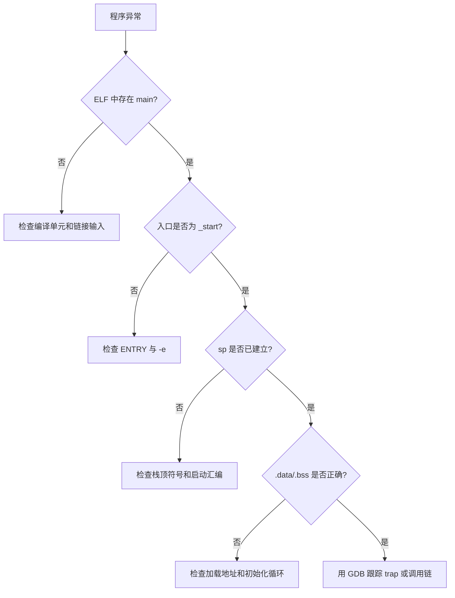
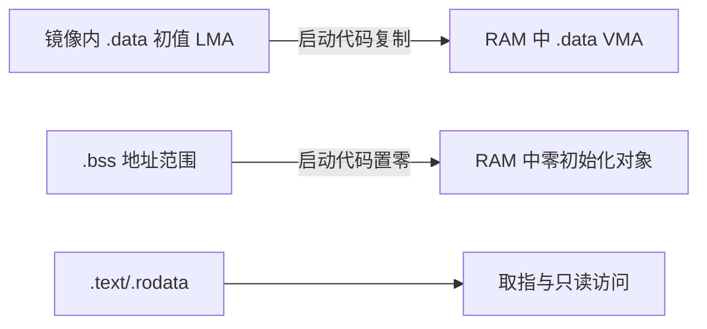
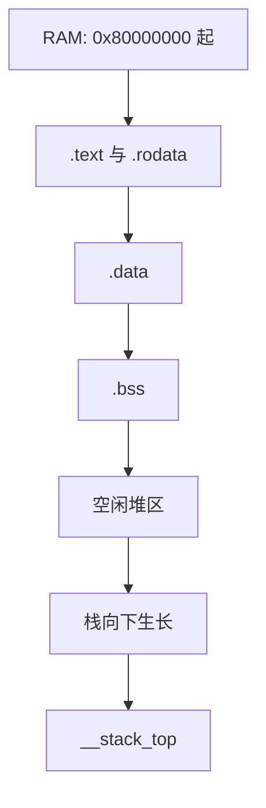
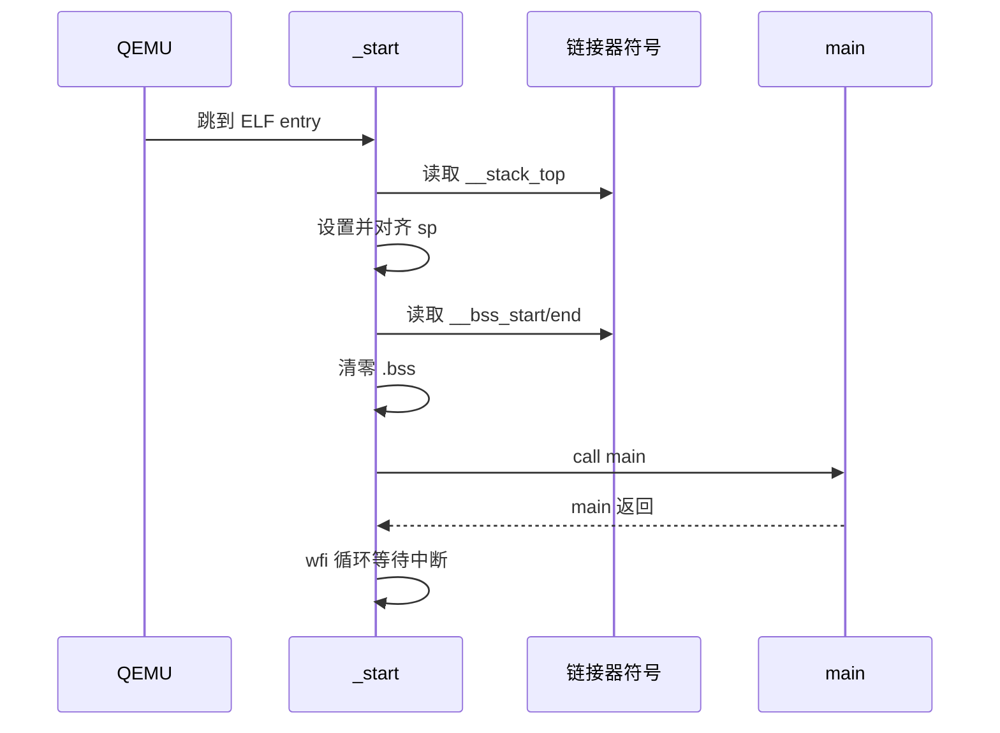
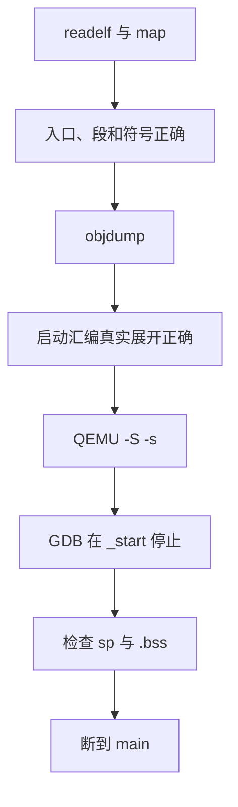

前 3 篇已经能把一个 C 程序交给交叉编译器，并在 QEMU 中启动。

但“能启动”并不等于已经理解启动。

编译器生成的目标文件只有段、符号与重定位。

它不知道镜像放到哪块 RAM，也不知道栈从哪里向下生长。

更不知道 C 语言期待的 `.data` 初值、`.bss` 零值和全局构造环境由谁准备。

本篇补上这条经常被省略的链路：**链接脚本定义地址空间，启动汇编建立最小机器状态，C 代码在已初始化的运行时中执行。**

实验目标仍然是 `qemu-system-riscv64 -M virt -bios none`。

这里的 `virt` 是 QEMU 的通用虚拟平台，不是某块真实开发板。

QEMU 文档将它定位为面向虚拟机的通用板型，并列出 CLINT、PLIC、UART 等设备。[QEMU virt 平台](https://qemu.readthedocs.io/en/master/system/riscv/virt.html)

本文只讨论 M 态裸机单 hart 的启动路径。

OpenSBI、S 态和 Linux 的启动职责会在系统软件章节单独处理。

## 1. 先把“编译”“链接”“启动”分开

编译器把每个源文件变成可重定位目标文件。

链接器把目标文件与库合并，解析符号，并为各段分配最终虚拟地址。

启动代码在 CPU 跳入程序的那一刻运行。

它不是编译器自动替你执行的魔法。


若这三个阶段混在一起排查，常见现象会显得无从解释。

例如 `main` 符号存在却没有被执行，通常是入口符号或启动跳转有问题。

全局变量初值变成零，通常是 `.data` 的加载地址与运行地址没有正确处理。

函数一调用就异常，则可能是栈地址没有准备或没有维持 psABI 要求的对齐。



RISC-V ISA 没有硬件规定某个通用寄存器天然就是栈指针。

`sp` 这个角色由 psABI 赋予 `x2`。

同一份 psABI 也规定标准 ABI 入口处栈指针应按 128 bit，也就是 16 字节对齐。[RISC-V psABI](https://riscv-non-isa.github.io/riscv-elf-psabi-doc/)

因此，启动代码是硬件复位状态与语言运行时约定之间的适配层。

## 2. ELF 的段不是“文件里的连续内存”

先看最小裸机镜像中常见的四类内容。

| 名称 | 典型内容 | 上电后是否需要写入 | 常见位置 |
| --- | --- | --- | --- |
| `.text` | 指令、只读跳转表 | 否 | 可执行 RAM 或闪存映射 |
| `.rodata` | 字符串、常量数据 | 否 | 与代码相邻 |
| `.data` | 带初值的全局变量 | 是，复制初值 | 运行在 RAM |
| `.bss` | 零初值全局变量 | 是，清零 | 运行在 RAM |

`.data` 最容易造成误解。

链接器可以让它的运行地址位于 RAM，同时将初始内容放在镜像的另一个加载位置。

在真实 MCU 中，初值常放在非易失存储，再由启动代码搬到 RAM。

本实验把镜像直接交给 QEMU RAM，但仍保留“加载地址”和“运行地址”两个概念。

这样换到 ROM、SPI flash 或 bootloader 时，脚本结构不需要重写。



术语可以这样记。

VMA 是程序运行时看到的地址。

LMA 是镜像中存放该段初始字节的位置。

二者相同时，不代表二者在所有平台上都必须相同。

不要仅用 `readelf -S` 的段大小来判断启动初始化是否完整。

需要同时检查脚本导出的边界符号与最终程序头。

## 3. 为 QEMU virt 定义一个可检查的 RAM 边界

下面使用一个教学用的内存区域定义。

示例起始地址和容量必须和你实际启动命令、QEMU 版本及设备树相匹配。

对于 `virt`，可用 QEMU 生成的设备树或启动日志核对 RAM 范围。

不要把本文的常量复制到一块真实板卡。

```ld
OUTPUT_ARCH(riscv)
ENTRY(_start)

MEMORY
{
  RAM (rwx) : ORIGIN = 0x80000000, LENGTH = 128M
}

SECTIONS
{
  . = ORIGIN(RAM);

  .text : ALIGN(16)
  {
    KEEP(*(.text.init))
    *(.text .text.*)
    *(.rodata .rodata.*)
  } > RAM

  .data : ALIGN(16)
  {
    __data_start = .;
    *(.data .data.*)
    __data_end = .;
  } > RAM

  .bss (NOLOAD) : ALIGN(16)
  {
    __bss_start = .;
    *(.bss .bss.*)
    *(COMMON)
    __bss_end = .;
  } > RAM

  . = ALIGN(16);
  __stack_top = ORIGIN(RAM) + LENGTH(RAM);
}
```

这份脚本故意保持简单。

它假设 `.text`、`.data` 与 `.bss` 都在同一片 QEMU RAM。

因此 `.data` 不需要从另一块存储器搬运。

但我们仍然保留初始化代码，以便把模板迁移到带独立 LMA 的系统。

`ENTRY(_start)` 要求链接器把 `_start` 作为 ELF 入口点。

`KEEP(*(.text.init))` 防止链接垃圾回收删除唯一的启动段。

`COMMON` 接住旧式 common 符号，使其与 `.bss` 一并清零。

`NOLOAD` 表达 `.bss` 不需要以实际初值占据镜像内容。



在这个布局中，链接器并没有自动为“堆”和“栈”建立碰撞保护。

它只计算符号地址。

动态分配器、任务栈或中断栈如果不断扩张，仍可能覆盖 `.bss` 或彼此覆盖。

教学阶段至少导出边界，并在调试构建中加入断言。

```ld
ASSERT(__bss_end < __stack_top, "RAM layout exceeds stack top")
```

这只能捕获静态布局越界。

它不能替代运行时栈水位、堆边界和 MPU/PMP 保护。

## 4. 用链接器符号连接脚本与汇编

链接脚本中赋值的 `__stack_top`、`__bss_start` 等名字，会成为 ELF 符号。

它们不是 C 变量的“值”。

通常要把符号地址当作数据使用。

在汇编中使用 `la` 获得其地址。

```asm
    .section .text.init
    .globl _start
    .type _start, @function

_start:
    la sp, __stack_top
    andi sp, sp, -16

    la t0, __bss_start
    la t1, __bss_end
1:
    bgeu t0, t1, 2f
    sd zero, 0(t0)
    addi t0, t0, 8
    j 1b
2:
    call main
3:
    wfi
    j 3b
```

这里假设的是 RV64，因此用 `sd` 并以 8 字节为步长。

若目标改为 RV32，应使用与指针宽度相符的加载、存储和增量。

同一份代码也应处理 `.bss` 的长度不是 8 的倍数的情形。

教学项目可以把 `.bss` 保持对齐并由链接脚本保证边界。

生产启动代码则应明确处理尾部字节，或使用经过验证的 `memset` 实现。



`andi sp, sp, -16` 是一种防御性对齐。

它不该掩盖链接脚本或内存区长度错误。

正确做法是让 `__stack_top` 本身已经满足对齐，再在汇编中保留断言式收敛。

`wfi` 表示等待中断。

在还没有中断初始化的最小程序中，`main` 返回后停在 `wfi` 循环比跳进随机地址更容易调试。

## 5. 给 `.data` 独立加载地址的通用模板

真正需要搬运 `.data` 时，可把运行内存和镜像存储拆开。

下面只展示结构，不替任何芯片臆造 flash 地址。

```ld
MEMORY
{
  ROM (rx)  : ORIGIN = BOARD_ROM_BASE, LENGTH = BOARD_ROM_SIZE
  RAM (rwx) : ORIGIN = BOARD_RAM_BASE, LENGTH = BOARD_RAM_SIZE
}

SECTIONS
{
  .text :
  {
    KEEP(*(.text.init))
    *(.text .text.*)
    *(.rodata .rodata.*)
  } > ROM

  .data : AT(LOADADDR(.text) + SIZEOF(.text))
  {
    __data_start = .;
    *(.data .data.*)
    __data_end = .;
  } > RAM

  __data_load_start = LOADADDR(.data);
}
```

启动代码再按三个地址工作。

```asm
    la t0, __data_load_start
    la t1, __data_start
    la t2, __data_end
1:
    bgeu t1, t2, 2f
    ld t3, 0(t0)
    sd t3, 0(t1)
    addi t0, t0, 8
    addi t1, t1, 8
    j 1b
2:
```

先读取 LMA，再写入 VMA。

不要把源和目的写反。

也不要错误地从 `__data_start` 读取初值，因为它是 RAM 的运行地址。


对于有 cache 的复杂 SoC，还需要考虑启动阶段 cache 是否开启、ROM 是否可直接读取、DMA 是否参与搬运。

对于本文 QEMU 裸机实验，这些条件都没有启用。

先把软件符号关系验证正确，再扩展到硬件一致性问题。

## 6. 用 CMake 传递链接语义，而不是手工拼命令

第 02 篇已经建立 CMake 交叉编译入口。

链接脚本应作为目标的明确依赖和链接选项出现。

```cmake
set(LINKER_SCRIPT ${CMAKE_SOURCE_DIR}/linker/qemu-virt.ld)

add_executable(riscv-qemu.elf
  src/main.c
  startup/start.S
)

target_link_options(riscv-qemu.elf PRIVATE
  -nostdlib
  -Wl,-T,${LINKER_SCRIPT}
  -Wl,-Map,${CMAKE_CURRENT_BINARY_DIR}/riscv-qemu.map
  -Wl,--gc-sections
)

add_custom_command(TARGET riscv-qemu.elf POST_BUILD
  COMMAND ${CMAKE_OBJCOPY} -O binary
          $<TARGET_FILE:riscv-qemu.elf>
          ${CMAKE_CURRENT_BINARY_DIR}/riscv-qemu.bin
  BYPRODUCTS ${CMAKE_CURRENT_BINARY_DIR}/riscv-qemu.bin
  VERBATIM
)
```

`-Wl,` 让编译器驱动程序把选项传递给链接器。

Map 文件是启动问题的重要静态证据。

它能显示各输入段最终放到什么地址，以及哪些符号定义了布局边界。

`objcopy -O binary` 生成的是纯字节镜像。

它不携带 ELF 符号和段头。

调试启动问题时，应优先将 ELF 交给 QEMU/GDB，保留二进制镜像用于需要 raw payload 的场景。

## 7. 验证顺序：先静态，再动态

先让工具回答“链接器做了什么”。

```powershell
riscv64-unknown-elf-readelf -h build/qemu-rv64-debug/riscv-qemu.elf
riscv64-unknown-elf-readelf -S build/qemu-rv64-debug/riscv-qemu.elf
riscv64-unknown-elf-readelf -s build/qemu-rv64-debug/riscv-qemu.elf `
  | Select-String '__stack_top|__bss_start|__bss_end|_start|main'
riscv64-unknown-elf-objdump -d -M no-aliases `
  build/qemu-rv64-debug/riscv-qemu.elf
```

期望看到 `_start` 是入口附近最早的代码。

期望看到 `__bss_start` 小于或等于 `__bss_end`。

期望看到 `__stack_top` 位于所选 RAM 区的顶端。

不要根据终端中某一行固定地址判断成功。

地址会随脚本、QEMU RAM 大小与链接选项变化。

接着以 GDB 服务器方式启动 QEMU。

```powershell
qemu-system-riscv64 -M virt -bios none -nographic `
  -kernel build/qemu-rv64-debug/riscv-qemu.elf `
  -S -s
```

另开终端连接调试器。

```text
riscv64-unknown-elf-gdb build/qemu-rv64-debug/riscv-qemu.elf
(gdb) target remote :1234
(gdb) break _start
(gdb) continue
(gdb) info registers pc sp
(gdb) x/8gx $sp-32
(gdb) break main
(gdb) continue
```

在 `_start` 处检查 `pc` 是否确实落到启动段。

单步跨过 `la sp, __stack_top` 后检查 `sp`。

在 `main` 处检查 `.bss` 对应的 C 变量是否为零。



当前工作区未安装 QEMU 或 RISC-V 交叉工具链时，可以完成 Markdown 与站点构建验证。

不能把静态文章检查当成已经运行过上述命令。

运行时结果必须由具有相应工具链的环境产生。

## 8. 常见失败模式

| 症状 | 先检查 | 典型原因 |
| --- | --- | --- |
| GDB 连接后 PC 不在 `_start` | ELF 入口与 QEMU 装载方式 | 没有 `ENTRY(_start)`，或启动的不是预期 ELF |
| 一进 C 函数就异常 | `sp` 和调用约定 | 栈未设置、未对齐或位于无效 RAM |
| 全局变量初值错误 | `__data_load_start` 与复制循环 | 源/目的地址混淆，或者漏复制 `.data` |
| 静态全局变量不是零 | `.bss` 边界和清零循环 | 遗漏 `COMMON`，或循环范围错误 |
| 启动代码被链接器丢弃 | map 文件中的 `.text.init` | 使用了段回收但没有 `KEEP` |
| 运行一段时间后随机异常 | 栈、堆和 `.bss` 边界 | 内存区过小，任务或递归使栈碰撞 |

排查时先保存 map 文件和 ELF。

它们比重新手拼一条长编译命令更能还原问题。

不要通过把所有段强行放在地址零来“消除”地址错误。

这样只会让链接布局脱离真实平台，并掩盖启动责任。

## 9. 练习与验收

### 练习

1. 在 C 中定义一个有初值变量和一个无初值变量，在 GDB 中分别观察 `main` 入口处的值。
2. 把 `__stack_top` 人为减小到接近 `.bss`，阅读 map 文件中两者的地址关系。
3. 在启动汇编的 `.bss` 清零循环中设置断点，观察 `t0` 如何从开始边界移动到结束边界。
4. 为 `.data` 复制模板增加一个纯软件 RAM 缓冲区，验证源地址与目的地址没有别名。
5. 将 `ENTRY(_start)` 删除后重新链接，比较 `readelf -h` 中 Entry point 的变化。
6. 为 `.text.init` 去掉 `KEEP` 并打开段回收，使用 map 文件确认启动段是否仍被保留。

### 本篇验收清单

- [ ] 能区分可重定位目标文件、ELF、原始二进制镜像与运行时内存。
- [ ] 能说明 VMA 与 LMA 的差别，并知道何时必须复制 `.data`。
- [ ] 能在脚本中定义 `_start`、`.text`、`.data`、`.bss` 与栈顶符号。
- [ ] 能说明 `.bss` 为何需要启动代码清零。
- [ ] 能在 RV64 启动代码中设置并检查 16 字节对齐的 `sp`。
- [ ] 能用 map、`readelf` 和 `objdump` 检查链接器的最终布局。
- [ ] 能用 QEMU GDB 服务器在 `_start` 与 `main` 两处观察状态。
- [ ] 不会把 QEMU `virt` 的内存参数直接套用到真实硬件。

链接脚本不是构建系统里的附属文件。

它是软件对地址空间的明确声明。

启动代码也不是一次性样板。

它把这份声明兑现为 C、汇编和调试器都能观察的机器状态。

> 🏷️ RISC-V · 链接脚本 · ELF · 启动代码 · 裸机 · QEMU · CMake
