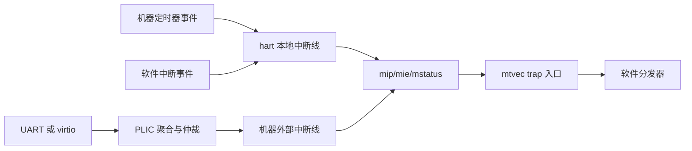
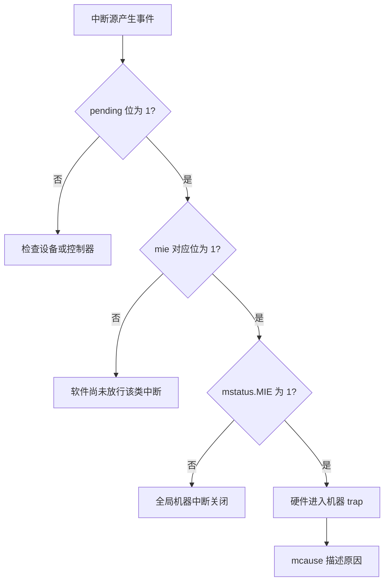
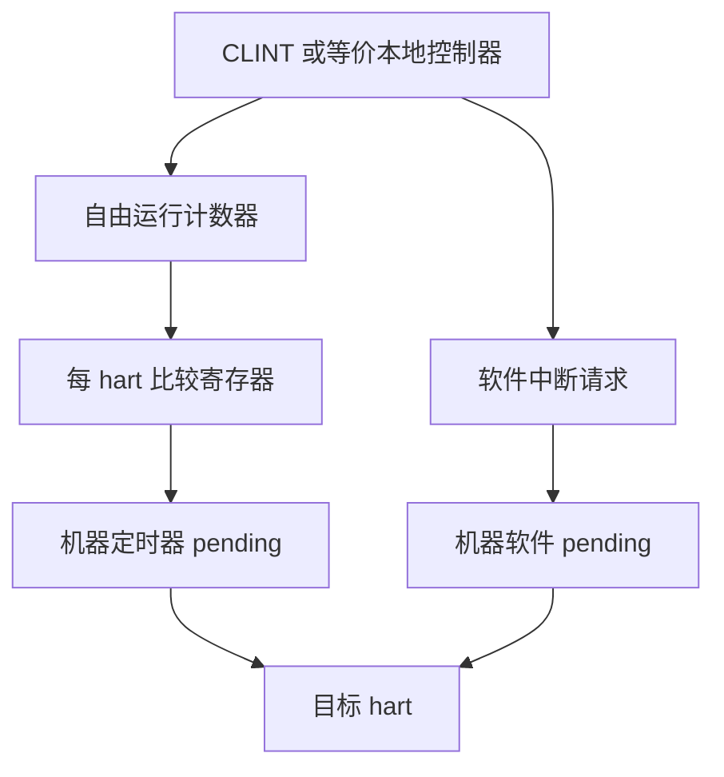
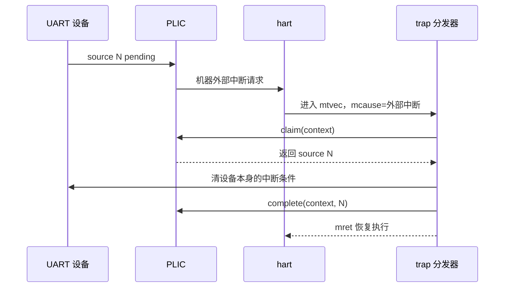
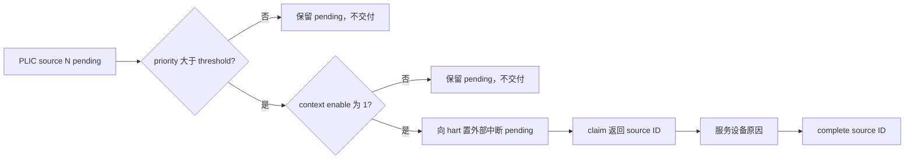
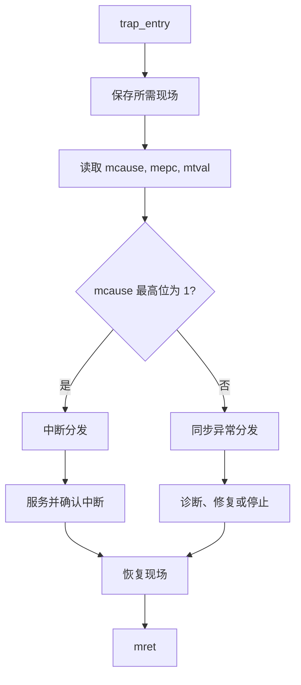
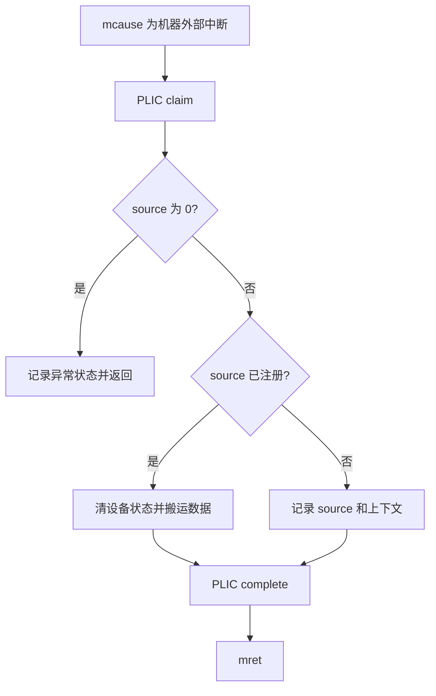

裸机程序一旦从轮询走向定时器、串口接收或外设事件，中断就成为控制流的一部分。

RISC-V 的中断不能只记成“跳进 ISR”。

一次可控的中断需要处理器 CSR、hart 本地来源、平台级控制器、设备树描述与软件处理函数共同配合。

本篇在 QEMU `virt` 上建立这条关系。

它的目标不是把某个地址表背下来。

目标是能够面对任意 RISC-V 平台时，沿着设备树和特权 CSR 找到真实的中断路径。

QEMU `virt` 明确包含 CLINT 和 PLIC，但它不代表所有 RISC-V 芯片都采用同一实现或同一地址布局。[QEMU virt 平台](https://qemu.readthedocs.io/en/master/system/riscv/virt.html)

PLIC 标准本身也将具体实现的中断数量、hart context 数量留给平台决定。[RISC-V PLIC 规范](https://docs.riscv.org/reference/plic/introduction.html)

## 1. 中断由“原因”和“交付路径”组成

先分开两个问题。

第一个问题是事件来自哪里。

定时器比较到期、软件写中断寄存器、UART 收到字节，都是不同来源。

第二个问题是事件如何到达某个 hart 的 trap 入口。

硬件通过中断 pending、enable 与全局使能条件决定是否交付。



一个 hart 能看到的机器级中断原因常包括软件、定时器和外部中断。

在 CSR 层，这些状态对应 `mip` 中的 pending 位与 `mie` 中的 enable 位。

`mstatus.MIE` 是机器态全局中断开关。

任何一个条件未满足，硬件都可能保留 pending 状态而不进入 trap。



这套判断避免了一个常见误区。

“我写了 PLIC enable，所以 UART 一定会进中断”并不成立。

PLIC 的设备级放行只是外部中断路径的一层。

hart 的外部中断使能和全局 MIE 仍然必须正确设置。

## 2. CLINT 是本地事件的常见实现，而不是 ISA 强制名称

QEMU `virt` 提供 CLINT 设备。

传统上它承载机器软件中断寄存器和机器定时器计数/比较寄存器。

但“CLINT”是平台装置名称，不是基础 RISC-V ISA 对所有芯片强制的外设规范。

具体平台也可能使用 AIA 相关组件、供应商控制器或不同的寄存器布局。

软件必须从该平台的设备树、手册和固件接口获得事实。



机器软件中断适合做 hart 间通知或测试 trap 链路。

机器定时器中断适合构造 tick、超时和调度时基。

它们都是“本地”概念：事件定向到一个明确 hart 的本地中断状态。

外部设备中断的多路复用则通常由 PLIC 完成。

在多 hart 系统中，不要默认每个 hart 都使用相同的比较寄存器偏移。

应根据平台描述选择目标 hart 的寄存器实例。

## 3. PLIC 解决的是外设中断聚合与仲裁

PLIC 接收多个设备源。

它记录 pending 状态，并按 priority、threshold、enable mask 选择可以交付给某个 hart context 的请求。

当 hart 收到机器外部中断后，软件还必须执行 claim，才知道是哪个 source 触发。

处理完毕后，软件向 completion 寄存器写回 source ID。



claim/complete 是 PLIC 协议的一部分。

只读取设备 UART 状态而不 claim，软件并不知道 PLIC 当前交付了哪个源。

只 claim 而不 complete，控制器可能不再向该 context 再次交付同一源。

同样重要的是先处理设备侧的真正原因。

如果 UART 接收 FIFO 仍然非空或状态位仍置位，complete 后会很快再次看到相同中断。



PLIC 不为软件提供通用优先级抢占语义。

设备中断嵌套、临界区和实时性边界仍由软件策略与平台实现共同决定。

## 4. `mtvec` 是入口，`mcause` 是分发依据

机器态 trap 入口地址来自 `mtvec`。

其低位模式字段决定 direct 或 vectored 语义。

教学项目先采用 direct 模式，把所有 trap 交给一个汇编入口。

入口保存最小现场、读取 `mcause`、调用 C 分发器，再恢复现场并 `mret`。

```asm
    .section .text
    .align 2
    .globl trap_entry
trap_entry:
    addi sp, sp, -128
    sd ra, 0(sp)
    sd t0, 8(sp)
    sd t1, 16(sp)
    sd a0, 24(sp)
    csrr a0, mcause
    csrr a1, mepc
    call machine_trap_dispatch
    ld ra, 0(sp)
    ld t0, 8(sp)
    ld t1, 16(sp)
    ld a0, 24(sp)
    addi sp, sp, 128
    mret
```

这是用于理解控制流的最小片段。

真实 trap 保存集合必须覆盖编译器、ABI、任务切换与可选浮点/向量状态的实际需要。

不能因为本示例只保存几个寄存器，就把它直接用作抢占式内核的完整入口。

`mcause` 的最高位表明这是中断还是同步异常。

其余 cause 编号决定分发目标。

`mepc` 保存被中断或发生异常的指令地址。

`mtval` 则为部分异常提供附加信息。



不要在 C 分发器中凭“某个数字看上去像 timer”判断来源。

应把中断位掩码、cause 枚举和平台 source ID 定义在集中头文件中。

这样从 RV64 切到 RV32，或从 QEMU 切到板卡时，宽度与平台差异有明确落点。

## 5. 初始化顺序比寄存器地址更关键

一个稳定的机器态中断初始化可遵循下面顺序。

第一步，关闭机器态全局中断。

第二步，写入对齐的 `mtvec`。

第三步，配置设备自身与控制器的 pending/enable 状态。

第四步，打开 `mie` 中需要的类别位。

第五步，最后置位 `mstatus.MIE`。

```c
#define MSTATUS_MIE (1UL << 3)
#define MIE_MSIE    (1UL << 3)
#define MIE_MTIE    (1UL << 7)
#define MIE_MEIE    (1UL << 11)

static inline void write_mtvec(uintptr_t value) {
  __asm__ volatile ("csrw mtvec, %0" :: "r"(value));
}

void machine_interrupts_init(void) {
  uintptr_t mstatus;

  __asm__ volatile ("csrr %0, mstatus" : "=r"(mstatus));
  mstatus &= ~MSTATUS_MIE;
  __asm__ volatile ("csrw mstatus, %0" :: "r"(mstatus));

  write_mtvec((uintptr_t)trap_entry);
  platform_plic_init_from_fdt();
  platform_timer_init_from_fdt();

  __asm__ volatile ("csrw mie, %0" :: "r"(MIE_MSIE | MIE_MTIE | MIE_MEIE));
  __asm__ volatile ("csrs mstatus, %0" :: "r"(MSTATUS_MIE));
}
```

`platform_plic_init_from_fdt()` 是刻意保留的边界。

它表示 PLIC 基地址、source ID、context 和 enable 位图来自当前平台描述。

它不是一个可以被空函数代替的抽象。

QEMU 支持将设备树导出为文件，实际项目可在构建或启动前保存该文件，再由解析工具核对节点与 `interrupts` 属性。

```powershell
qemu-system-riscv64 -M virt,dumpdtb=virt.dtb -nographic -bios none
dtc -I dtb -O dts -o virt.dts virt.dtb
Select-String -Path virt.dts -Pattern 'clint|plic|interrupt-controller|uart'
```

不同 QEMU 版本和启动参数可能产生不同节点。

让设备树成为核对来源，能避免示例里一个十六进制常量演变成项目的永久假设。

## 6. 一个外部 UART 中断的最小分层

以下伪代码展示各层责任。

```c
void machine_external_interrupt(void) {
  uint32_t source = plic_claim(machine_context_id());

  if (source == uart_interrupt_source()) {
    while (uart_rx_ready()) {
      uart_rx_push(uart_read_byte());
    }
    uart_acknowledge();
  } else if (source != 0U) {
    platform_unhandled_source(source);
  }

  if (source != 0U) {
    plic_complete(machine_context_id(), source);
  }
}

void machine_trap_dispatch(uintptr_t cause, uintptr_t epc) {
  if (cause == MACHINE_EXTERNAL_INTERRUPT) {
    machine_external_interrupt();
    return;
  }
  trap_panic(cause, epc);
}
```

`plic_claim()` 返回零通常表示没有可服务的 source。

这不应被当作设备编号零。

处理未知 source 时，仍应有明确的诊断和完成策略。

否则一个未注册外设会使中断路径停留在不确定状态。



中断处理函数应尽量短。

把复制大缓冲、协议解析和日志格式化延迟到线程、任务或主循环上下文。

这是降低中断延迟和锁竞争的结构性方法，不是靠某条编译选项获得的结果。

## 7. 从 QEMU 到真实平台时的迁移清单

QEMU `virt` 的价值在于让控制流可重复。

它不是芯片启动包的替代品。

迁移时至少核对下面项目。

| 项目 | QEMU 实验中如何获得 | 板卡上如何获得 |
| --- | --- | --- |
| hart 数量与 ID | QEMU 参数和设备树 | SoC 手册、固件或设备树 |
| 本地计时器 | `virt` 设备树节点 | 平台手册或 SBI 接口 |
| 外部控制器 | PLIC 节点与 context | 中断控制器文档 |
| UART source ID | 设备树 `interrupts` | SoC 手册与生成的硬件描述 |
| trap 特权级 | `-bios none` 的 M 态实验 | boot ROM、OpenSBI、OS 设计 |
| 可用 CSR | 编译 ISA 与 QEMU CPU | 核心实现和扩展配置 |

当系统由 OpenSBI 启动 Linux 时，S 态软件不应直接假定能接管机器计时器寄存器。

那时要通过 SBI 或内核的中断子系统与固件协作。

这正是同样叫“定时器中断”的代码，在裸机和 Linux 中完全不同的原因。

## 8. 调试证据与失败模式

GDB 观察 CSR 是定位第一现场的可靠起点。

```text
(gdb) target remote :1234
(gdb) break trap_entry
(gdb) continue
(gdb) p/x $mcause
(gdb) p/x $mepc
(gdb) p/x $mstatus
(gdb) p/x $mie
(gdb) p/x $mip
```

若断点永远不命中，不要先改 trap 汇编。

先验证设备是否产生事件、控制器是否放行、`mie` 是否设置、全局 MIE 是否开启。

| 症状 | 首先检查 | 常见原因 |
| --- | --- | --- |
| 设备有数据却不进 trap | `mstatus`、`mie`、控制器 enable | 只配置了设备或 PLIC，未开启 hart 中断 |
| trap 一进入就反复触发 | 设备状态与 complete 次序 | 没清设备原因，或没有完成 PLIC 请求 |
| claim 得到未知 source | 设备树、context、source ID | 把示例编号带到不同平台 |
| `mret` 后跳转异常 | 保存集、`mepc` 与栈 | trap 入口破坏寄存器或错误改写返回 PC |
| 双 hart 行为不一致 | hart ID 与 PLIC context | 所有 hart 共用错误的本地寄存器偏移 |
| 开启中断后立刻异常 | `mtvec` 对齐与权限 | 入口无效、特权态不匹配或栈未建立 |

可以在 trap 分发器里记录 `mcause`、`mepc`、`mtval` 和 claim source。

日志应使用不会递归依赖同一 UART 中断的最小路径。

中断里大量 `printf` 容易扭曲时序，也可能使故障看似消失。

## 9. 练习与验收

### 练习

1. 在全局 MIE 关闭时产生一个 UART 事件，观察 pending 与实际 trap 的区别。
2. 只打开 `mie.MEIE` 而不配置 PLIC enable，解释为何外部中断仍不能交付。
3. 故意跳过 PLIC complete，记录同一 source 在下一次事件时的表现。
4. 在机器外部中断分发中加入未知 source 计数器，并把 source ID 输出到安全的调试通道。
5. 导出 QEMU `virt` 的 DTB，找到中断控制器与 UART 节点，写下它们之间的 `interrupts` 关系。
6. 把 trap 分发器中的同步异常与异步中断分支分开，确保两者不会共享错误的确认路径。

### 本篇验收清单

- [ ] 能解释本地软件、定时器和外部中断的责任边界。
- [ ] 能说明 `mip`、`mie` 与 `mstatus.MIE` 为什么需要同时满足。
- [ ] 能在 direct `mtvec` 入口读取 `mcause` 并进入正确分支。
- [ ] 能说明 PLIC 的 priority、threshold、enable、claim、complete 各自负责什么。
- [ ] 能先清设备侧原因，再完成 PLIC 请求。
- [ ] 能用设备树而不是记忆中的地址和 source ID 描述平台。
- [ ] 能在 GDB 中检查 `mcause`、`mepc`、`mie`、`mip` 与 `mstatus`。
- [ ] 能指出 QEMU M 态裸机和 OpenSBI/Linux 中断职责的差别。

中断不是一张寄存器地址表。

它是一条由设备、控制器、hart、CSR 与软件确认动作构成的状态链。

每一层都可观察，才能把“没有进中断”缩小成一个可定位的问题。

> 🏷️ RISC-V · 中断 · CLINT · PLIC · trap · CSR · QEMU · 设备树
