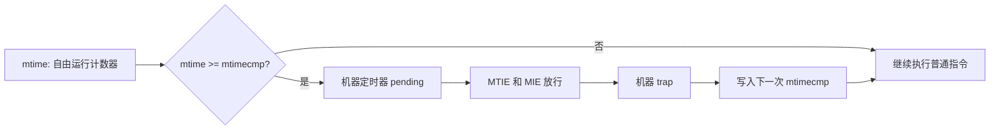
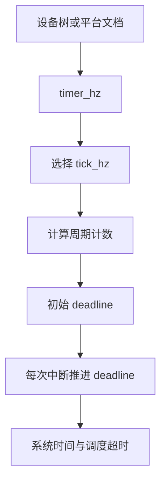
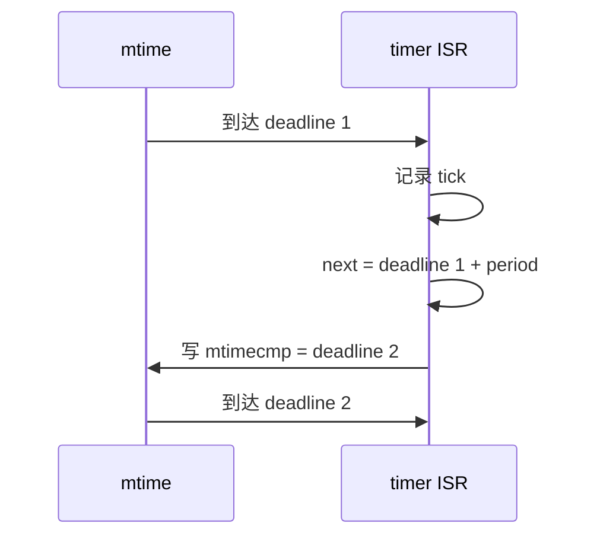
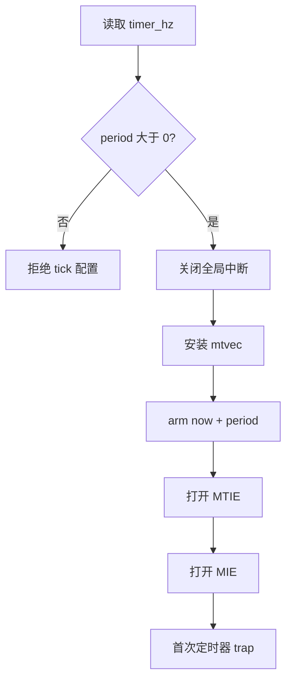
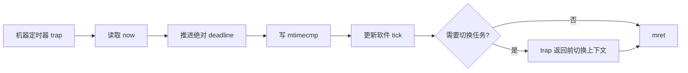
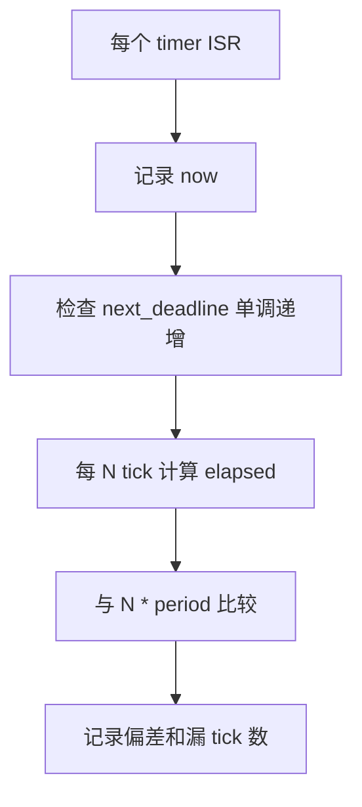

第 05 篇建立了 trap、CLINT、PLIC 与 CSR 的中断路径。

现在把其中最常见的本地事件变成系统时基：机器定时器。

一个可靠的 tick 不是“每次中断计数加一”。

它必须先确定计数器频率，再选择周期，安全地更新下一次比较值，并在中断延迟存在时保持可解释的时间语义。

本篇仍以 QEMU `virt` 的单 hart M 态裸机为实验环境。

QEMU 的 `virt` 列出 CLINT 作为平台设备，但具体时钟参数、设备节点和运行参数应由当前 DTB 核对。[QEMU virt 平台](https://qemu.readthedocs.io/en/master/system/riscv/virt.html)

本文的目标是让 tick 成为可测量、可迁移、可诊断的基础服务。

## 1. 先区分自由运行计数与周期事件

机器定时器通常由两个概念构成。

`mtime` 是持续递增的自由运行计数值。

每个 hart 的 `mtimecmp` 是比较阈值。

当 `mtime` 到达或超过当前 hart 的比较值时，机器定时器中断 pending 条件成立。

软件需要把 `mtimecmp` 推到未来，才能停止当前这次到期状态。



这里没有“硬件自动周期模式”的假设。

周期性来自软件每次都安排下一个 deadline。

把比较寄存器理解成闹钟时间点，比把它理解成计数器重载值更准确。

如果软件把下一次 deadline 算错，pending 会持续有效或很久都不再触发。

## 2. Tick 周期来自频率，不来自毫秒常量

设定的系统频率为 `tick_hz`。

定时器输入频率为 `timer_hz`。

每个 tick 应推进的计数近似为：

```text
ticks_per_period = timer_hz / tick_hz
```

例如 `timer_hz` 为 10 MHz、`tick_hz` 为 1000 Hz 时，一个 tick 是 10000 个计数。

这个例子只说明计算方法。

它不是对 QEMU、某个 FPGA 或任何 SoC 时钟频率的断言。



整数除法可能产生余数。

若 `timer_hz` 不能被 `tick_hz` 整除，长期会积累误差。

教学项目可以先选择可以整除的频率组合。

需要精确时间时，可使用分数累加或基于绝对时钟的 deadline 计算。

不要通过每次随机补偿一个计数来隐藏未定义的时间模型。

## 3. 使用绝对 deadline，避免处理中断的耗时漂移

第一种写法是从“当前时间”安排下一次。

```c
next_compare = read_mtime() + ticks_per_period;
```

它看上去直接，但中断处理本身、屏蔽窗口和总线访问时间都会进入周期。

时间越久，软件时钟越慢。

第二种写法保存绝对 deadline。

```c
next_compare += ticks_per_period;
write_mtimecmp(next_compare);
```

这种方法把理想 tick 网格固定在自由运行计数器上。

中断晚到时，处理的是“错过多少个理想时间点”的问题，而不是悄悄拉长每一个周期。



若当前 `mtime` 已经超过新 deadline，只有简单加一次周期仍会立刻重入。

必须把 deadline 循环推进到未来，或按系统设计统计已错过的 tick。

```c
static uint64_t next_deadline;

void machine_timer_isr(void) {
  const uint64_t now = timer_read_mtime();

  do {
    next_deadline += timer_ticks_per_period();
    kernel_account_one_tick();
  } while (next_deadline <= now);

  timer_write_mtimecmp(next_deadline);
}
```

这段伪代码的策略是补记每个错过的时间点。

某些实时系统会选择只记录一次并重新对齐。

两种策略对超时、统计与任务切换都有不同语义。

项目需要明确选择其中一种，而不是让负载偶然决定行为。

## 4. 把平台地址和频率隔离在驱动边界

以下接口刻意不暴露硬编码基地址。

```c
typedef struct {
  volatile uint64_t *mtime;
  volatile uint64_t *mtimecmp_for_hart;
  uint64_t frequency_hz;
} machine_timer_t;

static machine_timer_t timer;

uint64_t timer_read_mtime(void) {
  return *timer.mtime;
}

uint64_t timer_ticks_per_period(void) {
  return timer.frequency_hz / config_tick_hz();
}

void timer_arm(uint64_t deadline) {
  *timer.mtimecmp_for_hart = deadline;
}
```

`machine_timer_t` 的实例应由设备树、固件传入的硬件描述或明确的平台配置文件建立。

把 `mtime` 地址散落在中断处理、调度器和测试程序中，会使迁移和复核失去边界。


在 QEMU 实验中，仍可把已核对的基址实现为静态平台层。

但源文件中的注释应指向 DTB 和 QEMU 版本，而不是写成“RISC-V 定时器地址”。

后者在架构层面并不存在。

## 5. RV32 上写 64 位比较寄存器需要避免瞬态到期

`mtime` 和 `mtimecmp` 的语义是 64 位计数与比较。

在 RV64 上，正常的 64 位访问可直接表达一个完整值。

在 RV32 上，软件往往需要分两次写低半字和高半字。

如果先写低半字，组合出来的临时值可能比当前 `mtime` 小，从而产生一次不期望的定时器 pending。

通用的防御顺序是：先把高半字写成全 1，再写低半字，最后写真实高半字。

```c
void timer_write_mtimecmp_rv32(volatile uint32_t *cmp, uint64_t value) {
  const uint32_t lo = (uint32_t)value;
  const uint32_t hi = (uint32_t)(value >> 32);

  cmp[1] = UINT32_MAX;
  cmp[0] = lo;
  cmp[1] = hi;
}
```

这是针对分半字访问的时序保护。

它不意味着所有 RISC-V 平台都把比较寄存器暴露成相邻两个 32 位 MMIO word。

仍需遵循平台寄存器宽度和总线访问规则。

FreeRTOS 上游 RISC-V 端口历史也特别记录了 32 位核心上更新 64 位机器定时器比较值的建议顺序。[FreeRTOS Kernel 历史](https://github.com/FreeRTOS/FreeRTOS-Kernel/blob/main/History.txt)


读 64 位 `mtime` 也要考虑原子性。

在 RV32 上，先读高位、再读低位、再读高位，若两次高位不同就重试，能避免跨越低位回绕时得到拼接的错误时间。

```c
uint64_t timer_read_mtime_rv32(volatile uint32_t *time) {
  uint32_t hi0;
  uint32_t lo;
  uint32_t hi1;

  do {
    hi0 = time[1];
    lo = time[0];
    hi1 = time[1];
  } while (hi0 != hi1);

  return ((uint64_t)hi0 << 32) | lo;
}
```

## 6. 初始化时要先安排未来，再放行中断

以下次序把“比较值仍在过去”的窗口压缩到可控范围。

先关闭全局机器态中断。

再安装 `mtvec` 与 timer 平台描述。

读取当前计数并写入明确位于未来的初始 deadline。

然后开启 `mie.MTIE`，最后开启 `mstatus.MIE`。

```c
void timer_start_periodic(void) {
  const uint64_t period = timer_ticks_per_period();
  const uint64_t now = timer_read_mtime();

  interrupts_disable_global();
  trap_install_machine_vector();

  next_deadline = now + period;
  timer_arm(next_deadline);

  interrupts_enable_machine_timer();
  interrupts_enable_global();
}
```

`period` 必须大于零。

若 `timer_hz < tick_hz`，整数除法会得到零，比较寄存器会永远被安排在当前时刻。

平台层应该在初始化时拒绝这种配置。



不要先打开 `mstatus.MIE`，再慢慢计算比较值。

若旧比较值早已到期，trap 可能在系统状态没有准备完成时发生。

## 7. Tick ISR 只负责时基与调度请求

中断中最重要的动作是安排下一个 deadline。

否则当前 timer pending 状态可能持续有效。

然后可以推进系统 tick，并根据策略请求上下文切换。

```c
void machine_timer_interrupt(void) {
  const uint64_t now = timer_read_mtime();
  bool should_switch = false;

  do {
    next_deadline += timer_ticks_per_period();
    should_switch |= scheduler_tick();
  } while (next_deadline <= now);

  timer_arm(next_deadline);

  if (should_switch) {
    scheduler_request_switch_from_trap();
  }
}
```

本篇中的 `scheduler_tick()` 只是接口名。

在没有内核的裸机项目中，它可以只增加一个观测计数。

在抢占式内核中，它会更新延时队列和时间片状态。

两种情形都不应在 ISR 中执行长时间工作。



先 arm，再做相对耗时的调度工作，是减少立刻重入风险的一种清晰顺序。

实际 port 可以因保存现场、嵌套中断策略而不同。

但 deadline 更新必须有唯一责任人。

## 8. 测量 tick，而不是只打印 tick

串口打印能够证明程序活着，但不能证明周期正确。

一个简单的自检是每累计固定数量 tick 记录 `mtime` 差值。

```c
static uint64_t first_sample;
static uint32_t samples;

void tick_observe(uint64_t now) {
  if (samples == 0U) {
    first_sample = now;
  }

  samples++;

  if (samples == 1000U) {
    const uint64_t elapsed = now - first_sample;
    log_tick_window(elapsed, timer.frequency_hz);
    samples = 0U;
  }
}
```

在理想条件下，1000 个 1 kHz tick 的 `mtime` 差值接近一个 timer 秒。

它不会精确等于墙钟一秒。

QEMU 宿主负载、串口输出和调试停顿都会影响可观察到的时序。

更稳妥的结论是：检查累积周期、deadline 单调性与丢 tick 策略是否符合设计。



测试不要在 ISR 里对每个 tick 都输出一行。

I/O 本身会放大延迟，最终测试的是日志吞吐而不是定时器。

## 9. 失败模式从“比较值”反推

| 症状 | 首先检查 | 常见原因 |
| --- | --- | --- |
| 从不进入 timer trap | `mie.MTIE`、`mstatus.MIE`、`mtimecmp` | 未放行 CSR，或 deadline 距离过远 |
| 开启中断后持续重入 | 当前 `mtime` 与 `mtimecmp` | 比较值仍在过去或 ISR 未重新安排 |
| 软件时间逐渐变慢 | deadline 计算方式 | 每次用 `now + period` 累积处理延迟 |
| tick 频率离谱 | `timer_hz` 来源 | 把 CPU 频率当成 timer 频率 |
| RV32 偶发立即中断 | 比较值分半字写入 | 更新顺序产生了暂态较小值 |
| 多 hart tick 相互干扰 | hart ID 与 compare 实例 | 多个 hart 写同一个比较寄存器 |
| 调试时 tick 停顿 | GDB/QEMU 状态 | 单步和断点冻结了 guest 执行 |

排查时同时记录 `now`、上一个 deadline、新 deadline 和漏计数。

只记录一个“进入中断次数”不足以确定时间模型是否正确。

对时间服务而言，状态之间的差值比单点值更有诊断价值。

## 10. 练习与验收

### 练习

1. 从 QEMU 导出的设备树中找到 timer 相关节点和时钟属性，记录你的平台层输入。
2. 选择一个可整除的 `timer_hz` 与 `tick_hz` 组合，计算每个 tick 的计数值。
3. 将 ISR 改成 `now + period`，观察长时间窗口内它与绝对 deadline 策略的差别。
4. 在 RV32 模型代码中故意先写低半字，说明为什么可能产生瞬态到期。
5. 把 `tick_hz` 设得高于 `timer_hz`，验证初始化会拒绝零周期。
6. 在双 hart 实验中让每个 hart 维护独立 deadline，并检查它们不会覆盖同一 compare 实例。

### 本篇验收清单

- [ ] 能说明 `mtime` 是自由运行时间源，`mtimecmp` 是 deadline。
- [ ] 能从 timer 频率和目标 tick 频率计算周期计数。
- [ ] 能解释为什么绝对 deadline 能减少 ISR 耗时带来的周期漂移。
- [ ] 能在 deadline 已落后时选择补记或重新对齐的明确策略。
- [ ] 能在 RV32 上安全读写 64 位计数和比较值。
- [ ] 能按正确顺序安装 trap、安排未来 deadline 并放行 MTIE/MIE。
- [ ] 能让 timer ISR 先重新 arm，再请求调度工作。
- [ ] 能用累积 `mtime` 差值和 deadline 单调性验证 tick，而非只看日志。

系统 tick 的本质是对一个绝对计数器持续安排未来 deadline。

理解这一点，裸机超时、FreeRTOS 时基和 Linux 的 clockevent 都能落回同一套可检查的时间语义。

> 🏷️ RISC-V · 定时器 · mtime · Tick · CLINT · 中断 · QEMU
