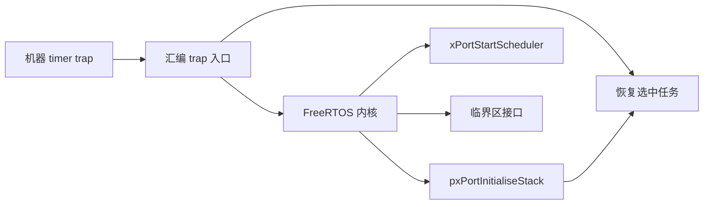
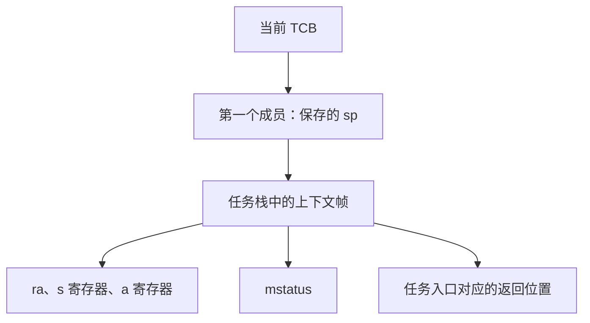
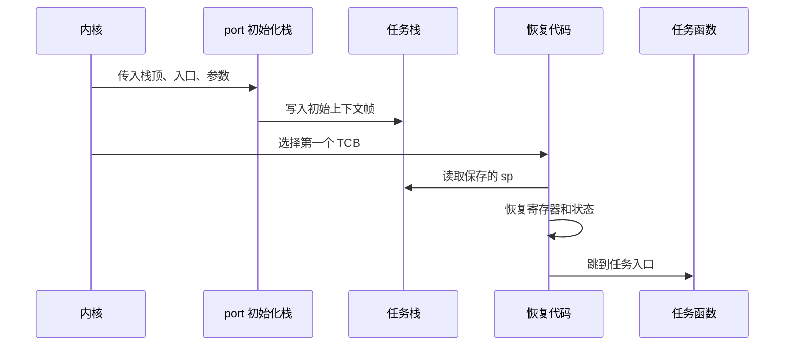
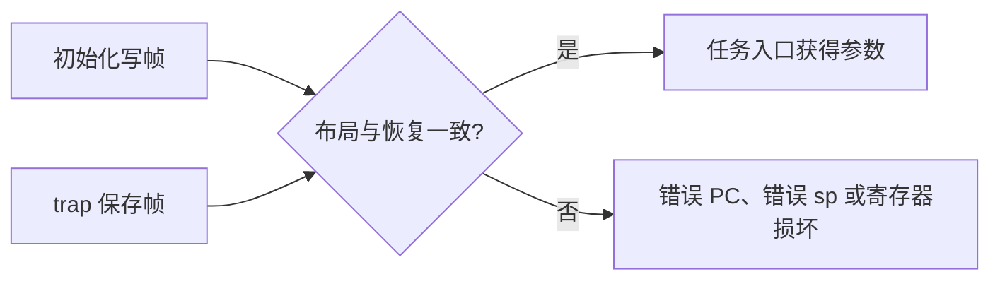
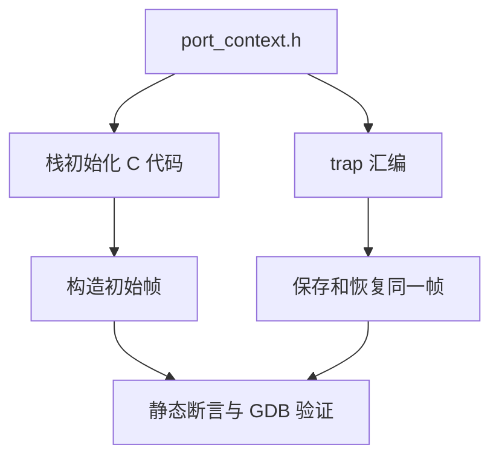
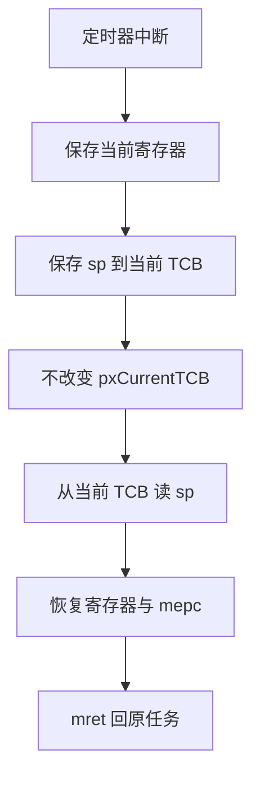
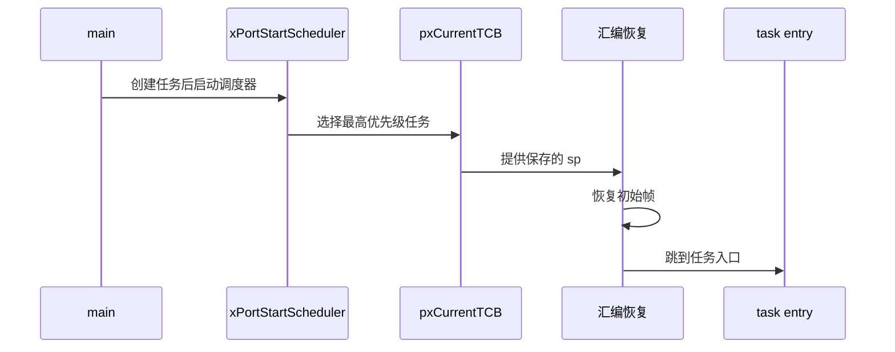
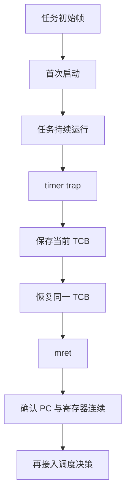

FreeRTOS 内核负责就绪列表、延时列表、队列和任务状态。

它并不天然知道某个 RISC-V 核该如何保存寄存器，也不知道定时器比较寄存器在哪里。

这部分工作由 port 层完成。

本篇从零建立一个教学 port 的边界。

目标不是替代上游 port。

目标是让“任务为什么能从自己的函数入口开始运行，以及为什么中断返回能回到另一个任务”变得可读、可验证。

FreeRTOS 上游将通用 RISC-V 汇编放在 `portable/GCC/RISC-V/portASM.S`，并通过芯片特定扩展头处理定时器和附加寄存器差异。[FreeRTOS RISC-V portASM.S](https://github.com/FreeRTOS/FreeRTOS-Kernel/blob/main/portable/GCC/RISC-V/portASM.S)

这正是本文的设计原则：通用 ABI 逻辑与 QEMU `virt` 平台逻辑分层。

## 1. port 层是内核与硬件状态之间的契约

FreeRTOS 内核需要几个由 port 提供的能力。

它需要创建任务时构造初始栈帧。

它需要启动调度器时恢复第一个任务的上下文。

它需要在 tick 中断时保存当前任务、调用内核决策、恢复选中的任务。

它还需要临界区屏蔽与恢复中断。



内核不应直接写 QEMU CLINT 的 MMIO 地址。

反过来，汇编 trap 入口也不应理解任务链表。

两者通过少量稳定函数和共享符号连接。

对于单核教学实验，最关键的共享项是当前 TCB 指针和 TCB 中第一项保存的任务栈指针。



“TCB 第一个成员是栈顶指针”是 FreeRTOS port 的常见约定。

它让汇编可以用固定偏移取得当前任务栈。

如果项目采用不同布局，汇编偏移与 C 结构必须一起调整并由编译期断言保护。

不能只修改 C 类型定义后继续相信旧汇编。

## 2. 任务并不是从 `main` 返回后自然出现

任务函数由 `xTaskCreate` 一类 API 注册。

内核为它分配栈，并要求 port 在该栈上伪造一份“刚从 trap 或函数调用恢复”的状态。

当调度器第一次选择它时，恢复代码把 `sp` 指向这份状态。

然后把寄存器和程序位置恢复，CPU 就像从一个中断返回那样开始执行任务函数。



初始帧的布局必须与真正的恢复顺序完全一致。

这不是“用几个占位值填栈”的松散约定。

保存代码从哪个偏移加载 `mstatus`、`ra` 和 `a0`，初始化就必须在相同偏移写入对应值。



因此，先画帧，再写汇编。

在 RV64、无浮点和无向量任务的教学模型中，可使用如下概念布局。

| 栈中项目 | 初始任务应填的内容 | trap 保存时的内容 |
| --- | --- | --- |
| 状态字 | M 态返回配置，预期中断状态 | 当前 `mstatus` |
| 返回 PC | 任务函数入口或包装器 | 被打断的 `mepc` |
| `ra` | 任务返回处理函数 | 当前返回地址 |
| `a0` | 任务参数 | 当前参数寄存器 |
| `s0-s11` | 调试填充值或零 | 被调用者保存寄存器 |
| 临界区嵌套值 | 零 | 当前任务的嵌套状态 |

实际帧还可能包括浮点、向量、PMP、扩展 CSR 或芯片私有状态。

是否保存这些状态必须取决于编译选项、硬件扩展与任务模型。

## 3. 先定义可审计的帧偏移

让 C 和汇编共享数字时，最好只由一个头文件产生偏移定义。

教学代码可以把帧定义收在汇编可包含的头中。

```c
/* port_context.h: 与汇编保存/恢复顺序一起维护 */
#define PORT_WORD_BYTES        8
#define PORT_CTX_RA            0
#define PORT_CTX_MSTATUS       8
#define PORT_CTX_MEPC          16
#define PORT_CTX_A0            24
#define PORT_CTX_S0            32
#define PORT_CTX_CRITICAL      128
#define PORT_CTX_BYTES         144
```

这些数值只是一个示例布局。

它们不能直接替换为上游 port 的真实偏移。

上游 port 支持的寄存器集合、特性开关和任务返回包装器都可能不同。



若用 C 结构表示帧，需谨慎面对对齐、填充和编译器 ABI。

汇编常要求精确的连续偏移。

更稳妥的方式是让 C 初始化逻辑按 word 索引写入，而由测试和 `static_assert` 验证总长度。

```c
typedef uintptr_t port_word_t;

port_word_t *port_initialise_stack(
    port_word_t *top,
    void (*entry)(void *),
    void *argument,
    void (*task_return)(void)) {
  port_word_t *sp = top;

  sp = (port_word_t *)((uintptr_t)sp & ~(PORT_WORD_BYTES - 1U));
  sp = (port_word_t *)((uintptr_t)sp & ~0xFUL);
  sp -= PORT_CTX_BYTES / PORT_WORD_BYTES;

  sp[PORT_CTX_RA / PORT_WORD_BYTES] = (port_word_t)task_return;
  sp[PORT_CTX_MEPC / PORT_WORD_BYTES] = (port_word_t)entry;
  sp[PORT_CTX_A0 / PORT_WORD_BYTES] = (port_word_t)argument;
  sp[PORT_CTX_MSTATUS / PORT_WORD_BYTES] = initial_mstatus();
  sp[PORT_CTX_CRITICAL / PORT_WORD_BYTES] = 0U;
  return sp;
}
```

任务栈顶通常向下生长。

因此初始化先将 top 对齐，再减去完整帧大小。

传给 TCB 的结果是恢复时应使用的最低地址，而不是分配区最高地址。

## 4. `mstatus` 决定任务以怎样的中断状态开始

首次恢复不一定使用 `mret`。

有些 port 在启动第一个任务时直接恢复寄存器并 `ret`，有些路径由 trap 返回统一处理。

无论使用哪条路径，初始状态字都必须使任务在预期的特权级和中断状态下运行。

在 M 态 FreeRTOS 教学实验中，任务通常以 M 态运行，并在调度器准备完毕后允许机器中断。


不要把 `mstatus` 当成一个可以直接写固定魔数的普通变量。

它的字段随特权架构和实现特性有约束。

在自己的目标 ISA、特权级与恢复指令确定前，应通过命名掩码组合，而不是复制某一份 port 的常量。

```c
static uintptr_t initial_mstatus(void) {
  uintptr_t status = read_mstatus();

  status &= ~MSTATUS_MIE;
  status |= MSTATUS_MPIE;
  status = (status & ~MSTATUS_MPP_MASK) | MSTATUS_MPP_MACHINE;
  return status;
}
```

上例表达的是意图。

实际掩码来自所使用的特权架构头文件和编译目标。

如果系统由 OpenSBI 管理 M 态，S 态 RTOS 不应照搬这段 M 态代码。

## 5. 先实现“保存并恢复同一任务”

不要一开始就调用 `vTaskSwitchContext()`。

最小验证是：定时器进入 trap，保存当前寄存器，再恢复同一个 TCB 的同一帧，最后 `mret` 回到原来的执行点。

这称为自恢复测试。

它将 trap 机制、帧偏移和栈对齐与调度决策分开。



保存序言需要在使用临时寄存器前保护足够的现场。

恢复尾声则应在最后恢复将被当作地址或跳转依据的寄存器。

下面只展示结构。

```asm
trap_save_current:
    addi sp, sp, -PORT_CTX_BYTES
    sd ra, PORT_CTX_RA(sp)
    csrr t0, mstatus
    sd t0, PORT_CTX_MSTATUS(sp)
    csrr t0, mepc
    sd t0, PORT_CTX_MEPC(sp)
    sd a0, PORT_CTX_A0(sp)
    sd s0, PORT_CTX_S0(sp)
    /* 保存所有本 port 承诺的其余寄存器 */
    la t0, pxCurrentTCB
    ld t0, 0(t0)
    sd sp, 0(t0)
    ret
```

在这个序言中，`t0` 的原值也必须是保存集的一部分。

代码片段省略它只是为了聚焦顺序。

实际实现必须完整保存自己会破坏的寄存器，并与初始帧布局保持一致。

## 6. 首个任务启动与 trap 返回有不同的入口条件

第一次启动时，CPU 不一定刚从中断进来。

此时没有一份硬件自动保存的 `mepc` 可取。

port 需要从 TCB 取出初始帧，并按照其设计选择跳转方式。

```asm
xPortStartFirstTask:
    la t0, pxCurrentTCB
    ld t0, 0(t0)
    ld sp, 0(t0)
    ld t1, PORT_CTX_MSTATUS(sp)
    csrw mstatus, t1
    ld a0, PORT_CTX_A0(sp)
    ld ra, PORT_CTX_RA(sp)
    ld t2, PORT_CTX_MEPC(sp)
    addi sp, sp, PORT_CTX_BYTES
    jr t2
```

这段教学代码选择跳到保存的任务入口。

真实 port 还需恢复全部寄存器，并处理初始中断状态与任务返回路径。

上游 RISC-V port 会把任务参数、返回地址、状态和寄存器放到和恢复逻辑匹配的栈帧中。[FreeRTOS RISC-V 端口实现](https://github.com/FreeRTOS/FreeRTOS-Kernel/blob/main/portable/GCC/RISC-V/portASM.S)



若任务函数意外返回，应跳到一个明确的 task return handler。

该处理函数可以断言、删除任务或停机。

绝不能返回到没有意义的地址。

## 7. 临界区先定义语义，再写 CSR 指令

单 hart 教学模型中，临界区通常通过暂时关闭机器中断实现。

但简单地 `csrc mstatus, MIE` 再 `csrs` 恢复，会在嵌套临界区中错误地过早打开中断。

port 应维护每任务临界区嵌套计数，或保存之前的中断状态。

```c
void port_enter_critical(void) {
  const uintptr_t old = interrupts_disable_and_save();

  if (critical_nesting == 0U) {
    saved_interrupt_state = old;
  }
  critical_nesting++;
}

void port_exit_critical(void) {
  configASSERT(critical_nesting > 0U);
  critical_nesting--;

  if (critical_nesting == 0U) {
    interrupts_restore(saved_interrupt_state);
  }
}
```

当任务切换时，`critical_nesting` 是任务上下文的一部分。

它必须随栈帧或 TCB 保存。

否则一个任务在临界区中切出，另一个任务可能错误继承它的中断屏蔽状态。

## 8. 验证路线与失败模式

先验证没有调度切换的自恢复路径。

再验证单个任务每次 tick 都能继续执行。

最后才允许 tick 调用内核选择另一个任务。



| 症状 | 首先检查 | 常见原因 |
| --- | --- | --- |
| 任务一启动就跳到异常地址 | 初始 `mepc`/入口、帧偏移 | 初始化与恢复布局不同 |
| trap 返回后寄存器被破坏 | 保存集合 | 汇编使用了未保存寄存器 |
| 调用 C 函数后栈异常 | `sp` 对齐 | 初始栈或 trap 栈未保持 16 字节对齐 |
| 中断永远关闭 | 初始状态与嵌套计数 | `mstatus` 配置错误或临界区未退出 |
| 任务返回后死机 | `ra` 与返回包装器 | 未为任务函数设置返回处理地址 |
| 切换后临界区行为异常 | 每任务嵌套状态 | 把状态放成了全局变量 |

GDB 应同时观察 TCB 保存的 `sp`、当前 `sp`、`mepc` 与一个长期寄存器。

每次自恢复后，它们应回到同一任务可预期的位置。

## 9. 练习与验收

### 练习

1. 为初始帧中的每个 word 写出名称和偏移，再把恢复汇编逐项对应。
2. 创建一个只递增计数器的任务，在不调用调度切换时验证 timer trap 自恢复。
3. 故意交换 `mepc` 与 `ra` 的初始化偏移，使用 GDB 解释首次启动为何失败。
4. 在任务中设置 `s0` 为已知值，确认一次 trap 保存/恢复后该值仍存在。
5. 在嵌套两层临界区后只退出一层，验证全局中断不会过早打开。
6. 为任务返回包装器增加断言和任务名记录，避免任务返回被误判为普通函数返回。

### 本篇验收清单

- [ ] 能说明 FreeRTOS 内核与 RISC-V port 层各自拥有的责任。
- [ ] 能画出任务初始帧，并让它与保存/恢复顺序一一对应。
- [ ] 能说明为何 TCB 保存的 `sp` 是一次上下文的唯一定位点。
- [ ] 能在 RV64 上保持任务栈和 trap 调用点的 16 字节对齐。
- [ ] 能设置任务入口、参数、返回包装器和初始状态字。
- [ ] 能先完成同任务的 trap 自恢复，再接入调度器。
- [ ] 能把临界区嵌套状态作为任务上下文的一部分保存。
- [ ] 不会把 QEMU `virt` 的 timer 与寄存器差异写死到通用 port 层。

一个可移植的 port 不是一段神秘的上下文切换汇编。

它是一份关于“哪些状态必须属于任务，哪些状态属于平台”的精确契约。

> 🏷️ RISC-V · FreeRTOS · port · 上下文切换 · 任务栈 · trap · QEMU
