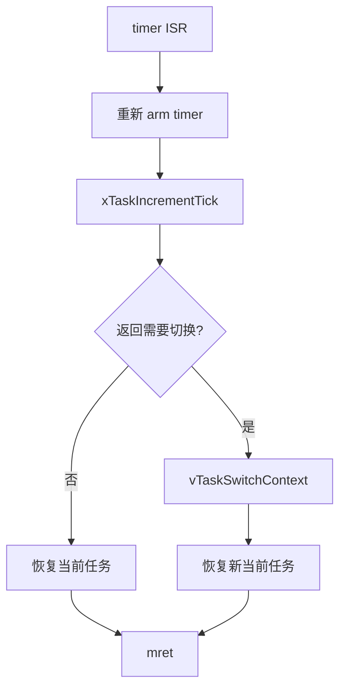
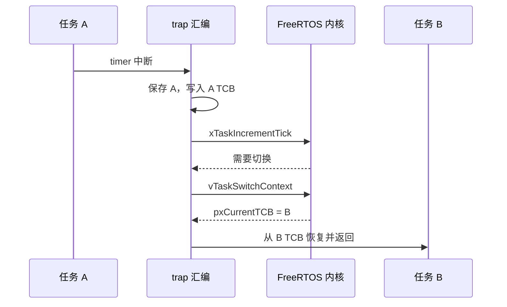
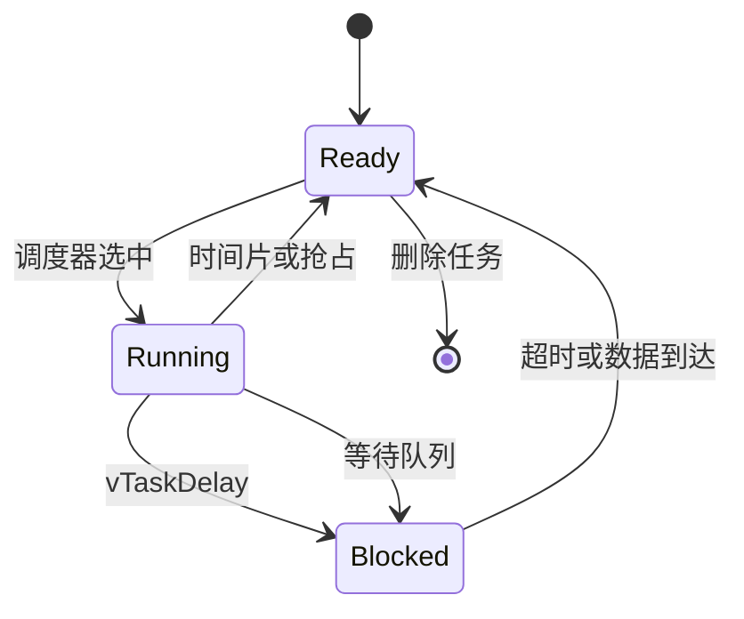
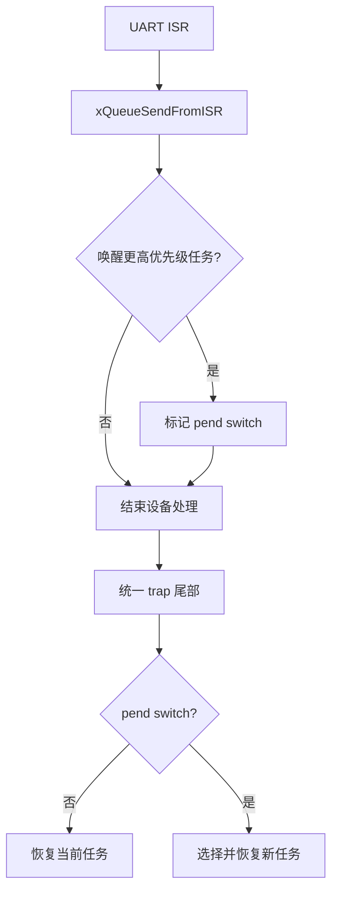
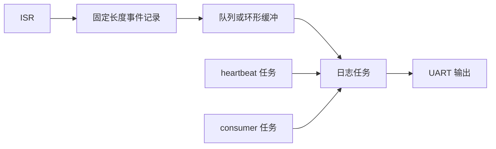
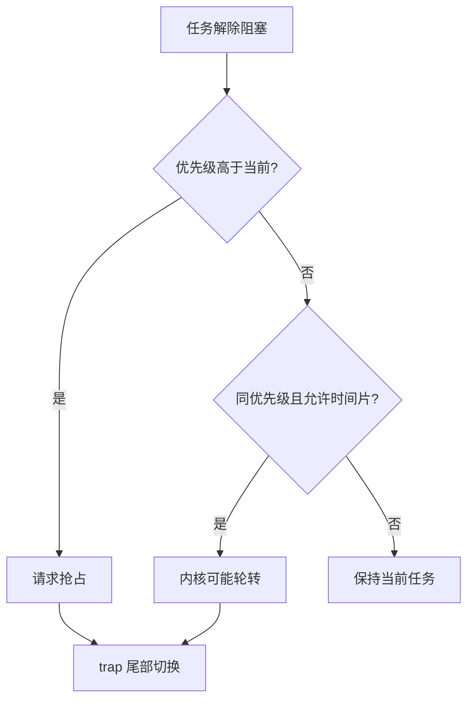
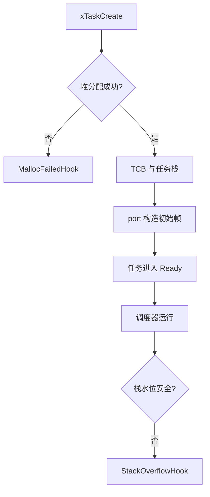

第 07 篇已经构造了任务初始栈帧，并验证 trap 可以保存和恢复同一个任务。

现在才把 `vTaskSwitchContext()` 接入返回路径。

这一步不应被理解成“中断函数里调用了调度器，所以多任务就完成了”。

真正的多任务闭环要同时满足：tick 到达、当前上下文被保存、内核选择新 TCB、新任务上下文被恢复、任务状态变化可观察。

本文继续使用 QEMU `virt` 的单 hart M 态模型。

QEMU 的 `virt` 是虚拟平台；实际芯片上的 timer、外部中断和 cache/PMP 约束需要在对应 BSP 中重新核对。[QEMU RISC-V 系统模拟](https://qemu.readthedocs.io/en/master/system/target-riscv.html)

## 1. 任务切换发生在两段状态之间

当前任务正常执行时，寄存器属于它。

timer trap 到来后，硬件和汇编入口接管控制流。

port 把当前寄存器写到当前 TCB 所指任务栈。

内核更新 `pxCurrentTCB`。

port 再从新 TCB 指向的栈读回寄存器。

`mret` 或对应恢复跳转后，CPU 已经以新任务的状态继续。


调度器只做“选择谁运行”的内核决策。

它不会自动移动 CPU 寄存器。

汇编 port 只做“保存和恢复哪个 TCB 所表示的状态”。

它不应自行遍历优先级列表决定下一个任务。

这个责任分界让问题可以被拆成内核问题或机器状态问题。

## 2. 只在需要时请求切换

每个 timer tick 都会推进内核时基。

但不一定每个 tick 都必须切换任务。

时间片、同优先级就绪任务、延时到期和更高优先级任务解除阻塞都会影响是否需要切换。

port 的 timer ISR 需要接收一个“是否应切换”的结果，而不是自行猜测。



教学 port 可把这段连接写得非常直白。

```c
void machine_timer_interrupt(void) {
  const uint64_t now = timer_read_mtime();
  bool need_switch = false;

  timer_advance_deadline_past(now);

  if (xTaskIncrementTick() != pdFALSE) {
    need_switch = true;
  }

  if (need_switch) {
    vTaskSwitchContext();
  }
}
```

这段 C 代码本身还没有完成寄存器切换。

trap 汇编应在 `machine_timer_interrupt()` 返回后，根据当前 `pxCurrentTCB` 恢复相应栈帧。

因此在 ISR 中调用 `vTaskSwitchContext()` 前，当前任务的 `sp` 必须已经保存。



如果保存动作放在 `vTaskSwitchContext()` 之后，内核已经指向 B，而汇编却会把 A 的状态写入 B 的栈。

这种错误常表现为第一次切换看似成功，第二次切换后寄存器和栈同时损坏。

## 3. 任务函数应展示不同的阻塞行为

用两个“无限打印”任务证明不了调度语义。

它只证明两个循环某种程度上交替。

更好的教学负载包含一个周期任务、一个事件处理任务和一个空闲观察点。

```c
static QueueHandle_t rx_queue;

static void heartbeat_task(void *arg) {
  (void)arg;

  for (;;) {
    board_led_toggle();
    vTaskDelay(pdMS_TO_TICKS(500));
  }
}

static void consumer_task(void *arg) {
  uint8_t byte;
  (void)arg;

  for (;;) {
    if (xQueueReceive(rx_queue, &byte, portMAX_DELAY) == pdPASS) {
      protocol_consume(byte);
    }
  }
}
```

`heartbeat_task` 通过延时进入 Blocked 状态。

`consumer_task` 通过队列等待进入 Blocked 状态。

当二者都阻塞，Idle 任务获得 CPU。

这比靠不同优先级不停忙等更能观察内核状态迁移。



若任务拥有外设寄存器或共享缓冲，也不能只因为它会阻塞就忽略同步。

阻塞时系统会运行别的任务。

共享资源的所有权必须明确。

## 4. ISR 与任务之间采用专用的 FromISR 接口

外部 UART 中断接收字节时，常见模式是 ISR 放入队列，任务在普通上下文处理协议。

FreeRTOS 为这类操作提供带 `FromISR` 后缀的 API。

它们可以返回“唤醒了更高优先级任务”的信息。

port 再将该信息合并到本次 trap 是否切换的决定中。

```c
void uart_external_interrupt(void) {
  BaseType_t wake_higher = pdFALSE;

  while (uart_rx_ready()) {
    const uint8_t byte = uart_read_byte();
    xQueueSendFromISR(rx_queue, &byte, &wake_higher);
  }

  if (wake_higher != pdFALSE) {
    port_request_switch_from_isr();
  }
}
```

`port_request_switch_from_isr()` 不应该在任意位置直接跳转到其他任务。

它应记录本次 trap 需要切换。

真正的保存、内核选择和恢复仍由统一的 trap 尾部完成。



这样 timer 与 UART 等不同中断源都能复用相同的切换收尾。

不要让每个设备 ISR 各自维护一套寄存器恢复代码。

那样很容易出现不同 ISR 保存集不一致的问题。

## 5. QEMU 串口日志要有“任务身份”和“时间身份”

在多任务系统里，一串 `hello` 输出没有诊断价值。

日志至少应包含 tick、任务名或任务句柄、事件类型和单调序号。

```c
void app_log(const char *event) {
  log_printf("tick=%lu task=%s event=%s\n",
             (unsigned long)xTaskGetTickCount(),
             pcTaskGetName(NULL),
             event);
}
```

日志 API 必须遵守上下文。

普通任务可用的格式化输出通常不应在 ISR 中调用。

中断只写入固定长度事件记录或递增计数，之后由任务格式化。



对于最初验证，甚至可以只让每个任务翻转不同的内存标志，并由单一观察任务定期输出汇总。

这样能避免 UART 带宽成为调度实验的主导变量。

## 6. 优先级和时间片是不同的维度

较高优先级的 Ready 任务通常会抢占较低优先级任务。

同优先级任务是否轮转，取决于配置和内核策略。

不要把“每个 tick 都切换”硬编码为 port 行为。

port 应只响应内核的调度决定。



为实验设计三组任务更容易验证。

第一组同优先级、短 CPU 工作、无阻塞，用于观察时间片。

第二组低优先级忙循环与高优先级延时任务，用于观察高优先级唤醒后的抢占。

第三组队列消费者与 ISR 生产者，用于观察事件唤醒。

每次只改变一项配置。

不要把所有实验混在同一个无限日志程序里。

## 7. 空闲任务和内存分配是移植验收的一部分

FreeRTOS 调度器通常需要 Idle 任务。

如果启用软件定时器，还会有 Timer Service Task。

启动调度器前，应检查任务创建返回值、堆实现选择、空闲任务栈和断言钩子。

```c
void app_create_tasks(void) {
  configASSERT(xTaskCreate(heartbeat_task, "beat", 256, NULL, 2, NULL) == pdPASS);
  configASSERT(xTaskCreate(consumer_task, "rx", 384, NULL, 3, NULL) == pdPASS);
}

void vApplicationMallocFailedHook(void) {
  taskDISABLE_INTERRUPTS();
  panic("FreeRTOS heap exhausted");
}

void vApplicationStackOverflowHook(TaskHandle_t task, char *name) {
  (void)task;
  (void)name;
  taskDISABLE_INTERRUPTS();
  panic("task stack overflow");
}
```

传给 `xTaskCreate` 的栈深度单位由 port 定义，通常是 `StackType_t` 数量而不是字节数。

RV64 中一个 word 比 RV32 大。

同一个数值在两种目标上消耗的字节数可能不同。

这是跨架构移植时易被忽略的内存差异。



在 QEMU 中跑通不表示任务栈尺寸已经适合真实 workload。

应启用水位检查，并把峰值记录进入测试报告。

## 8. 一个最小的启动顺序

把平台初始化、内核对象与调度器分成明确阶段。

```c
int main(void) {
  board_early_init();
  trap_install_machine_vector();
  timer_platform_init_from_fdt();
  uart_platform_init_from_fdt();

  rx_queue = xQueueCreate(64, sizeof(uint8_t));
  configASSERT(rx_queue != NULL);

  app_create_tasks();
  timer_prepare_first_deadline();

  vTaskStartScheduler();
  panic("scheduler returned");
}
```

`vTaskStartScheduler()` 返回通常表示启动失败或调度器被显式停止。

在裸机应用中把其后的路径标为 panic，有助于避免继续执行普通初始化代码。

由 port 启动第一个任务时，机器中断的放行顺序必须与第 07 篇的初始状态设计保持一致。

## 9. 先检查任务状态，再检查输出顺序

QEMU 串口输出的字符顺序会受缓冲与调试影响。

测试重点应是状态与不变量。

| 目标 | 建议证据 | 不应依赖 |
| --- | --- | --- |
| 初次调度 | 任务入口断点与 TCB 指针 | 第一行日志的先后 |
| tick 生效 | `xTaskGetTickCount` 单调增加 | 固定墙钟延迟 |
| 延时阻塞 | 任务状态和 Ready list | 忙等循环打印 |
| 事件唤醒 | queue 计数与 consumer 状态 | ISR 内格式化日志 |
| 抢占发生 | 切换前后 `pxCurrentTCB` | 某一轮字符恰好交错 |
| 栈安全 | high water mark 与断言 | “暂时没崩溃” |

GDB 中可在 trap 保存点、`vTaskSwitchContext` 和两个任务函数分别断下。

比较 `pxCurrentTCB`、当前 `sp`、保存的任务 `sp` 和 `mepc`。

```text
(gdb) break vTaskSwitchContext
(gdb) break heartbeat_task
(gdb) break consumer_task
(gdb) continue
(gdb) p/x pxCurrentTCB
(gdb) info registers sp mepc mstatus
```

符号、优化等级和 port 实现都会影响可见变量名。

调试脚本应从当前 ELF 的符号表生成或核对，不应固定地址偏移。

## 10. 常见失败模式

| 症状 | 首先检查 | 典型原因 |
| --- | --- | --- |
| 只运行第一个任务 | timer trap 与 `xTaskIncrementTick` | tick 未到、未放行 MTIE 或没有请求切换 |
| 第一次切换后崩溃 | 保存 A 与恢复 B 的顺序 | 当前 `sp` 在更新 TCB 后才保存 |
| 高优先级任务不抢占 | FromISR 唤醒标志、内核配置 | 忽略 `wake_higher` 或未在 trap 尾部切换 |
| UART 一来系统卡住 | ISR 工作量与设备确认 | ISR 内做协议/打印，或未清设备原因 |
| 任务偶发数据损坏 | 队列与共享资源 | 从 ISR 使用了错误 API，或未定义所有权 |
| 切换后中断状态错误 | 每任务临界区状态 | 嵌套计数没有随任务保存 |
| 创建任务失败 | heap 与栈深度单位 | 栈按字节估算、堆不足或配置不匹配 |

出现故障时先退回到第 07 篇的自恢复路径。

只要同一任务保存/恢复仍失败，就还不应检查 FreeRTOS 调度策略。

## 11. 练习与验收

### 练习

1. 创建两个同优先级短任务，分别记录运行次数，验证时间片策略由内核配置决定。
2. 创建一个低优先级忙循环和一个高优先级周期任务，观察高优先级任务从延时恢复后的切换。
3. 用 UART ISR 向队列投递字节，验证 consumer 被唤醒时的 trap 尾部切换。
4. 故意在 ISR 中改用普通 `xQueueSend`，确认项目的断言或上下文检查会拒绝它。
5. 逐步降低一个任务的栈深度，记录 high water mark 并在溢出钩子处断下。
6. 在任意任务的嵌套临界区中触发调度，验证恢复后中断状态与嵌套计数匹配。

### 本篇验收清单

- [ ] 能指出 tick、保存当前上下文、内核选任务、恢复新上下文的先后关系。
- [ ] 能说明 `vTaskSwitchContext()` 不负责直接保存 CPU 寄存器。
- [ ] 能让 task delay 和队列等待产生可观察的 Blocked 到 Ready 状态迁移。
- [ ] 能在 ISR 中使用 FromISR API，并把切换请求交给统一 trap 尾部。
- [ ] 能区分优先级抢占与同优先级时间片。
- [ ] 能为 Idle、堆分配失败和栈溢出建立显式处理。
- [ ] 能用 TCB、`sp`、`mepc` 和 tick 值验证调度，而非只看串口文本。
- [ ] 能把 QEMU 结果限定为该平台描述与该 port 配置下的结果。

多任务不是若干函数并排运行。

它是每个任务各自持有可恢复机器状态，并由内核在明确时刻改变“当前状态归属”的过程。

> 🏷️ RISC-V · FreeRTOS · 多任务 · 调度 · 队列 · 中断 · QEMU
