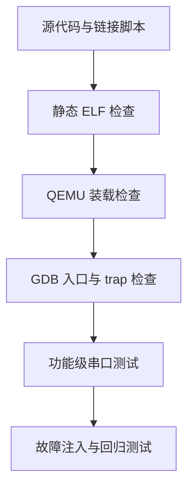
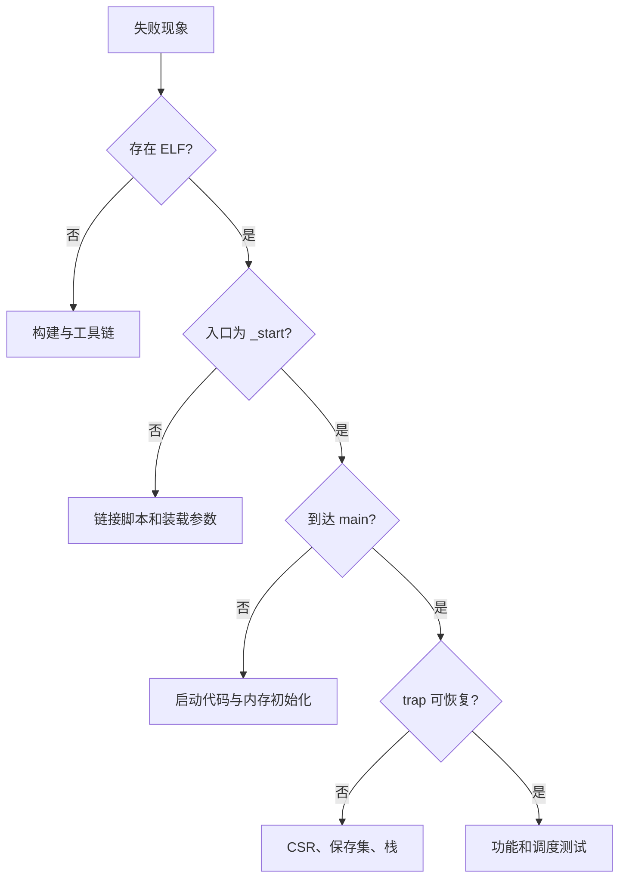
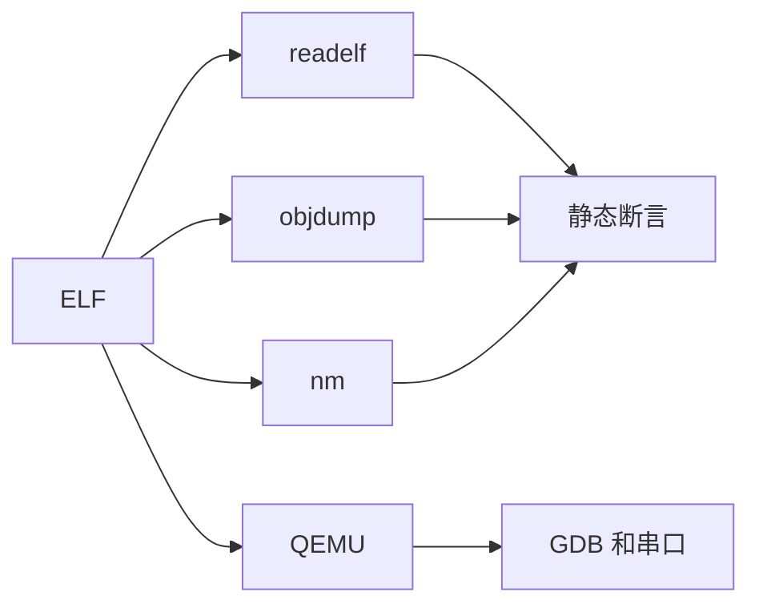
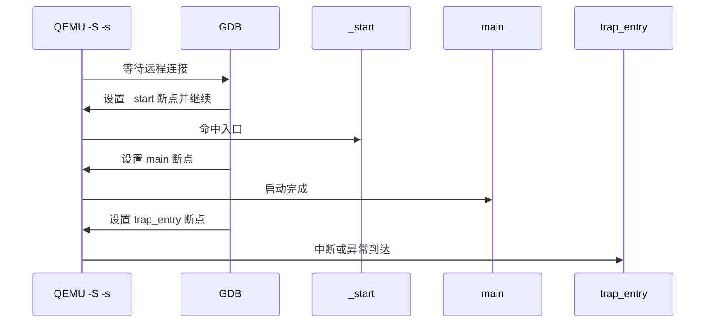
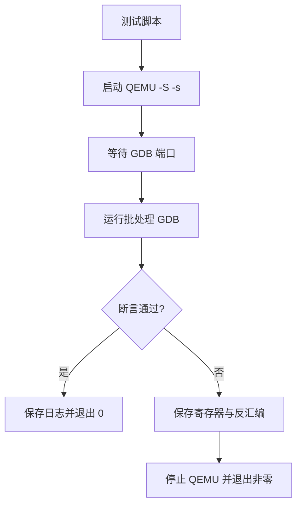
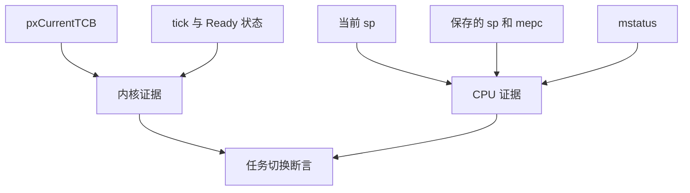
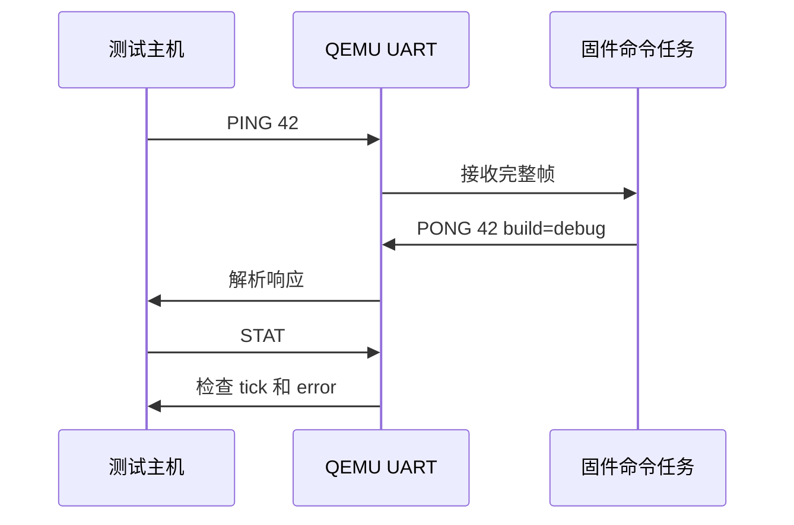
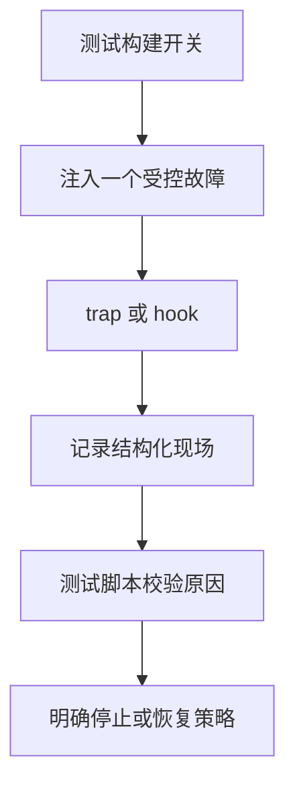

“QEMU 窗口没有退出”不是验证。

“串口打印了一次 hello”也不是验证。

裸机和 RTOS 程序需要的证据，至少覆盖静态镜像、复位入口、trap 行为、任务切换、外设事件和失败路径。

本篇将调试与测试组织成可以重跑的闭环。

QEMU RISC-V 系统模拟要求显式选择机器模型；调试脚本应把 `-M virt`、固件选择和 ELF 路径写入受版本控制的命令，而不是依赖终端历史。[QEMU RISC-V 系统模拟](https://qemu.readthedocs.io/en/master/system/target-riscv.html)

## 1. 测试先回答“在哪一层失败”

最低层是静态文件检查。

它不启动 CPU，但能证明入口、段、符号和反汇编符合构建预期。

中间层是 QEMU 加载与 GDB 远程调试。

它能观察第一条指令、CSR 和内存变化。

上层是串口协议、任务行为和故障注入。

每一层失败时，都应该缩小问题，而不是把所有输出混到一次手工运行中。



构建失败属于工具链或配置问题。

ELF 静态检查失败多属于链接、段或符号问题。

GDB 到不了 `_start` 多属于装载和入口问题。

能到 `_start` 却到不了 `main` 多属于启动初始化问题。

能运行单任务却切换后崩溃，则优先看上下文帧与 trap 尾部。



## 2. 让构建产物成为测试输入

一个裸机构建至少应保留 ELF、map 文件和反汇编。

可选再生成 raw binary、DTB 快照和符号表文本。

```cmake
add_custom_command(TARGET riscv-qemu.elf POST_BUILD
  COMMAND ${CMAKE_OBJDUMP} -d -M no-aliases $<TARGET_FILE:riscv-qemu.elf>
          > ${CMAKE_CURRENT_BINARY_DIR}/riscv-qemu.dis
  COMMAND ${CMAKE_NM} -n $<TARGET_FILE:riscv-qemu.elf>
          > ${CMAKE_CURRENT_BINARY_DIR}/riscv-qemu.sym
  VERBATIM
)
```

不同 CMake 生成器对 shell 重定向的处理不相同。

生产项目可改为独立 CMake 脚本或由测试框架读取工具输出。

核心要求是测试消费确定的文件，而非从人的终端复制文本。



静态检查可以先用简单、稳定的断言。

```powershell
$elf = 'build/qemu-rv64-debug/riscv-qemu.elf'
$header = riscv64-unknown-elf-readelf -h $elf
$symbols = riscv64-unknown-elf-nm -n $elf

if ($header -notmatch 'RISC-V') { throw 'ELF machine is not RISC-V' }
if ($symbols -notmatch '\b_start$') { throw 'missing _start' }
if ($symbols -notmatch '\btrap_entry$') { throw 'missing trap_entry' }
```

不要用完整反汇编文本的逐字匹配作为首选测试。

编译器版本、链接松弛和压缩指令都会改变文本细节。

更稳定的是断言关键符号、段边界、预期工具链架构和少数关键指令模式。

## 3. GDB 会话先停在确定的机器状态

QEMU 的 `-S` 让 CPU 在复位后暂停。

`-s` 默认在 TCP 1234 端口提供 GDB 服务器。

这能避免“程序在调试器连上前已经跑过入口”的竞态。

```powershell
qemu-system-riscv64 -M virt -bios none -nographic `
  -kernel build/qemu-rv64-debug/riscv-qemu.elf `
  -S -s
```

调试器使用同一个 ELF 获取符号与源行信息。

```text
riscv64-unknown-elf-gdb build/qemu-rv64-debug/riscv-qemu.elf
(gdb) target remote :1234
(gdb) break _start
(gdb) continue
(gdb) info registers pc sp ra
(gdb) x/8i $pc
```

先断 `_start`，再断 `main`，然后断 `trap_entry`。

这是从无运行时依赖到有中断依赖的顺序。



每一个断点都应有一条要验证的断言。

在 `_start` 处，确认 `pc` 位于 ELF 入口附近。

在 `main` 处，确认 `sp` 对齐且 `.bss` 变量为零。

在 `trap_entry` 处，确认 `mcause` 的中断位与预期来源一致。

## 4. 把 GDB 命令放进脚本

手工输入一长串命令很难复现。

将稳定检查收进 `tests/gdb/startup.gdb`。

```text
set pagination off
set confirm off
target remote :1234
break _start
continue
printf "PC at entry: %p\n", $pc
if (($sp & 15) != 0)
  echo stack is not aligned\n
  quit 1
end
break main
continue
printf "Reached main at %p\n", $pc
quit 0
```

然后由自动化命令统一拉起 QEMU、等待端口、调用 GDB、清理进程。



不要把端口已经被另一个 QEMU 占用误判为程序错误。

测试前应使用明确的端口选择和进程标识。

并行 CI 中可给每个 job 分配端口，或让驱动程序读取 QEMU 输出的连接信息。

## 5. 中断测试应证明状态链，而非只证明断点命中

定时器 trap 命中 `trap_entry` 只能证明硬件把控制流交给入口。

还需要验证 `mcause`、timer compare 更新、软件 tick 与恢复地址之间的关系。

```text
(gdb) break machine_timer_interrupt
(gdb) continue
(gdb) p/x $mcause
(gdb) p/x $mepc
(gdb) p/x next_deadline
(gdb) continue
```

断点会暂停 guest，因此不要用断点间的宿主墙钟时间评价 tick 精度。

应比较 guest `mtime`、deadline 和 tick 计数的单调关系。


外部中断测试还应覆盖 claim/complete。

为 UART 注入一个已知字节后，检查 PLIC source、接收缓冲长度和 consumer 任务的状态变化。

不要只断在 UART ISR 入口后就得出“队列可用”的结论。

## 6. FreeRTOS 测试需要同时观察内核与 CPU 状态

任务切换是两个模型的交点。

内核模型是 `pxCurrentTCB` 和任务状态。

CPU 模型是 `sp`、`mepc`、保存的寄存器和 `mstatus`。

缺少任意一边，都会让问题看起来像“偶发”。



一项可重复的测试可以安排两个任务在不同 tick 记录魔数。

任务 A 把 `s0` 设为 `0xA5A5`。

任务 B 把 `s0` 设为 `0x5A5A`。

发生多次抢占后，各任务仍应在自身上下文看到自己的值。

这比仅检查任务函数曾被调用，更直接检验被调用者保存寄存器是否穿越切换。

```c
static void task_a(void *arg) {
  (void)arg;
  set_s0_marker(0xA5A5U);
  for (;;) {
    configASSERT(get_s0_marker() == 0xA5A5U);
    taskYIELD();
  }
}
```

这个示例依赖编译器和内联汇编约束。

它应当是端口级测试，而不是普通应用业务代码。

## 7. 串口测试使用明确协议

人眼读日志适合探索。

回归测试更适合解析固定格式协议。

例如让固件接受 `PING`，回复带版本和校验的 `PONG`；接受 `STAT`，回复 tick、任务计数和错误位。

```text
host -> PING 42
target -> PONG 42 build=debug
host -> STAT
target -> STAT tick=1234 a=100 b=99 error=0
```

协议消息必须有超时、分隔符和错误码。

否则测试脚本会把半行输出、启动噪声或意外 trap 文本误当成功响应。



测试脚本应对输出保留原始副本。

失败时同时保存 QEMU 命令行、ELF SHA、DTB、串口日志和 GDB 批处理输出。

这些工件使一次失败可以被另一个开发者重放。

## 8. 故障注入让错误路径也有证据

只测正常路径会让 trap handler 中最重要的诊断代码长期没有执行。

教学项目可在受控编译开关下制造下面场景。

| 注入场景 | 预期证据 | 不能接受的行为 |
| --- | --- | --- |
| 非法指令 | `mcause` 与 `mepc` 记录 | 无声重启或无限打印 |
| 未注册 PLIC source | source ID 与 context 记录 | 不 complete 导致永久阻塞 |
| 任务栈接近边界 | high water mark 警报 | 静默覆盖相邻任务栈 |
| 堆分配失败 | MallocFailedHook | 继续创建半初始化任务 |
| timer deadline 在过去 | 统计并重新安排 | 中断无限重入 |

故障注入只能在隔离的测试构建中启用。

不要把故意非法指令混入发布固件路径。



## 9. 为回归测试定义稳定的通过条件

通过条件应该是可机器判断的，不是“输出看起来合理”。

一个基础矩阵可包含：

| 层级 | 通过条件 |
| --- | --- |
| 链接 | ELF 是目标 RISC-V 架构，包含 `_start`、`trap_entry`、`main` |
| 启动 | GDB 能依次停在 `_start` 与 `main` |
| 中断 | timer trap 命中，deadline 严格向未来推进 |
| 上下文 | 两个任务跨多次切换后保留自己的标记状态 |
| 同步 | UART 事件由 ISR 投递，任务收到完整字节序列 |
| 故障 | 受控非法事件产生可解析的结构化记录 |

每项通过条件都要有超时。

没有超时的自动化测试在固件死循环时只会卡住 CI。

超时本身也应输出已完成阶段，避免“超时”成为唯一信息。

## 10. 当前环境与可执行性边界

本文给出了 QEMU、GDB、交叉工具链存在时可执行的验证命令。

当前工作区没有安装 `qemu-system-riscv64`、RISC-V GNU 交叉编译器或相应 GDB。

因此本文在此仓库中只能做 Markdown 内容、链接和站点构建验证。

不应将文章通过静态检查解释为已经运行过 QEMU 测试。

当工具链准备好后，建议按本篇金字塔从静态 ELF 检查开始逐层启用。

## 11. 练习与验收

### 练习

1. 编写一个脚本，验证 ELF 中存在入口、trap 和两个任务符号。
2. 用 QEMU `-S -s` 与批处理 GDB 依次验证 `_start` 和 `main`。
3. 在 timer ISR 前后记录 `mtime` 与 deadline，校验 deadline 始终位于未来。
4. 设计两个任务的寄存器标记测试，跨 100 次切换检查上下文完整性。
5. 为 UART 命令任务定义 `PING` 和 `STAT` 协议，并让宿主脚本用超时检查响应。
6. 为一个受控异常定义结构化现场格式，并在测试中校验 cause、PC 与构建标识。

### 本篇验收清单

- [ ] 能按静态、QEMU/GDB、功能、故障注入的层次定位失败。
- [ ] 能保存 ELF、map、符号表、反汇编和 DTB 作为可重放工件。
- [ ] 能让 GDB 在 `_start`、`main` 与 trap 入口处验证明确断言。
- [ ] 能将 GDB 命令写入批处理脚本而非依赖手工输入。
- [ ] 能检查 timer 的 deadline、tick 和恢复地址之间的状态关系。
- [ ] 能同时观察 FreeRTOS 内核状态与 CPU 寄存器状态。
- [ ] 能使用串口协议与超时建立机器可判定的功能测试。
- [ ] 能明确区分本文测试步骤与当前工作区实际可运行的工具链范围。

调试不是一次偶然的单步操作。

测试也不是一份漂亮日志。

两者组合后，才是一条从 ELF 到任务状态、从异常现场到可重放证据的工程闭环。

> 🏷️ RISC-V · QEMU · GDB · 测试 · 调试 · FreeRTOS · 回归验证
