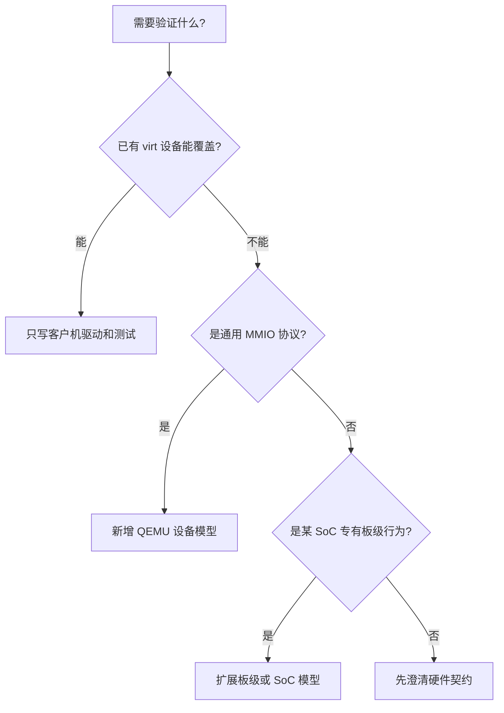
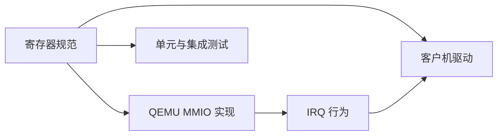
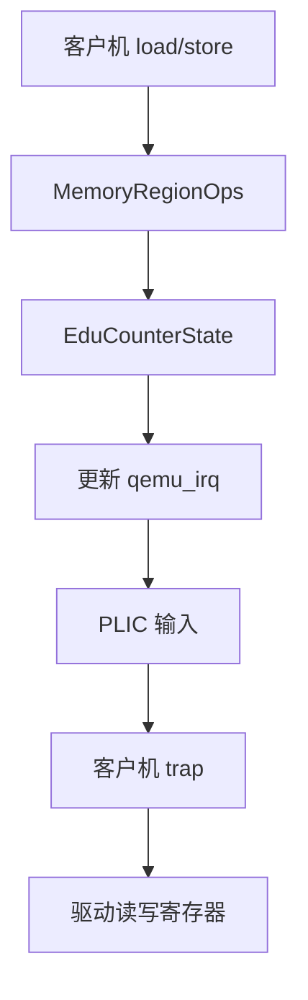
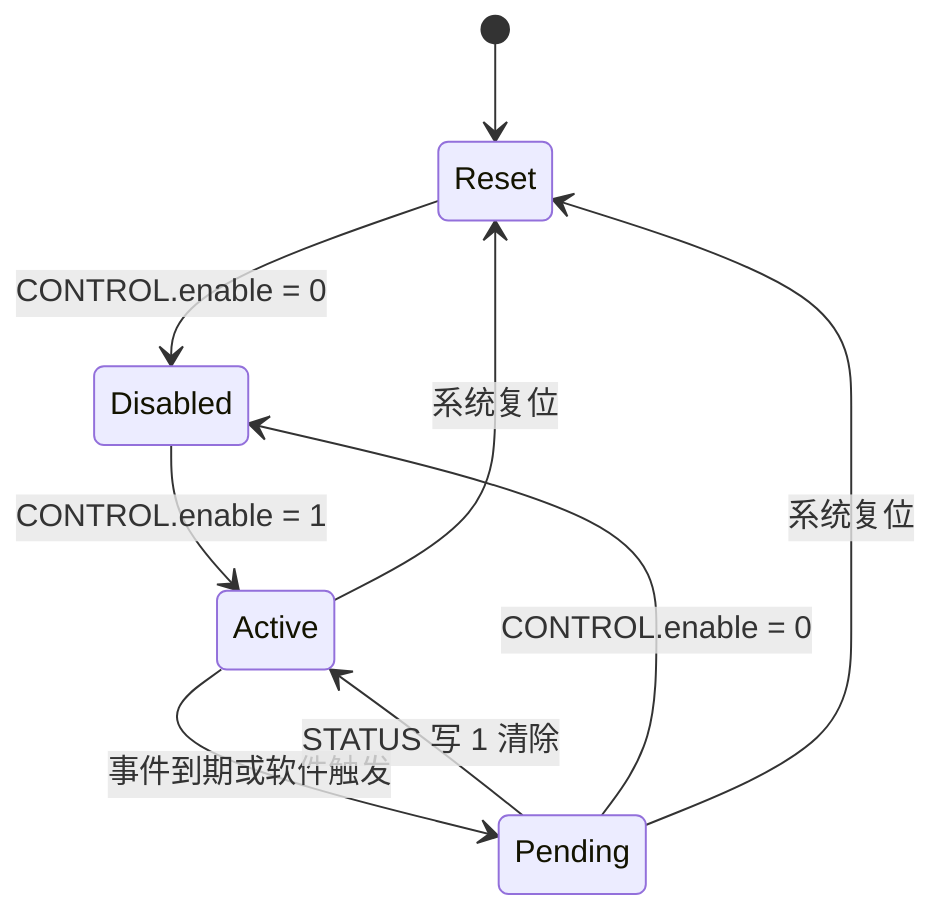
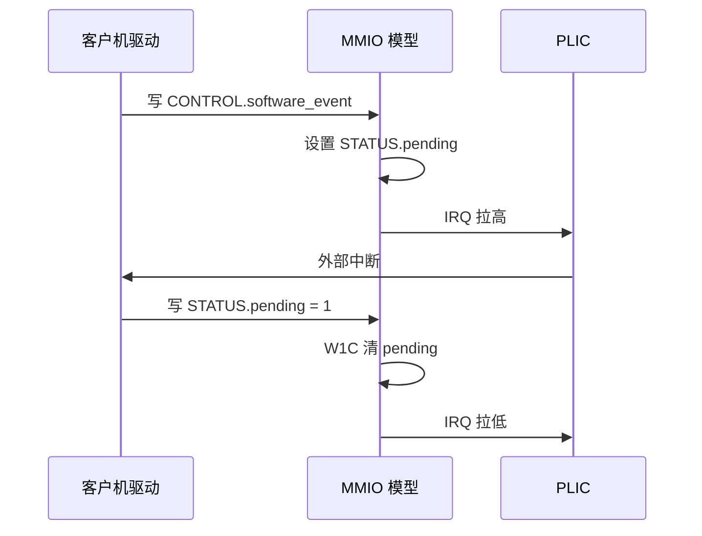
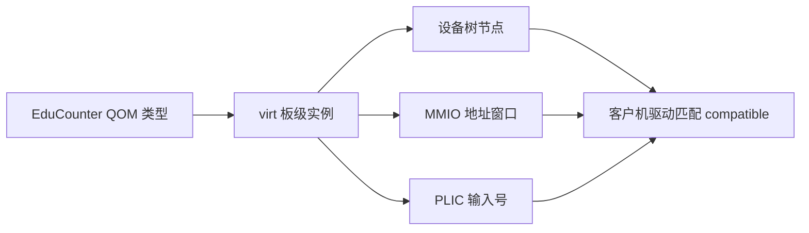
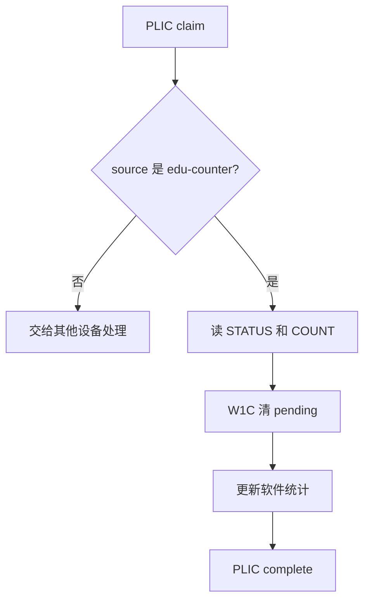
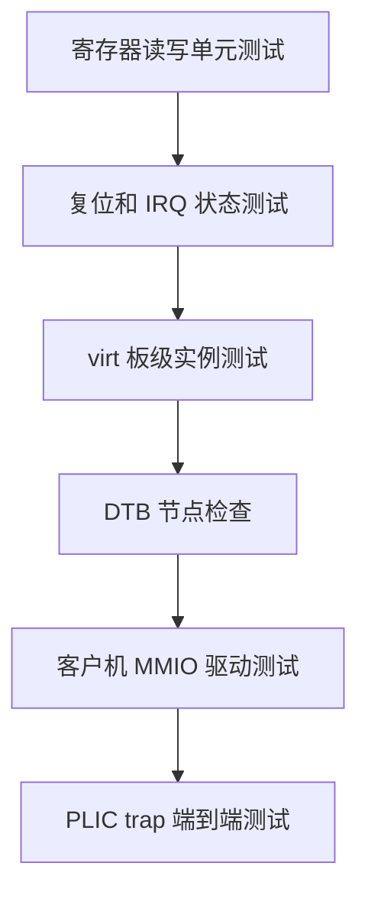

前面的实验把 QEMU `virt` 当作稳定的虚拟平台使用。

当你需要一个教学寄存器块、可控中断源或尚未存在的外设模型时，可以再向下一层走：修改 QEMU 源码。

这一步的价值不只是“造一个假外设”。

它会迫使你同时定义 MMIO 协议、复位语义、设备树、IRQ 线路和客户机驱动的边界。

QEMU `virt` 本身不是对真实硬件的复刻，它面向虚拟机，并提供可组合的通用设备。[QEMU virt 平台](https://qemu.readthedocs.io/en/master/system/riscv/virt.html)

因此，定制模型适合验证软件架构、寄存器协议和中断路径，不应用来替代真实 SoC 的电气与时序验证。

## 1. 先选择正确的扩展层

不是每个需求都需要改 QEMU 源码。

如果目标是验证裸机启动、UART、PLIC 或 virtio，已有 `virt` 设备通常已经足够。

如果目标是模拟一组固定 MMIO 寄存器，QEMU device model 是合适边界。

如果目标是验证某芯片的 boot ROM、时钟树或专有外设，应优先使用或补充对应板级模型。



最常见的浪费是为了“看见一个寄存器”复制一整块板级机器。

相反，只为一个专有硬件复位序列添加孤立通用设备，也会让模型脱离实际。

建模范围应由客户机软件真正需要观察的契约决定。

## 2. 设备规范先于 C 结构体

在写 QEMU 类和回调前，先写一页寄存器协议。

以一个教学用事件计数器为例。

| 偏移 | 名称 | 访问 | 语义 |
| --- | --- | --- | --- |
| `0x00` | `ID` | R | 固定设备标识 |
| `0x04` | `CONTROL` | R/W | bit0 使能，bit1 产生软件事件 |
| `0x08` | `COUNT` | R | 已处理事件计数 |
| `0x0C` | `STATUS` | R/W1C | bit0 表示 pending |
| `0x10` | `PERIOD` | R/W | 虚拟事件周期参数 |

必须同时写清未对齐访问、保留位、非法访问和复位值。

客户机驱动会依赖这些规则。

测试也需要根据它们定义期望。



不要从 host 的 C `struct` 内存布局反推客户机寄存器布局。

字节序、对齐、访问宽度和迁移格式都是不同问题。

MMIO 回调中应按 offset 明确处理每个寄存器。

## 3. 一个 QEMU 设备模型的最小组成

QEMU 设备通常使用 QOM 类型系统。

一个 sysbus MMIO 设备需要状态结构、realize、reset、MemoryRegionOps 和可选 IRQ。

下面是概念骨架，不是可直接编译的完整补丁。

```c
typedef struct EduCounterState {
    SysBusDevice parent_obj;
    MemoryRegion mmio;
    qemu_irq irq;
    uint32_t control;
    uint32_t status;
    uint32_t count;
    uint32_t period;
} EduCounterState;

static uint64_t edu_counter_read(void *opaque, hwaddr offset, unsigned size);
static void edu_counter_write(void *opaque, hwaddr offset, uint64_t value, unsigned size);
static void edu_counter_reset(DeviceState *dev);
static void edu_counter_realize(DeviceState *dev, Error **errp);
```

状态字段只保存设备可见且需要持久化的状态。

不应把每次访问可推导出的临时值无意义地塞进迁移状态。



`MemoryRegionOps` 应声明合理的最小和最大访问宽度。

若寄存器协议只支持 32 位访问，4 字节之外的访问应明确报错、掩码或按规范定义。

悄悄接受所有访问宽度会使驱动 bug 难以发现。

## 4. 复位要恢复软件可观察的初始状态

设备 reset 不是“把结构体 memset 成零”这么简单。

它需要恢复寄存器规范承诺的默认值，并撤销 IRQ 线。

```c
static void edu_counter_reset(DeviceState *dev) {
    EduCounterState *s = EDU_COUNTER(dev);

    s->control = 0;
    s->status = 0;
    s->count = 0;
    s->period = DEFAULT_PERIOD;
    qemu_set_irq(s->irq, 0);
}
```

若 `STATUS.pending` 在 reset 后为零，IRQ 也必须为低。

若设备有计时器或协程，reset 时还需取消或重新安排它们。

否则客户机复位后可能收到上一轮运行遗留的中断。



状态机先写清楚，`read`、`write`、定时回调和 reset 才不会各自维护矛盾的布尔变量。

## 5. MMIO 写入应有精确的副作用

一个简化的写回调可以明确表达 W1C 和软件触发。

```c
static void edu_counter_write(void *opaque, hwaddr offset,
                              uint64_t value, unsigned size) {
    EduCounterState *s = opaque;

    if (size != 4) {
        qemu_log_mask(LOG_GUEST_ERROR, "edu-counter: invalid access size\n");
        return;
    }

    switch (offset) {
    case 0x04:
        s->control = (uint32_t)value & CONTROL_WRITABLE_MASK;
        if ((s->control & CONTROL_SW_EVENT) != 0U) {
            s->status |= STATUS_PENDING;
        }
        break;
    case 0x0C:
        s->status &= ~((uint32_t)value & STATUS_W1C_MASK);
        break;
    case 0x10:
        s->period = (uint32_t)value;
        break;
    default:
        qemu_log_mask(LOG_GUEST_ERROR, "edu-counter: bad write offset\n");
        return;
    }

    qemu_set_irq(s->irq, (s->status & STATUS_PENDING) != 0U);
}
```

写 `STATUS` 的 1 清除 pending，写 0 不改变对应位。

这就是 W1C。

驱动若误把状态寄存器当成普通覆盖寄存器，测试应当暴露它。



设备模型不应该直接调用客户机 C 函数。

MMIO 和 IRQ 是设备与客户机之间唯一需要的硬件契约。

## 6. 将设备接入 `virt` 的板级地址空间

设备实例化属于板级模型。

板级代码负责选择地址、连接 IRQ 和在生成的设备树里公开节点。

地址和 IRQ 号必须避开现有 `virt` 设备，并与当前 QEMU 源码版本的内存图核对。



客户机不应仅凭一个地址就假设设备存在。

裸机可在编译期的板级描述中注册该设备。

Linux 或更通用的系统软件应通过设备树 `compatible`、`reg` 和 `interrupts` 属性匹配。

```dts
edu-counter@BOARD_CHOSEN_MMIO_BASE {
    compatible = "example,edu-counter";
    reg = <0x0 BOARD_CHOSEN_MMIO_BASE 0x0 0x1000>;
    interrupts = <BOARD_CHOSEN_PLIC_SOURCE>;
};
```

这里的 `BOARD_CHOSEN_*` 是占位符。

实际补丁必须替换为经过当前 `virt` 地址图检查的具体值。

不应从教程复制一个“看上去没有冲突”的地址。

## 7. 客户机驱动先验证版本和只读标识

驱动初始化第一步应读取 `ID`。

这能在地址映射错误、DTB 不匹配或设备版本不兼容时尽早失败。

```c
bool edu_counter_init(uintptr_t base) {
  const uint32_t id = mmio_read32(base + 0x00);

  if (id != EDU_COUNTER_EXPECTED_ID) {
    return false;
  }

  mmio_write32(base + 0x0C, STATUS_PENDING);
  mmio_write32(base + 0x04, CONTROL_ENABLE);
  return true;
}
```

客户机中断服务程序应遵循与第 05 篇相同的层次。

先从 PLIC claim 得到 source。

确认 source 对应这个设备。

读取并清设备 pending，最后 complete PLIC。



将“清设备”和“完成 PLIC”分成两个动作，是为了让每层状态都能独立观察。

## 8. 测试从设备单元语义到客户机闭环

设备模型可以先在 host 侧测试寄存器状态机。

它不需要启动 RISC-V 客户机。

然后再测试板级实例、DTB 和客户机驱动。



单元测试应覆盖只读 ID、非法偏移、错误访问宽度、W1C、enable 和 reset。

客户机测试应覆盖驱动能从设备树定位实例，读到正确 ID，触发事件并走完 IRQ 路径。

功能测试不等于时序保真测试。

若模型没有实现总线延迟、DMA 或缓存一致性，它就不能证明真实硬件的性能或竞态行为。

## 9. 构建、调试与变更边界

QEMU 的源码构建与本仓库 Astro 站点构建是两件事。

应在独立的 QEMU 源码树和构建目录中完成设备开发。

不要把修改后的二进制、对象文件或大体积构建目录提交进文章站点仓库。

```text
qemu-source/
  hw/riscv/
  hw/misc/
  include/hw/
  tests/qtest/

qemu-build/
  qemu-system-riscv64
  tests/
```

QEMU 文档提供系统模拟与机器模型使用方式；具体源码文件、构建选项和测试框架应以所选 QEMU release 的源码树为准。[QEMU 文档](https://qemu.readthedocs.io/en/master/)

本工作区没有 QEMU 源码树或 `qemu-system-riscv64` 可执行文件。

因此本文描述的是可执行的实现路线和验收点，不是本地已完成的 QEMU 设备补丁。

## 10. 常见失败模式

| 症状 | 首先检查 | 典型原因 |
| --- | --- | --- |
| 客户机读到全 `0xFF` 或异常 | MMIO 映射与 DTB `reg` | 地址未接入板级内存图 |
| 设备能读写但没有 IRQ | `qemu_set_irq` 与 PLIC 连接 | 未初始化 IRQ，或 pending 不影响线路 |
| IRQ 持续触发 | W1C 与设备状态 | 驱动未清 pending，或模型未在清除时拉低 IRQ |
| reset 后出现旧事件 | reset 回调与计时器 | 没有清状态或取消延迟回调 |
| 驱动匹配失败 | `compatible` 字符串 | DTB 与驱动名称不一致 |
| 更换 QEMU 后地址冲突 | 当前 `virt` 内存图 | 复制旧版本地址、没有重新核对 |
| qtest 通过但客户机失败 | 板级/DTS/PLIC 集成 | 单元模型正确，系统接线错误 |

排查顺序应从设备本身状态机开始，再看板级接线，最后看客户机驱动。

不要反过来先在客户机里反复修改延时和重试。

## 11. 练习与验收

### 练习

1. 为一个只读版本寄存器、一个控制寄存器和一个 W1C 状态寄存器写完整访问表。
2. 画出 enable、pending、acknowledge 与 reset 的状态机，并据此实现 host 侧单元测试。
3. 让软件事件从写 CONTROL 开始，经 QEMU IRQ、PLIC 与 trap 到达客户机驱动。
4. 在 DTB 中用 `compatible`、`reg` 和 `interrupts` 描述设备，不依赖驱动中的魔数地址。
5. 改变设备 ID，验证客户机驱动能在初始化阶段拒绝版本不匹配。
6. 对非法访问宽度和未定义 offset 增加日志或错误路径，并在测试中验证它们。

### 本篇验收清单

- [ ] 能先判断需求应使用现有 virt、通用设备模型还是专有板级模型。
- [ ] 能在实现前写清 MMIO 偏移、访问权限、复位值和副作用。
- [ ] 能把状态、MMIO 回调、IRQ 和 reset 组织为可测试的设备模型。
- [ ] 能说明 W1C 与 PLIC complete 分别在哪一层发生。
- [ ] 能让板级模型负责 MMIO 地址、IRQ 接线和 DTB 节点。
- [ ] 能让客户机驱动先验证只读 ID，再配置设备。
- [ ] 能从单元测试、DTB 到客户机 trap 逐层验证扩展。
- [ ] 不会将虚拟设备模型的通过结果外推为真实硬件时序结论。

定制 QEMU 的真正收获，是把“硬件接口”压缩成一份同时被模型、设备树、驱动和测试共享的精确协议。

协议清楚，虚拟平台才会成为架构实验的放大器。

> 🏷️ RISC-V · QEMU · virt · MMIO · 设备模型 · PLIC · 设备树
