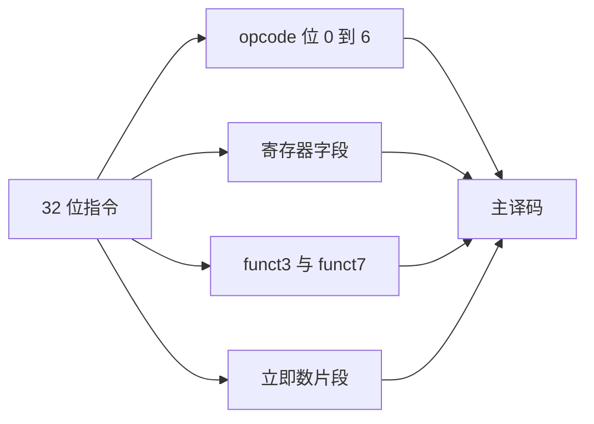
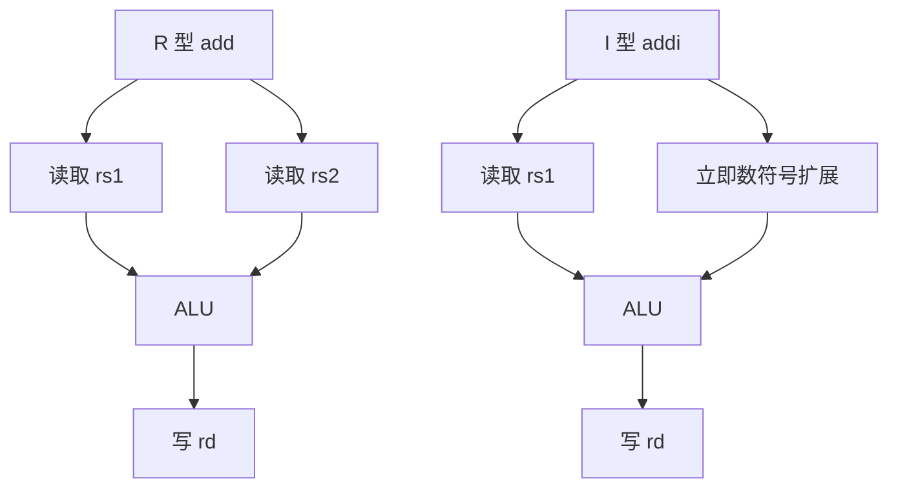
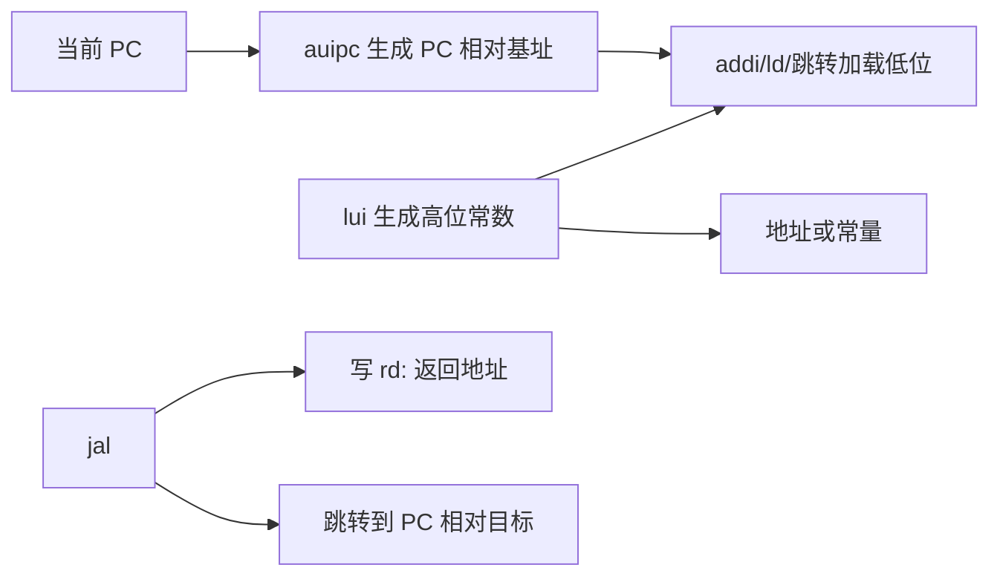
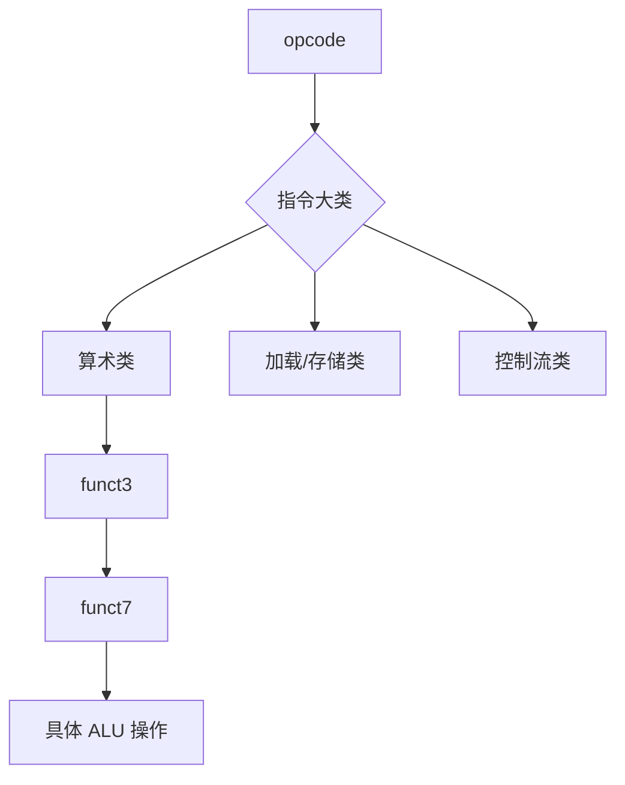
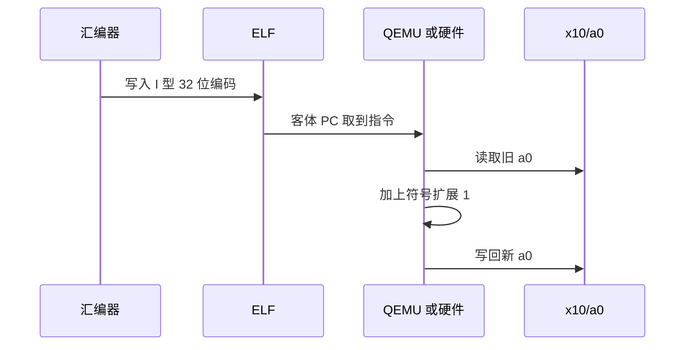
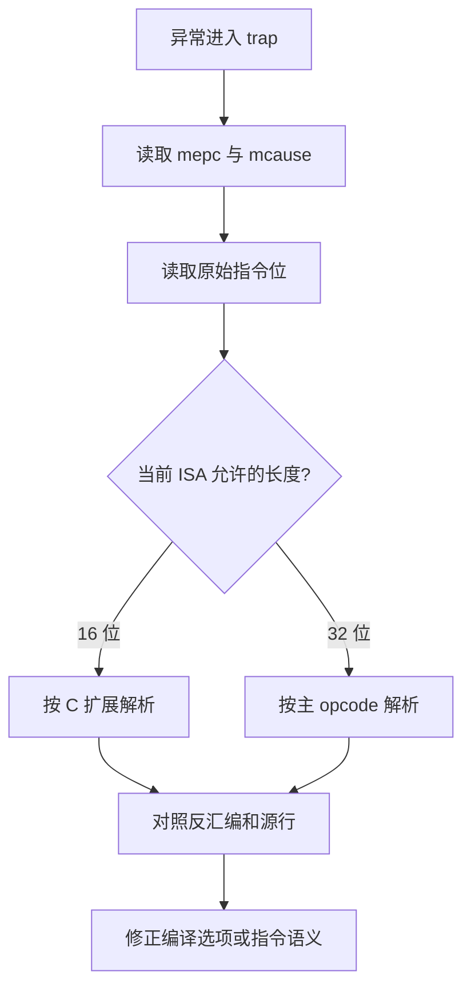

汇编助记符容易让人忘记一件事：CPU 只看到连续的指令位。

`add a0, a1, a2`、`beq a0, zero, label` 与 `ld a0, 8(sp)` 都会被拆成不同的编码格式。

理解位域能让你从 `objdump` 的十六进制、异常 `mepc` 和反汇编之间来回定位。

本篇还会解释 QEMU 的系统模拟如何把客体 RISC-V 指令翻译为宿主可执行的操作。

这不是在 QEMU 中实现一条 RISC-V 指令的唯一写法。

QEMU 的源码布局和翻译器细节会随版本变化，应以当前源码树与官方文档为准。[QEMU 文档](https://qemu.readthedocs.io/en/master/)

## 1. 指令的最小观察单位是位域

RISC-V 基础整数指令以 32 位编码为主。

最小 opcode 位于低 7 位。

不同格式复用 `rd`、`rs1`、`rs2` 与 `funct3` 等字段，使硬件解码结构相对规律。

官方非特权 ISA 文档给出基础指令格式与扩展编码空间的正式定义。[RISC-V 非特权 ISA](https://docs.riscv.org/reference/isa/unpriv/unpriv-index.html)



一条指令属于哪个格式，不是由汇编文本中的空格决定。

而是由 opcode 与规格的编码规则决定。

同一条 `addi` 的 `rd`、`rs1` 和 12 位立即数位于 I 型格式；同一条 `add` 的两个源寄存器位于 R 型格式。

```text
R 型： funct7 | rs2 | rs1 | funct3 | rd | opcode
I 型： imm[11:0] | rs1 | funct3 | rd | opcode
S 型： imm[11:5] | rs2 | rs1 | funct3 | imm[4:0] | opcode
B 型： imm[12|10:5] | rs2 | rs1 | funct3 | imm[4:1|11] | opcode
U 型： imm[31:12] | rd | opcode
J 型： imm[20|10:1|11|19:12] | rd | opcode
```

这份视图只说明字段布局。

立即数的实际值还需要按各自格式拼接、补低位零和做符号扩展。

## 2. R 型与 I 型覆盖大多数算术读法

R 型通常表示两个寄存器源操作数。

例如 `add rd, rs1, rs2` 读取两个通用寄存器并写回一个通用寄存器。

I 型通常表示一个寄存器源与小立即数，或加载、跳转等场景。



例如 `add a0, a1, a2` 中的 ABI 名称会被汇编器映射到 `x10`、`x11`、`x12`。

编码层没有 `a0` 这个字段名。

`rd` 是 5 位，能够表示 32 个整数寄存器。

`x0` 被写入时硬件丢弃结果，但它仍可以出现在 `rd` 字段。

```asm
add  a0, a1, a2
addi a0, a0, 7
sub  zero, a0, a1
```

最后一条的计算结果被丢弃。

这并不使指令非法。

分析反汇编时，要从编码的寄存器编号与当前 ISA 状态理解其效果，而非从变量名猜测。

## 3. 分支立即数的散布是为了编码布局，而非人为增加难度

S 型存储与 B 型分支都需要两个源寄存器。

因此它们把立即数分散在多个区段。

对分支而言，目标偏移还按半字边界编码。

这使得低位零无需写入指令。

```mermaid
flowchart LR
    A[B 型指令位] --> B[提取 imm[12]]
    A --> C[提取 imm[10:5]]
    A --> D[提取 imm[4:1]]
    A --> E[提取 imm[11]]
    B --> P[拼接偏移并补 0]
    C --> P
    D --> P
    E --> P
    P --> T[PC 相对分支目标]
```

因此从 machine code 手算分支地址时，不能把连续的高位字段当作普通 12 位值。

正确顺序是：提取、按格式拼接、补低位零、符号扩展、加到当前 PC。

```text
target = pc + sign_extend({imm[12], imm[10:5], imm[4:1], imm[11], 0})
```

`pc` 指向当前分支指令的地址。

不是分支完成后顺序执行的下一条地址。

当 GDB 显示的跳转目标与手算不一致时，先确认是否存在压缩指令和地址偏移的页/半字语义。

## 4. U 型与 J 型处理大范围地址构造

12 位立即数适合小常数和短位移。

加载较大地址通常需要多个指令共同完成。

`lui` 使用 U 型把大立即数放到高位。

`auipc` 以当前 PC 为基准构造地址。

`jal` 使用 J 型跳转并写入返回地址。



汇编中的 `la`、`call` 与 `ret` 往往是伪指令或宏展开。

最终到底是 `auipc` 加 `addi`，还是链接器松弛成另一组指令，应以 ELF 反汇编为准。

```powershell
riscv64-unknown-elf-objdump -dr -M no-aliases `
  build/qemu-rv64-debug/riscv-qemu.elf
```

`-M no-aliases` 可以减少伪指令显示。

它不会改变真实机器码，只改变反汇编呈现方式。

## 5. `funct3` 与 `funct7` 是同 opcode 下的二级选择

低 7 位 opcode 可以先决定大类，例如整数算术、加载、存储、分支或系统指令。

`funct3` 进一步选择宽度、比较条件或操作子类。

部分 R 型指令还用 `funct7` 区分 `add`、`sub` 等同字段布局的操作。



这也是反汇编器的工作方式之一。

它先识别有效编码，再将寄存器编号和立即数以人类可读形式呈现。

若一个位型在当前启用的 ISA 中没有有效含义，执行会触发非法指令异常。

这比“反汇编器不认识某条指令”更接近硬件视角。

## 6. 从一条 `addi` 跟到可执行行为

考虑一条演示指令：

```asm
addi a0, a0, 1
```

汇编器把 `a0` 映射为 `x10`。

它选择 I 型算术 opcode，并填入 `rd=10`、`rs1=10`、立即数 `1`。

执行时，CPU 读取 x10，符号扩展立即数，执行加法，再写回 x10。



在真实硬件上，这会经过某条具体的数据通路和流水线。

在 QEMU 的 TCG 系统模拟中，翻译器会读取客体指令、生成对应的中间操作，并由宿主执行路径更新客体 CPU 状态。

这并不意味着 QEMU 每执行一条客体指令都“调用一个 `addi` 函数”。

翻译块、优化、异常检查与宿主指令选择都属于实现细节。

## 7. QEMU 的翻译边界比“逐条解释”更合理

QEMU 系统模拟需要维护客体 CPU 状态、内存映射、异常与设备模型。

它通常以翻译块为单位处理一段连续客体指令。

翻译块结束条件可能包括控制流变化、页边界、异常检查或模拟器的其他约束。


因此调试 QEMU 的指令实现时，应观察三层。

第一层是目标 ISA 的位域与语义。

第二层是 QEMU 目标翻译器如何为该语义生成操作。

第三层是实际客户机运行时的寄存器、PC 与异常结果。

只读某一层，容易把翻译器的实现选择误认为 ISA 规则。

## 8. 从异常地址反推一条指令

当 `mcause` 指向非法指令或断点异常时，`mepc` 通常能定位异常指令地址。

先从该地址读取原始 word，再用当前编译目标的反汇编对照。

```text
(gdb) p/x $mepc
(gdb) x/2wx $mepc
(gdb) x/4i $mepc
(gdb) p/x $mcause
```

若启用了 C 扩展，地址处的指令可能是 16 位。

不要固定用 4 字节步长解读所有地址。

需要从实际 bits 和当前 ISA 允许的指令长度开始。



这种方法还可以发现“编译器生成了硬件未实现的扩展指令”问题。

例如目标编译为 `rv64gc`，而软核只实现 `rv32i`，反汇编和 ELF 属性会提前暴露不匹配。

## 9. 编码实验的最小工程方法

不要手写完整函数再猜机器码。

用一个短汇编文件，逐条增加指令，并在每次构建后检查。

```asm
    .section .text
    .globl encoding_lab
encoding_lab:
    addi a0, a0, 1
    add  a1, a0, a2
    beq  a1, zero, 1f
    ret
1:
    addi a0, zero, -1
    ret
```

记录每一条的地址、机器码、格式和目标寄存器。

```text
地址      机器码      助记符       格式      关键字段
...       ...         addi          I         rd=10, rs1=10, imm=1
...       ...         add           R         rd=11, rs1=10, rs2=12
...       ...         beq           B         rs1=11, rs2=0, PC 相对偏移
```

修改一条立即数或目标标签后，观察哪些位变化。

这比背图表更容易建立编码直觉。

## 10. 常见误读

| 误读 | 正确检查方式 |
| --- | --- |
| `a0` 是硬件寄存器名 | 它是 x10 的 ABI 别名 |
| 所有跳转偏移是连续位域 | 按 B/J 格式重组并补低位 |
| `call` 是一条固定机器指令 | 查看当前 ELF 的真实展开 |
| QEMU 的代码组织就是 ISA 规范 | 用官方 ISA 规范定义语义，用源码解释实现 |
| 任何地址都按 4 字节指令增长 | 检查是否启用 C 扩展 |
| `objdump` 显示的伪指令是硬件执行的名字 | 使用 `-M no-aliases` 检查真实形式 |
| 编译通过就说明硬件支持所有指令 | 对照 `-march`、ELF 属性和核心实现 |

## 11. 练习与验收

### 练习

1. 为一条 `add` 写出 R 型字段，并用 `objdump` 对照寄存器编号。
2. 为一条短分支手算 B 型立即数，核对跳转目标是否从当前 PC 计算。
3. 用 `-M no-aliases` 比较 `call`、`ret` 和 `la` 的显示差异。
4. 编译同一个函数的 `rv64i` 与 `rv64imac` 版本，记录允许的指令长度和差异。
5. 在 QEMU GDB 中读取一次异常 `mepc` 的原始位，并从 opcode 开始解析。
6. 选择一条已实现的算术指令，在所用 QEMU 源码树中追踪其译码分支与客户机状态更新。

### 本篇验收清单

- [ ] 能从 opcode、寄存器字段、function 字段和立即数片段描述一条指令。
- [ ] 能区分 R、I、S、B、U、J 型的主要用途。
- [ ] 能按 B/J 格式重组 PC 相对偏移。
- [ ] 能说明 ABI 名称与指令编码中的寄存器编号关系。
- [ ] 能用 `objdump -M no-aliases` 检查真实指令展开。
- [ ] 能用 `mepc`、原始位和当前 ISA 解释异常地址。
- [ ] 能把 QEMU 的翻译实现与 RISC-V ISA 语义分开阅读。
- [ ] 能通过 `-march`、ELF 与软核配置检查指令集匹配。

位域是汇编与硬件之间最小的共同语言。

从一条指令的编码出发，反汇编、异常诊断、QEMU 翻译与软核译码都会变成同一条可追踪链路的不同观察点。

> 🏷️ RISC-V · 指令编码 · ISA · QEMU · 反汇编 · TCG · 调试
