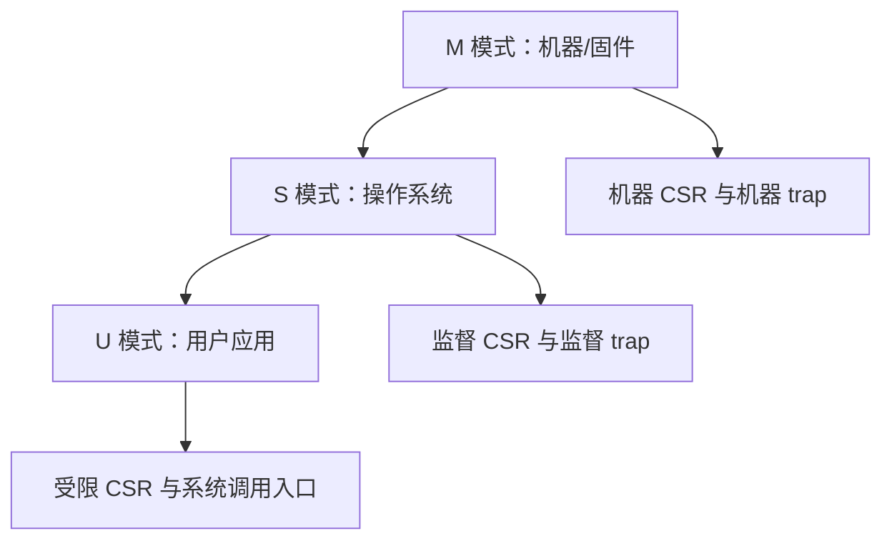
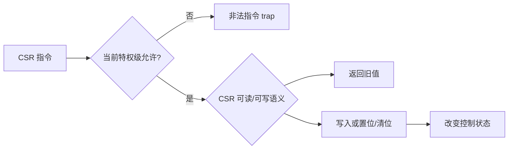
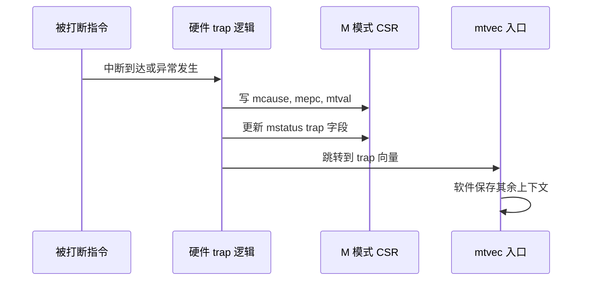
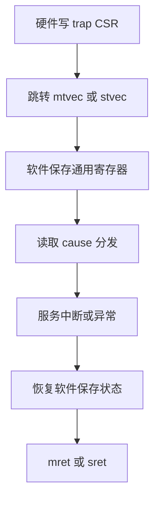
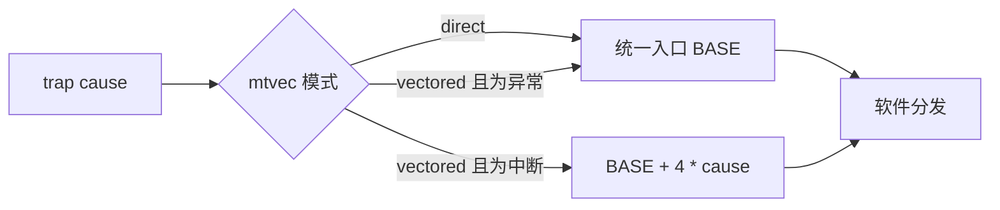
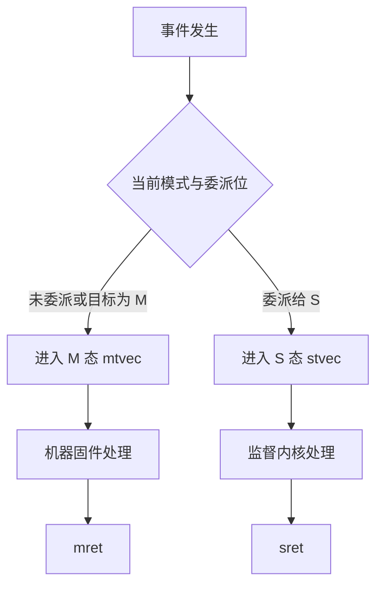
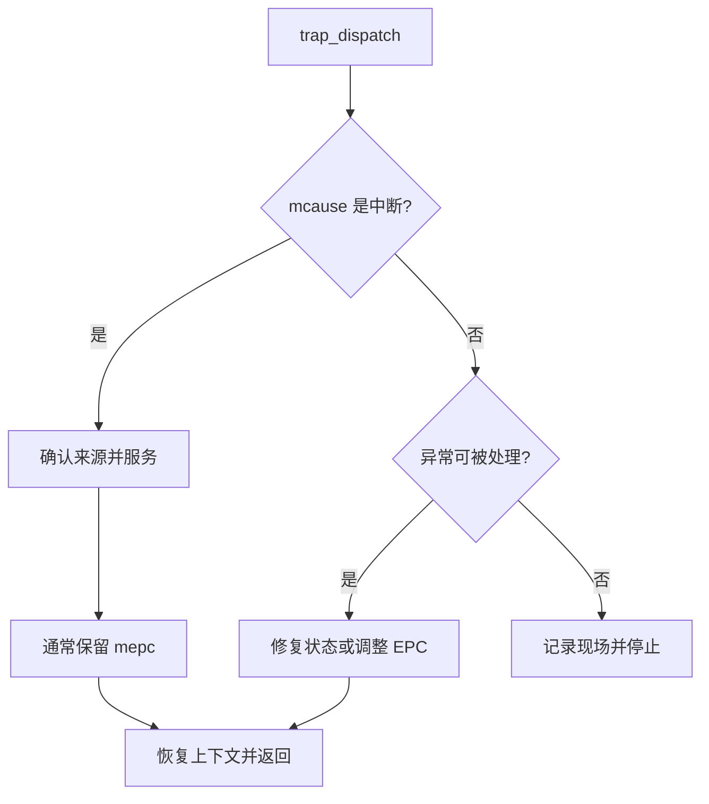

RISC-V 里“进入中断”只是 trap 的一种来源。

同步异常、软件中断、定时器中断和外部中断都通过特权架构定义的状态保存与入口选择进入处理路径。

要写对启动、RTOS port 或 Linux 启动链，必须同时理解 M、S、U 模式与 CSR 的访问边界。

本篇先采用包含 M、S、U 的通用概念模型。

一颗具体的 MCU 软核可能只实现 M 态，或者将 S/U 作为可选特性。

官方特权 ISA 是 trap、委派和 CSR 语义的唯一规范来源。[RISC-V 特权 ISA](https://docs.riscv.org/reference/isa/privileged.html)

## 1. 特权级是访问权限和控制职责的分层

M 模式是必需的机器级模式。

S 模式是可选的监督级模式，通常用于操作系统内核。

U 模式是可选的用户级模式，通常用于受保护应用。

它们不是三个“不同的 CPU”。

它们共享整数寄存器和大量执行资源，但每个模式可访问的 CSR、异常入口和内存控制能力不同。



在 QEMU `-bios none` 的裸机实验里，程序常从 M 态开始并始终留在 M 态。

在 OpenSBI 加 Linux 的系统里，固件负责 M 态，Linux 内核通常运行于 S 态，用户进程运行于 U 态。

不能把一段 M 态 CSR 初始化代码直接移到 Linux 驱动中。

那会违反特权边界。

## 2. CSR 是有权限和副作用的控制状态

CSR 指令访问的是控制与状态寄存器。

例如 `mstatus`、`mtvec`、`mepc`、`mcause` 属于机器级 trap 状态。

监督级存在对应的 `sstatus`、`stvec`、`sepc`、`scause` 等状态。

某些 CSR 只读，某些写入会清状态位，某些访问在较低特权级触发非法指令异常。



不要把 CSR 视为普通内存映射寄存器。

它们使用专门的指令编码与特权检查。

`csrrw`、`csrrs`、`csrrc` 及其立即数形式分别表达读写、置位与清位语义。

```asm
csrw mtvec, a0
csrs mstatus, a1
csrc mie, a2
csrr a0, mcause
```

汇编伪指令会让常见操作更简洁。

最终仍应理解读改写是否会带来状态变化。

## 3. trap 入口会记录足够的最低状态

以 M 态 trap 为例，硬件会记录原因和返回 PC。

`mcause` 描述中断或异常原因。

`mepc` 记录返回地址。

`mtval` 对部分异常提供附加值。

`mstatus` 的相关字段保存进入 trap 前的中断使能和特权信息。



硬件并不会为所有通用寄存器自动建立完整软件栈帧。

这与某些 Cortex-M 自动压栈寄存器的体验不同。

RISC-V trap 入口需要软件按照 ABI、嵌套策略、调试要求和是否切换任务保存适当寄存器。

这也是 FreeRTOS port 需要汇编层的原因。



## 4. `mtvec` 和 `stvec` 定义入口模式

trap 向量 CSR 中存放基址和模式。

direct 模式让所有 trap 进入同一基址。

vectored 模式会为中断原因提供向量偏移，而同步异常仍进入基址。

教学和早期移植常采用 direct 模式。

它便于把全部现场保存集中在一个入口。



vectored 模式可能减少中断入口的跳转开销。

它并不会自动解决寄存器保存、优先级、嵌套或外设确认。

若使用它，所有向量槽的对齐、范围和统一收尾仍需设计。

## 5. 委派决定 trap 停留在 M 还是下送到 S

在实现 S 模式的系统里，M 态可以通过委派控制某些异常和中断由 S 态处理。

这让固件仍保有机器级控制权，而操作系统能处理大部分日常陷入。



委派不是简单的“把中断转发给低权限软件”。

它遵循规范规定的当前特权级与原因规则。

具体实现可支持的位也可能不同。

固件必须先检查自身和平台的特性，而不是假设所有 cause 都能委派。

## 6. 返回指令恢复的是硬件 trap 状态，不是全部软件上下文

`mret` 用于从 M 态 trap 返回。

`sret` 用于从 S 态 trap 返回。

它们会使用对应 EPC 和状态字段恢复控制流与特权/中断状态。

在执行返回指令前，软件仍要恢复自己压栈的通用寄存器。

```asm
trap_entry:
    addi sp, sp, -FRAME_BYTES
    /* 保存本 port 定义的寄存器 */
    csrr a0, mcause
    csrr a1, mepc
    call trap_dispatch
    /* 恢复本 port 定义的寄存器 */
    addi sp, sp, FRAME_BYTES
    mret
```

若异常处理需要跳过非法指令，软件可能修改 `mepc`。

不能盲目把它加 4。

若启用了 C 扩展，故障指令可能是 16 位。

应读取实际指令长度，或对未支持的异常采用停止与诊断策略。

## 7. 同步异常与异步中断的恢复策略不同

中断通常在指令边界异步到达，处理后可回到 `mepc` 继续。

同步异常由当前指令引起。

非法访问、非法指令和环境调用是否能恢复，取决于原因与系统策略。



`ecall` 是一类有意的同步异常。

操作系统可把它作为用户态请求内核服务的入口。

M 态裸机中也可用它测试 trap 分发，但必须明确调整返回地址，否则会反复执行同一条 `ecall`。

## 8. 与 Cortex-M 的对照要保留架构差异

两者都提供异常入口、状态寄存器和中断屏蔽能力。

但寄存器名称、自动保存范围、优先级控制器和特权模型不同。

| 主题 | RISC-V 通用模型 | Cortex-M 常见模型 |
| --- | --- | --- |
| 向量入口 | `mtvec`/`stvec` 与模式 | 固定向量表基址机制 |
| 硬件自动保存 | trap CSR 的原因、EPC、状态字段 | 常见实现自动压入部分通用状态 |
| 通用寄存器保存 | trap 软件/port 定义 | 异常序言与 ABI 共同决定 |
| 中断控制器 | 平台选择 PLIC、AIA 或私有实现 | NVIC 集成于 Cortex-M 架构 |
| 特权层 | M 必需，S/U 可选 | Thread/Handler 与特权控制模型 |
| 系统调用路径 | `ecall` 与 trap | SVC 异常 |

对照的目的是迁移思维，不是逐位翻译寄存器。

“Cortex-M 自动压栈”不能推出“RISC-V trap 已保存 r0-r3”等结论。

同样，RISC-V 的 M/S/U 也不能直接对应到 Cortex-M 的每一个模式名称。

## 9. CSR 访问的调试证据

GDB 可在 trap 中检查关键 CSR。

```text
(gdb) break trap_entry
(gdb) continue
(gdb) p/x $mcause
(gdb) p/x $mepc
(gdb) p/x $mtval
(gdb) p/x $mstatus
(gdb) p/x $mtvec
```

调试器对 CSR 寄存器名称的支持随目标描述和版本变化。

若名称不可用，可通过汇编辅助函数读取 CSR，再在 C 中暴露值。

不要根据一次断点后的 `mstatus` 推断所有任务的长期中断状态。

还需检查 trap 入口、嵌套策略与返回前的恢复。

## 10. 常见失败模式

| 症状 | 先检查 | 常见原因 |
| --- | --- | --- |
| 写 CSR 触发非法指令 | 当前特权级与 ISA 扩展 | U/S 模式访问机器 CSR，或 CSR 指令扩展未启用 |
| trap 跳到异常地址 | `mtvec` 对齐与模式 | 基址无效、模式字段错误或链接布局不匹配 |
| `mret` 后再次同一异常 | `mepc` 与异常类型 | 对可恢复同步异常未调整 EPC |
| 中断返回寄存器损坏 | 软件保存集 | 只依赖硬件 CSR，未保存通用寄存器 |
| Linux 中访问 M 态寄存器失败 | 固件与内核边界 | 忽略 OpenSBI/SBI 的机器态职责 |
| 用向量模式后部分中断失败 | 向量槽布局 | 只设置 base，未提供有效的向量入口 |

## 11. 练习与验收

### 练习

1. 在 M 态裸机中读取 `mstatus`、`mtvec`、`mepc`、`mcause`，记录一场 timer trap 前后的变化。
2. 用 direct 模式实现统一 trap 入口，并让 C 分发器区分一个 timer 中断和一个 `ecall`。
3. 为受控 `ecall` 设计返回策略，验证不会反复陷入同一条指令。
4. 画出 M、S、U 三层中固件、内核与应用的职责图。
5. 为一个使用 S 模式的系统列出应由 OpenSBI 处理与应由 Linux 处理的事件类别。
6. 对照 Cortex-M 异常进入流程，标记哪些 RISC-V 通用寄存器保存必须由软件完成。

### 本篇验收清单

- [ ] 能说明 M 必需、S/U 可选以及三者的典型职责。
- [ ] 能区分 CSR 指令与普通 MMIO 访问的权限/副作用。
- [ ] 能说明 `mcause`、`mepc`、`mtval`、`mstatus` 与 `mtvec` 的 trap 角色。
- [ ] 能在 direct 或 vectored 模式下设计可恢复的入口。
- [ ] 能指出 trap 硬件状态与软件通用寄存器保存的分工。
- [ ] 能解释委派如何改变 M/S 的 trap 归属。
- [ ] 能说明 `mret`/`sret` 前仍需恢复软件上下文。
- [ ] 不会将 Cortex-M 异常机制的具体寄存器规则套用到 RISC-V。

特权架构的核心不是寄存器清单。

它是一个明确的状态转换协议：谁有权接收事件，硬件记录什么，软件还要保存什么，以及最终由哪条返回指令恢复执行。

> 🏷️ RISC-V · 特权级 · CSR · trap · 中断 · 异常 · M 模式 · S 模式
