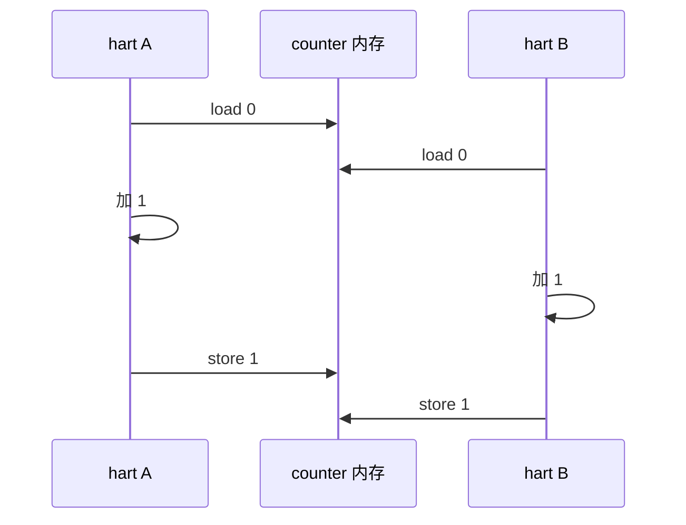
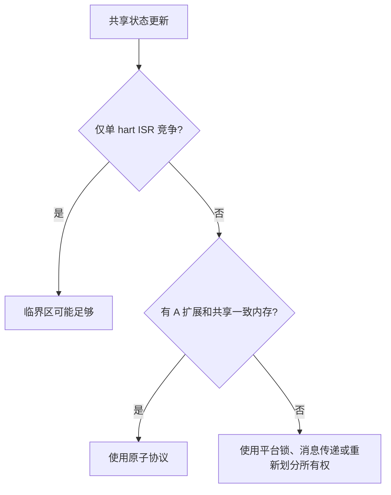
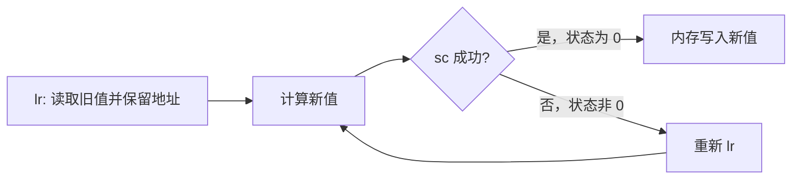
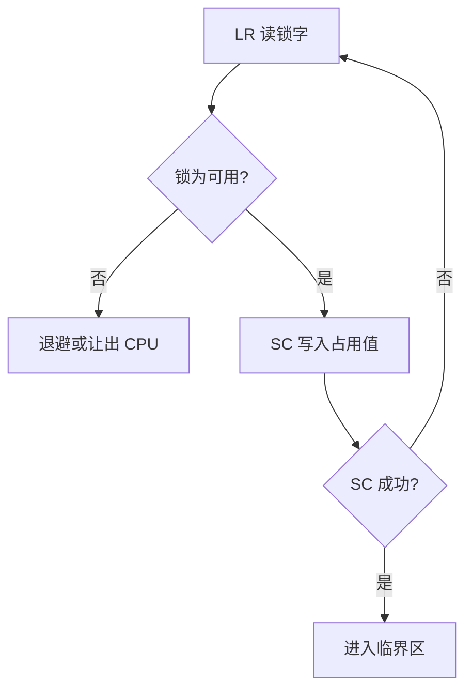
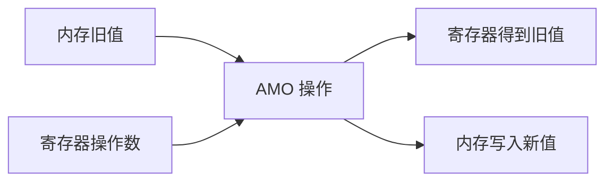
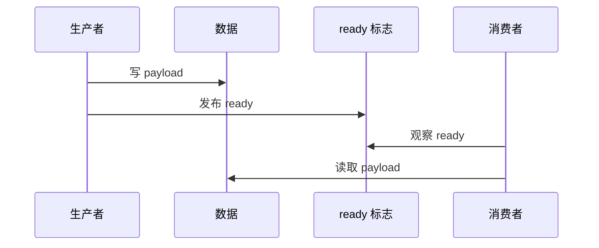
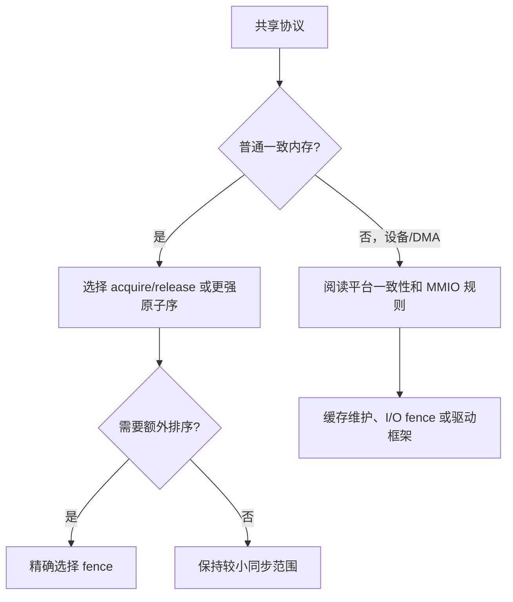
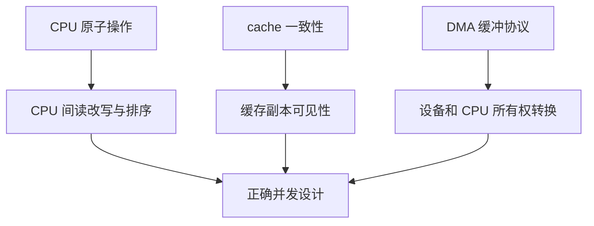

单核裸机里，把一个整数加一通常只是一条加载、加法和存储。

一旦有多 hart、DMA、可抢占 ISR 或外设共享状态，这三步之间就可能被观察或打断。

原子指令解决的是“这个读改写能否作为一个不可分割操作完成”。

内存模型解决的是“不同地址的读写能以什么顺序被其他观察者看见”。

两者相关，但不能相互替代。

RISC-V A 扩展定义 LR/SC 与 AMO 原子操作；官方 ISA 也将 A 扩展定位为多处理器同步所需的原子读改写支持。[RISC-V A 扩展](https://docs.riscv.org/reference/isa/unpriv/unpriv-index.html)

## 1. 先定义竞态，而不是先写自旋锁

假设两个 hart 都执行 `counter++`。

若展开为 load、add、store，两个 hart 可以读到同一个旧值，并分别写回相同的新值。

最终只增加一次。



问题不在于加法错误。

问题在于“读取旧值到写回新值”的整个区间不是原子操作。

禁用本 hart 的中断只可以防止本 hart 的 ISR 抢占。

它不能阻止另一个 hart 或 DMA 修改相同内存。



第一步总是确定参与者和内存属性。

不要在非一致 DMA 缓冲区上假设一个 CPU 原子指令自动提供设备一致性。

## 2. LR/SC 用“保留”表达条件写入

`lr.w` 或 `lr.d` 读取一个地址并建立保留。

`sc.w` 或 `sc.d` 只在保留仍然有效时写入。

成功时 `sc` 把零写入状态寄存器。

失败时它不写内存，并返回非零状态。



典型 compare-and-swap 风格循环如下。

```asm
1:
    lr.w    t0, (a0)
    bne     t0, a1, 2f
    sc.w    t1, a2, (a0)
    bnez    t1, 1b
    li      a0, 1
    ret
2:
    li      a0, 0
    ret
```

`a0` 指向目标地址。

`a1` 是预期旧值。

`a2` 是要写入的新值。

`t1` 不是“失败的旧值”，而是 `sc` 成功状态。

忽略 `sc` 返回值会使整个协议失效。

## 3. LR/SC 失败不是异常路径

其他 hart 写入保留集合、实现选择的失效条件或中断等因素都可能使 `sc` 失败。

软件必须把失败视为正常控制流，并根据算法重试。

这也是 LR/SC 比“先读再无条件写”多一层循环的原因。



自旋循环应考虑争用和功耗。

在 RTOS 中，长时间自旋会阻塞相同优先级任务并拖慢中断响应。

若临界区较长，互斥量、消息队列或 ownership 设计通常比自旋更合适。

## 4. AMO 将常见读改写编码为单条指令

A 扩展还提供 AMO 指令。

它们原子地读取内存、计算并写回结果，同时把旧值返回到寄存器。

常见形式包括 `amoadd`、`amoswap`、`amoor`、`amoand`、`amomax` 等。



例如原子加计数器的概念形式为：

```asm
li      t0, 1
amoadd.w t1, t0, (a0)
```

执行后 `t1` 是更新前的值。

内存中的值已经原子地加一。

这不自动决定与其他普通读写的排序关系。

若该计数器同时是发布某个数据结构的同步标志，还需考虑 acquire/release 或 fence。

## 5. 原子性与可见顺序是两个问题

考虑生产者写数据，再置 `ready=1`。

消费者看到 `ready=1` 后读取数据。

若没有正确的内存排序，消费者可能观察到 ready 已经更新，但数据写入在其观察顺序中仍未完成。



RISC-V 的 RVWMO 允许一定程度的内存访问重排。

算法需要显式声明发布与获取关系。

不要把“使用了 `amoswap`”自动等同于“所有数据已按正确顺序可见”。

## 6. `aq` 与 `rl` 表达获取和发布约束

原子指令可带 acquire `aq`、release `rl` 或两者标记。

release 约束之前的内存操作不越过发布动作到后面。

acquire 约束之后的内存操作不越过获取动作到前面。


一个锁获取/释放的概念伪代码可表示为：

```c
void lock_release(_Atomic uint32_t *lock) {
  atomic_store_explicit(lock, 0U, memory_order_release);
}

void lock_acquire(_Atomic uint32_t *lock) {
  while (atomic_exchange_explicit(lock, 1U, memory_order_acquire) != 0U) {
    cpu_relax();
  }
}
```

编译器如何映射 C11 原子到具体 A 扩展指令取决于目标、优化和工具链。

检查汇编可以验证映射，但不应把某次编译输出写成语言标准的唯一实现。

## 7. `fence` 是显式的排序屏障

`fence` 指令可为特定读写类别建立排序约束。

它常用于设备 MMIO、缺少合适原子标记的协议或架构边界。

```asm
fence rw, rw
```

上例表达较强的读写顺序约束。

更窄的屏障可能更适合特定协议。

但“总是加最强 fence”不是对内存模型的理解。

它会隐藏数据结构所有权不清、缓存维护缺失或设备规范未定义的问题。



MMIO 访问还可能需要 `fence iorw, iorw` 一类与 I/O 域相关的约束。

准确选择需参考平台总线、设备手册和操作系统 I/O 访问封装。

## 8. 原子并不替代 cache 和 DMA 协议

CPU 原子指令的内存域、cache 一致性与设备可见性是不同层次。

一个无硬件一致性的 DMA 缓冲区，即使应用使用原子 flag，也可能需要显式清 cache 或失效 cache。

反过来，cache 一致也不自动让多个 CPU 对读改写形成互斥。



驱动中常见的“写描述符、清 cache、写 doorbell”流程需要同时满足三类规则。

不能只在 doorbell 前加一条原子交换就宣称 DMA 安全。

## 9. 用最小压力测试暴露丢失更新

两个 hart 循环增加共享计数器，最后比较期望值，是原子测试的起点。

```c
for (unsigned i = 0; i < ITERATIONS; ++i) {
  atomic_fetch_add_explicit(&counter, 1U, memory_order_relaxed);
}
```

`memory_order_relaxed` 在这里足以保证计数器更新的原子性。

它不建立其他数据的发布关系。

测试应分别验证“最终计数无丢失”和“生产者数据发布正确”。

这两个测试不能合并为一句“原子变量工作正常”。

## 10. 常见失败模式

| 症状 | 先检查 | 常见原因 |
| --- | --- | --- |
| 计数偶尔少于期望 | 是否使用真正原子读改写 | 普通 load/add/store 竞争 |
| LR/SC 循环卡住 | `sc` 状态与竞争 | 忽略失败、过度争用或错误地址 |
| 已看到标志但数据陈旧 | 发布/获取排序 | 缺少 release/acquire 或协议错误 |
| ISR 与任务仍竞争 | 参与者范围 | 只关闭本地中断，未保护多 hart |
| DMA 数据错误 | cache 与设备协议 | 把 CPU 原子当成 cache 维护 |
| 软件在 RV32I 核非法指令 | ISA 配置 | 核未实现 A 扩展却生成原子指令 |
| 性能显著下降 | 锁粒度和 fence 范围 | 所有路径都用全局自旋与强屏障 |

## 11. 练习与验收

### 练习

1. 写一个普通 `counter++` 双 hart 测试，记录偶发丢失更新。
2. 用 `amoadd` 或 C11 `atomic_fetch_add` 修复，并只验证计数原子性。
3. 写一个 LR/SC compare-and-swap 循环，在 `sc` 失败时记录重试次数。
4. 实现一个数据与 ready flag 的发布/获取协议，并在压力下验证消费者读取的 payload。
5. 找到一个 DMA 环形缓冲场景，列出原子、cache 维护和所有权转换分别在哪里发生。
6. 使用 `objdump` 检查目标是否包含 A 扩展相关指令，并与 `-march` 对照。

### 本篇验收清单

- [ ] 能区分原子读改写与跨地址内存排序。
- [ ] 能说明 LR 建立保留、SC 返回成功状态以及失败需要重试。
- [ ] 能说明 AMO 返回旧值并原子写入新值。
- [ ] 能解释 acquire/release 的发布与获取关系。
- [ ] 能在需要时选择 `fence`，而非用它掩盖协议问题。
- [ ] 能区分 CPU 原子、cache 一致和 DMA 同步。
- [ ] 能检查软核/工具链是否真的支持 A 扩展。
- [ ] 能为计数正确性和数据发布正确性设计独立测试。

原子指令给出构造同步协议的原料。

正确的并发程序仍需要明确所有权、顺序、进度与设备可见性。

> 🏷️ RISC-V · A 扩展 · LR/SC · AMO · FENCE · RVWMO · 并发
