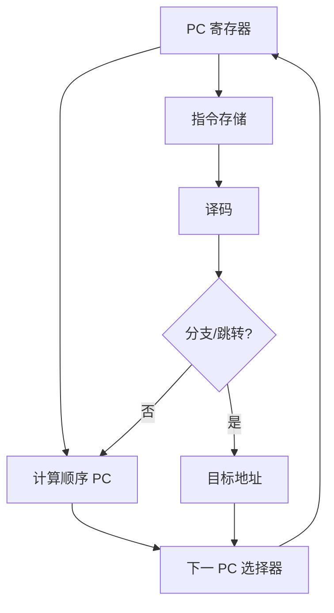
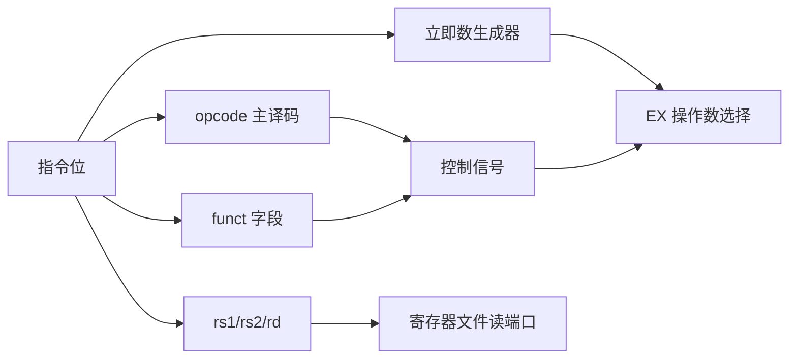
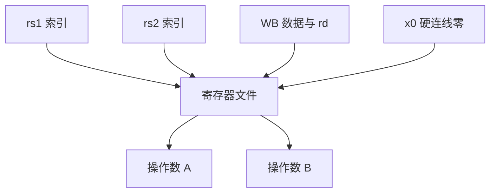
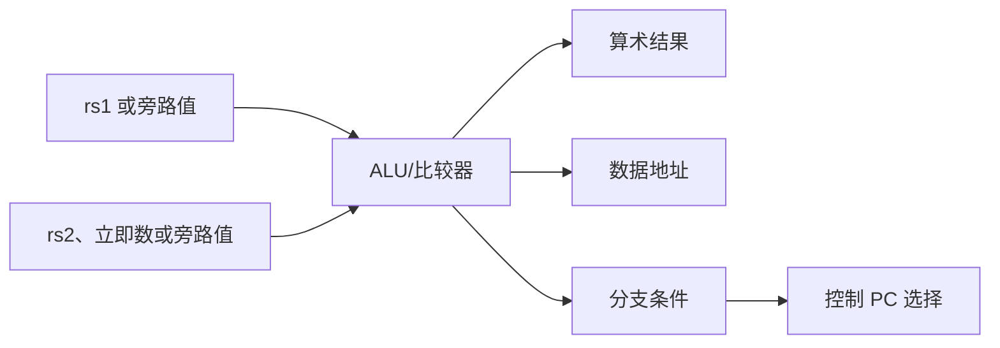
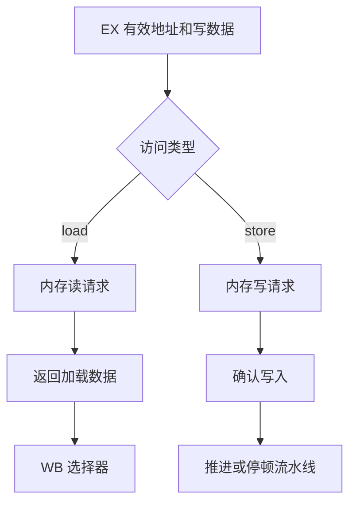
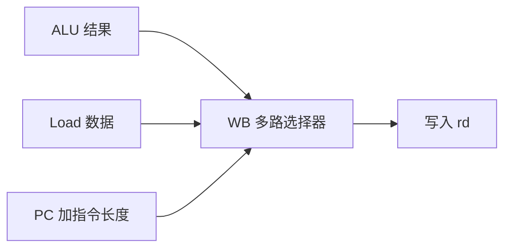
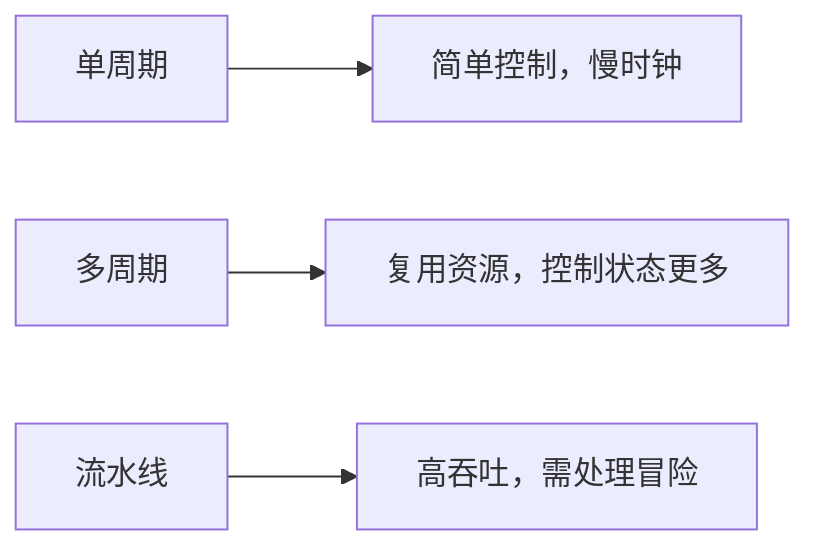

ISA 规定一条指令应产生什么结果。

微架构决定它用哪些寄存器、组合逻辑、存储接口和时钟周期得到该结果。

同一组 RV32I 指令可以由单周期、多周期、五级流水线或更深的乱序核心实现。

本篇从最容易验证的五个逻辑阶段出发。

这是一种教学模型。

真实软核的寄存器切分、cache 接口、旁路网络和时序收敛必须以 RTL 为准。

## 1. 一条指令经历的五类工作

常用流水线划分为 IF、ID、EX、MEM、WB。

IF 从指令存储取指并计算顺序 PC。

ID 译码、读寄存器并生成立即数。

EX 执行 ALU、分支比较或地址计算。

MEM 访问数据存储或完成外部接口握手。

WB 把结果写回整数寄存器。


并非所有指令都真正使用全部阶段。

`add` 没有数据存储访问。

`sw` 没有通用寄存器写回。

`beq` 需要比较与 PC 选择，但不写回普通结果。

使用统一阶段有助于共享硬件结构，也引入控制与数据冒险。

## 2. PC 与取指逻辑是控制流的起点

PC 寄存器保存当前取指地址。

取指单元同时计算 `pc + instruction_length`。

在含 C 扩展的实现中，指令长度可能是 16 位或 32 位。

教学 RV32I 模型常先假设固定 32 位指令，因此顺序 PC 为 `pc + 4`。



PC 选择器是控制错误的集中点。

`jal`、`jalr`、条件分支、异常入口和返回指令都可能提供非顺序地址。

实现中应让每条来源有明确优先级。

异常和中断通常比普通分支拥有更高的重定向优先级。

## 3. 译码不只是查一张 opcode 表

ID 阶段读取 instruction bits。

它解析 opcode、`funct3`、`funct7`、寄存器索引和立即数。

它还生成控制信号，例如 ALU 操作、写回使能、内存读写使能和分支种类。



立即数生成器必须按 I、S、B、U、J 型正确重排和符号扩展。

把 B 型立即数当作连续字段，是典型的硬件译码 bug。

控制信号应有默认安全值。

非法 opcode 不应意外启动存储写使能。

## 4. 寄存器文件的读写时序影响旁路需求

整数寄存器文件通常有两个读端口和一个写端口。

ID 读取 `rs1` 与 `rs2`。

WB 写入 `rd`。

`x0` 必须总读为零，写入被忽略。



在某些实现中，WB 在一个时钟边沿写入，ID 在同周期组合读取。

在另一些实现中，读写冲突要通过旁路或时序定义解决。

RTL 中应把这一点写成明确规则并用测试覆盖。

不能仅凭仿真中“看起来读到了新值”判断没有冒险。

## 5. EX 阶段合并 ALU、地址和比较

ALU 执行整数算术、逻辑、移位和比较。

加载与存储也使用 ALU 计算 `rs1 + offset` 的有效地址。

分支使用比较器，并与 PC 相对立即数生成候选目标。



`slt` 与有符号分支必须采用有符号比较。

`sltu` 与无符号分支必须采用无符号比较。

地址计算通常按 XLEN 位进行，但数据访问的对齐与异常规则由 ISA 和内存系统共同决定。

## 6. MEM 阶段不是只有 RAM 数组

简化模型把 MEM 表示为同步或组合的 `data_mem`。

真实系统的这一阶段可能面对 SRAM、cache、AXI、Wishbone 或 TileLink 一类接口。

读写可能立刻完成，也可能通过 ready/valid 多周期握手完成。



如果总线可能等待，流水线必须保持未完成指令及其控制信号。

这可以通过全流水停顿、MEM 级握手或更复杂的队列实现。

选择哪种结构是微架构权衡。

正确性要求是：未完成的 load/store 不能被覆盖，且紧随其后的相关指令不能越过其可见性规则。

## 7. WB 选择最终写入源

写回数据常来自三类源。

ALU 结果用于大部分整数算术。

内存读取数据用于 load。

`pc + length` 用于 `jal`/`jalr` 的返回地址。



`rd=0` 时，控制器仍可让其他阶段完成语义，但寄存器文件必须丢弃写回。

这比在每个指令路径都添加“rd 不是零”的特例更清晰。

## 8. 单周期、多周期和流水线的核心差别

单周期核心每个时钟完成一条指令。

时钟周期必须容纳最慢指令路径，例如 load。

多周期核心复用硬件，把一条指令拆成多个状态。

流水线让不同指令在不同阶段重叠，提高吞吐量。



流水线不必然降低单条指令的延迟。

它主要提升单位时间完成指令的数量。

性能仍取决于时钟频率、停顿、cache miss、分支预测和工作负载。

## 9. 一个可验证的 RTL 分解

无论写 Verilog、VHDL 还是 SpinalHDL，建议把组合路径和阶段寄存器拆开。

```text
pc_reg
if_id_reg
id_ex_reg
ex_mem_reg
mem_wb_reg
decode_unit
imm_generator
alu
branch_unit
register_file
memory_adapter
```

每个阶段寄存器应携带它需要的所有数据和控制位。

不要在 MEM 阶段重新从当前 IF 指令译码。

那会让发生停顿或冲刷时的数据来源失去一致性。


先让无冒险、小指令集版本通过逐条指令测试。

再逐步加入旁路、停顿、冲刷和总线等待。

## 10. 常见失败模式

| 症状 | 先检查 | 常见原因 |
| --- | --- | --- |
| 分支跳到错误地址 | B/J 立即数生成与 PC 基准 | 位域拼接或低位补零错误 |
| store 写到错误位置 | EX 地址与 `rs2` 数据通路 | 把立即数当写数据，或符号扩展错误 |
| load 得到前一条数据 | MEM/WB 控制位 | load 数据未选入写回 |
| x0 被改写 | 寄存器文件写使能 | 忘记丢弃 rd=0 写入 |
| 总线等待时状态损坏 | 阶段寄存器使能 | 未保持请求和控制字段 |
| 仅某些比较指令错误 | 有符号比较选择 | `slt` 与 `sltu` 共用了错误比较器 |

## 11. 练习与验收

### 练习

1. 画出 `add`、`ld`、`sd`、`beq` 和 `jal` 分别使用的数据通路。
2. 为 B 型立即数编写组合逻辑，并用正负偏移分支测试。
3. 实现一个始终返回零的 x0，写入 x0 后读取验证。
4. 将 data memory 改为带 ready/valid 的模型，确保 load 等待时流水线不会错误推进。
5. 为 WB 选择器添加 `jal` 的 PC 返回地址路径。
6. 在波形中标注同一条 load 从 IF 到 WB 的所有阶段寄存器内容。

### 本篇验收清单

- [ ] 能说明 IF、ID、EX、MEM、WB 各自拥有的职责。
- [ ] 能为算术、加载、存储、分支和跳转指出不同的数据路径。
- [ ] 能让译码器、立即数生成器和控制信号有明确默认值。
- [ ] 能保证 x0 永远为零。
- [ ] 能解释总线等待为何需要停顿或握手。
- [ ] 能区分单周期、多周期和流水线的吞吐/时序权衡。
- [ ] 能把所有跨阶段数据放进明确的流水寄存器。
- [ ] 能用波形和指令级测试检查每条路径。

数据通路是 ISA 语义落到门级/RTL 结构时的第一张地图。

冒险、预测和 cache 问题，本质上都是在这张地图上处理“多条指令同时存在”与“内存不是立刻返回”的现实。

> 🏷️ RISC-V · 数据通路 · 流水线 · RTL · CPU · 微架构
