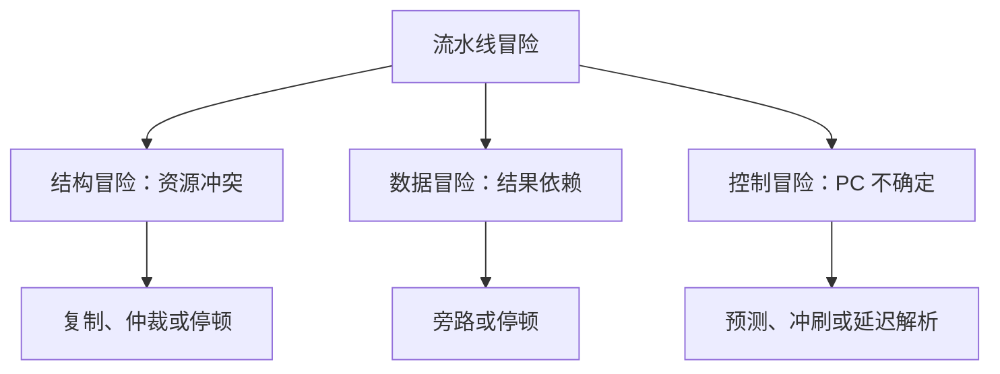
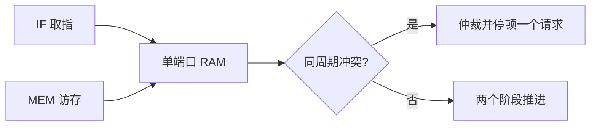
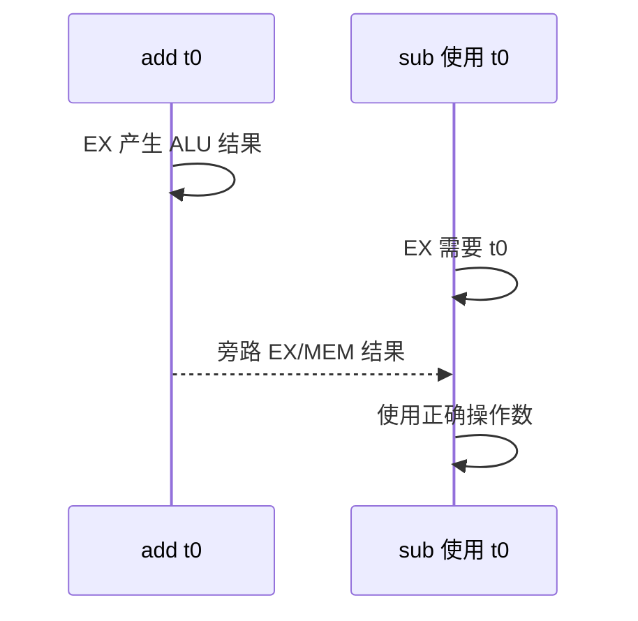
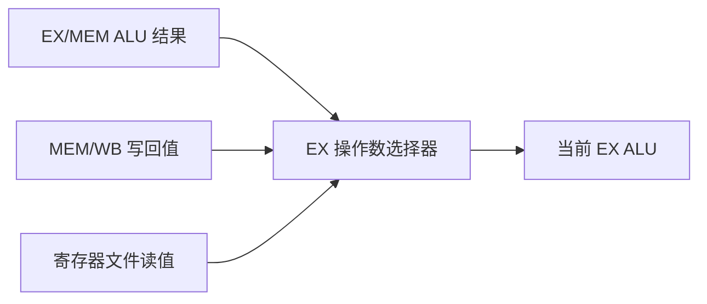
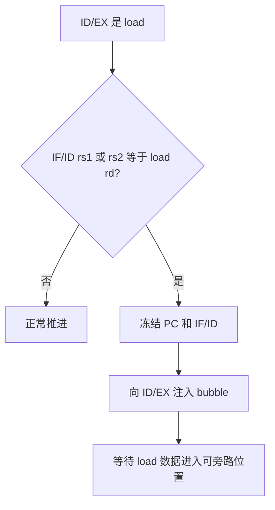
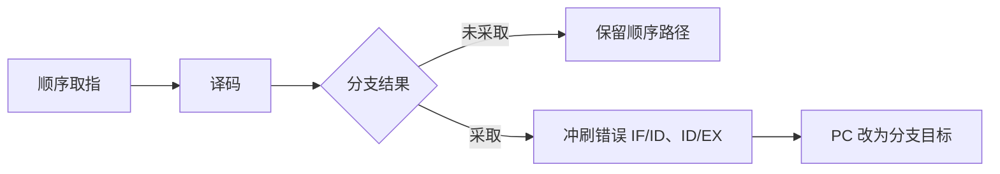
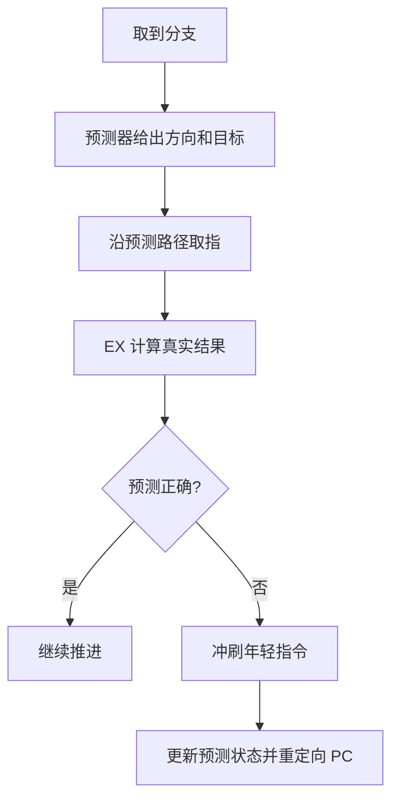
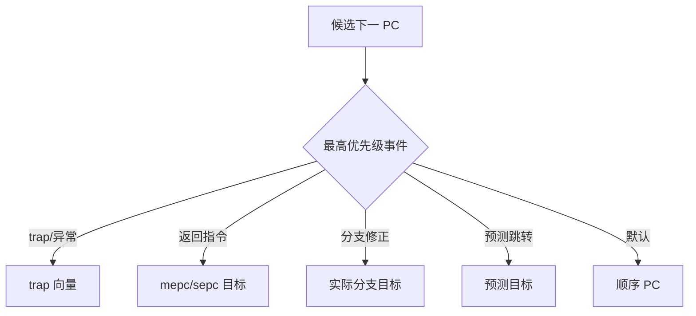
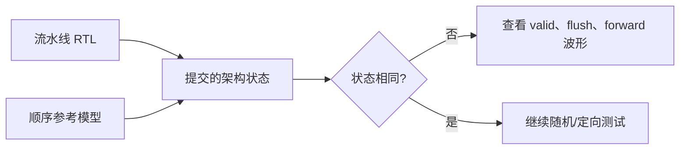

流水线让多条指令同时占用不同阶段。

当它们争用同一资源、依赖尚未产生的结果，或沿着错误控制流被取入时，硬件就遇到冒险。

冒险不是偶发 bug。

它是流水线并行带来的确定性设计问题。

本篇使用 IF/ID/EX/MEM/WB 教学模型。

具体软核的阶段数量、分支解析位置和 memory handshake 可能不同，但推理方法一致。

## 1. 三类冒险来自三种“同时”

结构冒险是两条指令在同一周期需要同一个硬件资源。

数据冒险是紧随而来的指令需要前一条尚未写回的结果。

控制冒险是取指单元尚未知道分支或跳转的正确 PC。



首先分类，才能选择最小修复。

不要因为一条 load 后的 add 出错，就立即给所有指令插入固定数量的 NOP。

那会掩盖依赖检测，而不是实现流水线。

## 2. 结构冒险由资源规划解决

若指令和数据共用单端口 RAM，IF 取指和 MEM load/store 在同一周期会冲突。

若乘法器只有一个，多条乘法也可能竞争。

解决方法包括复制资源、分时仲裁或冻结一个阶段。



Harvard 风格的独立指令/数据存储可以消除这类最直接冲突。

它不消除寄存器依赖或分支控制问题。

实现文档应列出每个可被同时访问的资源和仲裁规则。

## 3. RAW 是顺序流水线最关键的数据冒险

Read After Write，简称 RAW，表示消费者在生产者写回前读取结果。

```asm
add  t0, a0, a1
sub  a2, t0, a3
```

第二条在 EX 阶段需要 `t0`。

第一条的 ALU 结果可能还在 EX/MEM 或 MEM/WB 阶段，尚未写回寄存器文件。



顺序发射、顺序完成的简单五级流水线通常主要面对 RAW。

WAR 和 WAW 常由寄存器写回顺序避免。

更深的乱序核心则需要更复杂的重命名和提交机制。

不要把简单模型的结论外推到所有 CPU。

## 4. 旁路把尚未写回的结果送给消费者

旁路，也称 forwarding/bypass，从后级流水寄存器把新结果直接送到 EX 输入选择器。

它避免等待 WB 写寄存器后再读取。



旁路控制器比较当前指令的 `rs1`/`rs2` 与后级将写回的 `rd`。

比较时必须排除 `rd=0` 和不写回的指令。

若同时有多个匹配，应优先选择离当前 EX 最近、结果最新的生产者。

```text
if ex_mem.reg_write && ex_mem.rd != 0 && ex_mem.rd == id_ex.rs1:
    forward_a = EX_MEM
else if mem_wb.reg_write && mem_wb.rd != 0 && mem_wb.rd == id_ex.rs1:
    forward_a = MEM_WB
else:
    forward_a = REGISTER_FILE
```

相同逻辑还需覆盖第二操作数与 store 写数据路径。

只旁路 ALU 输入而漏掉 store data，会使某些 store 紧跟算术指令时写入旧值。

## 5. Load-use 往往仍需停顿一个周期

load 的数据通常在 MEM 阶段才返回。

紧随它的消费者在下一周期 EX 阶段就需要值，EX/MEM 中还没有可用数据可旁路。

```asm
ld   t0, 0(a0)
add  a1, t0, a2
```

这就是经典 load-use 冒险。



停顿不是“把整台 CPU 清零”。

PC 和 IF/ID 保持当前消费者。

ID/EX 插入一个没有副作用的 bubble。

load 继续向 MEM/WB 前进。

下一周期消费者才以正确操作数进入 EX。

```mermaid
gantt
    title Load-use 冒险的简化时序
    dateFormat  X
    axisFormat %s
    section ld
    IF :a1, 0, 1
    ID :a2, 1, 1
    EX :a3, 2, 1
    MEM :a4, 3, 1
    WB :a5, 4, 1
    section add
    IF :b1, 1, 1
    ID :b2, 2, 1
    stall :crit, b3, 3, 1
    EX :b4, 4, 1
```



Mermaid 甘特图只帮助说明周期关系。

RTL 验证必须看每一级 valid、enable、flush 和写使能的真实波形。

## 6. 控制冒险在真正目标出现前已经取错指令

条件分支通常要到 EX 阶段才能知道比较结果。

在此之前 IF 已经按顺序 PC 取入若干条指令。

若分支被采取，错误路径指令必须被冲刷，不能产生寄存器或内存副作用。



最简单策略是默认预测“不跳转”。

若条件为真，在 EX 修正 PC 并冲刷年轻指令。

它正确但对循环末尾与大量跳转可能有较高代价。

## 7. 预测是性能策略，冲刷仍是正确性机制

静态预测可选择默认不跳、默认跳或按分支方向猜测。

动态预测可使用分支历史表、目标缓存或更复杂的模式表。

预测只是在真正结果到来前选择下一 PC。

一旦预测错误，流水线仍需恢复到正确路径。



预测器不是功能正确性的前提。

先让“总是预测不跳 + 冲刷”通过所有控制流测试。

再添加预测器，并用同一组指令级参考模型证明架构状态未变。

## 8. `jalr`、异常和返回是更高优先级的控制重定向

分支预测通常关注条件分支和直接跳转。

`jalr` 目标依赖寄存器值，可能需要专用目标预测或等待 EX。

异常、中断和 `mret`/`sret` 则由特权控制流决定。

这些重定向必须能取消普通预测路径。



RTL 中为 PC 选择器写出明确优先级。

否则一个恰好同周期到来的 trap 与预测修正可能产生不可重复的错误地址。

## 9. 验证应以顺序参考模型为真值

流水线设计的微架构状态很复杂。

架构可见状态相对简单：PC、通用寄存器、CSR、内存副作用。

可用非流水的参考解释器或形式化属性比较提交结果。



定向测试至少覆盖 ALU-ALU RAW、load-use、store data、连续依赖、采取/未采取分支、跳转与 trap 重定向。

随机指令测试可以扩大组合覆盖。

无论何种测试，必须明确在何时观察“提交”，避免比较仍在流水中途的临时状态。

## 10. 常见失败模式

| 症状 | 先检查 | 常见原因 |
| --- | --- | --- |
| 连续 ALU 指令读到旧值 | forwarding 优先级 | 没有 EX/MEM 旁路或选择了较旧 MEM/WB 值 |
| load 紧跟使用失败 | hazard detector | 未冻结 PC/IF/ID 或 bubble 仍有写使能 |
| store 写旧数据 | store data 旁路 | 只处理了 ALU 操作数 |
| 跳转后错误路径改寄存器 | flush 控制 | 冲刷了指令位但没清控制信号/valid |
| 分支偶发跳错 | 比较与立即数 | signed/unsigned 或 B 型立即数错误 |
| trap 与分支同时发生错误 | PC 优先级 | 普通预测覆盖了 trap 重定向 |
| 性能无提升 | 停顿过度 | 把所有依赖都当 load-use 处理 |

## 11. 练习与验收

### 练习

1. 为 ALU-ALU RAW 实现 EX/MEM 与 MEM/WB 两级旁路。
2. 为 load-use 加入单周期停顿，并在波形中标记 PC、IF/ID、ID/EX 的使能。
3. 为 store data 加入独立旁路路径。
4. 实现默认不跳的条件分支，并在采取时冲刷年轻指令。
5. 在没有预测器时先跑指令级参考对比，再加入一个两位计数器预测器。
6. 构造 trap 与分支靠近发生的测试，验证 trap PC 重定向优先级最高。

### 本篇验收清单

- [ ] 能区分结构、数据和控制冒险。
- [ ] 能说明 RAW 依赖与旁路的来源/消费者关系。
- [ ] 能解释 load-use 为何需要停顿。
- [ ] 能保持停顿时 PC 和 IF/ID 的正确状态。
- [ ] 能保证冲刷的错误路径没有架构副作用。
- [ ] 能把预测视为性能选择，而非正确性替代。
- [ ] 能为 trap、返回和分支定义清晰的 PC 重定向优先级。
- [ ] 能通过提交状态与顺序参考模型验证流水线。

流水线的高性能来自重叠。

流水线的正确性来自对每一次重叠冲突进行明确的检测、转发、停顿或取消。

> 🏷️ RISC-V · 流水线 · 冒险 · 旁路 · 停顿 · 分支预测 · RTL
