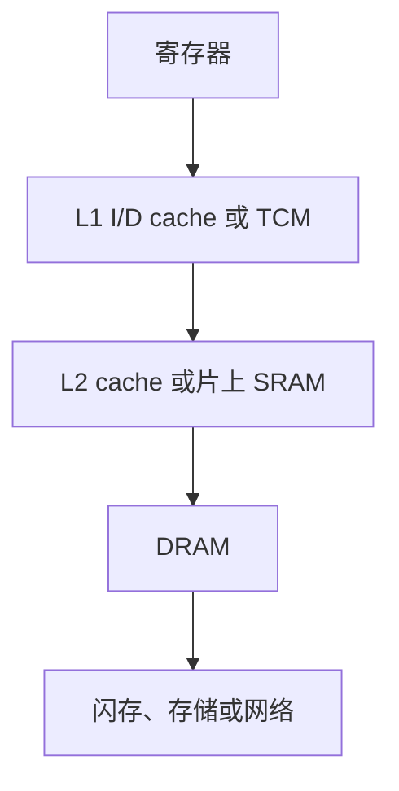
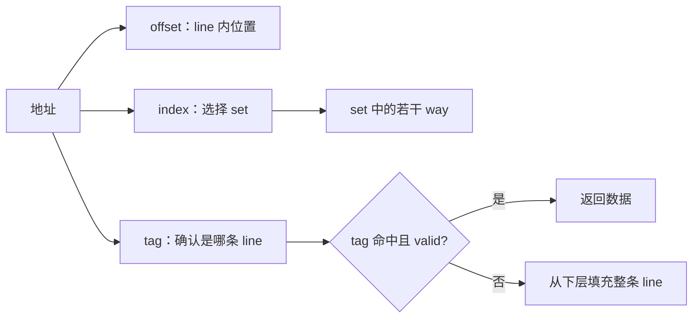
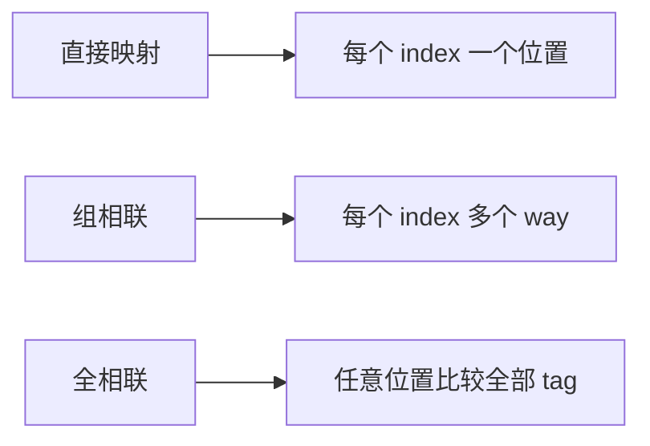
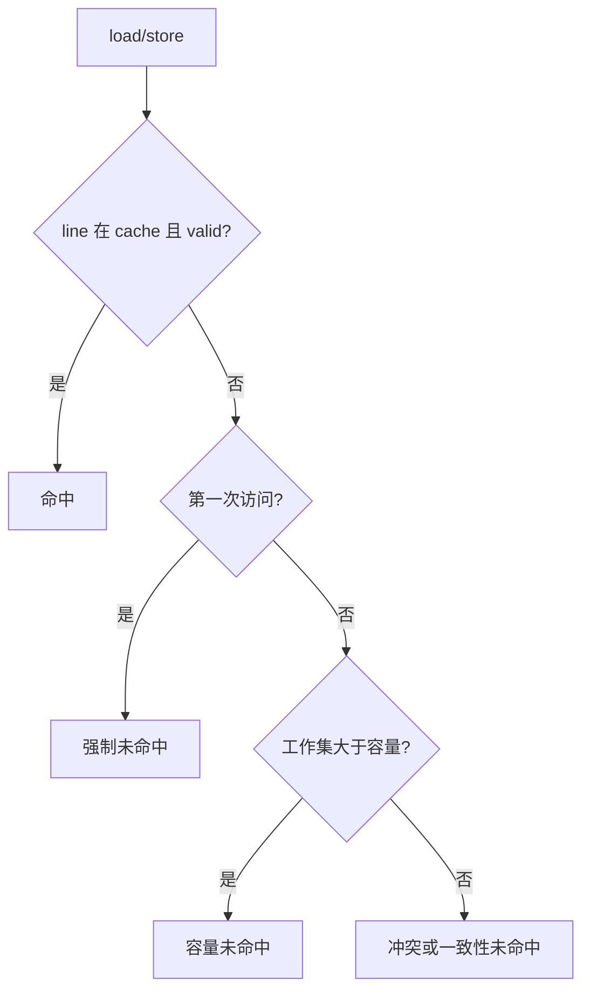
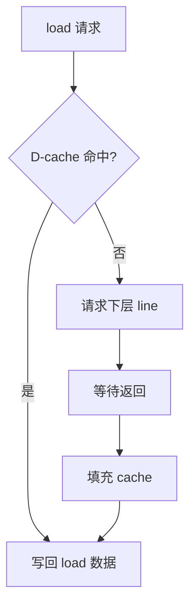
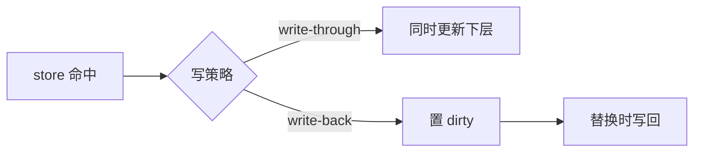
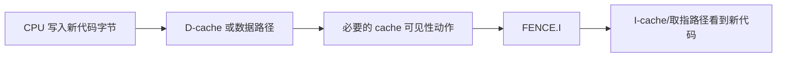
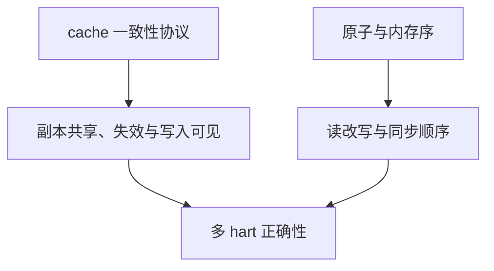
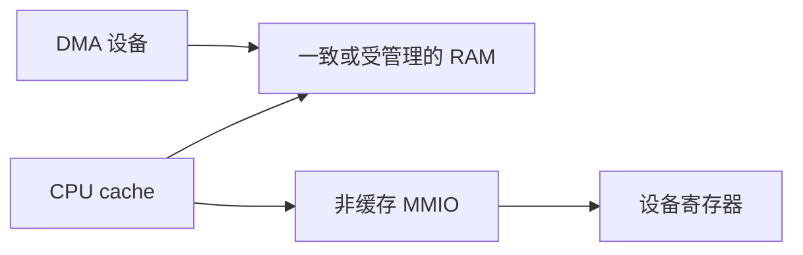
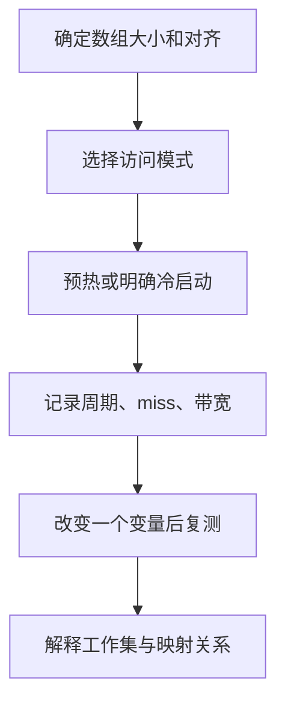

CPU 流水线可以每周期推进指令。

外部 DRAM 的访问延迟却常以远多于一个周期计。

缓存的作用是在时间局部性和空间局部性成立时，让常用数据靠近执行单元。

它不是一块“容量较小但更快的 RAM”。

它还包含地址映射、有效位、替换策略、脏数据处理和一致性规则。

本文讨论通用微架构概念。

某个 RISC-V 软核是否有 I-cache、D-cache、写策略或硬件一致性，必须看其 RTL 和 SoC 集成。

## 1. 访存层次是在容量、延迟和带宽间分工

寄存器最靠近执行单元，容量最小。

L1 cache 通常追求低延迟。

更低层 cache、片上 SRAM 和 DRAM 提供更大容量。

存储设备与网络位于更慢的层级。



层次不是所有系统都完整具备。

一个小型 FPGA 软核可能用 tightly coupled memory，根本没有 cache。

一个 Linux SoC 可能有多级 cache、DRAM 控制器和 IOMMU。

代码优化前必须先知道实际结构。

## 2. Cache line 是搬运和替换的基本单位

CPU 通常不只取一个字节或一个 word。

它按 cache line 粒度将相邻数据带入缓存。

当程序顺序遍历数组时，空间局部性能使一条 line 中的多个元素受益。



地址可分为 tag、index 和 offset。

index 选择 cache set。

tag 区分映射到同一 set 的不同内存块。

offset 选择 line 内字节或 word。

## 3. 映射方式决定冲突行为

直接映射 cache 每个内存块只能放入一个位置。

组相联 cache 让一个 set 包含多个 way。

全相联允许任何块进入任何位置，但查找代价更高。



直接映射硬件简单，但若两个热地址映射到同一行，会不断互相挤出。

组相联降低冲突未命中，但需要多个 tag 比较器和替换策略。

容量、line 大小、way 数和工作集形状共同决定效果。

不要只看 cache 总容量。

## 4. 命中、强制未命中、容量未命中与冲突未命中

第一次访问一块数据常出现强制未命中。

工作集超过 cache 容量会出现容量未命中。

地址映射互相竞争会出现冲突未命中。

多核一致性还会引入失效相关的未命中。



不同未命中需要不同优化。

强制未命中可通过预取或合并访问降低影响。

容量问题通常需要分块算法或更大存储层。

冲突问题可能通过数据布局、padding 或更高相联度改善。

## 5. 读操作在 miss 时需要保持流水线一致

load 命中时可在较短延迟返回。

load miss 时，数据通路需要发出下层请求，等待填充，再恢复相关指令。

简单 in-order 核可停顿整个流水线。

复杂核可以让无依赖指令继续执行。



功能正确性要求重复请求、exception、flush 和 replacement 时不会丢失或重复执行 store。

性能验证则需要统计 hit、miss、stall cycle 与有效带宽。

只看平均 CPI 无法判断是 cache 问题还是分支/总线问题。

## 6. 写回与写穿影响可见性和带宽

write-through 在每次 cache 写命中时也将数据写到下层。

write-back 只在 line 被替换或显式清理时将脏数据写回。

write-back 减少下层写带宽，但引入 dirty bit 与写回状态机。



write allocate 与 no-write-allocate 决定 store miss 是否先把整条 line 取入。

选择受 workload、总线带宽、DMA 需求和实现复杂度影响。

一个简单 MCU 可能直接使用非缓存 RAM；一个高性能 SoC 则使用多级 write-back cache。

## 7. I-cache 与 D-cache 分离带来新的一致性问题

分离的 I-cache 和 D-cache 可以让取指与数据访问并行。

但如果程序修改代码所在内存，写入 D-cache 的新指令未必立刻被 I-cache 看见。

RISC-V 为指令取值同步定义了 `FENCE.I` 扩展语义。

使用动态代码生成、bootloader 复制代码或自修改测试时，必须遵循相应的 cache 与 `FENCE.I` 规则。



普通应用业务代码不应随意插入 `FENCE.I`。

它是对特定“数据变成指令”边界的协议操作。

## 8. 多 hart 一致性不等于原子性

多 hart 读取同一 cache line 时，各自 cache 可能有副本。

硬件一致性协议负责让写入、失效和共享状态满足系统承诺。

原子操作负责特定读改写与排序的语言/ISA 语义。

两者都需要，且范围不同。



一些 FPGA 多核系统没有硬件一致 cache。

这时共享内存软件需要选择非缓存区域、软件 cache 维护或消息传递。

不能因为各 hart 都使用同一物理 DDR，就假设其私有 cache 自动一致。

## 9. DMA 与 MMIO 是 cache 优化最危险的边界

DMA 设备直接读写主存。

MMIO 寄存器则通常要求不可缓存且具有 I/O 排序语义。

把 MMIO 映射成 cacheable 内存可能让同一次设备读被合并、延迟或根本不发到设备。



DMA 发送前，CPU 可能需要将脏 cache line 清到内存。

DMA 接收后，CPU 可能需要使本地旧 line 失效再读取。

具体操作由平台 cache 控制器、操作系统 DMA API 或 IOMMU 属性决定。

CPU 原子与普通 `fence` 不会自动替你完成这些 cache 维护。

## 10. 性能实验需要控制工作集和访问模式

可用顺序访问、固定 stride、随机访问和矩阵分块对比 cache 行为。

```c
for (size_t i = 0; i < n; ++i) {
  sum += array[i];
}
```

再将索引改为大 stride 或随机置换。

记录 cycle counter、cache miss counter 和处理的数据量。

未实现性能计数器的软核可在仿真中统计内存请求和 stall cycle。



不要把带串口打印的循环用于 cache benchmark。

I/O 延迟会淹没内存访问差异。

## 11. 常见失败模式

| 症状 | 先检查 | 常见原因 |
| --- | --- | --- |
| 顺序数组仍很慢 | line 大小、总线和工作集 | cache 不存在、未启用或数据超容量 |
| 两个数组交替访问抖动 | index 映射 | 直接映射或低相联冲突 |
| DMA 接收旧数据 | cache 维护 | CPU 保留旧 cache line |
| DMA 发送数据缺失 | dirty line | 写回数据尚未到内存 |
| 写代码后仍执行旧指令 | I/D 一致性 | 漏掉平台所需的同步和 `FENCE.I` |
| 读设备寄存器值不变 | MMIO 属性 | 被缓存或错误使用普通内存访问 |
| 多 hart 看见不同缓冲内容 | 一致性域 | 非一致 cache 没有软件维护 |

## 12. 练习与验收

### 练习

1. 为一个给定 cache 容量、line 大小与相联度写出地址的 tag/index/offset 分解。
2. 设计两个映射到同一 set 的数组访问，观察冲突未命中。
3. 在 RTL 或仿真中分别统计 load hit、load miss、store miss 与写回次数。
4. 比较顺序、stride 和随机访问的周期与带宽。
5. 为一个 DMA 接收缓冲写出所有权转换与 cache 维护步骤。
6. 在复制可执行代码到 RAM 的实验中查阅目标平台规则，并验证取指同步。

### 本篇验收清单

- [ ] 能说明寄存器、cache、SRAM、DRAM 与设备存储的职责差异。
- [ ] 能分解地址的 tag、index、offset，并解释映射方式。
- [ ] 能区分强制、容量、冲突和一致性相关的未命中。
- [ ] 能解释写回/写穿和 allocate 策略的影响。
- [ ] 能说明 load miss 如何让流水线等待或重排。
- [ ] 能区分 I/D cache 同步、CPU 原子与多核一致性。
- [ ] 能为 DMA 与 MMIO 选择正确的不可缓存/cache 维护协议。
- [ ] 能用受控 benchmark 与计数器给出性能证据。

cache 优化的前提不是猜测，而是知道数据在哪一层、以什么 line 映射、由谁修改，以及观察者何时能看见更新。

> 🏷️ RISC-V · Cache · 内存层次 · DMA · MMIO · 一致性 · 性能
