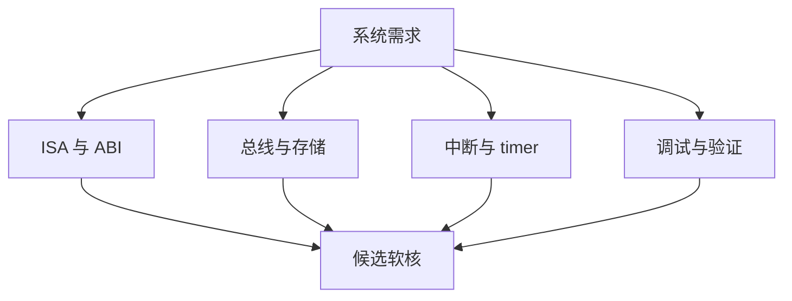
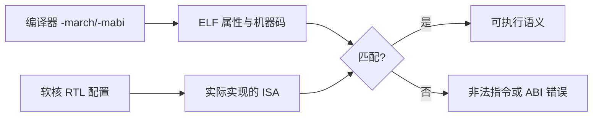
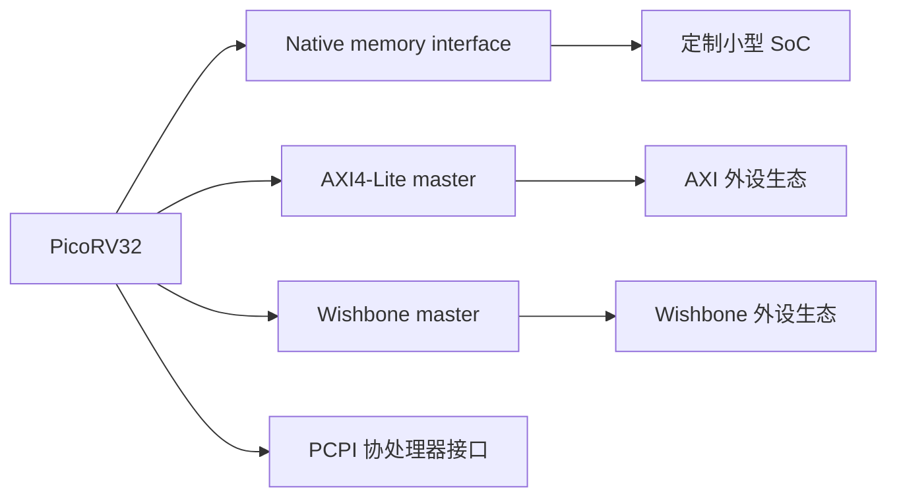
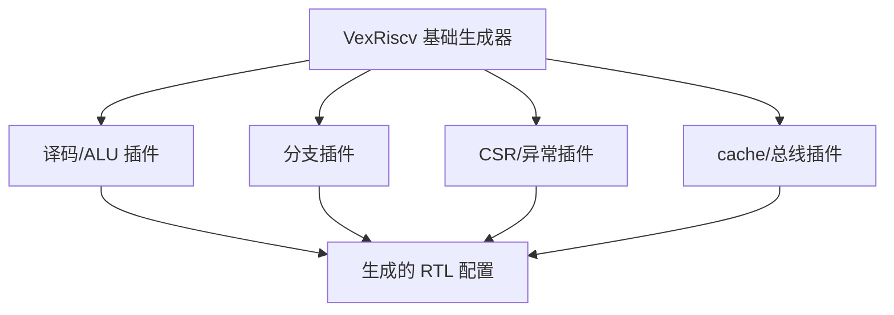
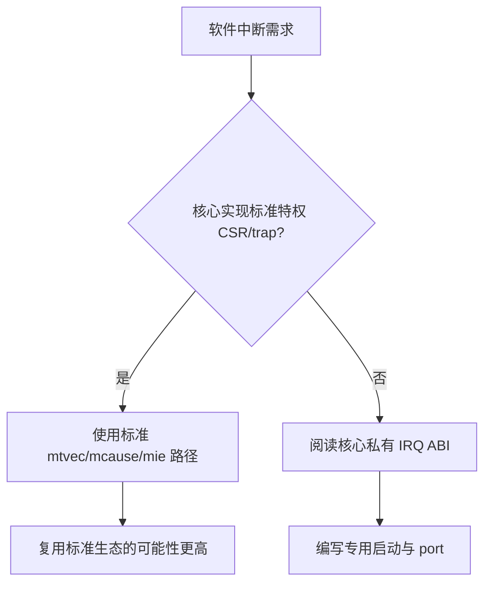
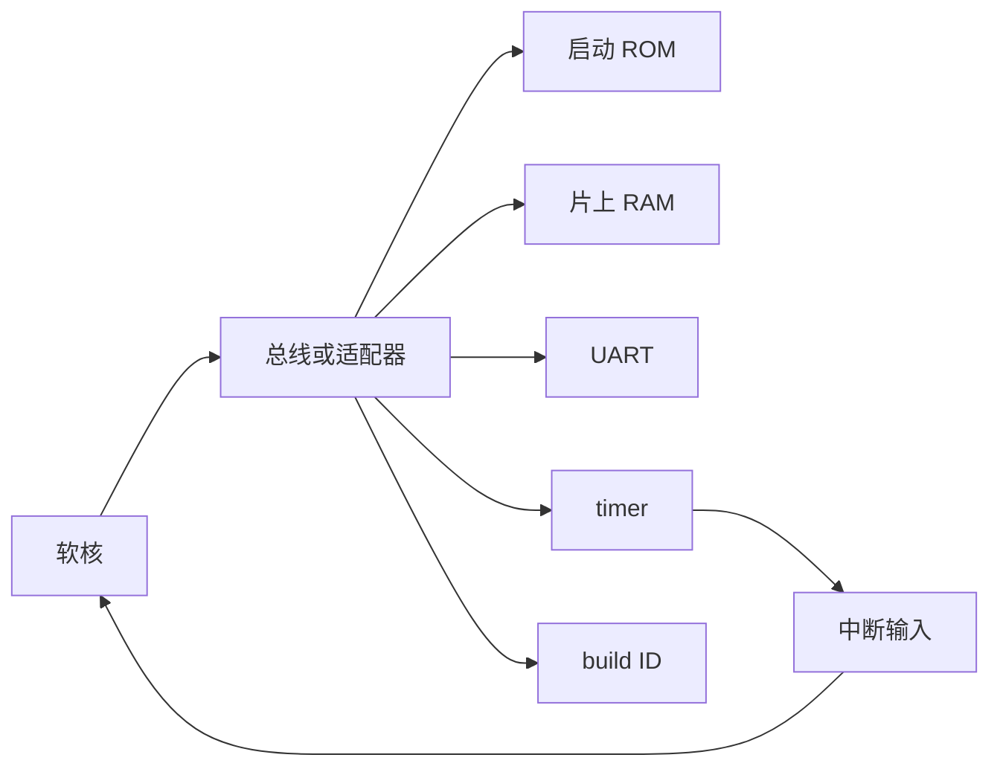
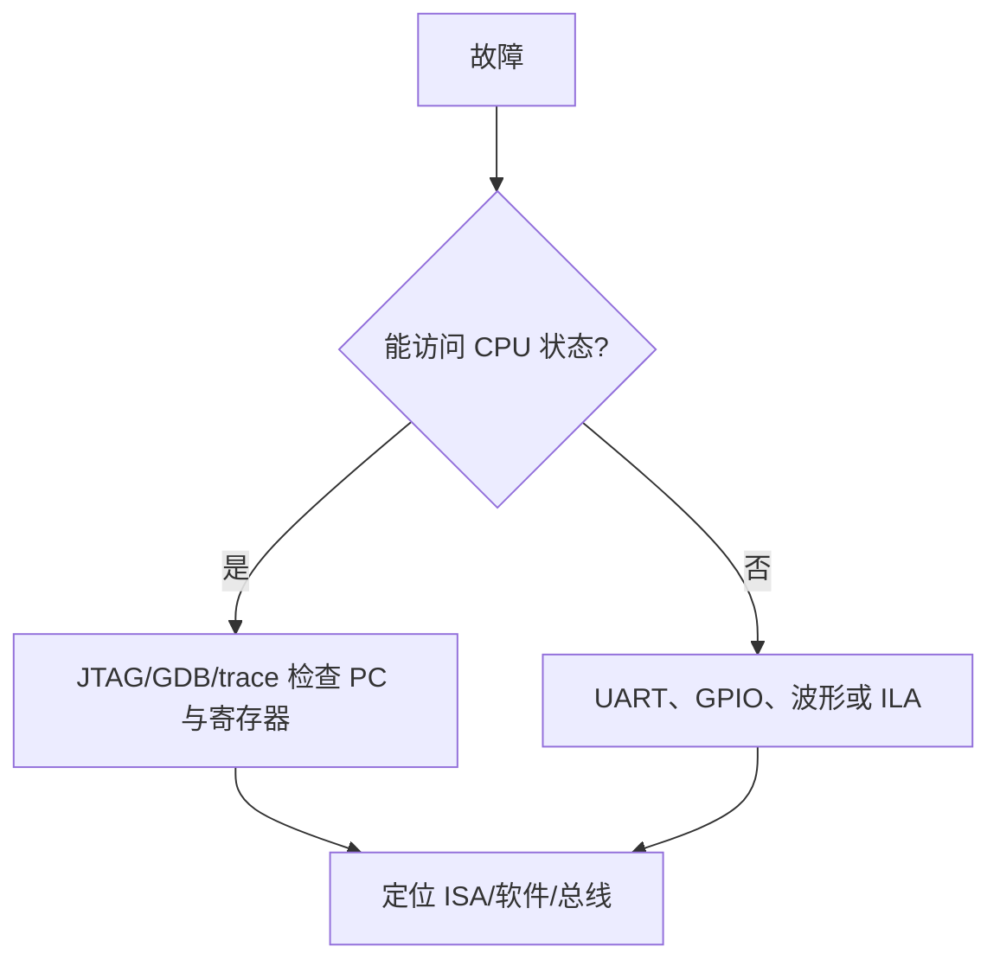

PicoRV32 和 VexRiscv 都常被用作 FPGA 上的 RISC-V 软核起点。

它们并不是“同一颗 CPU 的快慢版本”。

两者在实现语言、配置方式、流水线结构、总线接口和扩展策略上有不同取向。

选型前应先写清系统要解决的问题：面积优先、频率优先、软件生态、cache、调试、总线集成还是可验证性。

PicoRV32 上游将其定位为尺寸优化的 RV32 核，可配置为 RV32E/RV32I/RV32IC/RV32IM/RV32IMC，并提供 native、AXI4-Lite 和 Wishbone 变体。[PicoRV32 README](https://github.com/YosysHQ/picorv32/blob/main/README.md)

VexRiscv 上游则提供 FPGA 友好的 32 位 RISC-V 实现，并支持由插件配置 RV32I 的多种扩展组合。[VexRiscv](https://github.com/SpinalHDL/VexRiscv)

## 1. 先选择系统契约，再选择核心

软核是 SoC 的一个部件。

它需要和 ROM、RAM、时钟复位、互连、UART、timer、debug 和下载链路一起工作。

因此首要问题不是“哪颗核心最高频”。

而是它的接口和你已有系统是否匹配。

例如一个没有 cache、从片上 BRAM 启动的传感器节点，可能更看重面积与简单总线。

一个运行较复杂 RTOS 或需要高速外部 DDR 的系统，可能更看重流水线、cache 和成熟互连。

## 2. ISA 配置决定软件二进制能否执行

PicoRV32 的 README 列出可选的 RV32I、M、C、E 等配置。

VexRiscv 也通过插件组合提供不同指令集与特性。

编译器 `-march` 和 `-mabi` 必须与最终 RTL 完全匹配。

如果核心没有 M 扩展，而固件用了硬件乘除指令，执行会异常或需要软件库替代。

如果选择 RV32E，寄存器集合和 ABI 限制也与完整 RV32I 不同。

不能只因为 ELF 标题写了 RISC-V 就认为它能在任意软核运行。

## 3. PicoRV32 的接口取向

PicoRV32 上游提供 native memory interface、AXI4-Lite master 和 Wishbone master 变体。

这给简单 SoC 与既有总线生态提供不同接入方式。

其可选 PCPI 接口也允许把某些非分支类指令交给协处理器实现。

PCPI 是 PicoRV32 的实现接口。

它不是 RISC-V 标准 ISA 的通用外设协议。

使用 PCPI 实现乘法或自定义加速单元时，软件 ABI、异常行为和等待协议都应由设计明确说明。

## 4. VexRiscv 的插件化取向

VexRiscv 由 SpinalHDL 生成，并通过插件组合流水线能力、分支处理、缓存、CSR、debug 与扩展。

这让它适合做一系列配置探索。

同时也意味着“VexRiscv”不是单一固定的微架构答案。

在阅读或复用 VexRiscv 工程时，应先定位生成配置。

再确认该配置启用了哪些插件、ISA 扩展和总线参数。

直接阅读生成 Verilog 而不知道配置来源，容易把某次实验的选项误当成默认能力。

## 5. 面积、频率和 CPI 不能只用一个数字比较

较小核心可能节省 LUT/FF，却以多周期执行或较低 IPC 换取面积。

更深流水线和更多旁路可能提高频率，却增加控制复杂度和资源消耗。

cache 可能提升真实 workload 性能，也会增加 BRAM、tag RAM 和验证成本。

同一核心在不同 FPGA、约束、存储系统和编译器下的结果可能相差很大。

比较报告至少应包含目标器件、时钟约束、ISA 配置、BRAM/外部 RAM、综合工具版本和 benchmark 方法。

不带这些条件的“MHz”或“LUT”数字没有可迁移的结论。

## 6. 中断模型要特别核对标准兼容性

PicoRV32 README 说明其可选 IRQ 特性使用简单的自定义指令，并不遵循 RISC-V Privileged ISA 的 IRQ 处理方式。[PicoRV32 IRQ 说明](https://github.com/YosysHQ/picorv32/blob/main/README.md)

这对 bare-metal demo 可以很高效。

它也意味着面向标准 M 态 CSR/PLIC 的 FreeRTOS port 不能直接假定可用。

选择软核前，把 timer、中断进入、返回、全局屏蔽和 debug trap 写入兼容性清单。

这是 RTOS 与驱动能否复用的关键，不是收尾细节。

## 7. 从最小 SoC 开始集成

无论选 PicoRV32 还是 VexRiscv，先建立一个最小可验证闭环。

它至少包含 ROM、RAM、UART、timer 和一个可读的 build ID 寄存器。

先用固定链接脚本让 `_start`、栈和 `.bss` 在片上 RAM 可见。

再验证 UART 轮询输出。

然后加入 timer trap。

最后才接入复杂总线、cache、DMA 或外部 DDR。

每加一层都保留前一层的回归测试。

## 8. 仿真、形式验证和上板是互补证据

RTL 仿真适合快速定位时序和寄存器值。

形式验证适合证明特定 ISA/协议性质没有反例。

FPGA 上板适合验证时钟、复位、引脚约束与真实外设交互。

PicoRV32 上游仓库包含 testbench、firmware、指令测试和 VCD 路径，可作为阅读其验证组织的起点。[PicoRV32 验证入口](https://github.com/YosysHQ/picorv32/blob/main/README.md)

不同工具的通过结果回答不同问题。

“综合成功”不能替代指令级验证。

“仿真打印 hello”也不能替代时序收敛与硬件复位验证。

## 9. 调试接口与可观测性应在早期决定

调试器、JTAG、trace、性能计数器和内部逻辑探针都会影响软核集成方式。

在没有硬件 debug 模块的最小系统中，可先通过 UART、GPIO 和仿真波形定位。

但当软件规模增加，缺少可断点的 debug 路径会显著抬高问题成本。

选择核心时记录其 debug 支持与生成配置。

不要等固件复杂后再发现 debug 端口未连到顶层。

## 10. 常见选型误区

| 误区 | 更好的判断 |
| --- | --- |
| 只比较最大主频 | 比较真实 workload、存储系统和时序约束 |
| 只看是否写着 RV32I | 核对 M/C/E、CSR、IRQ、debug 和 ABI |
| 将私有 IRQ 当标准 trap | 阅读核心文档并建立专用 port 边界 |
| 直接接外部 DDR | 先跑通 ROM/RAM/UART/timer 最小 SoC |
| 认为生成的 RTL 等于固定默认配置 | 保存生成配置和工具版本 |
| 看到仿真输出就跳过验证 | 分别覆盖 ISA、总线、时钟复位和软件功能 |

## 11. 把软核配置记录成可复现输入

一次可比较的软核实验应保存配置，而不是只保存 bitstream。

推荐在版本控制中保留下表信息。

| 记录项 | 示例问题 |
| --- | --- |
| 核心提交版本 | RTL 来自哪个 commit 或发布标签？ |
| 生成配置 | 启用了哪些 ISA、cache、debug、IRQ 插件？ |
| 软件目标 | `-march`、`-mabi` 与链接脚本是什么？ |
| 目标器件 | 具体 FPGA 型号、speed grade 与开发板是什么？ |
| 时钟约束 | 输入时钟、目标频率和时序约束是什么？ |
| 存储结构 | ROM/RAM/DDR 的容量、端口和延迟是什么？ |
| 工具版本 | 综合、实现、仿真器和编译器的版本是什么？ |
| 测试负载 | 测的是指令回归、Dhrystone 还是实际应用？ |

配置文件、综合报告和 ELF 应能互相追溯。

这份记录也是设计评审与复现实验的输入。

这样当某次频率或软件行为变化时，才能区分是 RTL、约束、工具链还是 benchmark 改变造成的。

## 12. 练习与验收

### 练习

1. 为你的应用列出 ISA、RAM、UART、timer、IRQ 和 debug 的最小需求。
2. 从 PicoRV32 README 中选一个接口变体，画出它到 RAM/UART 的连接图。
3. 从一个 VexRiscv 生成配置中列出启用的插件和对应软件假设。
4. 为核心配置生成匹配的 `-march`、`-mabi`，再用 `readelf -A` 核对 ELF 属性。
5. 设计最小 SoC 的 ROM、RAM、UART、timer 回归测试顺序。
6. 为一个非标准 IRQ 核写出与标准 M 态 port 的差异清单。

### 本篇验收清单

- [ ] 能以系统接口而不是单一性能数字选择软核。
- [ ] 能让编译 ISA/ABI 与 RTL 配置严格匹配。
- [ ] 能说明 PicoRV32 的 native、AXI4-Lite、Wishbone 与 PCPI 接口边界。
- [ ] 能从 VexRiscv 的生成配置而非名称推导实际特性。
- [ ] 能区分面积、频率、CPI、cache 与 workload 的关系。
- [ ] 能核对核心 IRQ 是否兼容标准特权 trap 生态。
- [ ] 能按 ROM/RAM/UART/timer 建立最小可验证 SoC。
- [ ] 能把仿真、形式验证和上板视为不同层次的证据。

软核的价值不在于名字。

它来自一份可追溯的配置、一套匹配的软件 ABI 和一条从 RTL 到板上行为都可验证的系统链路。

> 🏷️ RISC-V · PicoRV32 · VexRiscv · 软核 · FPGA · RTL · SoC
