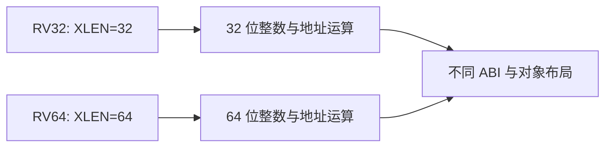
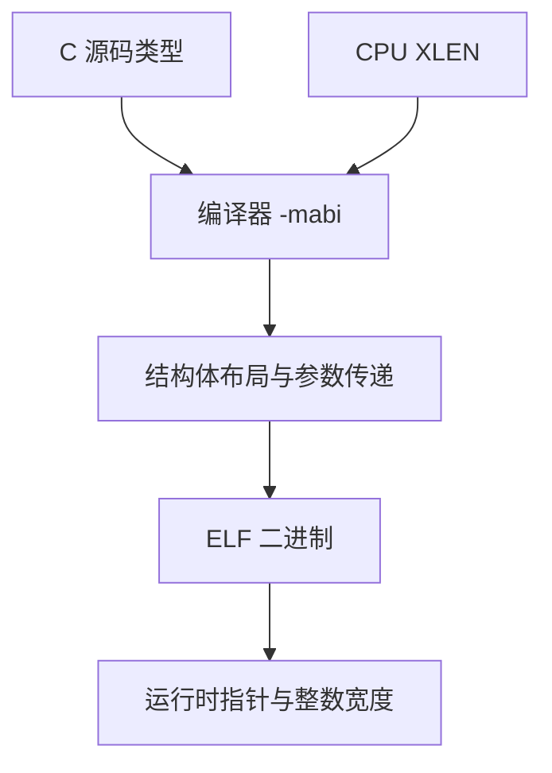
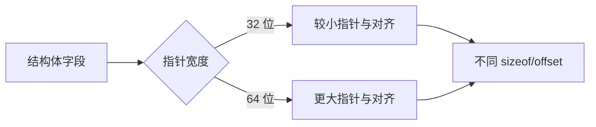
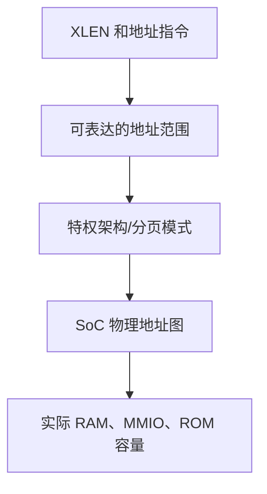
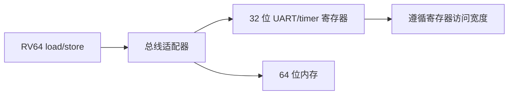
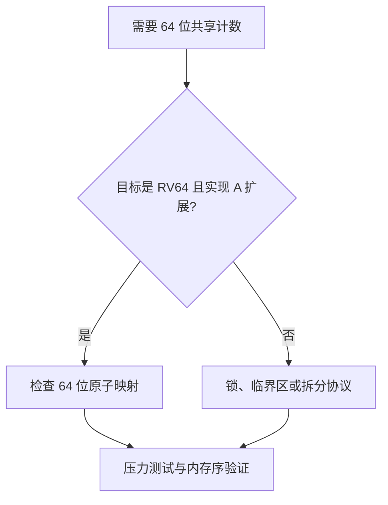
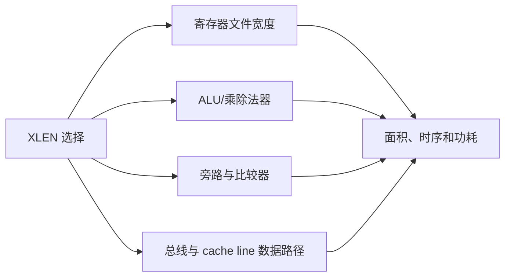
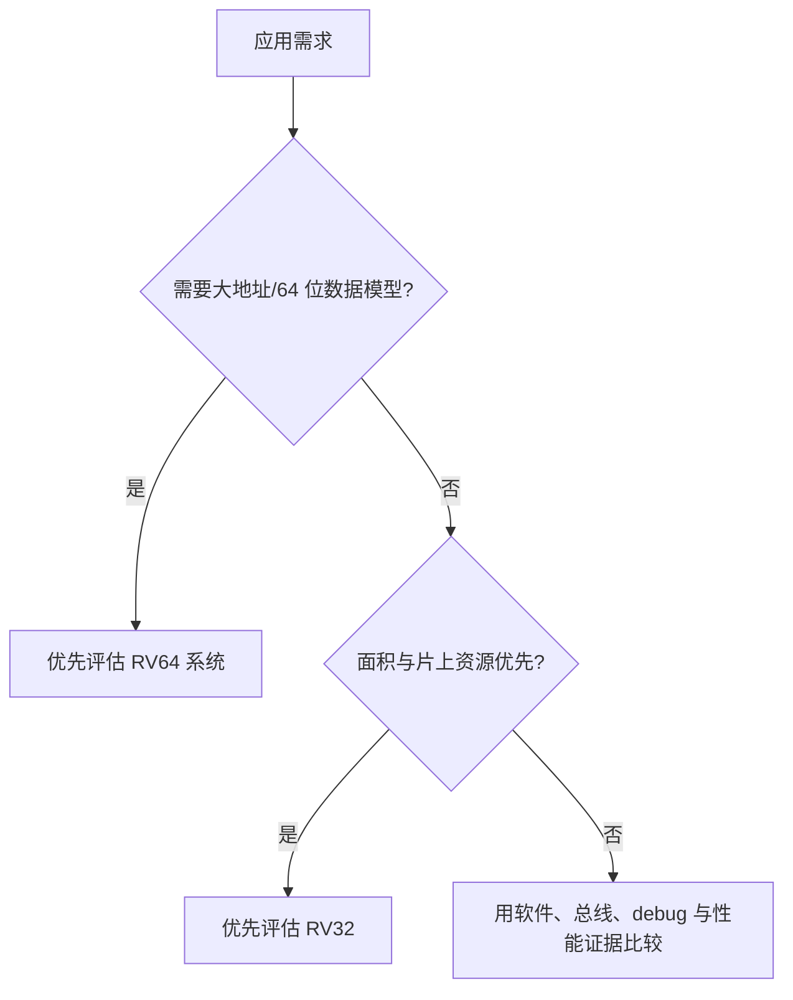

RV32 与 RV64 首先表示整数寄存器宽度 XLEN 为 32 或 64 位。

它们不是“同一个二进制只换一个编译开关”。

XLEN 会影响算术溢出、指针宽度、C 数据模型、调用约定、原子指令宽度、寄存器堆实现和总线数据通路。

在 FPGA 软核项目中，选择位宽应从软件与系统需求出发。

不要仅因为 QEMU `virt` 的常见例子使用 RV64，就把 RV64 当成所有嵌入式设计的默认答案。

RISC-V psABI 对不同 XLEN 的数据模型、参数传递和栈约定分别作出定义。[RISC-V psABI](https://riscv-non-isa.github.io/riscv-elf-psabi-doc/)

## 1. XLEN 是整数寄存器和基础算术宽度

RV32 的通用整数寄存器宽度为 32 位。

RV64 的通用整数寄存器宽度为 64 位。

两者都有 x0 到 x31 的完整整数寄存器编号，除非使用 E 精简配置。



寄存器数量并没有因为 RV64 自动翻倍。

变化的是每个寄存器中可容纳的整数位数。

这会影响 ALU、寄存器文件、旁路网络和数据总线的宽度。

## 2. C 类型大小由 ABI 决定，不能只看 CPU 名称

在常见 LP64 数据模型中，`long` 和指针为 64 位。

在常见 ILP32 数据模型中，`int`、`long` 和指针为 32 位。

但源码中出现 `long` 不足以推断二进制的真实 ABI。

必须检查 `-mabi`、编译器目标和 ELF 属性。



例如把一个指针强转为 `uint32_t`，在 RV64 上可能截断高位。

把 `size_t` 格式化为固定 `%u` 也可能产生错误输出。

跨位宽项目应使用 `<stdint.h>` 的精确宽度类型，并使用适当的 `PRIuPTR`、`PRIx64` 等格式宏。

## 3. 指针宽度改变内存布局与协议

指针字段出现在链表、队列、虚表、内核对象、设备描述符和调试帧中。

在 RV64 ABI 下，它通常比 RV32 ABI 占用更多字节。

结构体 padding 也会变化。



不能把 RV32 固件的二进制数据包直接用 `memcpy` 解释为 RV64 进程中的同一个 C 结构。

对外协议应定义固定字节序、固定字段宽度和显式序列化。

寄存器描述符也应使用 `uint32_t`、`uint64_t` 与 offset，而不是 host 指针大小。

## 4. RV64 有专门的 32 位算术语义

RV64 并不是所有操作都天然以 64 位计算。

它还提供以 32 位结果为语义、再符号扩展到 64 位寄存器的 W 类指令。

这使编译器能正确实现 32 位 `int` 运算。


阅读 RV64 反汇编时，`addw`、`sllw` 一类指令不是“性能较差的 add”。

它们携带 C 语言 32 位运算的结果宽度语义。

移植汇编时要明确想要 XLEN 运算还是 32 位结果运算。

## 5. 地址空间能力不等于系统真的有那么多内存

RV64 能表达更宽的虚拟和物理地址。

这不代表一个 RV64 软核必须连接大容量 DDR。

同样，RV32 系统也可能通过分页、MMU 或设备窗口管理复杂系统。



真实可用地址由 SoC 地址解码、互连、DDR 控制器、页表模式和操作系统共同决定。

不要因为 RV64 指针是 64 位，就在链接脚本中随意使用超出实际 BRAM/DDR 的地址。

## 6. 总线与外设寄存器仍需精确定义宽度

RV64 CPU 可以执行 64 位 load/store。

外设寄存器却经常是 8、16 或 32 位。

在 32 位 MMIO 寄存器上做无约束的 64 位访问，可能跨越两个寄存器，或被总线适配器拒绝。



驱动应使用寄存器规范要求的读写宽度。

并用 `volatile uint32_t`、访问器函数或 OS 提供的 readl/writel 类接口表达意图。

这比用 `uintptr_t` 直接解引用更容易审核。

## 7. 原子操作宽度和 lock-free 能力也不同

RV32 A 扩展提供 32 位原子操作。

64 位原子是否 lock-free 取决于 ISA 扩展、实现与编译器支持。

RV64 则自然具备 XLEN 为 64 位的原子操作语义。



不要在 RV32 上假定 `uint64_t` 的普通读写天然原子。

读取高低半字跨越回绕时可能得到拼接值。

定时器与计数器章节中的安全读取模式同样适用。

## 8. FPGA 资源差异来自整个数据通路

把整数 ALU、寄存器文件、比较器、旁路、地址生成和总线通路从 32 位扩到 64 位，通常会增加资源和布线压力。

但增长并非总是严格两倍。

FPGA 的 LUT、BRAM、DSP、综合优化和接口宽度都会影响结果。



因此需要在目标 FPGA 和真实约束下综合。

不要用一个通用“RV64 必然两倍资源”的口号做设计决策。

## 9. 软件生态与系统目标的典型取舍

小型裸机、控制循环、GPIO/UART、简单 RTOS 任务和片上 RAM 常能在 RV32 中得到很好的平衡。

需要大地址空间、64 位整数密集计算、较完整 Linux 用户态或某些高层软件栈时，RV64 更自然。



这不是绝对分类。

RV32 也能运行复杂系统，RV64 也能做小型裸机。

工程选择取决于全系统约束。

## 10. 构建与调试检查

构建时明确目标参数。

```cmake
target_compile_options(firmware PRIVATE
  -march=rv32imac
  -mabi=ilp32
)
```

或：

```cmake
target_compile_options(firmware PRIVATE
  -march=rv64imac
  -mabi=lp64
)
```

链接脚本的地址、启动汇编的 `lw/sw` 或 `ld/sd`、FreeRTOS 的 `StackType_t` 和 MMIO 访问器都要与目标一起审查。

```powershell
riscv64-unknown-elf-readelf -h firmware.elf
riscv64-unknown-elf-readelf -A firmware.elf
riscv64-unknown-elf-objdump -d -M no-aliases firmware.elf
```

工具前缀不必等同于最终目标位宽。

某些工具链使用 riscv64 前缀也能产生 RV32 ELF。

应以 ELF header、attributes 和指令内容判断。

## 11. 常见失败模式

| 症状 | 先检查 | 常见原因 |
| --- | --- | --- |
| RV64 程序指针异常 | 指针截断与格式化 | 把地址存进 32 位整数 |
| RV32 核遇非法指令 | `-march` | 编译器生成 RV64 或未实现扩展指令 |
| 外设寄存器错位 | MMIO 访问宽度 | 对 32 位寄存器做 64 位访问 |
| 任务栈大小变化 | `StackType_t` 与 ABI | 以字节而非 word 估算 |
| 二进制协议字段错位 | 结构体 layout | 在不同 ABI 间直接传裸结构体 |
| 64 位计数偶发错误 | RV32 原子/读取 | 把双 word 读写当原子 |
| 资源超过 FPGA | 全数据通路 | 未在目标器件下综合和约束 |

## 12. 练习与验收

### 练习

1. 用 RV32 和 RV64 分别编译同一结构体定义，比较 `sizeof` 与字段 offset。
2. 在 RV64 中故意把一个指针截断为 32 位，使用编译器告警和 GDB 观察错误。
3. 为一个 32 位 MMIO UART 写访问器，确认 RV64 软件不会做宽访问。
4. 比较 `add` 与 `addw` 的反汇编和边界输入结果。
5. 在 RV32 实现中为 64 位计数器设计安全读取或锁保护。
6. 对同功能 RV32/RV64 软核在同一 FPGA、同一约束下做资源与频率报告。

### 本篇验收清单

- [ ] 能说明 XLEN 影响寄存器宽度而非通用寄存器数量。
- [ ] 能用 `-march`、`-mabi`、ELF 属性确认实际软件目标。
- [ ] 能预判指针宽度导致的结构体、协议与格式化差异。
- [ ] 能解释 RV64 W 类指令的 32 位语义。
- [ ] 能让 MMIO 访问宽度服从设备规范，而非 CPU 最大位宽。
- [ ] 能评估 RV32/RV64 的原子和 64 位计数风险。
- [ ] 能在目标 FPGA 上测量整条数据通路的资源/时序影响。
- [ ] 能依据系统目标而非标签选择位宽。

RV32 与 RV64 的选择，是软件模型、硬件数据通路和系统地址空间的一次共同取舍。

位宽迁移前，应把 ABI、链接、MMIO、栈、协议和性能报告放进同一次评审。

只修改编译选项而不检查这些接口，不构成完成的移植。

把 ABI 和外设接口一起纳入决策，位宽才会成为系统能力，而不是移植陷阱。

> 🏷️ RISC-V · RV32 · RV64 · XLEN · psABI · 软核 · FPGA
