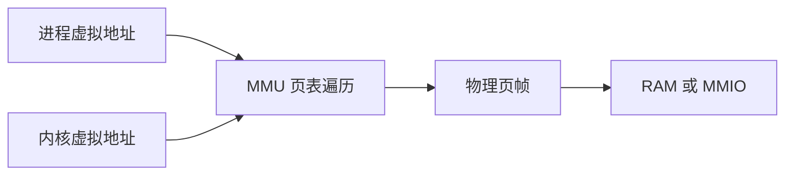
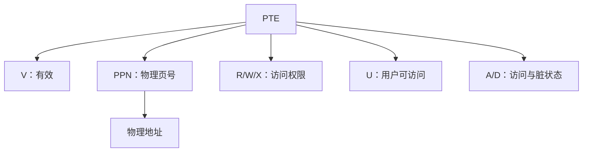
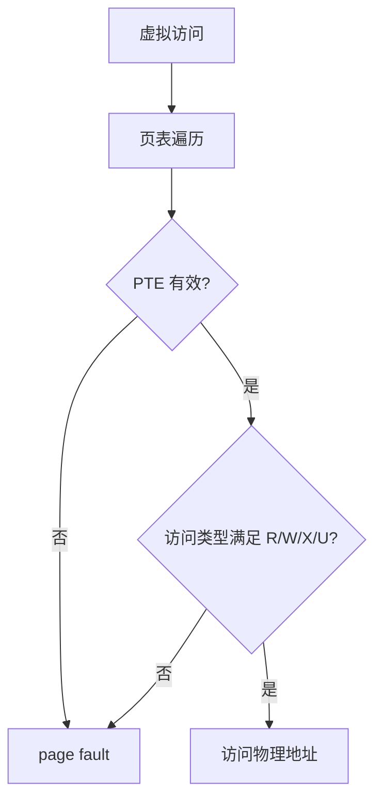
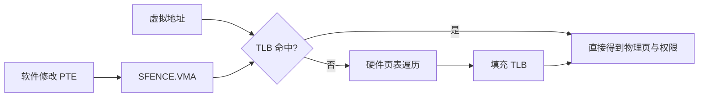
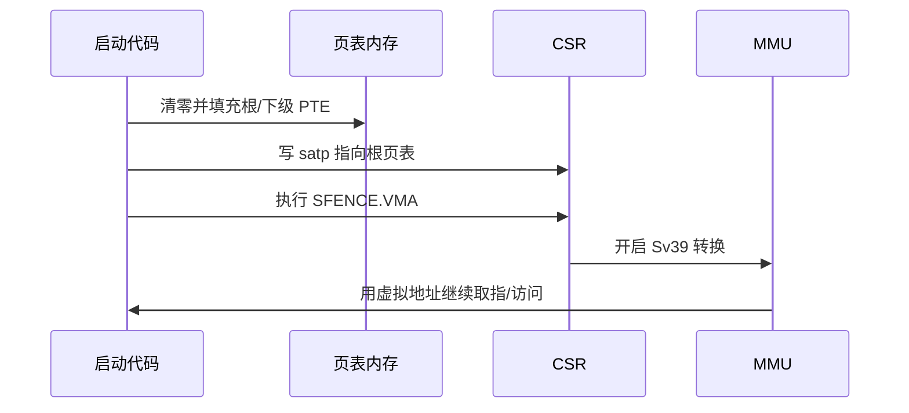

裸机链接脚本直接把符号放在物理地址上。

进入带 MMU 的系统后，内核与进程使用的是虚拟地址。

硬件通过页表把虚拟地址翻译为物理地址，并在过程中检查权限。

Sv39 是 RV64 监督级地址转换的一种常见模式。

它定义 39 位有效虚拟地址、三级页表和 4 KiB 基页的基本结构。

具体系统是否选择 Sv39、Sv48 或其他模式，取决于 CPU 与内核配置。

规范中的 `satp`、PTE、地址转换和 `SFENCE.VMA` 规则应以官方特权 ISA 为准。[RISC-V 特权 ISA](https://docs.riscv.org/reference/isa/privileged.html)

## 1. 虚拟地址把软件视图与物理布局分开

一个进程可将相同虚拟地址用于自己的代码、堆和栈。

不同进程的同一虚拟地址可以映射到不同物理页。

内核还能选择映射自身、高端设备区或共享页。



地址转换不只是便利的重定位。

它也是进程隔离和页级访问控制的基础。

没有正确页表权限，用户态写内核页或执行不可执行页应触发 page fault。

## 2. Sv39 的规范地址与三级索引

Sv39 使用虚拟地址低 39 位形成地址转换输入。

高位必须满足规范地址的符号扩展要求。

虚拟地址被分成 VPN[2]、VPN[1]、VPN[0] 和页内 offset。

每级 VPN 通常为 9 位，offset 为 12 位。

```text
63                              39 38      30 29      21 20      12 11        0
| sign extension of bit 38         | VPN[2]   | VPN[1]   | VPN[0]   | page offset |
```

```mermaid
flowchart LR
    V[虚拟地址] --> A[VPN[2]：根页表索引]
    V --> B[VPN[1]：二级索引]
    V --> C[VPN[0]：三级索引]
    V --> D[12 位页内偏移]
    A --> R[根页表]
    B --> L1[二级页表]
    C --> L0[叶子页表]
```

高位符号扩展检查很重要。

一个不满足规范形式的虚拟地址不能被当作“只是更大的物理地址”。

它会导致地址转换异常。

## 3. PTE 同时编码物理页号与权限

每个页表项 PTE 包含物理页号 PPN 与状态/权限位。

典型权限包括 V、R、W、X、U、G、A、D。

V 表示有效。

R/W/X 控制读、写、取指。

U 控制用户模式是否可访问。



PTE 中 R、W、X 的组合有规范约束。

例如无效组合和没有 V 的 PTE 不可作为正常映射使用。

操作系统页表代码应通过明确的 helper 构造 PTE，不应手写散落的常量。

## 4. 硬件页表遍历从 `satp` 给出的根开始

`satp` 选择地址转换模式，并提供根页表物理页号和 ASID 等信息。

当 S 态访问虚拟地址时，硬件从根页表开始，用 VPN[2] 找到第一项。

若该项是非叶子项，继续用 VPN[1] 和 VPN[0] 遍历。

若找到叶子项，组合 PPN 与 offset 得到物理地址。

```mermaid
flowchart TD
    A[satp: mode, ASID, root PPN] --> B[VPN[2] 查根页表]
    B --> C{叶子 PTE?}
    C -- 否 --> D[VPN[1] 查下级页表]
    D --> E{叶子 PTE?}
    E -- 否 --> F[VPN[0] 查末级页表]
    F --> G{有效叶子 PTE?}
    C -- 是 --> H[大页映射检查]
    E -- 是 --> H
    G -- 是 --> H
    G -- 否 --> X[page fault]
    H --> P[组合 PPN 与 offset]
```

叶子可以出现在不同层级，对应不同大小的页映射。

大页可以减少页表层数和 TLB 压力。

它也要求 PPN 对齐满足对应页大小。

初学阶段可先只实现 4 KiB 叶子页映射，再扩展大页。

## 5. 权限检查与 page fault 是系统保护的一部分

地址能翻译并不表示访问一定被允许。

取指需要 X。

加载需要 R。

存储需要 W。

用户模式还受 U 位和监督级访问控制相关规则影响。



page fault handler 要区分取指、加载和存储 fault。

还要记录 faulting virtual address 与当前页表上下文。

Linux、教学内核和 bootloader 对 fault 的恢复策略不同。

无论策略如何，不能把 fault 当成“硬件随机跳转”。

## 6. TLB 缓存翻译，修改页表后需要同步

每次访存都走三级页表会很慢。

TLB 缓存最近使用的虚拟页到物理页翻译与权限。

当软件修改页表后，旧 TLB 项可能仍存在。

因此必须使用 `SFENCE.VMA` 按规范同步地址转换状态。



`SFENCE.VMA` 不是普通通用内存 fence 的替代名字。

它针对地址转换缓存和页表更新的可见性语义。

多 hart 系统还可能需要在其他 hart 上执行相应同步。

操作系统通常通过 IPI 和体系结构 helper 协调这一过程。

## 7. 建立最小页表的启动顺序

教学内核可先建立几个必要映射。

例如内核代码/RAM、UART MMIO、启动栈和 trap 向量所在页。

页表本身必须位于可从关闭/开启 MMU 两种状态正确访问的物理内存。



切换瞬间最容易出错。

写入 `satp` 后的 PC、栈、trap 向量和访问地址必须在新旧视图下都有定义，或通过受控跳转完成切换。

不要在尚未映射的虚拟地址执行下一条指令。

## 8. 调试页表需要同时看 VA、PTE 与 PA

只打印一个十六进制地址不能判断故障。

调试记录应包含当前特权级、`satp`、fault VA、访问类型、三级 VPN、每级 PTE 和最终 PA。

```text
satp=...
fault_va=...
vpn2=... vpn1=... vpn0=...
pte2=... pte1=... pte0=...
access=load/store/execute
```

可在 QEMU 中通过 GDB、页表 dump 和内核日志交叉验证。

QEMU 的 `virt` 自动生成 DTB，设备地址和 RAM 范围应从该平台描述获得，而非给页表代码写入任意常数。[QEMU virt 与 DTB](https://qemu.readthedocs.io/en/master/system/riscv/virt.html)

## 9. 常见失败模式

| 症状 | 先检查 | 常见原因 |
| --- | --- | --- |
| 写 satp 后立刻 fault | 下一条 PC/栈映射 | 打开 MMU 前只映射数据，漏掉代码或栈 |
| 用户程序读到内核页 | U/R/W/X 权限 | PTE 标志过宽或切换页表错误 |
| 修改 PTE 后仍看到旧映射 | TLB 同步 | 漏掉 `SFENCE.VMA` 或多 hart shootdown |
| 大页映射 fault | PPN 对齐 | 在高层叶子填入未对齐物理页号 |
| UART 消失 | MMIO 映射属性 | 漏映射设备页或用错物理地址 |
| 随机 page fault | 页表内存被覆盖 | 页表/栈/堆布局没有保护 |
| 高地址访问异常 | Sv39 规范地址 | 高位没有按 bit 38 符号扩展 |

## 10. 最小映射审查表

在首次打开 Sv39 前，逐项核对下表。

| 对象 | 必要映射 | 关键检查 |
| --- | --- | --- |
| 当前执行代码 | X 与 R | 开启 `satp` 后下一条 PC 是否可取指 |
| 当前栈 | R 与 W | `sp` 所在页是否有写权限 |
| trap 入口 | X | fault 发生时向量页是否可执行 |
| 页表自身 | R 与 W | 硬件遍历和软件更新是否能访问 |
| UART/MMIO | 按设备定义 | 物理地址、页属性和访问宽度是否正确 |
| 内核数据 | R 与 W | 用户页表是否意外映射它 |
| 用户代码 | U、R、X | 是否禁止写入和内核执行权限泄漏 |

每修改一个映射，都记录旧 PTE、新 PTE、执行的同步操作和验证访问。

这种变更记录比单独保存最终页表 dump 更容易解释 fault。

## 11. 练习与验收

### 练习

1. 将一个 Sv39 虚拟地址分解为 VPN[2]、VPN[1]、VPN[0] 和 offset。
2. 构造一个 4 KiB 叶子 PTE，分别验证可读、可写、可执行和用户访问检查。
3. 建立仅映射内核代码、栈和 UART 的最小页表，切换 `satp` 后输出日志。
4. 修改一个 PTE 后有意省略 `SFENCE.VMA`，观察或推演旧 TLB 映射风险。
5. 为 page fault handler 输出访问类型、VA、三级 PTE 与 `satp`。
6. 为第二个 hart 设计一次页表更新同步流程，明确谁发 IPI、谁执行 fence。

### 本篇验收清单

- [ ] 能说明虚拟地址、物理地址、页表和页级权限各自负责什么。
- [ ] 能分解 Sv39 的三级 VPN 与页内 offset。
- [ ] 能解释 PTE 中 V、R、W、X、U、A、D 与 PPN 的作用。
- [ ] 能从 `satp` 根页表走完一次页表遍历。
- [ ] 能区分叶子、非叶子和大页映射的规则。
- [ ] 能在修改页表后使用 `SFENCE.VMA` 同步 TLB 视图。
- [ ] 能在启用 MMU 的切换瞬间保证 PC、栈和 trap 入口都有效。
- [ ] 能记录足够的 VA/PTE/PA 证据定位 page fault。

Sv39 不是一串 9 位索引。

它是硬件、页表代码、TLB 同步和权限策略共同维持的一份地址空间契约。

> 🏷️ RISC-V · Sv39 · MMU · 页表 · satp · TLB · SFENCE.VMA
