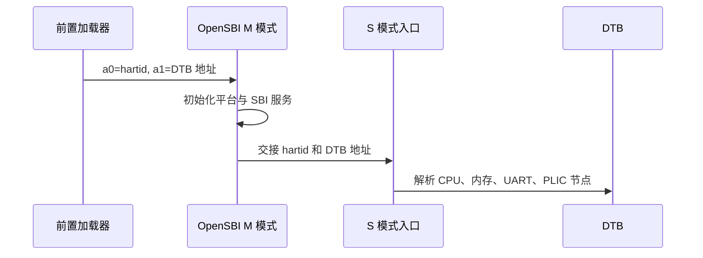
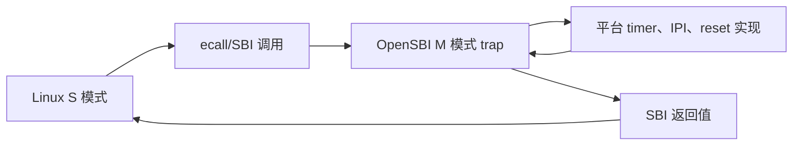
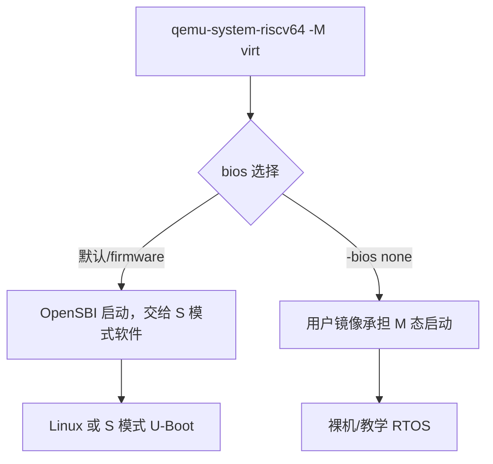
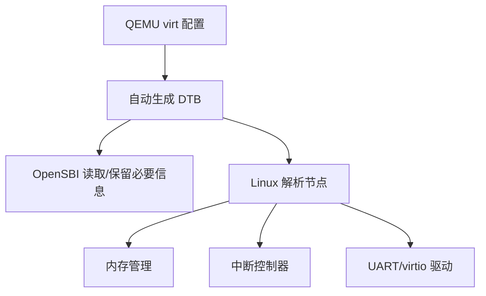
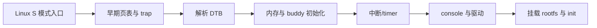
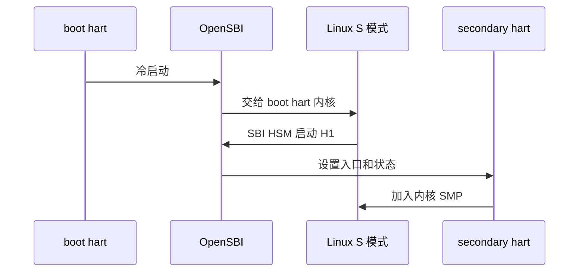
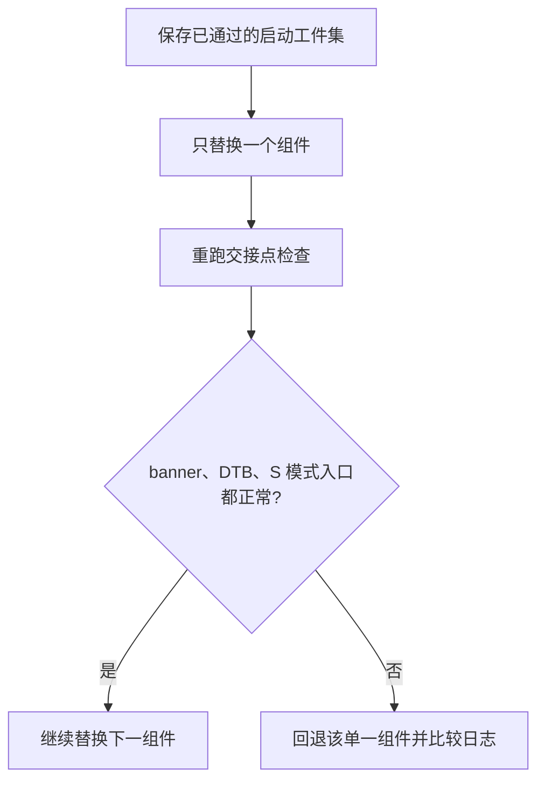

从 `-bios none` 的 M 态裸机转向 Linux 时，最容易犯的错误是继续把所有硬件寄存器当成内核可直接访问的资源。

在常见 RISC-V Linux 系统中，M 模式由平台固件持有。

OpenSBI 是 SBI 的开源参考实现，向 S 模式的 bootloader、hypervisor 或通用操作系统提供服务接口。[OpenSBI 项目说明](https://qemu.googlesource.com/opensbi/)

Linux 内核运行在 S 模式，并通过 SBI 请求特定的机器级服务。

QEMU `virt` 会自动生成 DTB 并传给客户机；客户机软件应从 DTB 发现设备地址和中断，而不是把教程常量写死。[QEMU virt 文档](https://qemu.readthedocs.io/en/master/system/riscv/virt.html)

## 1. 启动链是一组特权级交接

最早的阶段可能是 ROM、bootloader 或 QEMU 装载器。

它负责把固件、内核和 DTB 放入内存，并选择启动 hart。

OpenSBI 在 M 模式完成平台初始化并建立机器级 trap 服务。

它再把控制权交给 S 模式的下一阶段。


不同板卡的第一阶段名称和存储来源不同。

OpenSBI 文档将 firmware 类型区分为 `FW_JUMP`、`FW_PAYLOAD`、`FW_DYNAMIC` 等，适配不同前置阶段和下一阶段交接方式。[OpenSBI Firmware 类型](https://qemu.googlesource.com/opensbi/%2B/HEAD/docs/firmware/fw.md)

不要把某一块板卡的 flash 地址或 SPL 行为当作 QEMU `virt` 的固定规则。

## 2. a0 与 a1 是早期接口的关键输入

OpenSBI firmware 文档说明，前一启动阶段通过 `a0` 传入 hartid，通过 `a1` 传入对齐的 device tree blob 地址。[OpenSBI Firmware 输入](https://qemu.googlesource.com/opensbi/%2B/HEAD/docs/firmware/fw.md)

这两个寄存器是 M 模式到 S 模式交接的重要契约。

bootloader 或内核入口代码应在覆盖它们前保存或按 ABI 传递。



如果 DTB 地址错误，内核可能在很早期失去内存图、串口或中断控制器信息。

这种错误通常表现为“内核没有日志”，而根因可能在启动交接寄存器或内存布局。

## 3. SBI 是 S 模式请求 M 模式服务的接口

SBI 使 S 模式软件无需直接理解每个 SoC 的机器级 timer、IPI、hart 状态管理和关机实现。

OpenSBI 在 M 模式处理这些请求，再调用平台特定实现。



这条路径解释了为什么 Linux 内核不应在普通驱动中直接写 M 态 timer compare 寄存器。

它应使用内核抽象与 SBI 服务。

同样，SMP 次 hart 的启动通常通过 SBI Hart State Management 等接口完成，而不是由 S 模式随意修改机器状态。

## 4. QEMU `virt` 的默认固件选择会改变启动责任

QEMU RISC-V 系统模拟要求选择板型。

`virt` 可使用默认 OpenSBI firmware，也可在 `-bios none` 下不加载固件。[QEMU RISC-V 系统模拟](https://qemu.readthedocs.io/en/master/system/target-riscv.html)

这两个命令模型的 CPU 特权状态和软件前提不同。



把 M 态裸机 ELF 直接当作 Linux kernel 通过默认 firmware 启动，或反过来把 Linux Image 交给 `-bios none`，都会造成职责错位。

启动命令必须与镜像类型、入口特权级和固件选择一起版本控制。

## 5. DTB 是内核发现平台的事实来源

QEMU `virt` 生成 DTB，其中描述 CPU、memory、CLINT、PLIC、UART、virtio 和其他设备。

内核根据 compatible、reg、interrupts、clock 和 chosen 节点建立驱动与控制器。



如果传入自定义 `-dtb`，它的 CPU 节点数、memory 大小和关键兼容字符串必须与 QEMU 运行参数匹配。

QEMU 文档明确列出了这类 DTB 一致性要求。[QEMU virt DTB 要求](https://qemu.readthedocs.io/en/master/system/riscv/virt.html)

一个错配 DTB 可能让内核认为存在错误数量的 CPU，或使用错误 RAM 范围。

## 6. Linux 内核进入早期阶段时做什么

Linux 早期代码建立 S 模式 trap、页表、内存管理、时钟源和中断控制器。

它解析 DTB 的 `/chosen`、`/memory` 与设备节点。

随后初始化 console、调度器、驱动模型和用户空间 init。



每个阶段都依赖上一阶段提供的地址、设备和特权服务。

当串口日志停止时，记录最后一条消息对应的子系统，能将问题缩小到 DTB、页表、SBI 或驱动初始化。

## 7. 一个命令行应表达完整实验条件

以下命令是结构示意。

内核、initrd、QEMU 和 OpenSBI 版本必须由具体项目提供。

```powershell
qemu-system-riscv64 -M virt -smp 2 -m 1G -nographic `
  -kernel path/to/Image `
  -initrd path/to/rootfs.cpio `
  -append "console=ttyS0 root=/dev/ram"
```

若使用默认 firmware，QEMU 可让 OpenSBI 作为 `-bios` 路径启动 S 模式镜像。

QEMU 官方 `virt` 文档给出 Linux Image、initrd、串口和内存参数的示例，但其中内核版本与构建工具应随当前项目更新。[QEMU virt Linux 启动](https://qemu.readthedocs.io/en/master/system/riscv/virt.html)

当前工作区没有 QEMU、Linux 源码或 OpenSBI 构建树。

本文不能把命令示例描述为已在本机运行的结果。

## 8. 多 hart 引导不是让所有 CPU 同时跑同一入口

一个 boot hart 通常完成冷启动工作。

其他 hart 在受控状态等待，之后由内核通过 SBI HSM 等服务启动。

OpenSBI 对 HSM 的支持与 S 模式软件版本能力有关；官方文档说明这一接口让 S 模式按定义顺序启动其他 hart。[OpenSBI HSM 说明](https://qemu.googlesource.com/opensbi/)



在多 hart 调试中，记录哪个 hart 打印每条早期日志。

把所有启动错误都归因于“第二核没起来”会掩盖共享页表、IPI、DTB 或固件配置问题。

## 9. 验证按交接点分层

| 交接点 | 建议证据 |
| --- | --- |
| QEMU 到 OpenSBI | firmware banner、hartid、版本与平台名 |
| OpenSBI 到 S 模式 | 入口 PC、a0 hartid、a1 DTB 地址 |
| DTB 到 Linux | `/memory`、UART、PLIC、CPU 节点 dump |
| Linux 早期初始化 | 页表、console、timer、中断日志 |
| 用户态启动 | rootfs、`init` 与 shell/服务进程 |

每层都保留对应版本与命令行。

在升级 QEMU、OpenSBI 或 kernel 时，先验证这张表的前几层，而非直接开始调应用。

## 10. 常见失败模式

| 症状 | 先检查 | 常见原因 |
| --- | --- | --- |
| 内核完全无输出 | firmware 与 console DTB | 镜像级别不匹配、UART 节点或参数错误 |
| S 模式非法访问机器 CSR | SBI 边界 | 直接复制 M 态裸机代码 |
| 内核 RAM 范围错误 | QEMU `-m` 与 DTB | 自定义 DTB memory 节点错配 |
| secondary hart 不启动 | HSM/内核配置 | SBI 版本能力或 SMP 配置不匹配 |
| timer/PLIC 初始化失败 | DTB 和 firmware | 使用了过期地址或错误 compatible |
| 早期页表 fault | kernel 映射和入口 | 内核 Image、固件与启动参数不匹配 |
| 设备驱动找不到硬件 | DTB 节点 | 漏掉 `reg`、`interrupts` 或 compatible |

## 11. 启动工件与排障记录

一次可重放的启动实验应保存以下工件。

| 工件 | 需要记录的内容 |
| --- | --- |
| QEMU | 完整版本、机器参数、CPU、内存、SMP 数和命令行 |
| OpenSBI | commit/发布版本、firmware 类型、平台配置、ELF 与二进制 hash |
| Linux | commit/发布版本、defconfig、`Image` hash 与 cmdline |
| DTB | QEMU 导出的原始 DTB、反编译 DTS、是否有自定义覆盖 |
| initrd/rootfs | 构建来源、压缩格式、`init` 路径和 hash |
| 串口日志 | 从 OpenSBI banner 起的原始字节流 |
| GDB 信息 | 入口断点、hartid、a0/a1、关键 fault CSR |

将这些工件放在一次测试运行的目录中。

不要只保存截取过的终端截图。

升级某个组件时，一次只替换一个层级。

先用旧 DTB 和新 firmware 验证交接。

再替换 DTB 或 kernel。

这样能将兼容性问题定位到明确的版本边界。



一个基础的排障顺序如下。

第一步，确认 QEMU 使用的机器、内存和 CPU 参数。

第二步，确认 OpenSBI banner 中的平台、hart 数与预期一致。

第三步，保存 a0/a1 与 DTB dump。

第四步，确认 Linux command line 选择了正确 console。

第五步，检查内核是否在解析 DTB 后建立内存和中断。

第六步，最后再检查 rootfs 与用户态 `init`。

这个顺序避免在 kernel 根文件系统错误时反复修改 firmware。

## 12. 练习与验收

### 练习

1. 导出 QEMU `virt` DTB，检查 CPU 数量、RAM 大小、UART 和 PLIC 节点。
2. 对比 `-bios none` 的 M 态裸机命令与默认 firmware 的 Linux 命令，标注每一层的特权级。
3. 在 OpenSBI 交接点保存 `a0`、`a1` 和入口地址，确认 S 模式可解析 DTB。
4. 为一次 Linux 早期启动失败建立分层日志表，定位最后成功的交接点。
5. 在双 hart QEMU 实验中记录 boot hart 与 secondary hart 的启动顺序。
6. 修改一项自定义 DTB 属性后，验证 QEMU 参数与内核所见硬件描述一致。

### 本篇验收清单

- [ ] 能区分早期加载器、OpenSBI、S 模式内核与 U 模式应用的职责。
- [ ] 能说明 a0 hartid 与 a1 DTB 地址在 OpenSBI 启动交接中的意义。
- [ ] 能说明 SBI 为什么存在，以及 Linux 为何不直接接管 M 态资源。
- [ ] 能让 QEMU firmware 选择与镜像目标特权级匹配。
- [ ] 能将 DTB 视为 QEMU 平台设备、内存和中断的事实来源。
- [ ] 能用交接点而不是单一串口文本定位 Linux 启动故障。
- [ ] 能说明 secondary hart 通过 SBI 服务进入 SMP 的基本路径。
- [ ] 不会将本文命令示例表述为当前工作区已经实际运行的测试。

OpenSBI 到 Linux 的链路，本质上是一份跨特权级的系统契约。

固件隐藏平台机器细节，DTB 描述可发现硬件，SBI 提供受控服务，Linux 才能在 S 模式建立通用操作系统能力。

> 🏷️ RISC-V · OpenSBI · Linux · SBI · QEMU · 设备树 · 启动链
