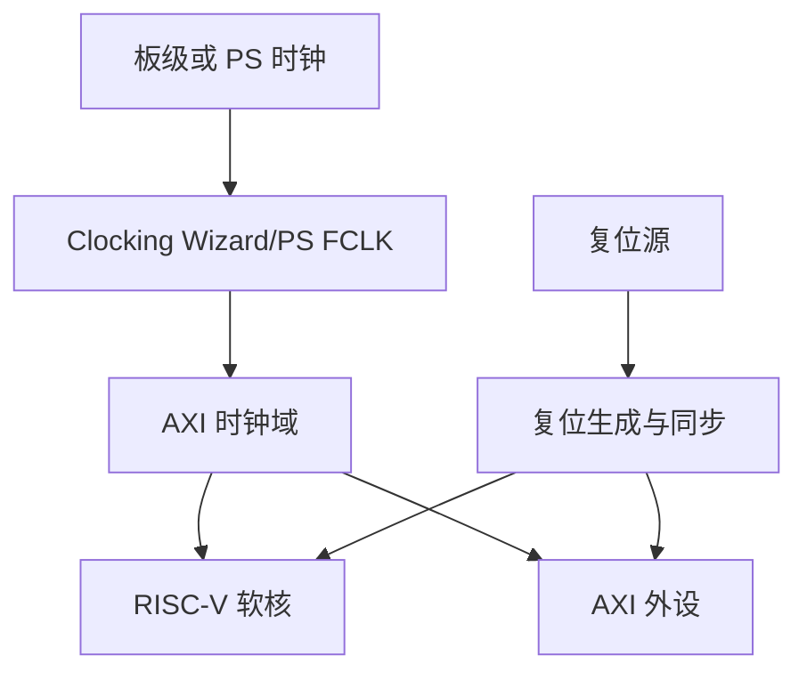
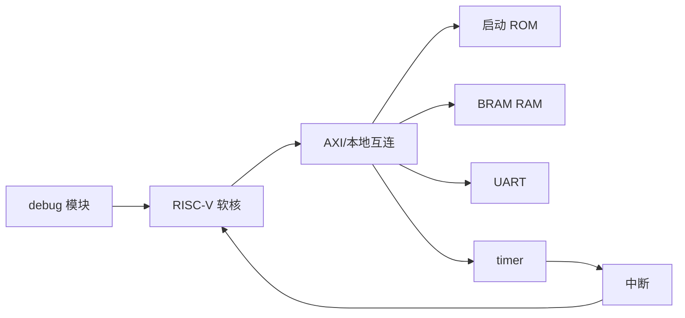
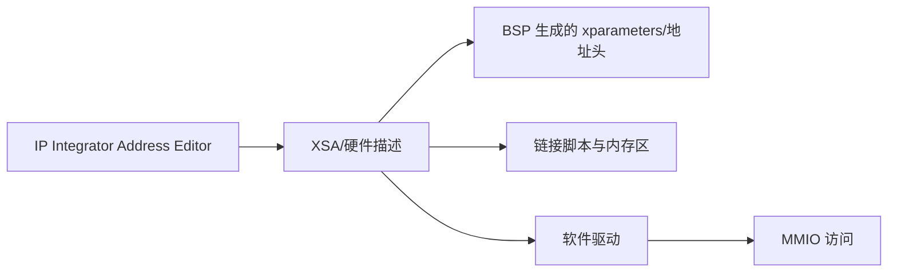
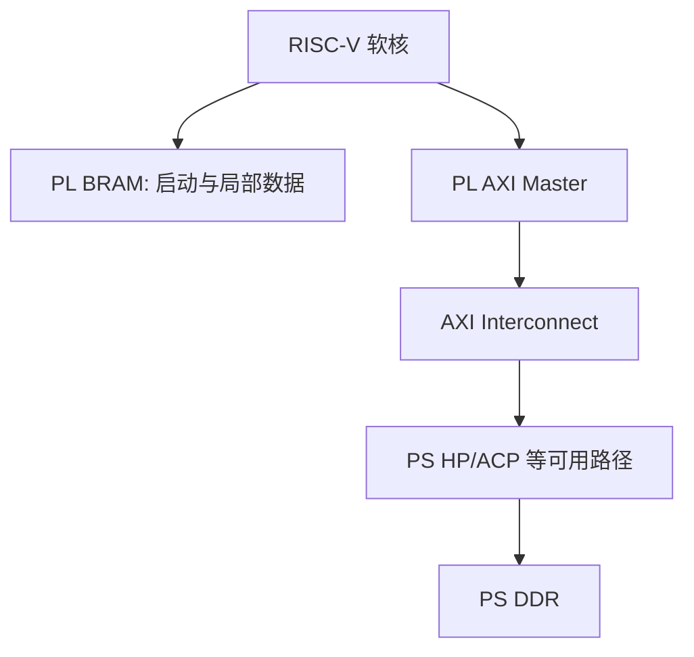
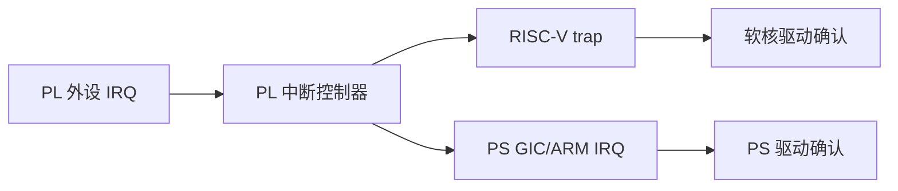
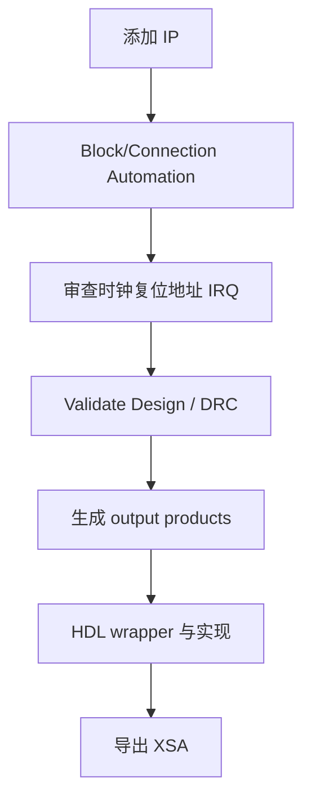

Zynq-7000 将 ARM Processing System，简称 PS，和可编程逻辑，简称 PL，集成在同一器件中。

在 xc7z020 上构建 RISC-V 软核系统时，最重要的设计问题不是“把 CPU IP 放进 block design”。

而是明确哪些服务由 PS 提供，哪些外设和计算由 PL 提供，以及两侧如何通过地址、时钟、复位、中断和共享内存协作。

本文描述方法，不绑定某块开发板的引脚、时钟或 DDR 参数。

这些值必须从板卡约束、Vivado block design、Address Editor 和导出的硬件平台得到。

AMD 的 MicroBlaze V 设计指南将创建 block design、配置处理器、连接 IP、运行 DRC、生成输出与导出硬件描述列为标准流程。[MicroBlaze V 嵌入式设计指南](https://docs.amd.com/r/en-US/ug1711-microblaze-v-embedded-design/Designing-with-the-MicroBlaze-V-Processor)

## 1. 从职责而不是模块名称开始划分 PS 与 PL

PS 适合承担 DDR、启动、以太网、SD、Linux、控制面和成熟驱动生态。

PL 适合承担定制硬件、确定性数据路径、专用采集、低延迟接口和 RISC-V 软核。

一侧不必替代另一侧。

先列出每个功能的时延、吞吐、软件复杂度和安全边界。

再决定放在 PS 还是 PL。

把所有控制都塞进 PL 或把所有实时处理都塞进 PS，都会增加不必要的跨域复杂度。

## 2. Block Design 要先稳定时钟和复位拓扑

每个 IP 都需要被其接口时钟和复位正确覆盖。

AXI 主从设备、BRAM 控制器、UART、timer 和软核可能工作在同一时钟域，也可能跨时钟域。

任何跨域都需要明确的 CDC 方案。

复位不是一根全局异步线就结束。

异步断言、同步释放、clock locked 信号和各 IP 的 reset 极性都需要一致设计。

一次时钟未稳定时解除软核复位，常表现为偶发启动失败而不是确定性 DRC 错误。

## 3. 软核的最小 PL 子系统应先自举

首次集成建议建立最小 RISC-V 子系统。

它包含处理器、片上 ROM/BRAM、数据 RAM、UART、timer、reset 与 debug。

复杂 AXI 外设、PS 通信和自定义加速器在该闭环稳定后逐步加入。

最小系统的验收顺序是复位释放、`_start`、`.bss`、UART 轮询、timer trap、GDB/debug。

任何一步未通过，都不应引入 cache、DMA 或 PS-PL 共享 DDR。

## 4. Address Editor 是硬件与软件的共同接口

每个 AXI 从设备需要在主设备地址空间有非重叠窗口。

Address Editor 应生成或导出地址分配。

软件 BSP、链接脚本和寄存器头文件必须消费同一份硬件描述。

不要在 C 文件里手写一个“看起来空闲”的地址。

也不要仅修改链接脚本而不更新 block design。

硬件地址图变化后，应重新导出平台并重新生成/核对软件输入。

## 5. PS 与 PL 的内存路径要区分控制和数据

软核可只使用 PL BRAM。

这对启动和确定性访问很简单，但容量有限。

若需要访问 PS DDR，可经合适 AXI 端口、interconnect 和缓存/一致性策略连接。

具体可用 PS 端口与 cache/coherency 特性由 Zynq PS 配置、设计工具版本和系统架构决定。

在使用共享 DDR 前，先确定谁拥有缓冲区、谁执行 cache 维护、如何同步 doorbell/中断。

不能把“能读写同一 DDR 地址”当作多处理器数据一致的证明。

## 6. 中断跨越模块边界时要有完整路径

PL timer、UART 或自定义 IP 的 IRQ 可能先汇聚到 PL 中断控制器。

然后可送到 RISC-V 软核，也可送到 PS。

每个目标的处理器模式、控制器、驱动和确认顺序不同。

不要让两个处理器同时对同一个 level interrupt 进行确认，除非硬件协议明确支持。

中断所有权应在寄存器规范和软件架构中写清楚。

## 7. Vivado 自动化帮助连接，不替代设计审查

IP Integrator 的 Block Automation 与 Connection Automation 可以建立处理器、BRAM、debug 或 AXI 的常用连接。

AMD 文档也将运行 DRC、生成输出、创建 HDL wrapper 和导出硬件描述列为标准步骤。[AMD 嵌入式处理器设计流程](https://docs.amd.com/r/en-US/ug1711-microblaze-v-embedded-design/Designing-with-the-MicroBlaze-V-Processor)

自动连接后仍应人工检查时钟、复位、地址、IRQ、参数和顶层端口。

自动化只解决已知连接模式。

它无法替你判断自定义外设访问宽度、IRQ 触发类型或多时钟域协议是否符合应用需求。

## 8. 导出的 XSA 是软件平台的版本边界

XSA 或等价硬件导出物包含配置的处理器、IP、地址、时钟和接口信息。

AMD 的 MicroBlaze V Vitis 快速指南说明，硬件导出物包含规格、IP 接口、外部信号与本地内存地址，用于创建软件平台。[MicroBlaze V Vitis 快速指南](https://docs.amd.com/api/khub/documents/SrOrKDydHKHElRD5Nc1xsw/content)

任何硬件地址、时钟或处理器配置变化后，都应视为新的平台版本。

旧 BSP 可能仍能编译，但它不保证访问的是新硬件。

## 9. 验证从 DRC 到板上观测逐层推进

| 层级 | 证据 |
| --- | --- |
| Block Design | Validate Design、未连接端口审查、Address Editor 截图/导出 |
| RTL/实现 | 综合、时序、DRC、bitstream 日志 |
| 平台导出 | XSA 版本、BSP 地址头、链接脚本 |
| 裸机 | `_start`、UART、timer、trap、内存测试 |
| PS-PL 通信 | 共享缓冲、IRQ、cache/所有权测试 |
| 硬件调试 | JTAG、ILA、串口、复位与时钟观测 |

硬件实现报告和软件 ELF 应使用同一个配置标签。

这样一次故障才能判断属于软件、bitstream、约束还是平台导出错配。

## 10. 常见失败模式

| 症状 | 先检查 | 常见原因 |
| --- | --- | --- |
| 软核偶发不启动 | reset/clock locked | 复位释放早于时钟稳定 |
| 软件写错外设 | Address Editor 与 BSP | 使用旧 XSA 或手写地址 |
| AXI 访问挂起 | 时钟域和 interconnect | master/slave 未同域或 reset 不一致 |
| UART 没输出 | 时钟、引脚、地址、驱动 | 任一层参数未同步 |
| IRQ 不到 CPU | 中断控制器和端口 | 未连线、未使能、触发类型错配 |
| PS/PL 缓冲数据陈旧 | cache/所有权 | 未定义 flush/invalidate 与同步 |
| 时序失败 | 关键路径与约束 | 软核/互连频率过高或约束遗漏 |

## 11. 交付前设计审查清单

在生成 bitstream 前，使用一份可追溯的设计审查记录。

| 类别 | 审查问题 |
| --- | --- |
| 器件与板卡 | 选择的 part、speed grade、板级时钟与引脚约束是否匹配？ |
| 时钟 | 每个 AXI 接口、软核和外设处于哪个时钟域？ |
| CDC | 所有异步请求、reset 和 IRQ 是否有明确跨域结构？ |
| 复位 | 是否等待 PLL/MMCM locked 后同步释放？ |
| 地址 | 是否存在重叠窗口，软件是否来自同一 XSA？ |
| 存储 | ROM、RAM、DDR 的容量、地址、初始化文件和访问宽度是否一致？ |
| 中断 | 每个 source 的类型、mask、目标和 acknowledge 是否唯一？ |
| 总线 | AXI master/slave 的数据宽度、ID、时钟和 reset 是否兼容？ |
| 软件 | `-march`、ABI、链接脚本和 BSP 是否匹配软核配置？ |
| 调试 | JTAG、串口和 ILA 探针是否在顶层可用？ |
| 约束 | 时钟约束、I/O 电平、时序例外是否经过审查？ |
| 版本 | block design、XSA、BSP、ELF 和 bitstream 是否同一标签？ |

审查记录应包含对应 Vivado report 的路径或版本化导出。

地址与时钟变化时，更新记录后再导出 XSA。

避免出现硬件已修改而软件团队仍使用旧平台描述的状态。

对外发布前至少保存 block design Tcl、约束文件、实现报告、XSA 和一个通过的裸机验证日志。

这些文件共同描述了可复现的硬件平台。

### XSA 驱动回归

每次导出新 XSA 后，先运行一组小型硬件平台回归。

它至少覆盖 CPU 入口、BRAM RAM、自身 UART、timer IRQ 与一个 GPIO 输出。

这组回归不依赖传感器算法、网络或复杂 RTOS workload。

若它失败，优先检查 XSA、BSP、链接脚本与 bitstream 的版本组合。

若它通过，再运行 PS-PL 共享缓冲和应用级测试。

## 12. 练习与验收

### 练习

1. 画出你的 xc7z020 设计中 PS、PL、DDR、BRAM、RISC-V 软核和自定义 IP 的责任图。
2. 在 Vivado 中建立最小软核、BRAM、UART、timer 和 debug 子系统，并运行 DRC。
3. 导出地址分配，让软件通过生成的硬件头访问 UART，而不是手写常量。
4. 为一个 PL 外设 IRQ 指定唯一处理器所有者，画出确认路径。
5. 修改一个 AXI 地址后重新导出 XSA，验证旧 BSP 与新 BSP 的差异。
6. 为 PS-PL 共享缓冲定义 producer、consumer、cache 维护和完成通知协议。

### 本篇验收清单

- [ ] 能从职责、时延和吞吐划分 PS 与 PL。
- [ ] 能建立带同步复位的时钟/复位拓扑。
- [ ] 能先让 ROM/RAM/UART/timer/debug 最小软核系统自举。
- [ ] 能让 Address Editor、XSA、BSP 和链接脚本使用同一地址图。
- [ ] 能为 PS DDR 与 PL BRAM 选择明确的数据路径和所有权模型。
- [ ] 能定义唯一的 IRQ 所有者和完整确认链路。
- [ ] 能把 Vivado 自动化结果纳入人工设计审查。
- [ ] 能用 DRC、时序、XSA、ELF、JTAG/ILA 形成分层验证证据。

在 xc7z020 上集成 RISC-V 软核，真正需要管理的是系统接口。

时钟、复位、地址、IRQ、内存和软件平台保持同一份事实，PS/PL 协同才会稳定可维护。

> 🏷️ RISC-V · Zynq-7000 · xc7z020 · Vivado · AXI · PS · PL
