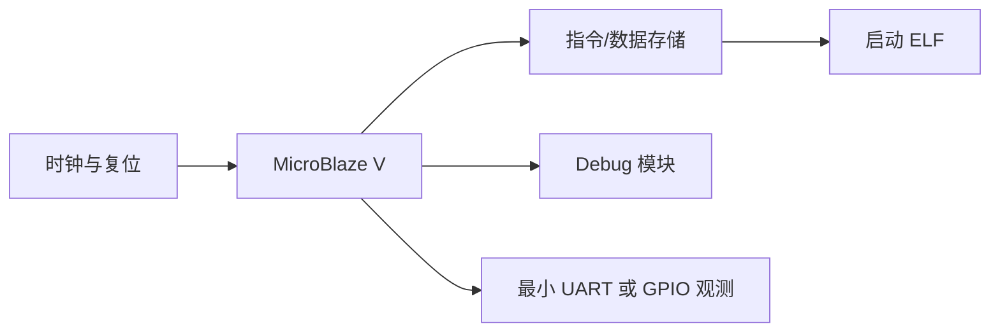
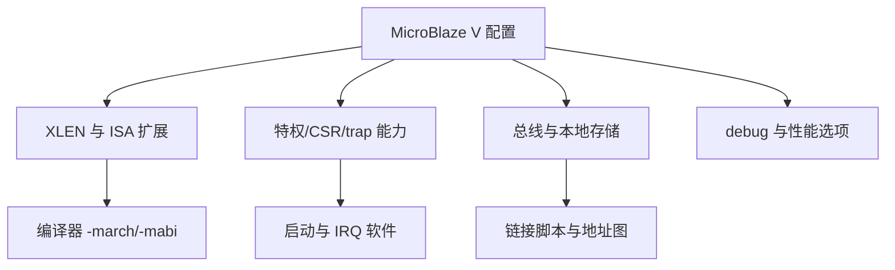
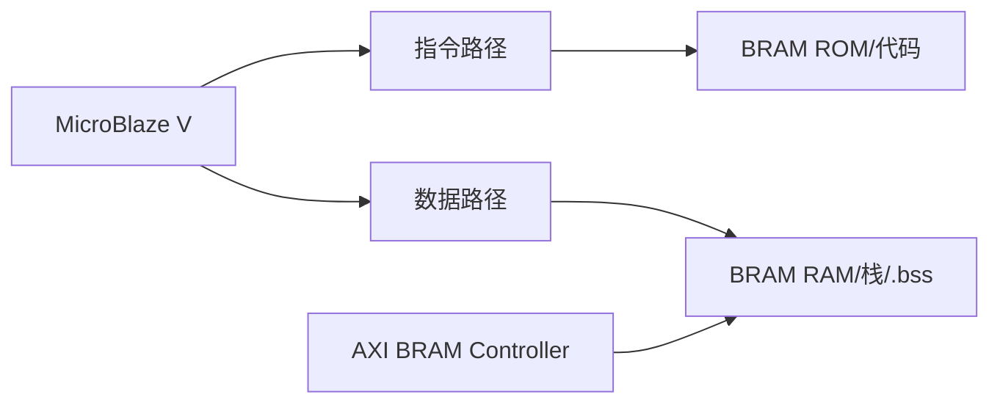
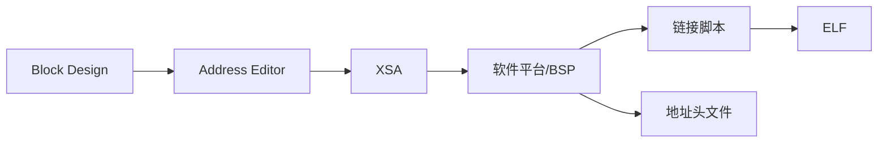
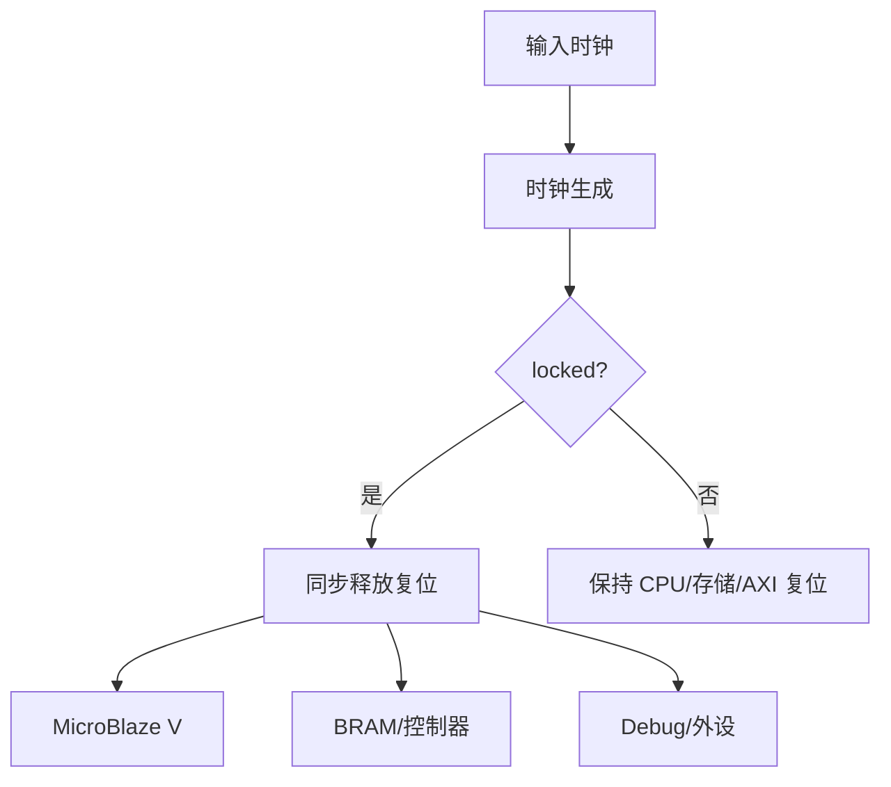
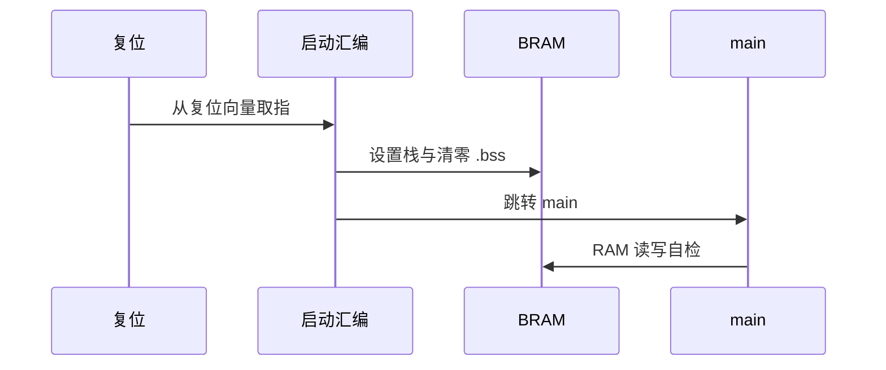
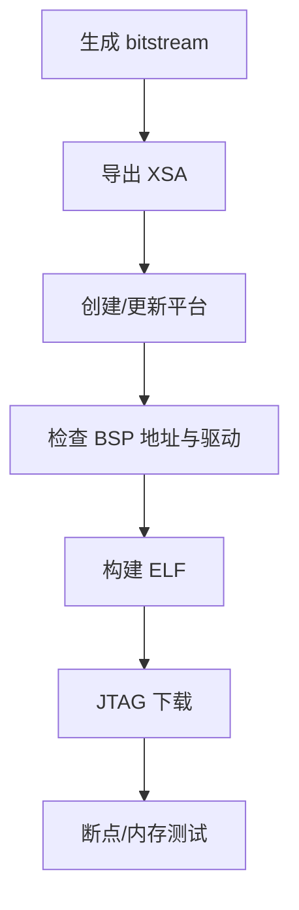
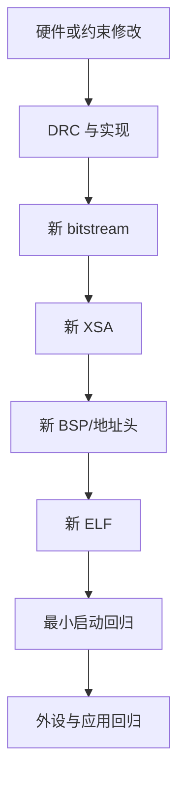

MicroBlaze V 是 AMD Vivado 生态中面向 RISC-V 的软处理器 IP。

一个“最小系统”不是只放置 CPU 图标。

它必须有可复位的时钟域、可取指的存储、可读写的数据路径、可生成的软件地址图与可调试的下载链路。

先让这条链路稳定，再增加 GPIO、UART、timer、FreeRTOS 或自定义加速器。

AMD UG1711 将创建 block design、添加 MicroBlaze V、配置、地址映射、DRC、实现和硬件导出作为处理器设计基本步骤。[MicroBlaze V 嵌入式设计指南](https://docs.amd.com/r/en-US/ug1711-microblaze-v-embedded-design/Designing-with-the-MicroBlaze-V-Processor)

## 1. 最小系统的定义是可验证的闭环

最小系统至少应支持：复位后执行 `_start`、初始化 `.bss`、访问一段 RAM、输出一个可观察结果，并能通过 debug 读取 PC/寄存器。

它不要求先跑操作系统。

若连单一内存测试都不能通过，外设驱动或 RTOS 只会放大问题。

最小系统的价值是让硬件、BSP、链接脚本和启动汇编有一个共同基准。

## 2. 处理器配置决定软件可使用的 ISA 和特权能力

MicroBlaze V 参考指南覆盖 32 位和 64 位软处理器，并列出 RISC-V 指令、CSR、trap、地址转换与 debug 相关主题。[MicroBlaze V 参考指南](https://docs.amd.com/r/2024.1-English/ug1629-microblaze-v-user-guide)

配置时记录实际选择的位宽、ISA 扩展、cache、异常/中断、debug 和本地存储接口。

生成 bitstream 后再猜测处理器配置会导致软件与硬件错配。

把配置 Tcl、IP 参数导出和软件编译参数一起保存。

## 3. 存储先选片上 BRAM，避免引入不必要变量

片上 BRAM 适合作为最小系统的 ROM/RAM。

它的容量有限，但延迟、时钟和复位边界都易于控制。

可以使用 AXI BRAM Controller，或根据所选处理器接口采用适当本地存储结构。

不要一开始就让软核从 PS DDR、外部 DDR 或 QSPI 引导。

这些路径涉及额外互连、时钟、cache、初始化和 boot 流程。

最小 BRAM 系统通过后，才有可靠基线评估扩展路径。

## 4. 地址图应由 Address Editor 生成并导出

处理器可执行存储、数据 RAM 与外设窗口必须在地址空间有定义。

Address Editor 负责分配并检查 AXI 地址段。

硬件导出物将这些信息提供给软件平台。

链接脚本里 `MEMORY` 的区域必须与生成地址图中的实际 RAM 一致。

没有从某地址段映射到存储器的区域，不能仅凭链接器脚本变成硬件 RAM。

## 5. 时钟复位是启动问题的第一根因候选

每个由同一时钟驱动的 IP 要共享清晰的 reset 策略。

若 CPU 在 BRAM 或 interconnect 尚未退出复位时开始执行，会产生随机取指或 AXI 错误。

对每个 reset 端口记录极性、同步域和依赖。

不要用一个异步按钮直接扇出到所有时钟域而不经过同步处理。

## 6. Debug 应成为最小系统的一部分

串口打印需要 UART、引脚与软件驱动。

debug 模块允许在没有 UART 前验证 CPU 已经运行。

可用 Vitis/JTAG 或对应工具读取 PC、设置断点、下载 ELF 与检查内存。

AMD 示例流程也包含把 debug 模块接入设计并标记网络进行观察的步骤。[MicroBlaze V 编程教程](https://docs.amd.com/r/2024.1-English/xd131-zynq-embedded-design-tutorial/Programming-an-Embedded-MicroBlaze-V-Processor)

在上板前，确认 debug 时钟与处理器时钟关系符合工具要求。

## 7. 最小裸机要有明确的链接和启动协议

构建应指定与处理器配置匹配的 `-march` 和 `-mabi`。

链接脚本指定 ROM/RAM、入口和栈顶。

启动代码设置 `sp`、清零 `.bss`，再进入 `main`。

第一版应用不需要复杂库。

让 `main` 写一个 RAM 模式、读回比较，并通过 GPIO 或 debug 中变量证明结果即可。

## 8. 硬件导出后生成的软件平台也要校验

XSA 是软件看到硬件的依据。

导入后检查处理器实例、可用内存、外设地址和时钟信息。

若软件头文件中缺少某个 IP，先回到硬件导出检查，而不是手写宏补齐。

硬件变更后使用旧 XSA 是最常见的“软件能编译但上板不工作”原因之一。

## 9. 建议的最小验收程序

| 阶段 | 程序行为 | 通过证据 |
| --- | --- | --- |
| 复位 | 停在 `_start` | debug 读取 PC |
| 栈 | 调用一个普通 C 函数 | `sp` 对齐且能返回 |
| `.bss` | 检查静态零变量 | 变量为零 |
| RAM | 写入多种 bit pattern 后读回 | 失败地址与预期值 |
| trap | 受控 `ecall` 或 timer | `mcause` 与 `mepc` |
| 输出 | GPIO 翻转或 UART 字节 | 示波器/串口/ILA |

先让每一项单独通过，再组合成一次启动自检。

不要在第一次上板就加入 heap、printf、网络和 FreeRTOS。

## 10. 常见失败模式

| 症状 | 先检查 | 常见原因 |
| --- | --- | --- |
| JTAG 看不到处理器 | debug 时钟/reset | debug 模块未连或时钟未锁定 |
| PC 不在启动入口 | BRAM 初始化与链接地址 | ELF/boot memory 地址不匹配 |
| C 函数调用异常 | 栈和 ABI | `sp` 未设置或链接脚本 RAM 错误 |
| BSP 缺少内存/外设 | XSA 版本 | 导出了旧硬件或平台未刷新 |
| AXI BRAM 访问挂起 | reset/地址/时钟 | 接口未完成连接或被保持复位 |
| 上板行为随机 | 时序/CDC | 缺少约束或异步复位释放 |
| UART 未输出 | 尚未到 UART 问题 | 先用 JTAG 检查是否已到 main |

## 11. 首次上板记录模板

第一次让最小系统运行时，按时间顺序记录事实。

| 项目 | 记录内容 |
| --- | --- |
| 工程输入 | Vivado 版本、器件、board files、block design Tcl |
| 处理器 | IP 配置、XLEN、ISA 扩展、异常/debug 选项 |
| 时钟 | 输入频率、生成时钟、约束文件、locked 状态 |
| 复位 | 外部 reset、同步逻辑、各域释放顺序 |
| 存储 | BRAM 容量、地址、初始化文件与链接脚本 |
| 地址图 | Address Editor 导出、XSA 版本、BSP 地址头 |
| bitstream | 生成时间、git commit、实现与时序报告 |
| 软件 | 工具链、`-march`、`-mabi`、ELF hash |
| debug | JTAG 连接、首个断点 PC、寄存器截图/日志 |
| 自检 | `.bss`、RAM、trap、输出测试的通过结果 |

当任何项变化时，把这次运行视为新的平台组合。

不要将旧日志用于证明新 bitstream 的行为。

### 变更控制的最小流程

硬件改动后按下列顺序更新。

1. 修改 block design 或约束。
2. 运行 Validate Design 与 DRC。
3. 重新生成 output products、wrapper、实现和 bitstream。
4. 导出新的 XSA。
5. 用新的 XSA 创建或更新软件平台。
6. 重新生成 BSP、链接脚本输入和驱动配置。
7. 重新构建 ELF。
8. 先运行最小 RAM/PC/trap 回归，再运行应用。

这个流程看起来重复。

它避免了最难诊断的状态：硬件、软件平台和 ELF 分别来自三个历史版本。

### 最小自检的失败策略

每个自检失败应保存错误码与所在阶段。

例如 RAM 测试报告地址、写入值和读取值。

trap 测试报告 `mcause`、`mepc` 与 `mtval`。

栈测试报告 `sp` 对齐状态和最深调用点。

把这些内容放进一个固定 RAM 结构或 debug 可读变量。

发生 reset 后，仍可以通过 JTAG 取回最后失败阶段。

## 12. 练习与验收

### 练习

1. 用 IP Integrator 建立 MicroBlaze V、BRAM、时钟复位和 debug 的 block design。
2. 在 Address Editor 中记录代码 RAM 与数据 RAM 地址，再导出 XSA。
3. 为该地址图写一个最小链接脚本和 `_start`。
4. 用 JTAG 在 `_start`、`main` 和一个 RAM 自检失败分支处设置断点。
5. 修改一个 BRAM 地址并重新导出平台，比较新旧 BSP 生成文件。
6. 在复位释放与 CPU 首次取指之间用 ILA/波形检查时钟 locked 关系。

### 本篇验收清单

- [ ] 能定义最小系统的复位、取指、RAM、输出和 debug 闭环。
- [ ] 能把 MicroBlaze V IP 配置与软件 ISA/ABI 参数一起记录。
- [ ] 能先使用 BRAM 建立可控的代码与数据存储。
- [ ] 能让 Address Editor、XSA、BSP 和链接脚本共享地址图。
- [ ] 能为所有时钟域设计同步复位释放。
- [ ] 能在没有 UART 前通过 debug 验证 PC、寄存器和内存。
- [ ] 能以分阶段裸机程序定位启动、栈、RAM 和 trap 问题。
- [ ] 能在硬件变化后重新导出并验证软件平台。

最小 MicroBlaze V 系统的目标不是展示很多 IP。

它是建立一条每层都有证据的启动链，让日后的外设、RTOS 和自定义逻辑都有可靠地基。

> 🏷️ RISC-V · MicroBlaze V · Vivado · BRAM · AXI · Debug · Vitis
