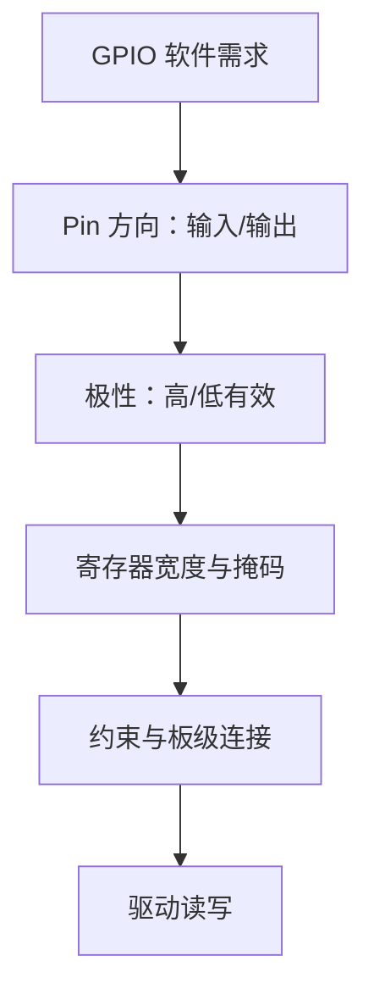
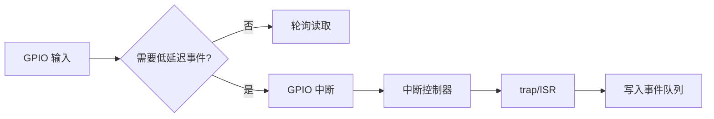
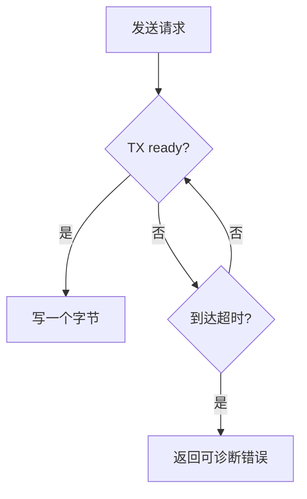
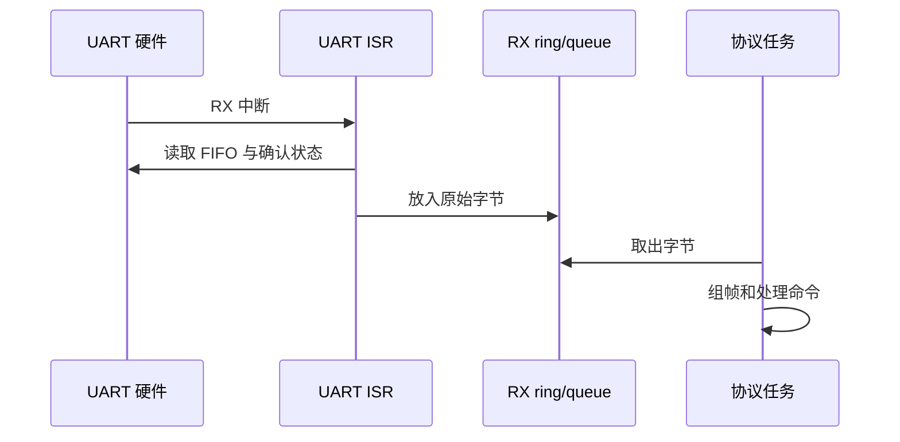
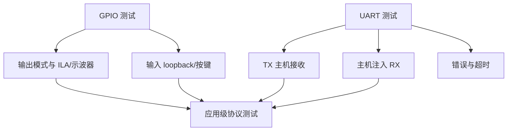
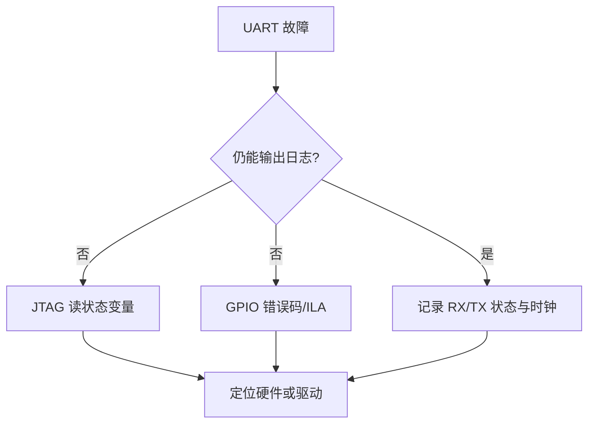

GPIO 与 UART 是最适合验证软核 SoC 的两类外设。

GPIO 提供可测量的引脚状态。

UART 提供主机与固件之间的字节通道。

但它们不应被当作“写几个地址就能跑”的示例。

正确的驱动需要从导出的硬件描述取得实例、地址、时钟和 IRQ，遵循寄存器访问宽度，并把轮询、中断、缓冲与业务协议分层。

## 1. 从硬件导出物获得外设事实

Vivado Address Editor 和 XSA 描述实际连接的外设实例。

软件平台/BSP 根据这些信息生成地址、设备 ID 和驱动配置。

应用代码应包含生成的头文件或使用 BSP 提供的实例查找机制。


不要把某个教程中的 `BASEADDR` 复制到新工程。

硬件地址、UART 时钟和 GPIO 宽度都可能不同。

若生成头文件与 block design 不一致，先重新导出 XSA 并更新平台。

## 2. GPIO 驱动先定义方向、极性和所有权

GPIO 输出之前应明确 pin 是输入还是输出。

LED 是否低电平有效、按键是否有上拉、引脚是否跨时钟域，也属于硬件契约。



一个安全的 GPIO API 不直接暴露所有寄存器细节。

```c
void board_led_set(unsigned index, bool on) {
  const uint32_t mask = 1U << index;
  uint32_t value = gpio_read_output_shadow();

  if (board_led_is_active_low()) {
    value = on ? (value & ~mask) : (value | mask);
  } else {
    value = on ? (value | mask) : (value & ~mask);
  }

  gpio_write_output(value);
}
```

输出 shadow 避免读改写一个可能同时包含输入状态或硬件副作用的寄存器。

多个任务或 ISR 共享 GPIO 输出时，还需要由上层定义串行化策略。

## 3. GPIO 轮询适合验证，边沿中断适合事件

LED 闪烁和低频状态读取可用轮询。

按键、传感器 ready 或外部触发更适合用中断，避免浪费 CPU 持续读取。



边沿触发与电平触发的确认方式不同。

电平中断必须先消除真实的有效电平，或屏蔽并在条件变化后重新放行。

只在中断控制器完成 acknowledge 而不处理 GPIO 源状态，可能导致持续重入。

## 4. UART 先区分硬件字节与文本协议

UART 寄存器提供发送、接收、状态与可选中断。

它只传输字节流，不知道一条命令从哪里开始或结束。

协议层需要定义帧界定、长度、校验、超时和错误恢复。


把 `printf` 直接用于所有业务响应，容易让格式、阻塞和缓冲行为耦合到应用。

教学阶段可先用固定帧，例如 `PING\n` 返回 `PONG\n`。

成熟协议再增加长度和校验。

## 5. 轮询 UART 要先检查 TX/RX 状态

发送前确认 TX FIFO 或发送寄存器可接受新字节。

接收前确认 RX 有有效数据。

```c
bool uart_try_read(uint8_t *byte) {
  if (!uart_rx_ready()) {
    return false;
  }
  *byte = uart_read_data();
  return true;
}

bool uart_try_write(uint8_t byte) {
  if (!uart_tx_ready()) {
    return false;
  }
  uart_write_data(byte);
  return true;
}
```

轮询 API 返回成功/失败，调用者可选择重试、超时或让出执行权。

不要在底层驱动里隐藏无限循环。

这会让一个断开的 UART 线把整个启动或控制循环卡住。



## 6. UART 中断应只搬运字节

高吞吐或低延迟场景可用 RX/TX 中断。

ISR 的职责是读取 FIFO、清状态、把字节放进环形缓冲或 RTOS 队列，并记录错误。

协议解析、行编辑、JSON 和日志格式化留给普通任务/主循环。



ISR 内不应调用会锁、会分配内存或会长时间等待的普通 API。

在 FreeRTOS 中使用 FromISR 接口，并由统一 trap 尾部决定是否切换任务。

## 7. 时钟和波特率是 UART 可用性的隐含输入

UART 的波特率分频来自外设时钟。

同一份驱动在不同 PL 时钟下，若没有重新生成/配置分频，就会产生乱码或丢字节。


不要通过反复更换主机终端波特率来掩盖硬件平台时钟错误。

先从 Vivado 时钟报告和 BSP/UART 配置查找分频输入。

## 8. GPIO 与 UART 的测试要分层

GPIO 输出测试可写固定模式、计数模式和单 pin 翻转。

GPIO 输入测试可读取物理按键、loopback 或 testbench 激励。

UART 测试可分 TX loopback、RX 注入、帧错误和吞吐测量。



先确认 GPIO/UART 硬件访问，再测试业务协议。

不要在协议解析失败时马上修改寄存器驱动。

## 9. 使用生成 BSP 与寄存器访问封装

AMD 的软件生态包含 BSP、驱动与示例源码，可作为实例初始化和平台访问边界的起点。[Xilinx embeddedsw](https://github.com/Xilinx/embeddedsw)

生成代码并不是不可读的黑盒。

应审查实例 ID、基地址、时钟、IRQ 连接和缓存属性是否来自当前硬件平台。


将 BSP 调用封装在 `board_gpio.c`、`board_uart.c` 一类文件中。

这样更换 IP、驱动版本或模拟环境时，业务层不需要知道寄存器细节。

## 10. 调试信息应避免递归依赖同一 UART

当 UART 本身故障时，用 UART 打印 UART 错误可能没有意义。

为早期调试保留 GPIO、JTAG、ILA 或内存错误码等独立观测路径。



把每个驱动状态机的错误计数导出到可读变量。

例如 RX overrun、framing error、TX timeout 与未处理 IRQ 数。

## 11. 常见失败模式

| 症状 | 先检查 | 常见原因 |
| --- | --- | --- |
| LED 亮灭相反 | GPIO 极性与板卡连接 | active-low 没有抽象 |
| GPIO 写入无效 | 方向/tri-state/约束 | pin 仍是输入或顶层未连接 |
| UART 乱码 | 时钟与 baud | 分频输入或主机配置不匹配 |
| UART 发送卡死 | TX ready 与超时 | 底层无限等待或硬件未复位 |
| RX IRQ 风暴 | FIFO/状态确认 | 未读空数据或未清源状态 |
| 串口吞吐低 | ISR 工作量 | 在 ISR 中格式化/解析大量文本 |
| 软件访问错误实例 | BSP/XSA | 使用旧平台或手写地址 |

## 12. 练习与验收

### 练习

1. 从当前 XSA/BSP 找到一个 GPIO 和一个 UART 的实例标识、地址与中断连接。
2. 为 LED 写 active-high 与 active-low 都正确的板级封装。
3. 使用 loopback 或 ILA 验证 GPIO 单 bit 写入与输入读取。
4. 实现带超时的 UART `try_read`/`try_write`，避免底层无限等待。
5. 将 UART RX ISR 改为只搬运字节，再在主循环/任务解析 `PING` 帧。
6. 修改 PL UART 时钟后重新导出平台，验证波特率配置与主机一致。

### 本篇验收清单

- [ ] 能从 XSA/BSP 而非记忆常量获取 GPIO/UART 平台信息。
- [ ] 能定义 GPIO 方向、极性、掩码和并发所有权。
- [ ] 能按轮询或中断的实际需求选择 GPIO 输入路径。
- [ ] 能把 UART 字节驱动与文本/帧协议分开。
- [ ] 能让 UART 轮询 API 有明确超时与错误返回。
- [ ] 能让 UART ISR 只负责 FIFO、状态和缓冲搬运。
- [ ] 能从时钟与分频解释 UART 波特率一致性。
- [ ] 能用 JTAG/GPIO/ILA 避免调试路径只依赖失效的 UART。

GPIO 与 UART 看似简单，却完整覆盖了软核 SoC 的地址、时钟、复位、IRQ、BSP、驱动分层和硬件观测。

把这两类外设做成可靠模板，后面的传感器、总线和自定义 IP 都有可复用的工程边界。

> 🏷️ RISC-V · MicroBlaze V · GPIO · UART · 裸机 · BSP · Vivado
