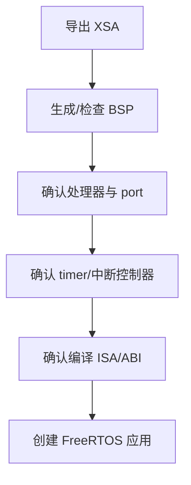
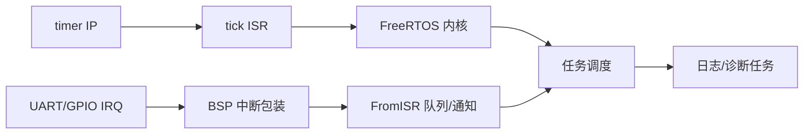
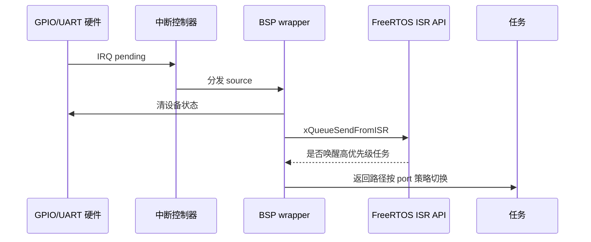
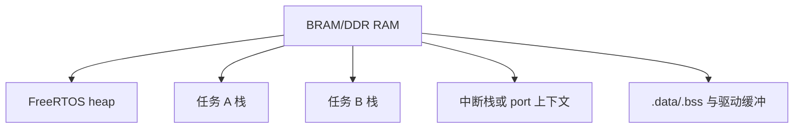
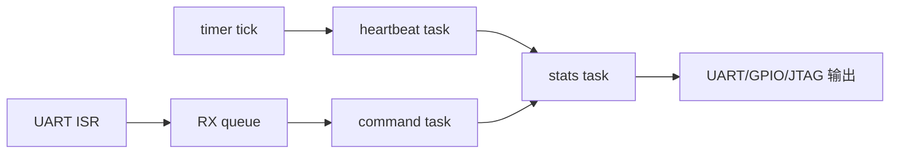
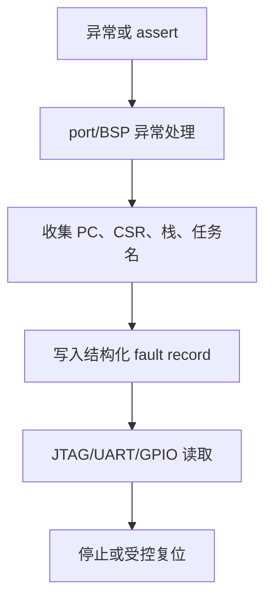
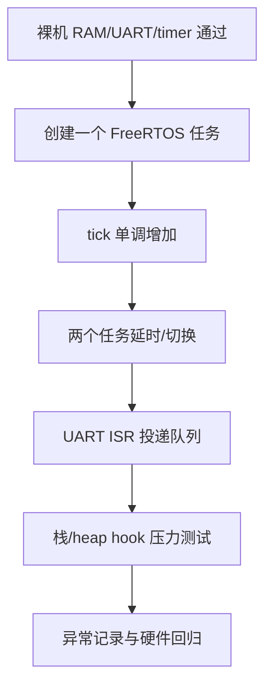

第 07、08 篇从通用 RISC-V M 态 trap 视角解释了 FreeRTOS port。

MicroBlaze V 平台的集成不应复制那份 QEMU 教学汇编。

它应从当前 Vivado 硬件描述、BSP 生成结果、定时器 IP、中断控制器与 AMD/Xilinx FreeRTOS 支持层出发。

FreeRTOS 内核依旧管理任务、队列、时间与同步。

平台 port 负责把这些内核语义映射到 MicroBlaze V 的寄存器、异常、中断与时基。

Xilinx `embeddedsw` 中的 FreeRTOS BSP 支持处理器和生成配置，并包含 MicroBlaze 相关 port 源与中断包装路径。[Xilinx FreeRTOS BSP 配置](https://github.com/Xilinx/embeddedsw/blob/master/ThirdParty/bsp/freertos10_xilinx/data/freertos10_xilinx.tcl)

## 1. 先核对“可用 port”与“当前处理器配置”

处理器名称相近不等于 port 可直接互换。

必须核对当前平台中的处理器类型、位宽、异常/中断支持、timer、debug、BSP 版本和 FreeRTOS 版本。



AMD 的 MicroBlaze V 参考指南覆盖 RISC-V CSR、trap、中断与地址转换能力，但实际启用项取决于 IP 配置和工具版本。[MicroBlaze V 参考指南](https://docs.amd.com/r/2024.1-English/ug1629-microblaze-v-user-guide)

因此应以生成 hardware platform 和 BSP 源为最终事实来源。

## 2. FreeRTOS 集成由四条链组成

第一条是任务链：TCB、任务栈、heap 和调度器。

第二条是 tick 链：硬件 timer、ISR、`xTaskIncrementTick` 和调度请求。

第三条是外设事件链：GPIO/UART IRQ、BSP 中断包装、FromISR API 和任务。

第四条是诊断链：assert、malloc/stack hook、异常 dump、JTAG 和 UART。



其中任一条未连通，都不应让应用去掩盖问题。

先用最小任务和明确计数验证每一条。

## 3. Tick 定时器必须来自当前硬件地址图

Vivado 可提供多种 timer/IP 组合。

其频率、地址、IRQ source 和中断控制器连接来自 block design 与 XSA。

`configTICK_RATE_HZ` 是软件需求。

实际周期比较值/分频必须根据 timer 输入时钟计算。


不要把 QEMU `mtime` 访问代码搬到 AXI timer 平台。

timer 寄存器、acknowledge 方法、计数宽度和启动语义都可能不同。

## 4. 中断包装应分开平台确认和内核通知

外设 IRQ 到达时，低层 wrapper 要先识别并确认当前硬件 source。

然后使用 FreeRTOS 的 FromISR API 投递最小事件。

最后把是否需要立即切换的决定交给 port 的统一返回路径。



设备确认与内核队列操作不能交换顺序而不经分析。

对 level interrupt，若不先消除设备条件，ISR 可能持续重入。

对边沿事件，过早清状态又可能丢失多次边沿，需要由 FIFO/状态寄存器规则决定。

## 5. 任务栈、heap 和中断栈需要分开估算

FreeRTOS 每个任务有自己的栈。

port 还可能使用中断栈或在任务栈上保存 ISR 上下文。

heap 用于动态创建任务、队列、定时器和其他对象。



把所有可用 RAM 都交给 heap 会覆盖启动数据或中断栈。

链接脚本、BSP memory map 与 FreeRTOS heap buffer 必须共同审查。

任务栈深度的单位和 `StackType_t` 宽度应由当前 port 确认。

## 6. 用任务设计观察调度，而不是制造日志洪水

设计三个小任务即可验证主要行为。

heartbeat 任务周期翻转 GPIO。

UART command 任务等待队列。

stats 任务低频汇总 tick、队列深度、错误计数和栈水位。



这样能分别观察周期阻塞、ISR 唤醒和低优先级运行机会。

不要让每个任务都在循环中 `printf`。

串口吞吐会反过来改变调度时序。

## 7. 异常处理应给出寄存器与平台上下文

FreeRTOS port/BSP 通常提供异常处理和 hook 入口。

Xilinx 的 MicroBlaze 相关 port 头文件说明，可由应用覆盖弱定义的寄存器 dump 回调以记录异常上下文。[Xilinx FreeRTOS 异常 hook](https://github.com/Xilinx/embeddedsw/blob/master/ThirdParty/bsp/freertos10_xilinx/src/Source/portable/GCC/MicroBlazeV9/portmacro.h)

在 MicroBlaze V 项目中，应依据当前 BSP 导出的实际 API 验证对应 hook 名称和寄存器结构。



异常路径应避免调用可能再次分配内存或等待锁的普通服务。

先保证记录能够从 JTAG 或独立 GPIO 观测到。

## 8. FreeRTOSConfig.h 应把项目假设集中起来

以下配置名仅展示类别。

具体数值应由硬件频率、任务需求和 BSP 规则确定。

```c
#define configCPU_CLOCK_HZ              PLATFORM_CPU_CLOCK_HZ
#define configTICK_RATE_HZ              1000
#define configMAX_PRIORITIES             6
#define configMINIMAL_STACK_SIZE         PLATFORM_MIN_STACK_WORDS
#define configTOTAL_HEAP_SIZE            PLATFORM_FREERTOS_HEAP_BYTES
#define configCHECK_FOR_STACK_OVERFLOW   2
#define configUSE_MALLOC_FAILED_HOOK     1
#define configUSE_PREEMPTION             1
```

`configCPU_CLOCK_HZ` 与 timer 输入频率未必相同。

不要从一个时钟名称推断另一个。

FreeRTOSConfig 中的 tick、heap、断言和 hook 选项应能对应到具体硬件和测试需求。

## 9. 上游 BSP 有助于生成，但不免除阅读

`embeddedsw` 的 FreeRTOS BSP 配置列出所支持的处理器类别、版本和链接库组合。[Xilinx FreeRTOS BSP 元数据](https://github.com/Xilinx/embeddedsw/blob/master/ThirdParty/bsp/freertos10_xilinx/data/freertos10_xilinx.mld)

使用生成的 BSP 前，检查：

| 项目 | 要回答的问题 |
| --- | --- |
| port 源 | 当前 BSP 实际拷贝了哪些 C/汇编文件？ |
| 处理器 | 是否与 XSA 中的实例/类型匹配？ |
| timer | tick 使用哪个 IP、频率和 IRQ？ |
| 中断 | wrapper 如何注册、使能、acknowledge？ |
| 链接 | heap、栈、BSP 库和应用链接顺序是否正确？ |
| debug | assert/exception hook 输出到哪里？ |

生成工具可以减少样板工作。

它不能替项目定义时间、内存和错误恢复策略。

## 10. 验证顺序



先用一个任务验证 scheduler 启动。

再验证两个任务的时间片或优先级行为。

然后才让外设 ISR 唤醒任务。

每一步失败都回退到更低一层的已通过闭环。

## 11. 常见失败模式

| 症状 | 先检查 | 典型原因 |
| --- | --- | --- |
| 调度器未启动 | port、首任务、tick | BSP/处理器配置错配或 timer 未配置 |
| tick 不增加 | timer 时钟与 IRQ | 错误频率、IRQ 未连或未确认 |
| 切换后异常 | 上下文与栈 | port 保存集、栈对齐或 RAM 布局错误 |
| UART 事件不唤醒任务 | ISR API 和切换请求 | 使用普通 API 或忽略唤醒标志 |
| 系统随机重启 | hook/异常记录 | 栈溢出、heap 覆盖或 reset 不稳定 |
| 统计任务永远不运行 | 优先级与阻塞 | 高优先级任务忙等不让出 CPU |
| GPIO/UART 驱动访问错误 | XSA/BSP | 平台导出已过期 |

## 12. 用预算管理实时性

在引入更多任务前，建立最小实时性预算。

记录 tick ISR 的最大执行时间、最长临界区、UART ISR 最大搬运量、最高优先级任务周期和任务栈峰值。

这些数字应来自测量、仿真波形或硬件计数器，而不是经验猜测。

当某一项变化时，重新评估 timer 延迟和任务 deadline。

这能避免系统在日志关闭或负载提高后才暴露偶发超时。

## 13. 练习与验收

### 练习

1. 从当前 XSA/BSP 找出 tick timer 的时钟、地址、IRQ 与中断控制器。
2. 先创建一个周期 heartbeat 任务，验证 `xTaskGetTickCount` 单调增加。
3. 增加 UART command 任务和 RX ISR 队列，验证 ISR 仅搬运字节。
4. 启用 malloc failed 与 stack overflow hook，并通过受控配置触发各自的错误路径。
5. 在 JTAG 中观察当前任务、任务栈水位、tick 和异常记录结构。
6. 修改一个硬件地址/时钟参数后重新导出 XSA，验证旧 BSP 被拒绝或重新生成。

### 本篇验收清单

- [ ] 能从 XSA/BSP 验证当前 port、处理器、timer 与中断配置。
- [ ] 能将任务、tick、外设事件和诊断拆成四条独立链路。
- [ ] 能让 tick timer 的频率和 ACK 语义来自实际硬件。
- [ ] 能在 ISR 中先处理平台 source，再使用 FromISR API。
- [ ] 能为任务栈、heap、中断上下文和 `.bss` 预留不重叠内存。
- [ ] 能用少量阻塞任务验证调度，不用日志洪水扭曲时序。
- [ ] 能把 assert、malloc、stack 和异常现场导出为可读证据。
- [ ] 能按裸机到单任务再到多任务/ISR 的顺序完成回归。

FreeRTOS 在 MicroBlaze V 上的价值，不是把任务 API 编译通过。

价值在于让 Vivado 导出的硬件事实、BSP port、时基、中断和任务内存形成一条可验证的实时系统链路。

> 🏷️ RISC-V · MicroBlaze V · FreeRTOS · Vitis · Tick · 中断 · 任务
