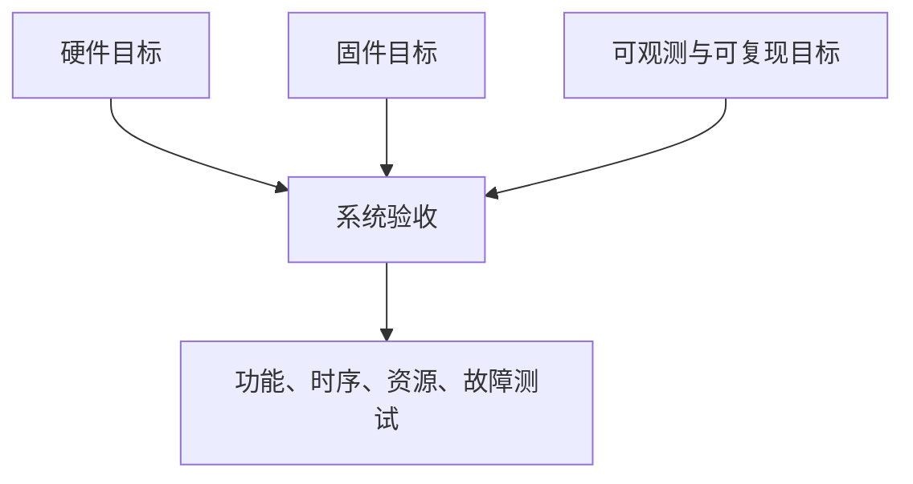
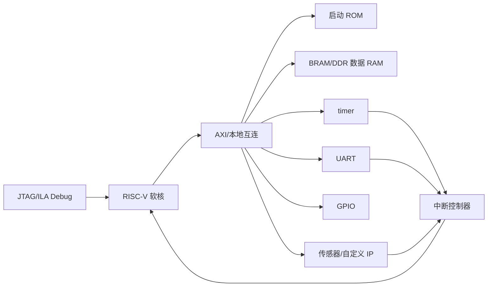
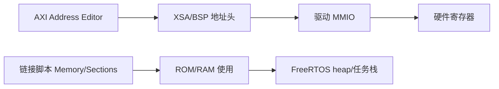
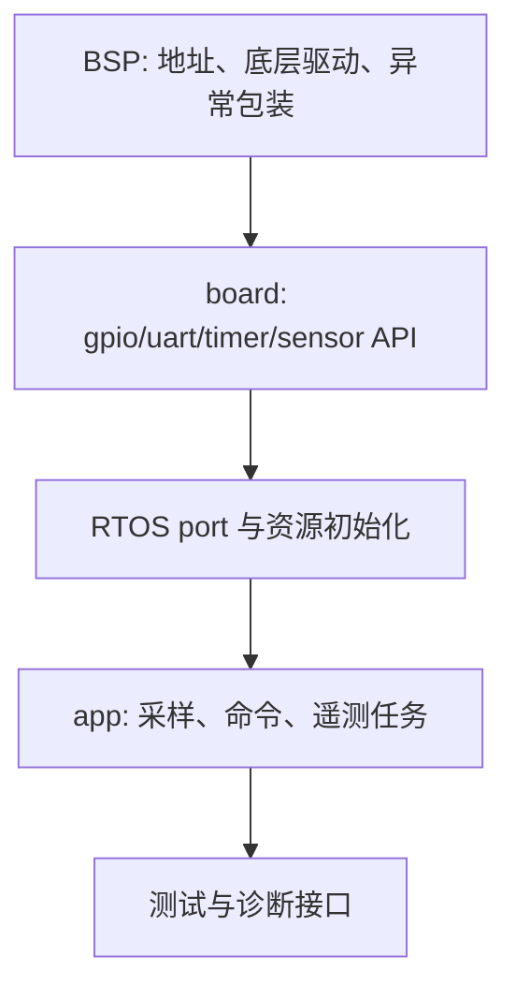
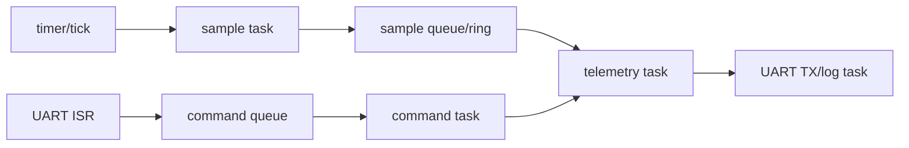
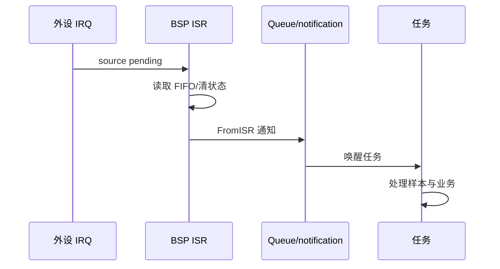
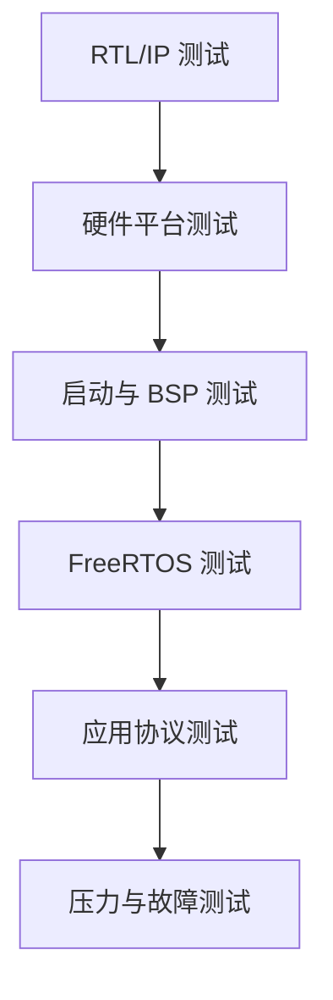
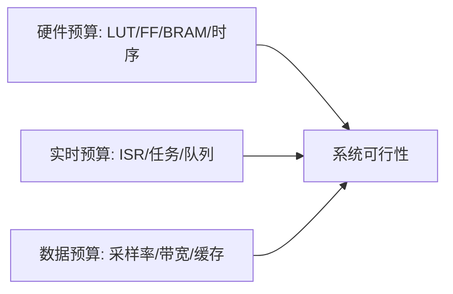
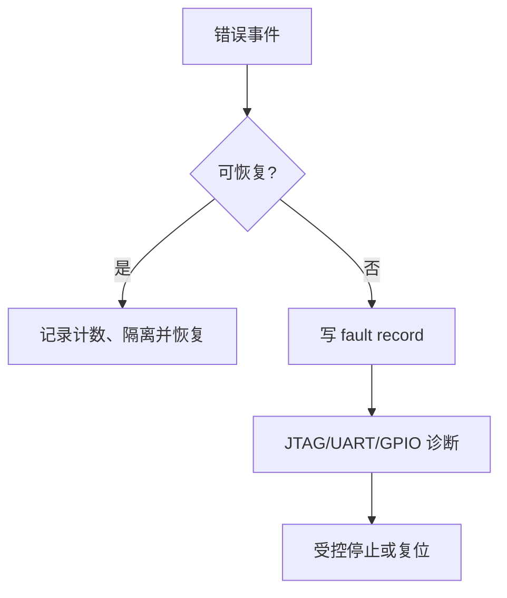

系列前半段已经建立了启动、trap、timer、FreeRTOS、软核、cache 与系统软件的基础。

本篇把这些知识收束为一个 FPGA RISC-V 软核 SoC 项目。

项目不是一份“能编译”的工程目录。

它需要同时交付硬件平台、地址图、BSP、固件、测试、性能/资源报告和问题追踪证据。

示例场景选择“可配置的传感器节点”：周期采样、GPIO 状态、UART 命令、ring buffer、可选 PS/DDR 数据通道与 FreeRTOS 任务。

传感器 IP 的具体寄存器和引脚由你的 block design 定义。

本文不虚构某块板卡的地址、采样率或时钟参数。

## 1. 先写项目边界和成功标准

硬件目标是 RISC-V 软核可从片上存储启动，通过 AXI 访问 UART、GPIO、timer 和一个自定义传感器/模拟 IP。

软件目标是 FreeRTOS 以确定 tick 调度采样、命令与状态任务。

系统目标是每条数据都有时间戳、每次硬件/软件变更可追溯、故障能由 JTAG/UART/GPIO/ILA 观察。



在开始画 block design 前，写出以下成功条件。

| 领域 | 可判定成功条件 |
| --- | --- |
| 启动 | reset 后在 `_start`、`main` 和首任务入口可断下 |
| 存储 | ROM/RAM/heap/任务栈不重叠，RAM 自检通过 |
| 时基 | tick 单调、deadline 位于未来、采样周期可测 |
| 外设 | GPIO/UART/timer/传感器按导出地址图可访问 |
| 并发 | ISR 只搬运事件，任务通过队列/通知协作 |
| 数据 | 每个样本有序号、时间戳、状态与校验 |
| 故障 | stack/heap/异常/超时能留下结构化记录 |
| 交付 | XSA、bitstream、BSP、ELF、报告来自同一版本 |

## 2. 硬件结构保持分层

将计算、互连、存储、外设和调试拆开。



每个 IP 的地址、时钟、reset、IRQ 类型和访问宽度都写入接口表。

自定义传感器 IP 的寄存器文档需要与 RTL、驱动和测试共享。

不要让驱动依赖 RTL 中未记录的 bit field。

## 3. 地址图与内存图是共同设计物

Address Editor 产生硬件地址窗口。

链接脚本分配代码、`.data`、`.bss`、heap、任务栈和可选共享缓冲。

这两张图必须共同审查。



示例内存用途：

| 区域 | 用途 | 审查重点 |
| --- | --- | --- |
| ROM/BRAM 代码 | 启动、text、rodata | 入口、初始化和容量 |
| 数据 RAM | data、bss、栈 | 对齐、边界与 stack guard |
| FreeRTOS heap | 动态对象 | 与链接段不重叠 |
| DMA/共享区 | PS/PL 或 IP 缓冲 | cache 属性与所有权 |
| MMIO 窗口 | 外设寄存器 | 宽度、权限和 side effect |

## 4. 固件按 BSP、board 和应用分层

`bsp` 层由平台导出物和供应商驱动提供。

`board` 层封装 UART、GPIO、timer、传感器与 reset 的项目语义。

`app` 层只关心采样、命令、存储和业务状态。



禁止应用直接包含一长串平台基地址宏。

这样替换传感器 IP、调整地址或切换仿真平台时，变更停留在 BSP/board 边界。

## 5. 任务设计以数据所有权为中心

建议的任务包括：

采样任务按周期启动转换或读取采样 FIFO。

命令任务处理 UART 帧并修改允许的配置。

遥测任务打包状态、错误计数与样本摘要。

日志任务输出低优先级诊断。



队列中传递的是样本副本、固定大小事件或对象引用。

若传递指针，必须定义缓冲区所有权何时交给消费者、何时回收。

不定义所有权会比“队列满”更难调试。

## 6. ISR 与任务之间保持最小接口

传感器 ready 或 UART RX IRQ 在 ISR 中只做三件事：读取/确认硬件状态、搬运最小数据、发出 FromISR 通知。

复杂滤波、文本格式化、flash 写入和网络发送在任务中完成。



若 ISR 发现队列满，应增加 drop counter 并制定背压策略。

它不应无限等待或无声丢弃。

## 7. 时间戳和采样序号是最小可观测数据模型

每条样本至少带有单调序号、tick/硬件时间戳、值、状态位和来源。

```c
typedef struct {
  uint32_t sequence;
  uint32_t tick;
  int32_t value;
  uint32_t status;
} sample_t;
```

字段宽度应按实际 ABI、协议和溢出周期选择。

如果样本通过 UART 或 PS/PL 共享缓冲传输，使用明确字节序和版本字段。

不要发送未定义 padding 的裸 C 结构体作为长期协议。


## 8. 建立逐层测试矩阵

测试需要同时覆盖硬件、启动、驱动、RTOS 和应用。

| 层级 | 测试 | 通过证据 |
| --- | --- | --- |
| RTL/IP | 寄存器、FIFO、IRQ 状态机 | 仿真波形与断言 |
| Block Design | 地址、时钟、reset、IRQ | DRC、Address Editor、时序报告 |
| 启动 | `_start`、栈、bss、RAM | JTAG/GDB 断点和内存自检 |
| 驱动 | GPIO/UART/timer/sensor | loopback、ILA、寄存器读写 |
| RTOS | tick、切换、队列、hook | TCB、tick、stack 水位 |
| 应用 | 采样、命令、遥测 | 主机协议脚本与数据校验 |
| 压力 | 队列满、IRQ 突发、故障 | counter、fault record、恢复策略 |



每层测试都能单独运行和保存结果。

应用失败时不要立刻重新综合硬件。

先用低层回归确定 platform 没有退化。

## 9. 性能与资源以预算管理

RISC-V 软核 SoC 的资源预算包括 LUT、FF、BRAM、DSP、时钟频率和外部带宽。

实时预算包括 timer ISR、最长临界区、采样 ISR、任务计算、队列延迟和 UART 带宽。



任何新增 feature 都应说明消耗哪一类预算。

例如增加 FIR 过滤器可能消耗 DSP、任务周期和样本缓冲。

增加 trace 可能消耗 BRAM 和 UART 带宽。

## 10. 故障策略必须在发布前确定

定义超时、队列满、传感器错误、UART 帧错误、stack overflow、heap failure 和硬件异常的行为。

有些错误可丢弃单个样本并继续。

有些错误必须停机、复位或通知 PS/主机。



不要让 `configASSERT` 被编译掉后变成无声内存破坏。

发布构建可以减少日志，但应保留错误计数、复位原因和结构化 fault record。

## 11. 交付物和版本关系

项目交付不只是源代码。

| 交付物 | 用途 |
| --- | --- |
| Vivado Tcl/BD/约束 | 重建硬件平台 |
| IP 寄存器规范 | 驱动与测试共同契约 |
| 实现/时序报告 | 资源与频率证据 |
| XSA 与 BSP 配置 | 重建软件平台 |
| 链接脚本/启动代码 | 固件内存与入口 |
| FreeRTOSConfig/应用源码 | 任务与实时策略 |
| ELF/bin 与 hash | 可下载固件身份 |
| 主机测试脚本与日志 | 功能回归证据 |
| 已知限制 | 不支持功能与风险边界 |

给每个集合一个共同版本标签。

这样能重建“某个通过的 bitstream 上运行了哪个 ELF”。

## 12. 常见失败模式

| 症状 | 先检查 | 典型原因 |
| --- | --- | --- |
| 应用能跑但样本错乱 | 缓冲所有权与队列 | 指针生命周期不清或并发写入 |
| 采样周期抖动大 | ISR/任务预算 | 在高优先级路径做日志或滤波 |
| UART 命令丢失 | RX FIFO/队列/协议 | ISR 不及时或没有帧边界/背压 |
| PS/PL 数据陈旧 | cache 与所有权 | 共享 DDR 缺少维护和通知 |
| 压力下重启 | 栈/heap/异常 hook | 内存预算不足或 fault path 不可观测 |
| 修改硬件后软件失效 | XSA/BSP 版本 | 平台导出与 ELF 不一致 |
| bitstream 时序失败 | 软核/互连关键路径 | 预算未留余量或约束缺失 |

## 13. 练习与验收

### 练习

1. 将你的项目目标改写为启动、时基、外设、并发、数据、故障与交付七类可判定条件。
2. 在 block design 中建立 CPU、ROM/RAM、UART、GPIO、timer、传感器 IP 与 IRQ 控制器。
3. 为每个 IP 写一页寄存器/IRQ 协议，并让驱动和 RTL 测试共用。
4. 实现 sample、command、telemetry、log 四类任务，并记录它们的优先级和数据所有权。
5. 用主机脚本向 UART 发送命令，验证返回样本序号、时间戳和错误计数。
6. 注入队列满、传感器超时、异常和堆不足，确认 fault record 与恢复策略符合设计。

### 本篇验收清单

- [ ] 能用可判定条件定义软核 SoC 项目的成功范围。
- [ ] 能为硬件 IP、地址图、链接脚本和 BSP 建立共同接口。
- [ ] 能让应用只通过 board/BSP 边界访问平台外设。
- [ ] 能定义任务、队列和缓冲区所有权，不依赖隐式共享状态。
- [ ] 能让 ISR 保持最小工作并将业务交给任务。
- [ ] 能为样本建立序号、时间戳、状态和协议版本。
- [ ] 能用 RTL 到应用的测试矩阵定位问题层级。
- [ ] 能交付可重建硬件、软件和验证结果的一组版本化工件。

一个完整的 RISC-V 软核 SoC 项目，最终交付的是可复现的系统能力。

当硬件平台、实时软件、数据协议和验证证据属于同一个版本，项目才具备继续扩展到 Linux、加速器或边缘 AI 的基础。

> 🏷️ RISC-V · SoC · FPGA · MicroBlaze V · FreeRTOS · AXI · 综合项目
