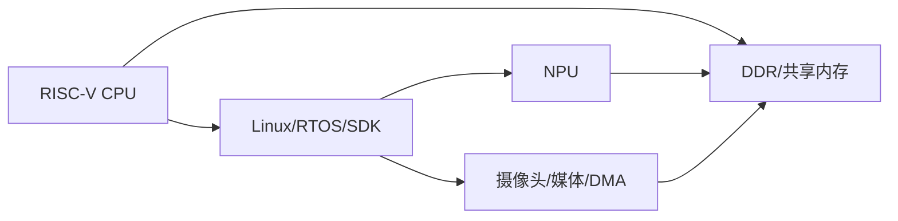
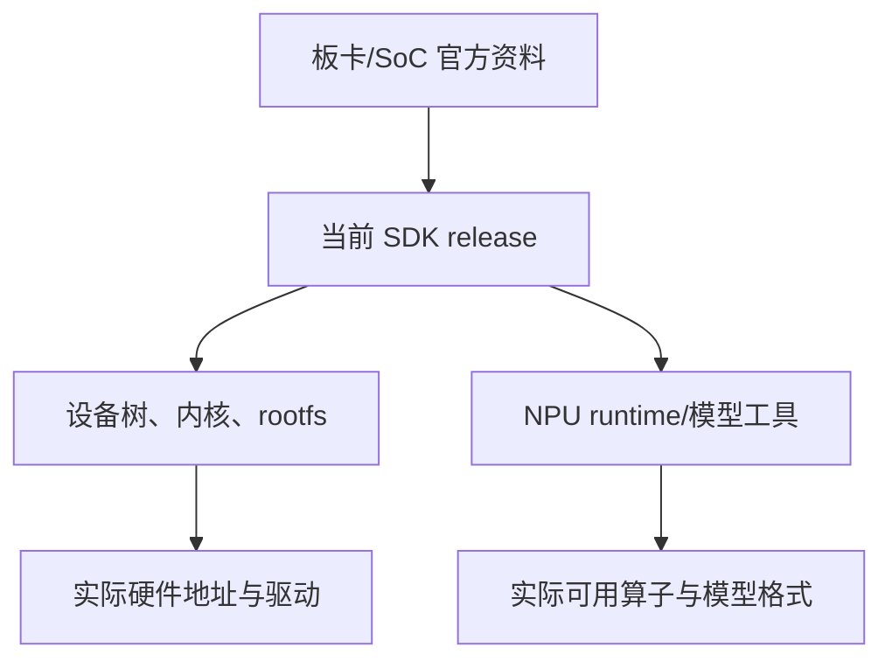
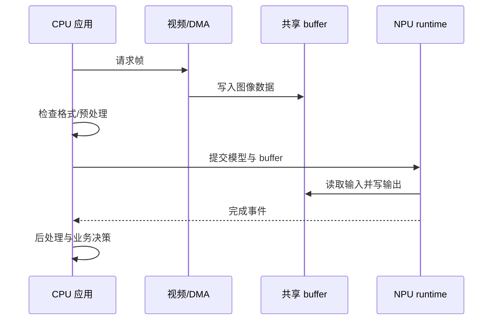
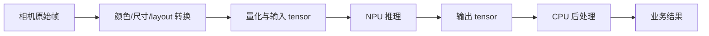
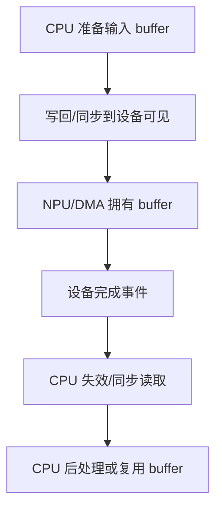
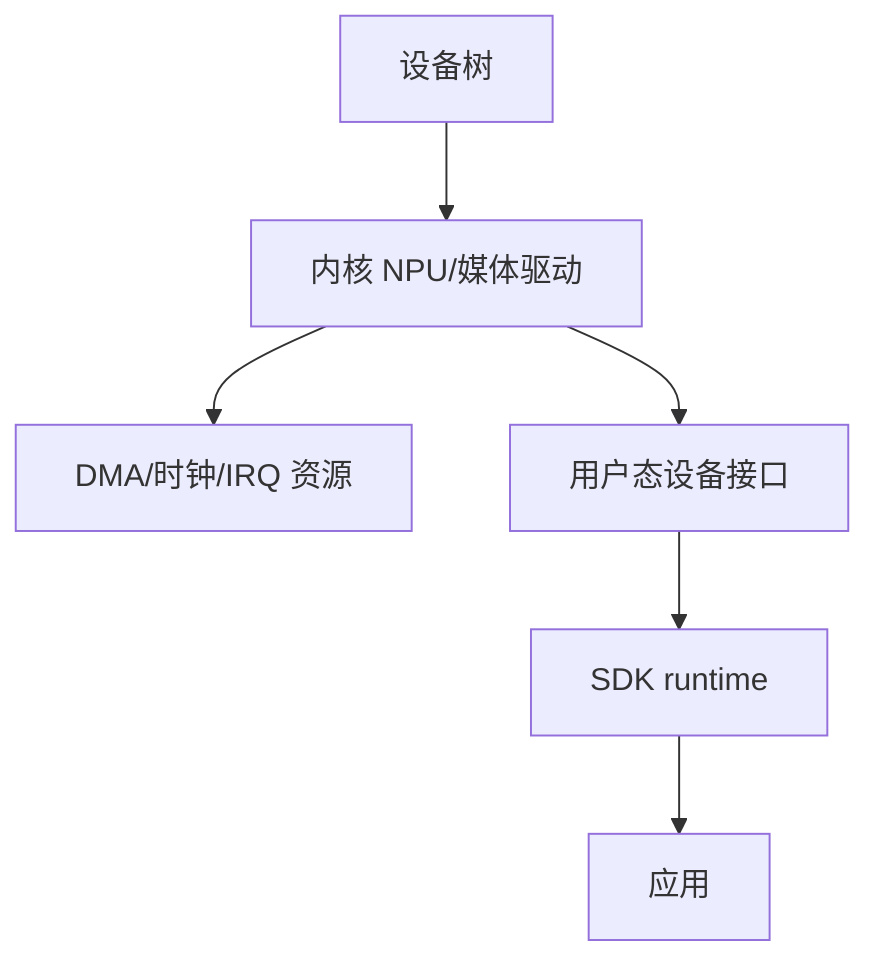
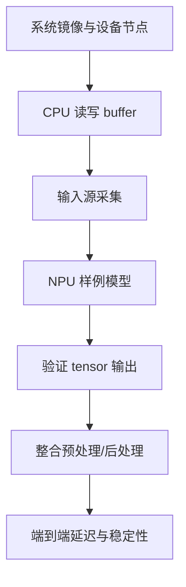
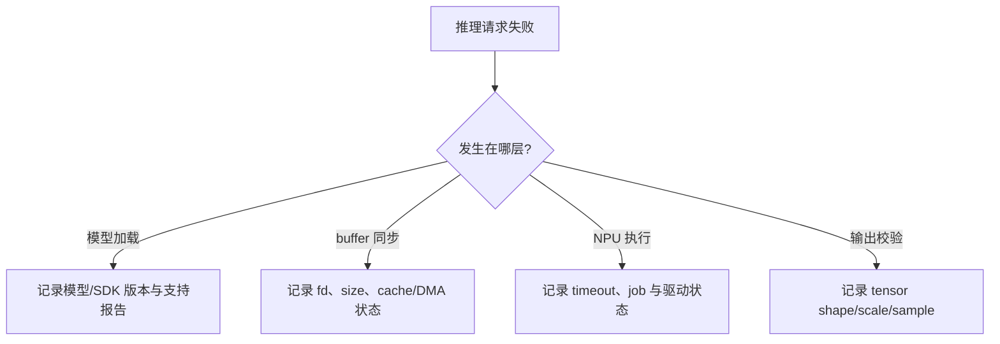
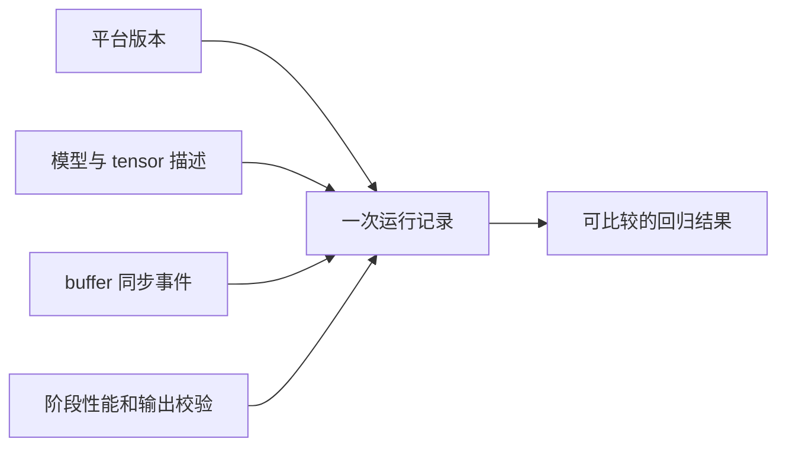

前面的 FPGA 软核项目强调“自己定义硬件平台”。

进入集成式 RISC-V SoC 后，重点转为理解一个已经存在的 CPU、NPU、内存、媒体和 SDK 系统如何分工。

Milk-V Duo 文档将 Duo 256M 描述为基于 SG2002 的平台，并列出 RISC-V C906 处理器和 NPU 等核心资源。[Milk-V Duo 概览](https://milkv.io/docs/duo/overview)

这里的 NPU API、模型格式、运行时和工具链都属于供应商 SDK 与发布版本的边界。

它们不是 RISC-V ISA 的一部分。

本文关注的是如何建立可迁移的系统方法，而不是固定某个 SDK 命令。

## 1. 先把 SoC 看成异构执行域

CPU 擅长控制流、协议、预处理、后处理和系统服务。

NPU 擅长其支持算子的密集推理。

媒体引擎、DMA 和外设控制器负责数据采集与搬运。

内存系统把这些执行域连接起来。

异构不等于所有部件可以随意共享一个 buffer。

每次从采集到 CPU，再从 CPU 到 NPU，再到显示/网络，都需要明确所有权、格式、cache 与同步。

## 2. SG2002 板级信息必须从当前官方资料和 SDK 获取

Milk-V 的 Duo 页面和 SDK 文档提供不同板型、内存和构建入口。

例如官方 Buildroot SDK 指南中使用了特定 SoC/板型输出目录命名。[Milk-V Buildroot SDK 指南](https://milkv.io/docs/duo/getting-started/buildroot-sdk)

这类名称、版本和目录会随 SDK 演进改变。

项目记录应保存板卡型号、SoC 修订、SDK commit、镜像版本、内核 config、设备树和 runtime 库版本。

不要只记“Milk-V Duo 能运行某模型”。

那无法复现依赖关系。

## 3. CPU 的任务是编排，而不是和 NPU 竞争每个算子

一个典型推理路径中，CPU 负责启动摄像头、准备 buffer、做颜色/尺寸转换、提交 job、等待完成、解码输出和执行业务决策。

NPU 负责被支持的图计算区域。

若把大量可向量化的预处理或非模型控制工作错误地放进 NPU，可能无法获得支持。

若把已支持的完整网络逐层拆回 CPU，又会失去加速器的价值。

需要由模型转换报告、算子支持列表和端到端 profile 决定边界。

## 4. 数据格式比“模型能加载”更早决定成败

图像来源可能是 YUV、RGB、BGR 或压缩码流。

模型输入可能要求固定尺寸、通道顺序、量化比例、零点与 layout。

NPU 输出可能是量化 tensor，需要 CPU 做反量化、阈值、NMS 或跟踪。

每个变换都应记录输入 shape、stride、像素格式、量化参数和 buffer 所有者。

只比较最终类别标签无法定位“颜色通道错误”“letterbox 参数错误”或“量化比例不匹配”。

## 5. Buffer 所有权和 cache 是 CPU/NPU 协作的核心

DMA 或 NPU 可能通过共享物理内存访问输入输出。

CPU cache 中的脏 line 未写回时，设备可能读到旧数据。

设备写回后，CPU 若仍持有旧 cache line，也可能读到旧结果。

具体 cache 同步 API 来自当前 Linux driver、DMA-BUF、SDK 或内核框架。

不要把一条 RISC-V `fence` 当作所有 buffer 同步的替代品。

它不能替代设备 DMA 映射和 cache maintenance 协议。

## 6. 设备树、驱动和用户态 runtime 各有职责

设备树描述硬件存在、地址、IRQ、时钟和兼容字符串。

内核驱动管理电源、时钟、DMA、中断、字符设备或 media 接口。

用户态 runtime 调用受支持的 ioctl、库或服务接口提交模型任务。

不要在用户态程序中直接映射推测的 NPU 寄存器。

那绕过了驱动的资源管理，也会随 SoC/SDK 版本失效。

## 7. 建立最小“模型之外”的 bring-up

首先验证串口、存储、网络、相机或输入源、内存分配和驱动节点。

然后运行一个 CPU-only 图像/数组处理基准。

再用 SDK 的最小样例确认 NPU runtime 能加载模型并返回输出。

最后把它们组合成实时 pipeline。

这种顺序避免在模型转换失败时误改 camera 驱动，也避免在 DMA 配置错误时误判 NPU 算子不支持。

## 8. 端到端性能应分阶段测量

总帧率由最慢阶段决定。

测量至少包括采集、预处理、输入同步、NPU 推理、输出同步、后处理和发送/显示。

```mermaid
gantt
    title 单帧处理阶段
    dateFormat  X
    axisFormat %s
    section CPU
    采集准备 :a1, 0, 1
    预处理 :a2, 1, 2
    后处理 :a3, 5, 1
    section NPU
    推理 :b1, 3, 2
```

图中周期只表示阶段关系，不表示 SG2002 的真实时延。

对每个阶段记录平均值、分位数、最大值和丢帧/超时计数。

把模型推理时间单独很快与端到端很快区分开。

## 9. 失效必须可诊断

模型 load 失败、设备 node 缺失、DMA 映射失败、输入格式错误、NPU timeout 和输出 NaN/异常量化都要有不同错误码。

不要用“推理失败”一个字符串覆盖所有层次。

可观测状态越靠近边界，恢复和升级越容易。

## 10. 常见失败模式

| 症状 | 先检查 | 典型原因 |
| --- | --- | --- |
| runtime 找不到设备 | DTB/驱动节点/权限 | 镜像或驱动版本不匹配 |
| NPU 输出全零/异常 | 输入 tensor 格式 | layout、量化或 cache 同步错误 |
| CPU 读到旧输出 | buffer 同步 | 设备写入后未完成 CPU 可见性操作 |
| 推理偶发超时 | job 生命周期/资源竞争 | buffer 被复用、时钟/驱动状态或队列拥塞 |
| 模型转换失败 | 支持算子/版本 | 将上游模型假定为 runtime 全支持 |
| 帧率低于预期 | 阶段 profile | 预处理、拷贝或后处理成为瓶颈 |
| 升级 SDK 后失效 | 固件/内核/runtime 组合 | 只替换了用户态库 |

## 11. 一次端到端运行应保存什么

为每次性能或正确性实验保存一份机器可读记录。

| 类别 | 最小字段 |
| --- | --- |
| 平台 | 板卡、SoC、镜像、内核、DTB、SDK/runtime 版本 |
| 模型 | 文件 hash、输入/输出 tensor 描述、转换工具版本 |
| 输入 | 来源、像素格式、尺寸、stride、量化参数 |
| buffer | 分配方式、大小、所有者、同步操作、fd/句柄策略 |
| 执行 | job 序号、提交/完成时间、timeout 与返回码 |
| 输出 | shape、scale、前若干元素、后处理版本 |
| 性能 | 各阶段时延、帧率、分位数、丢帧/重试计数 |
| 故障 | 驱动日志、runtime 错误、可重放输入样本 |

保存输入样本的 hash 或固定测试集。

否则模型、量化或预处理变化后，无法判断输出差异来自哪一层。

每一次 SDK 升级先运行固定输入集。

比较 CPU-only 基线、NPU 输出数值和端到端时延。

只有这三组证据同时存在，才能区分性能回归、精度回归与平台兼容性问题。

## 12. 练习与验收

### 练习

1. 记录当前 Milk-V Duo/SG2002 板卡、SDK、内核、DTB 和 runtime 版本。
2. 在不使用 NPU 的情况下完成输入帧或数组的 CPU-only 处理和 buffer 测试。
3. 运行供应商最小 NPU 样例，保存模型、输入 tensor 与输出 tensor 的 shape/量化信息。
4. 为输入和输出 buffer 画出 CPU、DMA、NPU 的所有权与同步转换图。
5. 分别测量采集、预处理、推理、后处理和端到端延迟。
6. 注入一次模型版本不匹配或 buffer 失败，确认错误记录能指出具体边界。

### 本篇验收清单

- [ ] 能区分 RISC-V CPU、NPU、DMA/媒体、内核驱动与用户态 runtime 的职责。
- [ ] 能将 Milk-V/SG2002 的结论绑定到具体板卡、SDK 和镜像版本。
- [ ] 能让模型输入输出格式、shape、量化和 stride 形成可检查契约。
- [ ] 能为 CPU/NPU 共享 buffer 定义所有权和 cache/DMA 同步。
- [ ] 能按系统、CPU buffer、NPU 样例、端到端顺序完成 bring-up。
- [ ] 能分阶段测量端到端性能，而非只报告推理耗时。
- [ ] 能用结构化错误码区分模型、驱动、buffer 和输出问题。
- [ ] 不会把供应商 NPU API 表述为 RISC-V ISA 的标准能力。

SG2002/Milk-V Duo 的工程价值，在于让 RISC-V CPU 成为异构系统的可编程控制中心。

部署记录必须将 NPU runtime 与内核驱动视为同一兼容性组合。

把 NPU 当成有明确输入、同步和版本边界的协处理资源，才能让模型推理成为可维护系统的一部分。

> 🏷️ RISC-V · SG2002 · Milk-V Duo · NPU · DMA · SoC · 边缘计算
