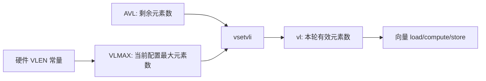
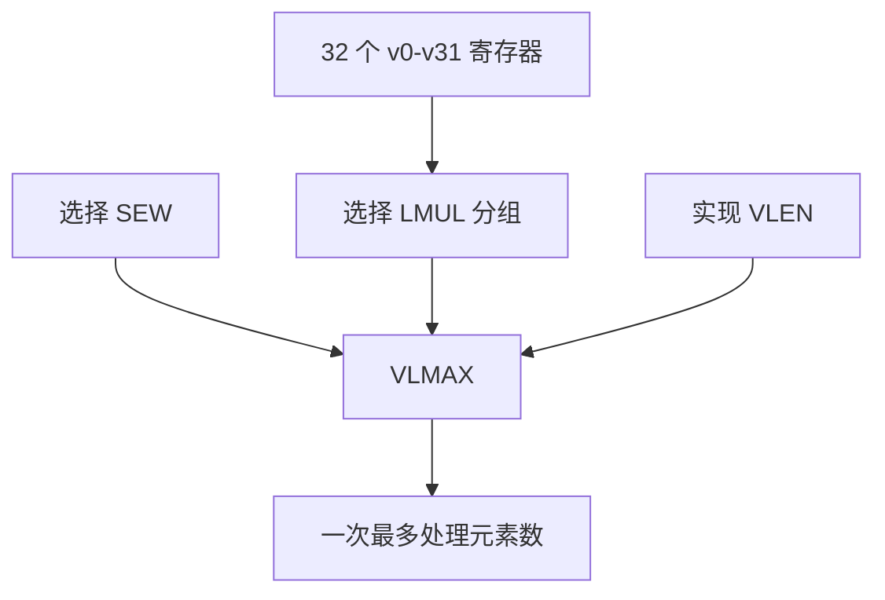
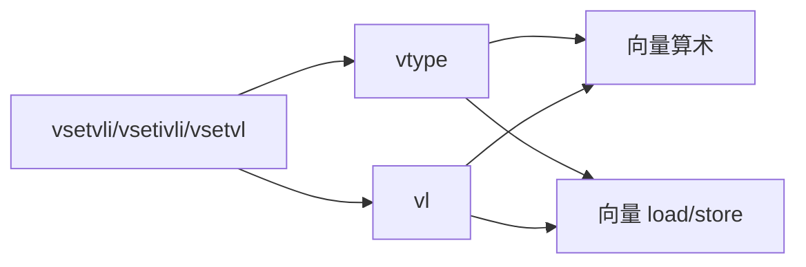
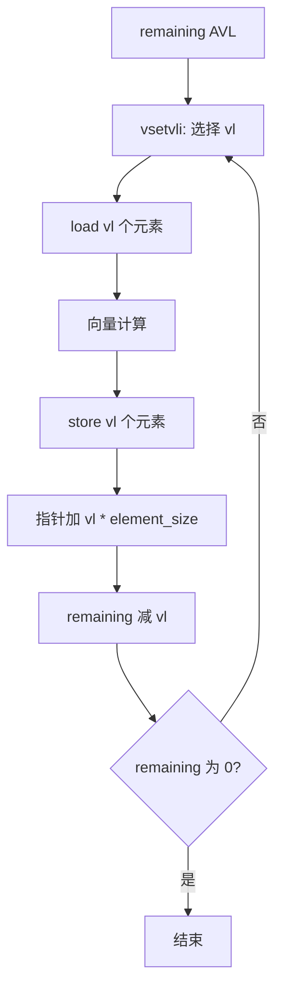
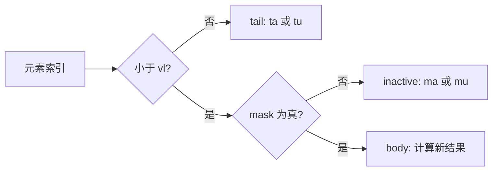
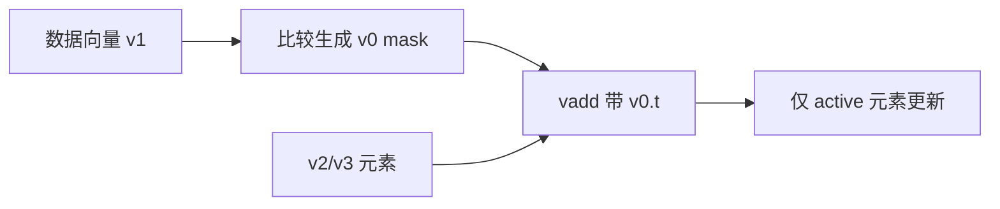
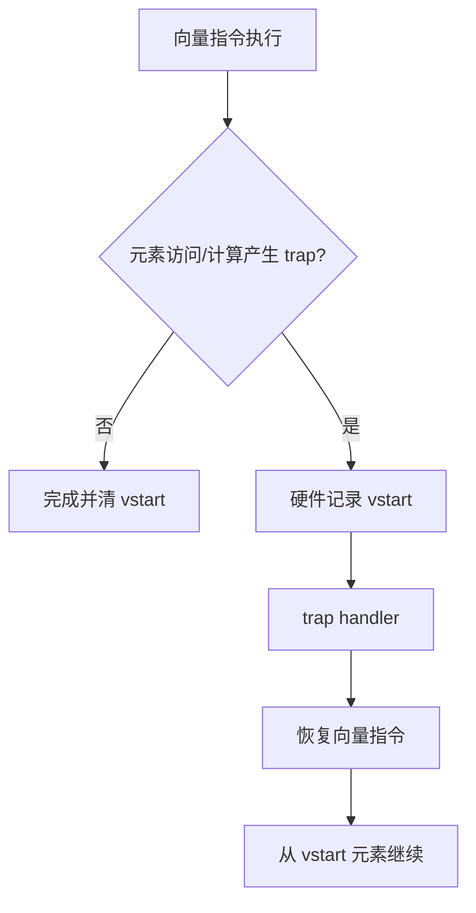
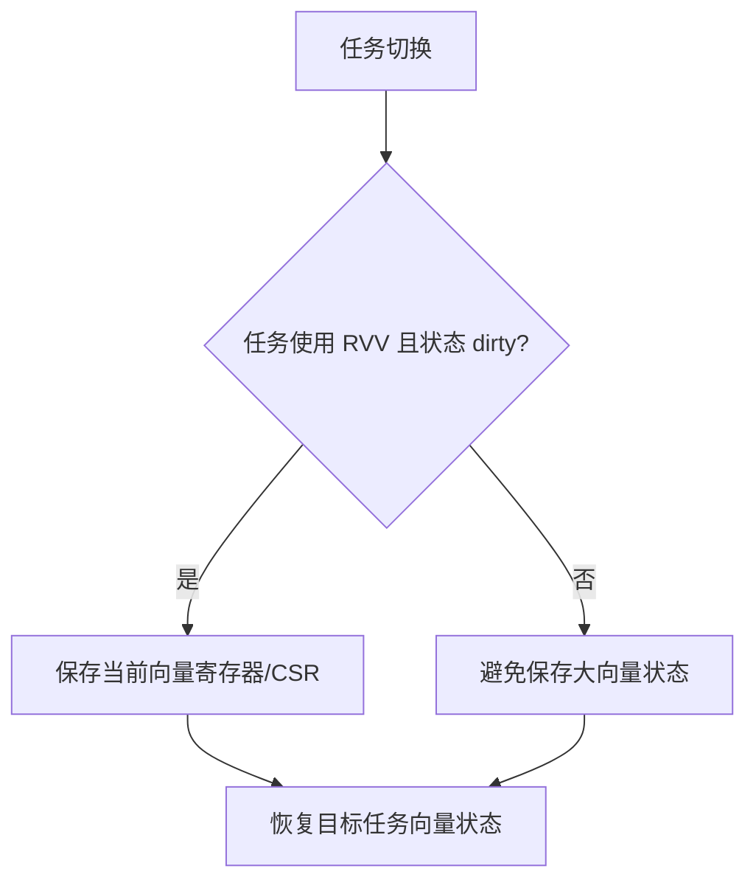
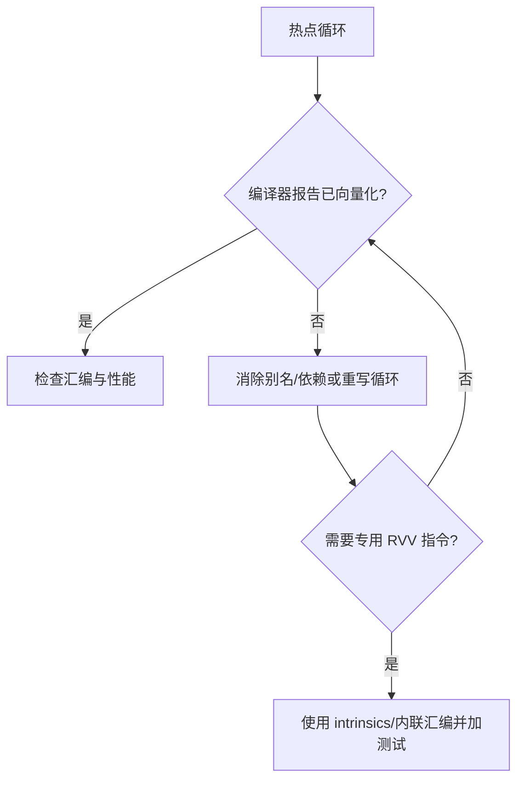
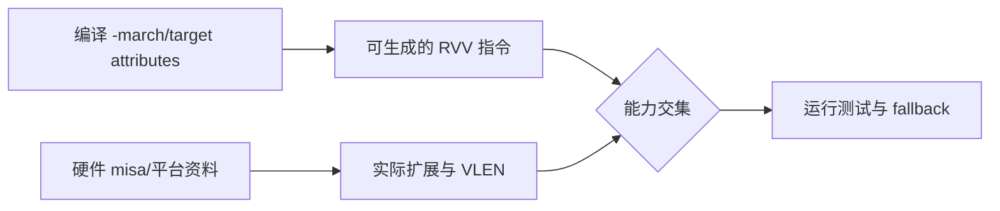

RVV 的核心不是“每条指令固定处理 4 个或 8 个元素”。

它把硬件向量寄存器长度 VLEN 与每次实际处理元素数量 `vl` 分开。

软件通过 `vsetvli` 请求一个元素类型和剩余长度，硬件返回当前可处理的 `vl`。

因此同一段二进制可在不同 VLEN 的实现上以不同批次大小执行。

这被称为 vector-length-agnostic，简称 VLA，编程模型。

RVV 1.0 定义 32 个向量寄存器、向量 CSR、配置指令、mask 和可移植的不同 VLEN 执行规则。[RISC-V V 扩展规范](https://docs.riscv.org/reference/isa/unpriv/v-st-ext)

## 1. VLEN 是硬件常量，`vl` 是运行时工作长度

每个支持 RVV 的 hart 有固定的单寄存器长度 VLEN。

它是实现参数，不应由应用源码假定为某个具体位数。

`vl` 是当前向量指令要处理的有效元素数。

它由配置指令根据 AVL、SEW、LMUL 和实现能力设定。



不要把 `vl` 等同于“CPU 有多少向量 lane”。

实现可以有不同物理 lane、流水深度或 microarchitecture，却对软件提供同样的 `vl` 语义。

## 2. 向量寄存器、元素宽度与分组共同定义容量

RVV 有架构向量寄存器 `v0` 到 `v31`。

SEW 是本次操作的标准元素宽度，例如 8、16、32、64 bit。

LMUL 让一个逻辑向量操作数占用一个或多个寄存器，或使用分数分组。

VLMAX 可由 VLEN、SEW 和 LMUL 推导。



较大的 SEW 会减少同一寄存器组容纳的元素数。

较大的 LMUL 会增加一个操作数可用的存储，但减少可同时使用的独立寄存器组。

选择不是“越大越快”。

它需要考虑数据类型、寄存器压力、指令支持和内存带宽。

## 3. `vtype` 和 `vl` 是向量指令的隐式上下文

`vtype` 描述 SEW、LMUL、tail policy、mask policy 和非法配置状态。

`vl` 表示有效元素数。

向量指令读取它们，而不是在每条指令中重复编码全部配置。



RVV 规范列出了 `vl`、`vtype`、`vlenb`、`vstart`、`vxrm`、`vxsat` 等向量状态 CSR。

向量状态是线程上下文的一部分。

操作系统若允许任务使用 RVV，需要在调度时正确管理该状态。

## 4. `vsetvli` 是 VLA 循环的入口

以下是典型的向量加法结构。

```asm
loop:
    vsetvli t0, a3, e32, m1, ta, ma
    vle32.v v1, (a0)
    vle32.v v2, (a1)
    vadd.vv v3, v1, v2
    vse32.v v3, (a2)
    slli t1, t0, 2
    add a0, a0, t1
    add a1, a1, t1
    add a2, a2, t1
    sub a3, a3, t0
    bnez a3, loop
```

`a3` 代表剩余元素数 AVL。

`vsetvli` 把本轮实际元素数写入 `t0`，也更新 `vl`。

指针按 `vl * sizeof(element)` 前进，而不是按固定常量前进。



这份循环不假定 VLEN 为 128、256 或其他值。

只要目标支持请求的元素类型和指令，硬件可选择适合自己的批次大小。

## 5. `ta`、`tu`、`ma`、`mu` 不是装饰参数

tail elements 是索引不小于 `vl` 的目标元素。

masked-off elements 是在有效范围内但 mask 为假时未参与的元素。

tail/mask policy 决定这些未写入目标元素是保持旧值，还是可以变成不确定的 agnostic 值。



当算法不再读取 tail 或 inactive 元素时，agnostic policy 可以给实现更多自由。

当算法依赖旧元素保留时，必须选择 undisturbed policy 或显式保存数据。

RVV 规范要求在 `vsetvli` 中明确指定这些策略标志。[RVV vtype 策略](https://docs.riscv.org/reference/isa/unpriv/v-st-ext)

不要依赖某个实现“碰巧没有改写”无效元素。

## 6. mask 使用 `v0` 控制按元素执行

RVV 中 mask 通常位于向量寄存器 `v0`。

带 `v0.t` 的向量指令只对 mask 为真的元素执行。

被 mask 掉的元素不产生该指令的访问/计算副作用。

```asm
vmslt.vx v0, v1, a0
vadd.vv v2, v2, v3, v0.t
```



mask 适合处理阈值、边界、条件更新和稀疏选择。

它不是消除所有分支代价的魔法。

生成 mask、执行 masked load/store 与处理数据布局仍会消耗资源。

## 7. `vstart` 关联可恢复 trap 与向量状态

向量指令可能在某个元素访问处发生可恢复 trap。

`vstart` 表示恢复时应从哪个元素开始执行。

正常完成的向量指令会将 `vstart` 清零。



系统软件需要理解这一点，尤其是构建可抢占任务和 page fault 处理时。

应用通常不应随意把 `vstart` 写成非零值来做循环控制。

## 8. RVV 上下文切换比保存整数寄存器更昂贵

32 个向量寄存器的状态大小取决于 VLEN。

每次任务切换都无条件保存全部向量状态会显著增加开销。

特权状态中的 VS 字段允许操作系统识别向量状态是否活跃/dirty，从而实施惰性保存等策略。



策略必须符合目标 OS、ABI 和实现能力。

不要在裸机 demo 中省略保存后，就假定抢占式 RTOS 也能安全共享 RVV。

## 9. 编译器自动向量化与内联汇编的边界

编译器可以在满足别名、对齐、循环依赖与目标 ISA 条件时自动向量化。

内联汇编可精确控制指令，但增加寄存器约束、clobber 和可移植性成本。



先用正确的标量参考实现验证结果。

再比较自动向量化、intrinsics 与手写汇编。

不要只因为反汇编中出现 `v` 前缀，就忽略 tail、mask、溢出和数值一致性。

## 10. 检查目标是否真的支持所需 RVV

RISC-V V 扩展与嵌入式 Zve 子集提供不同能力。

目标可能支持向量整数、部分浮点或不同最小 VLEN。



应用应在构建、部署或运行时确认能力。

不能因为 SoC 是 RISC-V 就假定存在 RVV。

## 11. 常见失败模式

| 症状 | 先检查 | 典型原因 |
| --- | --- | --- |
| 结果尾部错误 | `vl` 循环和 tail policy | 指针按固定长度前进或读取 agnostic tail |
| 非法指令 | `-march` 与硬件扩展 | 目标没有 V/Zve 或配置非法 vtype |
| 大数组只处理一段 | AVL 更新 | 忘记减去实际 `vl` |
| masked 结果异常 | `v0` 和 mask policy | mask 覆盖/未初始化或依赖 inactive 数据 |
| RTOS 切换后向量数据损坏 | VS/上下文保存 | port 未管理向量状态 |
| 性能无提升 | 内存与循环结构 | 数据带宽/别名/访存成为瓶颈 |
| 不同硬件结果不同 | VLEN 假设 | 代码依赖固定批次或 agnostic 值 |

## 12. 练习与验收

### 练习

1. 为 `float` 或 `int32_t` 数组加法实现标量参考循环和 VLA RVV 循环。
2. 在循环中打印/记录每轮 AVL、返回的 `vl` 和指针增量，验证总元素数一致。
3. 用不同数组长度测试，覆盖小于、等于和大于当前 VLMAX 的情况。
4. 使用 `v0` 实现阈值选择，明确 masked-off 与 tail 元素能否被读取。
5. 在抢占式系统中运行两个使用 RVV 的任务，检查 port 的向量状态保存策略。
6. 对比自动向量化和手写 RVV 的汇编、结果与内存带宽。

### 本篇验收清单

- [ ] 能区分硬件 VLEN、最大 VLMAX、运行时 AVL 与 `vl`。
- [ ] 能用 SEW、LMUL、`vtype` 解释一次向量操作的元素布局。
- [ ] 能写出按返回 `vl` 推进的 VLA strip-mining 循环。
- [ ] 能明确选择并正确使用 tail/mask policy。
- [ ] 能用 `v0` mask 处理条件元素，并知道 inactive 元素规则。
- [ ] 能说明 `vstart` 与可恢复 trap 的关系。
- [ ] 能为 RTOS/OS 向量状态保存估计额外上下文成本。
- [ ] 能确认编译器、硬件和部署环境的实际 RVV 能力交集。

RVV 的可移植性来自“软件请求元素类型与工作量，硬件决定每轮长度”的协议。

遵守这个协议，向量代码才能跨不同 VLEN 保持正确，并把性能优化留给实现与数据布局共同发挥。

> 🏷️ RISC-V · RVV · 向量扩展 · VLA · vsetvli · SIMD · 性能
