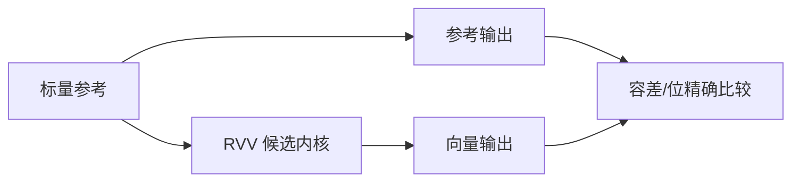
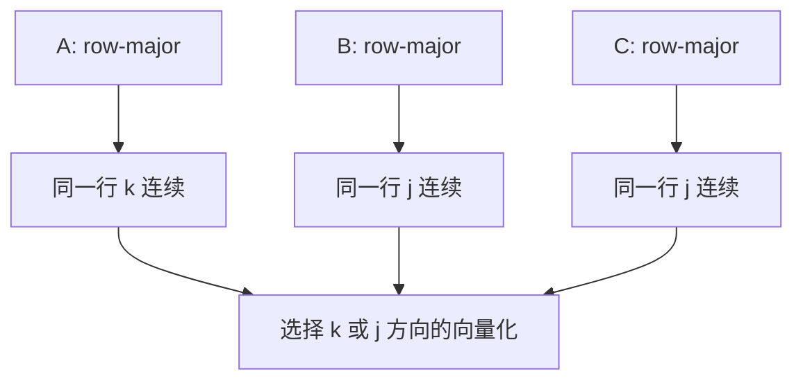
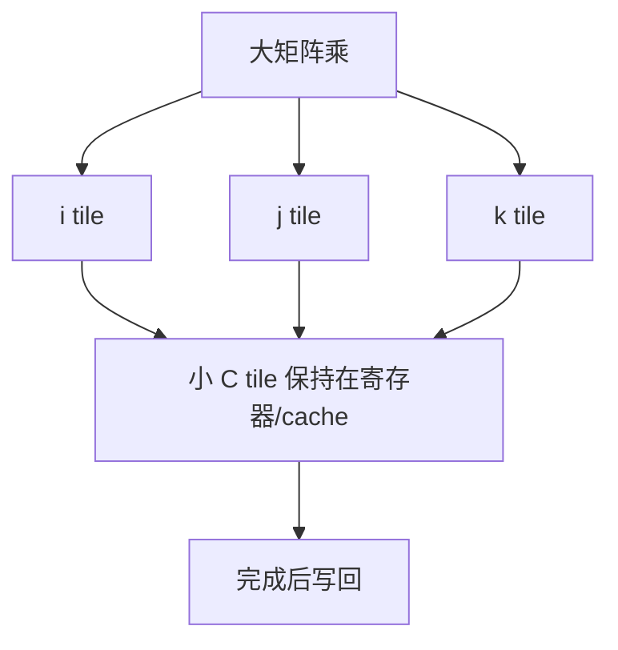
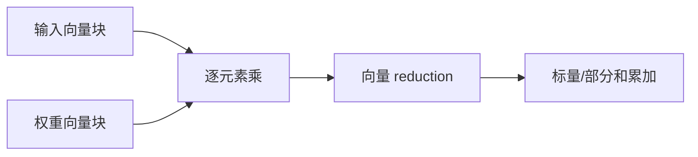
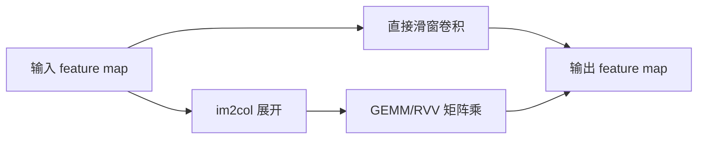
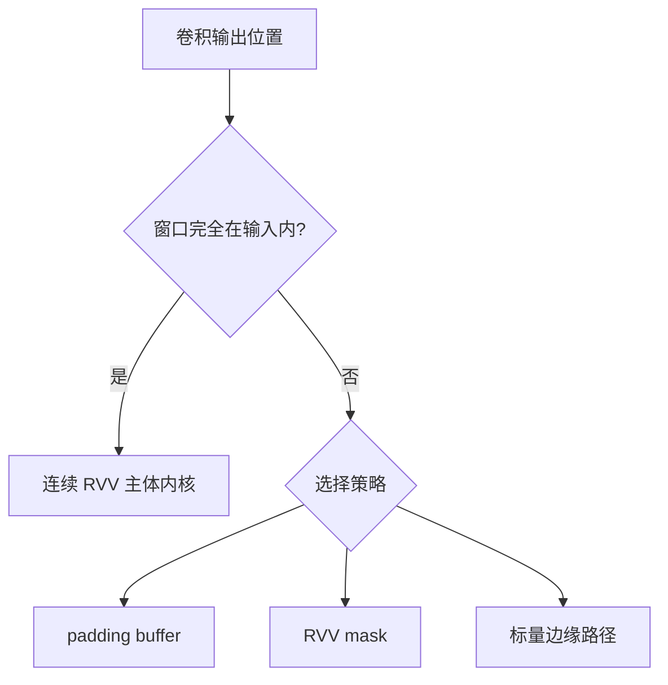
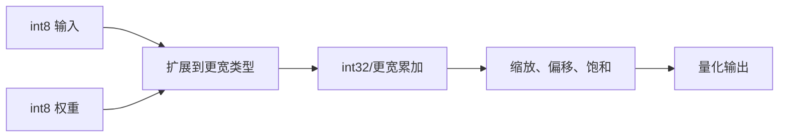
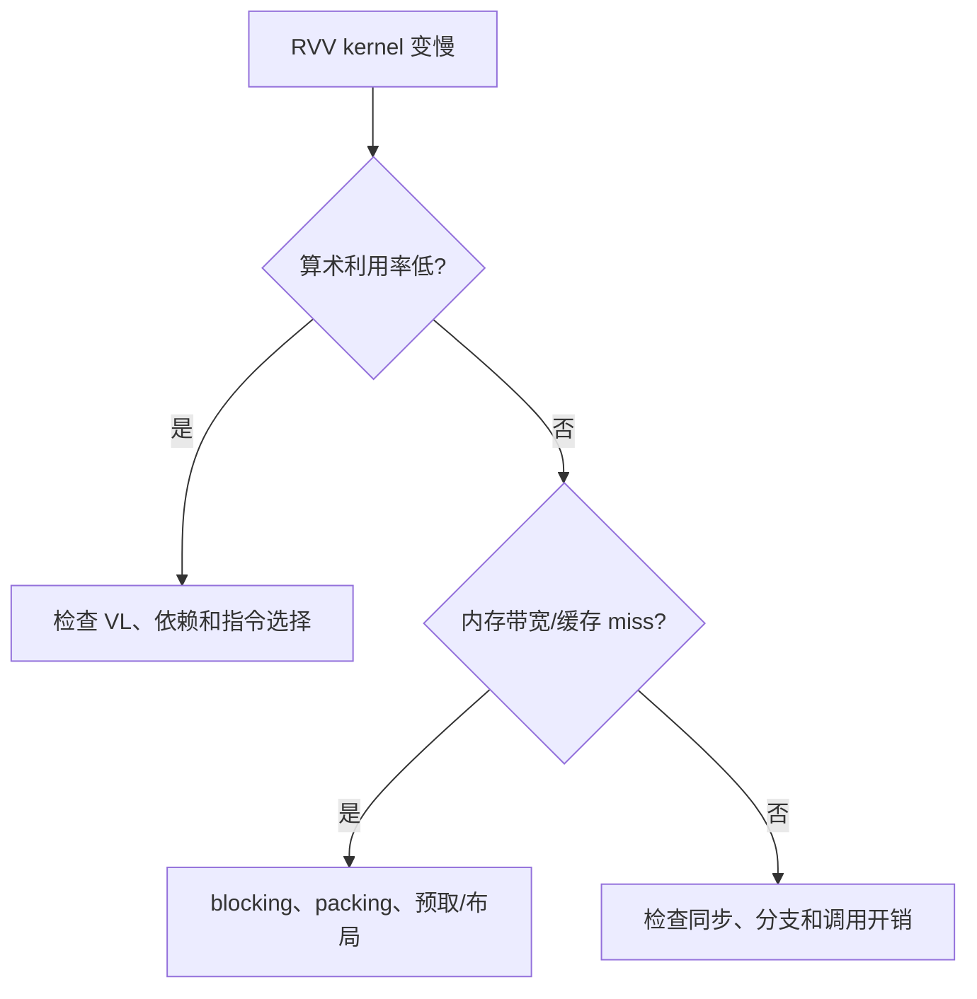
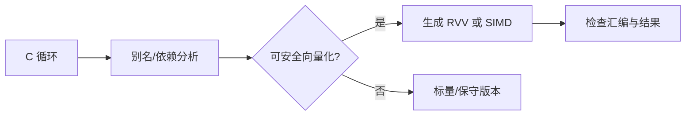
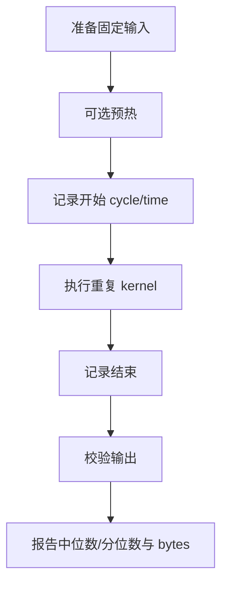

矩阵乘和卷积并不是“把标量 `for` 循环中的 `+` 换成向量加法”就能高效。

它们的性能往往由数据复用、访存连续性、tile 大小、累加精度、量化和 cache/带宽共同决定。

RVV 提供的是可随 VLEN 缩放的元素级操作。

算法仍要把工作划分为适合这种操作和内存系统的块。

RVV 规范定义了 VLA 配置、向量 load/store、整数/浮点算术、reduction 和 mask 等基础能力。[RISC-V V 扩展规范](https://docs.riscv.org/reference/isa/unpriv/v-st-ext)

## 1. 先保留正确的标量参考实现

所有向量内核都应先有易读、可测试的标量版本。

对矩阵乘：

```c
for (size_t i = 0; i < m; ++i) {
  for (size_t j = 0; j < n; ++j) {
    float acc = 0.0f;
    for (size_t k = 0; k < kdim; ++k) {
      acc += a[i * kdim + k] * b[k * n + j];
    }
    c[i * n + j] = acc;
  }
}
```

参考实现定义索引、边界、数值类型与累加顺序。

它也是每次向量化、分块、预打包或量化后的结果判定来源。



先验证正确性，再量性能。

不应使用“更快但结果略有不同”来跳过数值分析。

## 2. 矩阵布局决定哪一维适合向量化

以 row-major 连续存储为例，矩阵一行的元素在内存中连续。

若一次计算一个 C 行的多个列，B 的访问是否连续取决于 B 的布局或预转置。



不要只根据数学符号选择向量方向。

先画出每个 inner loop 的地址递增模式。

连续 unit-stride load/store 通常更容易利用内存带宽。

stride 访问与 gather/scatter 在某些场景必要，但成本和支持度需评估。

## 3. 一个向量化行更新的思路

对 `C[i, j:j+vl] += A[i,k] * B[k,j:j+vl]`，可以把 A 的标量元素广播，并加载 B/C 的连续向量段。

```asm
loop_j:
    vsetvli t0, a_remain, e32, m1, ta, ma
    vle32.v v1, (a_b_ptr)
    vle32.v v2, (a_c_ptr)
    vfmacc.vf v2, fa0, v1
    vse32.v v2, (a_c_ptr)
    slli t1, t0, 2
    add a_b_ptr, a_b_ptr, t1
    add a_c_ptr, a_c_ptr, t1
    sub a_remain, a_remain, t0
    bnez a_remain, loop_j
```

这里 `fa0` 表示标量 `A[i,k]`。

实际指令可用性取决于目标是否支持所需的浮点 RVV 子集。

示例旨在说明 VLA 指针推进，不是针对某个 CPU 的最终汇编。

```mermaid
flowchart LR
    A[标量 A(i,k)] --> B[广播到向量运算]
    X[B(k,j:j+vl)] --> M[向量乘加]
    Y[C(i,j:j+vl)] --> M
    M --> Z[写回 C 向量段]
```

为了减少 C 的反复 load/store，真正的 kernel 通常会在寄存器中累加多个 `k`，再统一写回。

这引入寄存器压力与 tile 选择问题。

## 4. Blocking 将数据复用限制在可用存储层内

大矩阵无法同时装进寄存器或 L1 cache。

blocking 将 i、j、k 维度切成小块，使一个 A/B 子块在计算多个 C 元素时被复用。



tile 大小受 VLEN、LMUL、寄存器数量、cache、BRAM/DDR 带宽和数据类型影响。

没有一个对所有 RVV 实现都最优的常量。

基准应在目标硬件上扫描候选 tile，并记录资源与性能。

## 5. Reduction 是点积和卷积累加的核心

一维点积是卷积、全连接和矩阵乘内积的基本形式。

向量代码可先做元素乘，再 reduction 求和。



浮点 reduction 的累加顺序可能与标量循环不同。

结果在舍入上不必逐位相同。

测试应使用合理绝对/相对误差，并为 NaN、Inf、边界值单独定义行为。

整数/量化内核则需分析乘积和累加是否溢出。

## 6. 卷积先转换为清晰的数据访问问题

二维卷积可直接实现为滑动窗口。

也可以用 im2col 将窗口展开为矩阵乘。

两者在内存开销、数据复用和实现复杂度上不同。



直接卷积避免显式大展开缓冲。

它却可能产生复杂 stride 和边界处理。

im2col 让计算落到成熟 GEMM 内核，但增加内存与搬运。

选择由 SRAM/DRAM 容量、cache、batch 和模型 shape 决定。

## 7. 卷积边界可用 mask 或标量尾处理

输出边缘的窗口可能越过输入边界。

有些实现使用 padding buffer，让内层访问连续。

有些实现用 mask 屏蔽无效元素。

还有些将主体区域向量化，边缘保留标量路径。



哪种更好要靠 profile。

不要为了“全向量化”引入比计算本身更大的数据重排成本。

## 8. 量化内核要把类型提升与缩放写清楚

边缘推理常用 int8/uint8 输入和权重。

乘积与累加通常需要更宽的中间类型，例如 int32。

输出再根据 scale/zero point 重新量化并饱和。



位宽与 rounding 是模型契约的一部分。

不要将 SIMD/RVV 结果直接强制转换为 int8 而不定义饱和和零点规则。

## 9. 内存带宽往往比算术单元先饱和

测得向量算术吞吐很高，不代表矩阵乘端到端很快。

若每次运算都从外部内存重新读取数据，性能会被 bandwidth 限制。



性能记录应包含 bytes moved、FLOPs/ops、cache miss、cycle 和实际时延。

单独报告 Giga-operations 但不报告数据移动，会掩盖系统瓶颈。

## 10. 对齐、alias 与编译器假设影响自动向量化

编译器若无法证明数组不重叠、循环没有依赖或访问对齐满足需求，可能不向量化。

可用 `restrict`、清晰循环边界和对齐分配表达真实约束。

这些声明必须真实。

错误的 `restrict` 会让正确程序变成未定义行为。



先阅读编译器 vectorization report，再决定是否使用 intrinsics 或手写汇编。

## 11. 基准必须避开常见测量陷阱

预热 cache 与明确冷启动是不同测试。

输入初始化、内存分配、日志和文件 I/O 不应混入 kernel 计时。



对比标量与 RVV 时，使用相同输入、相同编译优化等级和相同输出校验。

性能提升应报告整个 kernel，而不是只报告一小段内联汇编。

## 12. 常见失败模式

| 症状 | 先检查 | 典型原因 |
| --- | --- | --- |
| 矩阵结果只有首段正确 | VLA loop | 忘记按返回 `vl` 更新 j/指针 |
| 边缘输出错误 | padding/mask | 窗口越界或 tail/inactive 元素被误用 |
| RVV 比标量慢 | 数据复用 | 小工作集/带宽/调用开销掩盖算术收益 |
| float 结果不逐位相同 | reduction 顺序 | 舍入路径改变，容差测试缺失 |
| int8 输出饱和错误 | 量化 | 中间类型、scale 或 zero point 不正确 |
| 访问异常 | 对齐/stride | load/store 约束或地址计算错误 |
| 编译器未向量化 | alias/依赖 | loop 表达不清或目标扩展未开启 |

## 13. 练习与验收

### 练习

1. 对一个小矩阵乘实现标量参考和 RVV VLA 行更新版本，并比较完整输出。
2. 改变矩阵布局或预转置 B，观察 unit-stride 访问对性能的影响。
3. 扫描多个 i/j/k tile，记录 cycle、cache miss、bytes moved 与正确性。
4. 为一维 int8 卷积实现宽累加、缩放和饱和，验证边界输入。
5. 实现直接卷积与 im2col+GEMM 两条路径，比较内存占用和端到端时延。
6. 让编译器输出向量化报告，并与 intrinsics/汇编版本进行结果和性能对比。

### 本篇验收清单

- [ ] 能保留可比较的标量参考作为 RVV 内核真值。
- [ ] 能从内存布局选择矩阵/卷积向量化维度。
- [ ] 能用返回 `vl` 推进矩阵块指针和剩余长度。
- [ ] 能用 blocking 管理寄存器/cache/带宽的数据复用。
- [ ] 能解释 reduction 的浮点舍入与整数宽累加风险。
- [ ] 能在直接卷积、im2col、mask 和边缘标量路径间做取舍。
- [ ] 能为量化内核定义类型提升、scale、zero point 与饱和。
- [ ] 能用受控基准同时报告正确性、周期、带宽和输出校验。

RVV 为矩阵和卷积提供随 VLEN 扩展的计算粒度。

真正的性能来自让该粒度与数据布局、存储层次、量化模型和算法 tile 对齐。

> 🏷️ RISC-V · RVV · 矩阵乘 · 卷积 · 向量化 · 量化 · 性能
