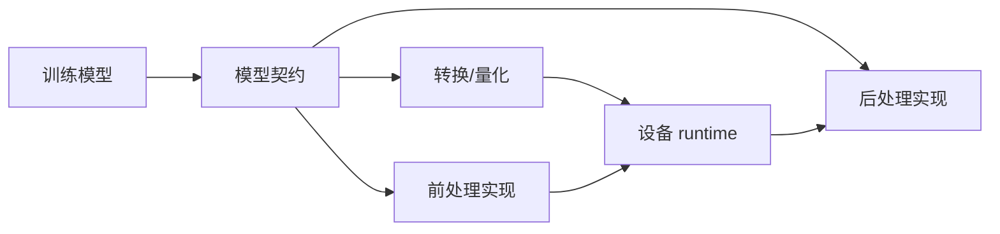
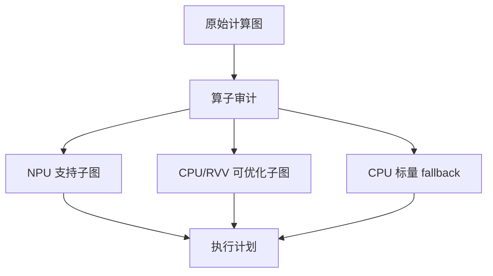
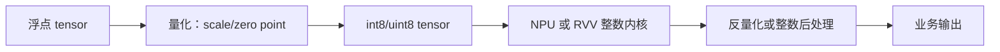
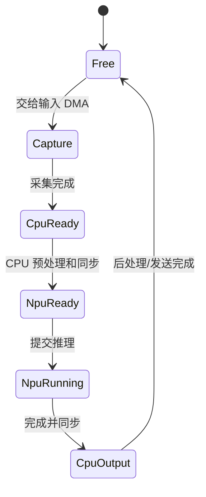
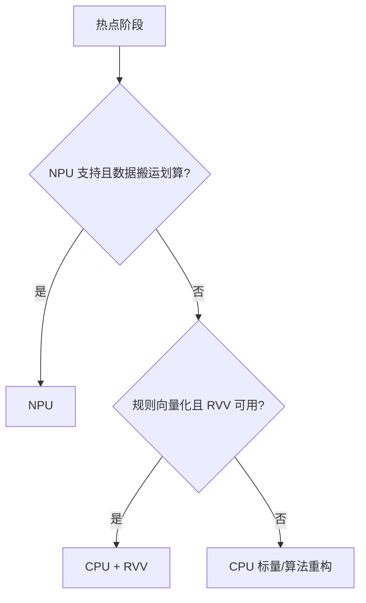
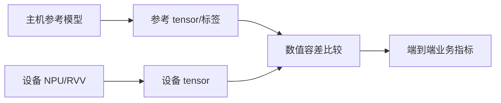
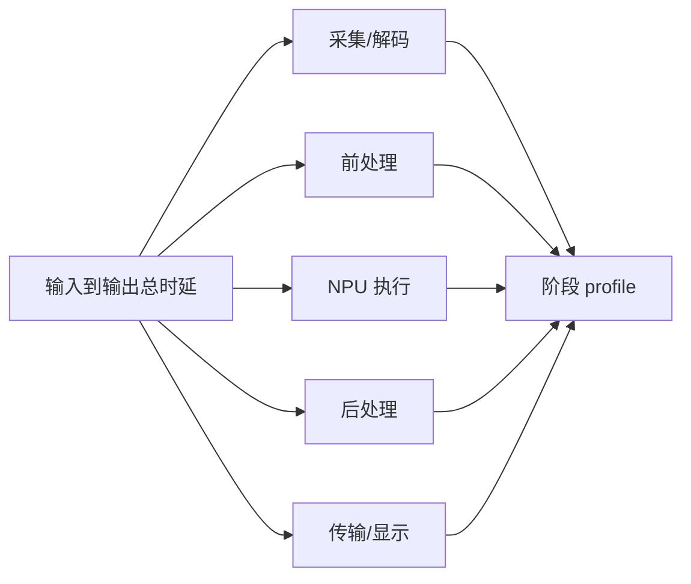
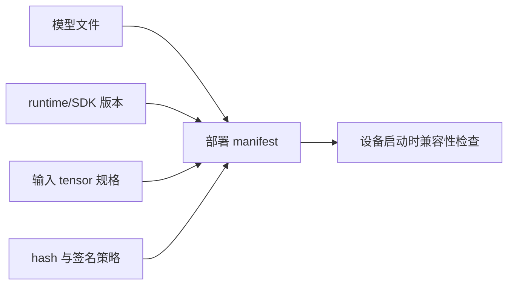
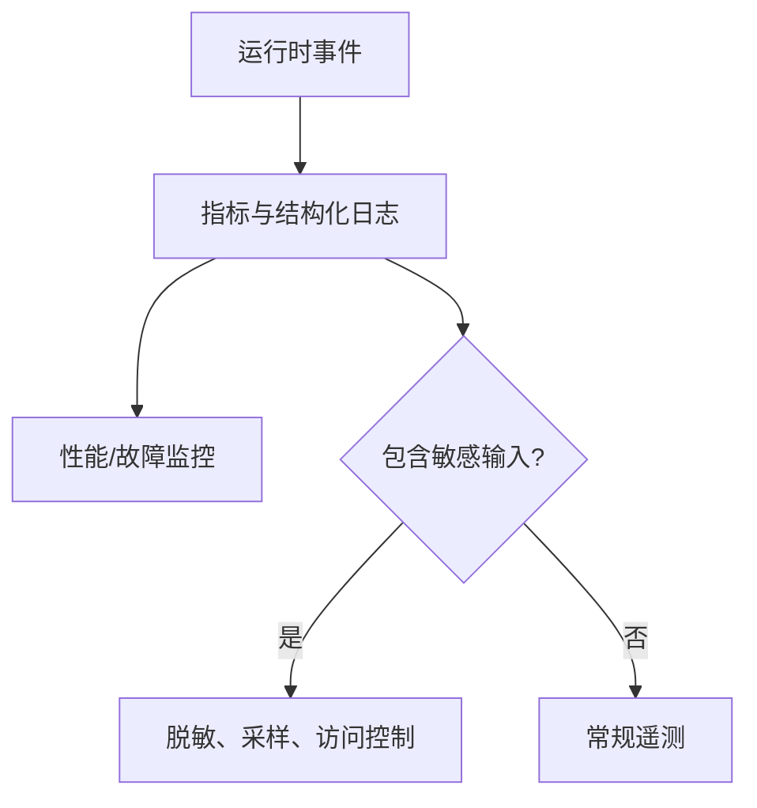

边缘 AI 部署不是把训练框架导出的模型文件复制到板卡。

它是一条跨越训练输入、模型格式、量化、算子支持、硬件加速、数据格式、运行时、性能和升级的工程链。

RISC-V CPU、RVV 和 NPU 可以共同承担这条链的不同阶段。

但它们的能力来源不同。

CPU/RVV 能力来自目标 ISA 与编译器。

NPU 能力来自具体 SoC、内核驱动和 SDK runtime。

任何部署结论都必须带上模型、工具链、板卡和 runtime 版本。

## 1. 从“模型契约”而不是文件扩展名开始

模型契约至少包括输入/输出 tensor 名称、shape、layout、dtype、量化参数、动态维度规则、前处理、后处理和正确性指标。

`model.onnx`、`model.bin` 或任何厂商格式都只是容器名。

不知道 tensor layout 和 quantization，运行时即使成功加载，输出也可能完全无意义。

## 2. 算子审计决定 NPU、RVV 与 CPU 的边界

模型转换工具会接受、重写、分割或拒绝不同算子。

对于每个模型版本，保存算子支持报告和 graph partition 结果。

不要把转换器“成功”解释为全部层都在 NPU 执行。

也不要把所有 fallback 都当失败。

关键是知道每段在哪个执行域运行，以及数据往返是否抵消加速收益。

## 3. 量化是一份数值协议

量化将浮点值映射到整数表示。

常见形式包含 scale、zero point、对称/非对称选择和 per-tensor/per-channel 策略。

量化校准集应代表设备实际输入分布。

只用少数理想图像校准，可能在真实光照、噪声或边界样本上产生严重精度退化。

性能与准确率要一起记录。

## 4. 前处理通常是端到端瓶颈的一部分

摄像头或传感器的数据格式很少与模型输入直接一致。

CPU/RVV 可用于 resize、颜色转换、normalization、packing、letterbox 和量化。

NPU 通常处理转换完成的输入 tensor。

若模型推理只占总时延的小部分，优化 NPU kernel 不会显著改善产品体验。

应首先 profile 完整数据路径。

## 5. 为每个 buffer 写清所有权状态机

一块 buffer 在其生命周期中可能属于摄像头 DMA、CPU、NPU 或显示/网络 DMA。

每次交接都要有同步点。

当一个 buffer 被提交给 NPU 后，CPU 不应在未完成前覆盖它。

当 DMA 写入完成后，CPU 也不应跳过平台要求的 cache/同步操作。

这比加锁更基础：先定义谁在何时拥有写权限。

## 6. CPU、RVV 和 NPU 的任务分配应由 profile 驱动

CPU 适合控制流、驱动、协议、动态 shape 管理和复杂分支后处理。

RVV 适合可并行、NPU 不支持或提交成本过高的数值内核。

NPU 适合供应商 runtime 明确支持且数据准备成本合理的密集子图。

这种分工需随模型和硬件版本重新评估。

不要把“AI”自动等同于“NPU”。

## 7. 用固定数据集建立三层正确性回归

第一层比较主机高精度参考输出。

第二层比较转换模型在目标 runtime 的原始 tensor。

第三层比较完整前处理/后处理后的业务结果。

这样可以区分模型转换误差、输入预处理错误和业务阈值变化。

只比较最终分类文字无法定位差异来源。

## 8. 性能报告要拆成吞吐、延迟和资源使用

吞吐描述单位时间处理量。

延迟描述单个请求从输入到输出的时间。

资源使用还包括 CPU 利用率、NPU queue depth、内存带宽、温度/频率限制和丢帧率。

报告平均值之外，还要看 p95/p99 或最大值。

对控制类边缘应用，偶发长尾延迟可能比平均帧率更重要。

## 9. 部署包需要完整性与兼容性检查

发布包可包含模型、manifest、版本、hash、输入规格、runtime 最低版本、回归摘要和回滚标识。

设备在加载前验证模型 hash、版本和 runtime 能力。

加载失败时保留上一个已验证模型或进入降级模式。

不要在远端覆盖模型后只依赖“重启看看”。

## 10. 观测与隐私也属于部署设计

运行时应记录模型版本、输入帧计数、成功/失败推理数、各阶段时延、温度/频率状态和错误码。

但不应无控制地上传原始敏感图像或完整 tensor。

把调试数据、产品遥测和原始用户数据分级处理。

这会影响存储、带宽、权限和发布审查。

## 11. 失败模式应当对应可执行恢复动作

| 失败 | 检测 | 行为 |
| --- | --- | --- |
| 模型不兼容 | manifest/runtime 检查 | 保留旧模型或拒绝加载 |
| NPU timeout | job watchdog | 取消/重置资源并记录 job |
| 输入格式异常 | shape/stride 校验 | 丢弃帧并计数 |
| 量化输出异常 | tensor 范围检查 | 保存最小诊断样本 |
| buffer 饥饿 | queue depth/所有权状态 | 背压、降帧或扩容 |
| 长尾延迟 | 分阶段 profile | 降低输入率或优化瓶颈 |
| SDK 升级回归 | 固定数据集 | 回滚 runtime/模型组合 |

恢复动作必须经过测试。

写一个错误字符串不等于系统具备降级能力。

## 12. 发布前的工程审查

| 主题 | 审查问题 |
| --- | --- |
| 模型 | 输入输出、量化、支持算子和 hash 是否明确？ |
| 平台 | SoC、内核、DTB、SDK、runtime 是否锁定版本？ |
| 数据 | 前处理、layout、stride、buffer 所有权是否可验证？ |
| 执行 | CPU/RVV/NPU 划分是否有 profile 证据？ |
| 正确性 | 主机、device tensor、业务输出三层回归是否通过？ |
| 性能 | 吞吐、尾延迟、内存和温度是否在目标范围？ |
| 运维 | manifest、日志、回滚、敏感数据策略是否完备？ |

## 13. 升级闸门

模型、runtime 或内核升级前，先运行兼容检查、固定数据集正确性回归、端到端性能回归和回滚演练。

任一项失败，升级包不能进入默认启动路径。

将旧版本 manifest 保留到新版本稳定运行并完成观测窗口。

这让“部署”成为一个可撤销的系统变更，而不是不可追踪的文件替换。

## 14. 练习与验收

### 练习

1. 为一个模型写完整 tensor 契约，包括 layout、dtype、scale、zero point 与后处理。
2. 导出/保存 NPU 转换工具的算子审计与 graph partition 报告。
3. 在设备上分别运行 CPU-only、RVV 预处理、NPU 推理和端到端 pipeline。
4. 为一块图像 buffer 写出 capture、CPU、NPU、output 的所有权状态机。
5. 用固定数据集比较主机参考、设备 tensor 和业务指标。
6. 制作带 hash、runtime 版本和回滚信息的部署 manifest，并测试一次不兼容加载。

### 本篇验收清单

- [ ] 能把模型文件扩展名之外的 tensor 契约写清楚。
- [ ] 能以算子支持报告定义 CPU/RVV/NPU 分工。
- [ ] 能把量化视为可验证的数值协议。
- [ ] 能让前处理、buffer 同步和后处理进入端到端 profile。
- [ ] 能为异构 buffer 定义所有权与 cache/DMA 转换。
- [ ] 能用主机、设备 tensor、业务输出三层回归定位误差。
- [ ] 能报告吞吐、尾延迟、资源/温度与错误率。
- [ ] 能用 manifest、兼容检查和回滚支持安全升级。

边缘 AI 部署的重点不是让一次 demo 推理成功。

重点是把模型、执行域、数据所有权和版本控制组织成可持续运行、可验证升级的设备能力。

> 🏷️ RISC-V · 边缘 AI · 模型部署 · RVV · NPU · 量化 · 运行时
