本系列从 QEMU 裸机、链接脚本、trap、FreeRTOS、流水线、软核、MMU 和 Linux 启动逐层构建了 RISC-V 系统能力。

最终项目不再把这些主题当作孤立知识点。

它要求在一个真实 RISC-V SoC 上，让 CPU、RVV、NPU、DMA、内核驱动、模型 runtime 与现场运维共同形成可验证闭环。

示例目标是一个“边缘视觉/传感器事件分类器”。

输入可以来自摄像头或固定数据源。

输出可以是类别、位置、告警或控制命令。

所有 NPU API、模型转换格式和硬件驱动细节必须以你部署时的 SoC/SDK 版本为准。

## 1. 用系统需求定义项目，而不是用一张网络定义项目

项目应先确定输入频率、最大端到端延迟、准确率指标、丢帧策略、功耗/温度约束、网络/存储需求和升级策略。

模型只是满足这些约束的一个组件。

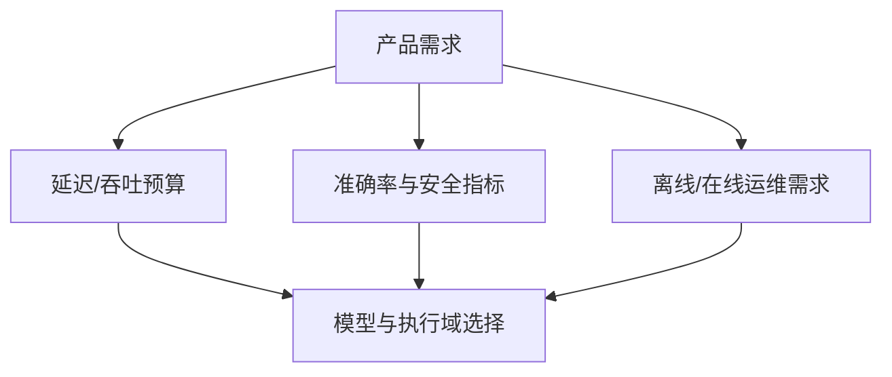

例如一个告警系统可能更看重 p99 延迟和错误可诊断性。

一个批处理分类系统可能更看重吞吐和能耗。

不同目标会导致不同的 batch、buffer 数量、CPU/NPU 分配与回压策略。

## 2. 将系统划分为五个稳定层

第一层是输入与设备层：相机、传感器、DMA、时钟、驱动和 device tree。

第二层是数据层：buffer、格式、同步、时间戳与所有权。

第三层是执行层：CPU 控制、RVV 数值核、NPU 推理。

第四层是业务层：后处理、规则、通信、存储和 UI。

第五层是运维层：指标、日志、模型版本、回滚和诊断。

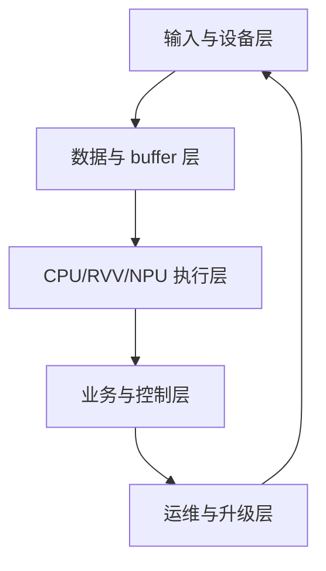

每层只通过明确接口与相邻层交互。

这使模型更新不需要修改 camera 驱动，也使硬件驱动升级不需要重写业务规则。

## 3. 建立从输入到动作的数据契约

为一帧或一条传感器样本定义不可含糊的数据结构。

它至少包括来源、序号、时间戳、格式、尺寸/shape、stride、量化描述、buffer 句柄、状态位和版本。

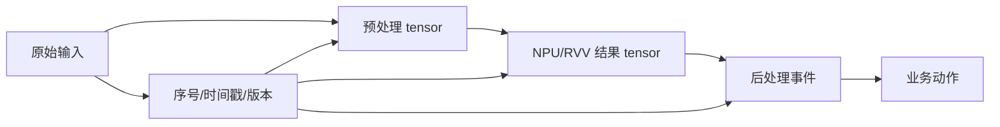

所有跨进程、跨设备或持久化的数据使用固定字节序和显式序列化。

不要将带 padding 的 C 结构体直接作为网络、共享内存或文件协议。

## 4. Buffer 生命周期用状态机而非约定俗成

为每块输入/输出 buffer 跟踪状态。

典型状态包括 free、capture、CPU-owned、NPU-owned、output-ready、sending 和 error。

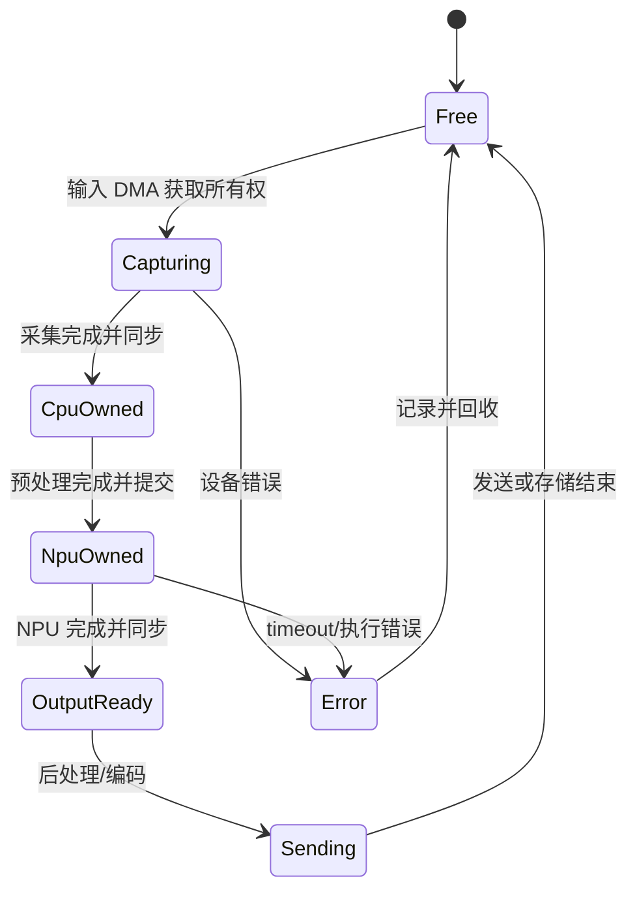

状态转移的唯一执行者、超时和回收路径必须明确。

CPU、NPU 或 DMA 不得在不拥有 buffer 时读写它。

这条规则比选择何种锁更基础。

## 5. CPU、RVV 和 NPU 的职责由可测证据决定

CPU 处理驱动、队列、动态控制、协议、模型选择和复杂业务逻辑。

RVV 处理适合 VLA 的 resize、颜色/量化、filter、后处理和 NPU fallback 数值核。

NPU 处理 vendor runtime 支持的重计算子图。

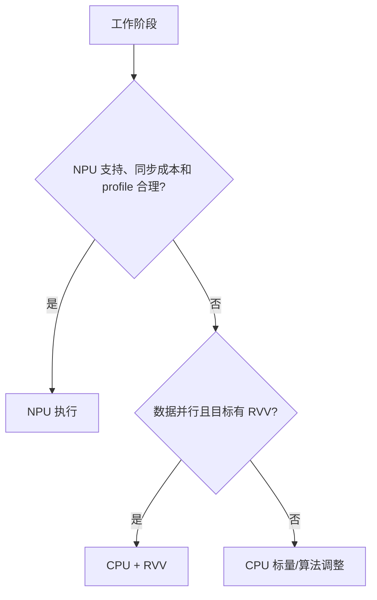

每个判断都应有模型转换报告、运行 profile 或基准作为依据。

“某阶段属于 AI”不是将它放进 NPU 的理由。

## 6. RVV 预处理和后处理采用 VLA 内核

图像 normalize、颜色通道变换、量化、阈值、NMS 的部分内核可使用 RVV。

实现必须按 `vsetvli` 返回的 `vl` 推进指针，不能假设 VLEN。

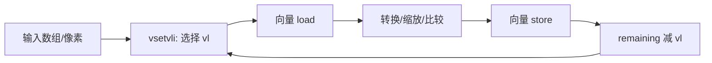

RVV 规范明确允许不同实现有不同 VLEN，并支持在满足要求的硬件上编写可移植的向量长度无关代码。[RVV 1.0](https://docs.riscv.org/reference/isa/unpriv/v-st-ext)

若部署硬件没有所需 RVV/Zve 扩展，必须有编译期或运行时 fallback。

## 7. NPU 提交边界要像网络协议一样严格

NPU runtime 调用前验证模型版本、tensor shape、dtype、layout、buffer 大小和同步状态。

提交后保存 job ID、开始时间和 deadline。

完成后再次验证输出 tensor 描述。

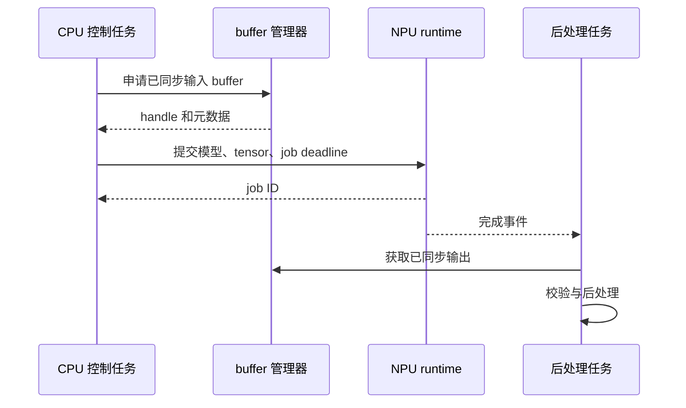

运行时 API 的具体名称随 vendor SDK 改变。

封装层应把应用从这些名称和 ioctl/库版本差异中隔离出来。

## 8. 实时管线需要背压和降级策略

当输入速率大于处理能力时，队列会增长、延迟扩大、buffer 被占满。

系统必须选择丢新帧、丢旧帧、降低输入率、降低分辨率、跳过 NPU 或切到轻量模型等策略。

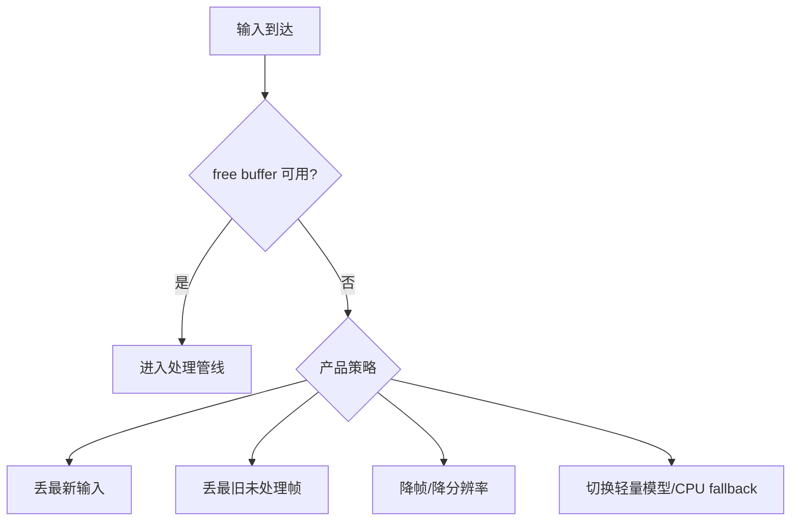

策略不应散落在各任务的 `if` 语句中。

把它集中在 pipeline controller，并用指标验证实际触发次数。

## 9. 正确性回归分为四个层次

第一层验证预处理输出 tensor。

第二层验证 NPU 原始输出 tensor。

第三层验证 RVV/CPU 后处理。

第四层验证用户可见业务事件。


每层使用适当精度。

浮点、量化整数、坐标和类别都可能需要不同容差或精确匹配规则。

不要把所有差异压缩成一个总准确率。

## 10. 性能与可靠性一起做压测

压测应模拟输入突发、温度变化、网络拥塞、NPU timeout、模型切换和长时间运行。

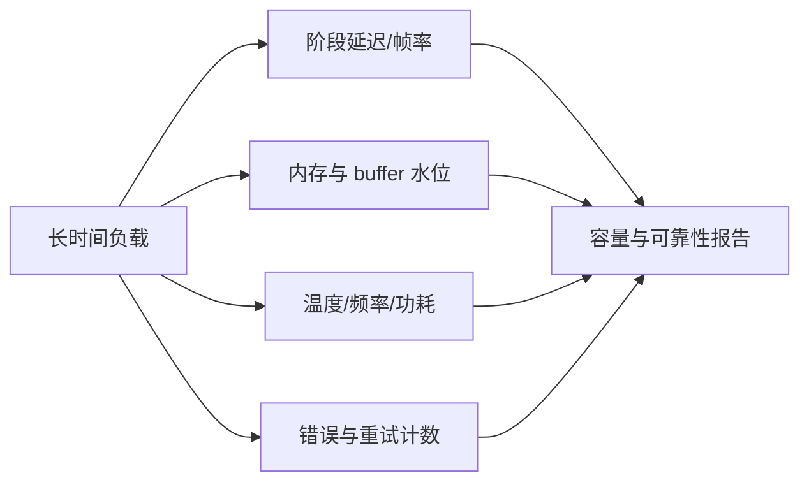

平均 FPS 只是一项指标。

必须同时记录 p95/p99 延迟、最大 queue depth、丢帧率、NPU reset 次数、CPU 利用率和内存泄漏趋势。

## 11. 故障记录独立于正常日志链路

正常日志可能因为网络、存储或 UART 拥塞而丢失。

关键 fault record 应包含模型/SDK 版本、job ID、输入元数据、错误层级、寄存器/驱动状态摘要和发生时间。

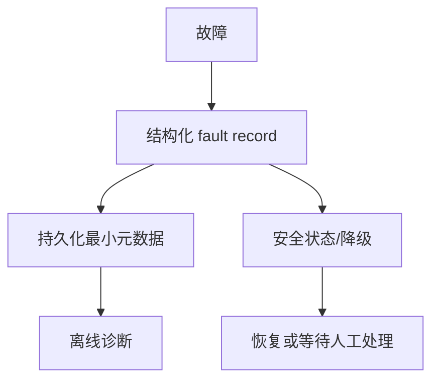

必要时保留经过脱敏的输入 hash 或小型采样，而不是无控制保存原始画面。

## 12. 发布包需要可验证和可回滚

一个发布包可包含应用、模型、manifest、hash/签名、目标硬件范围、runtime 版本、回归摘要和回滚版本。

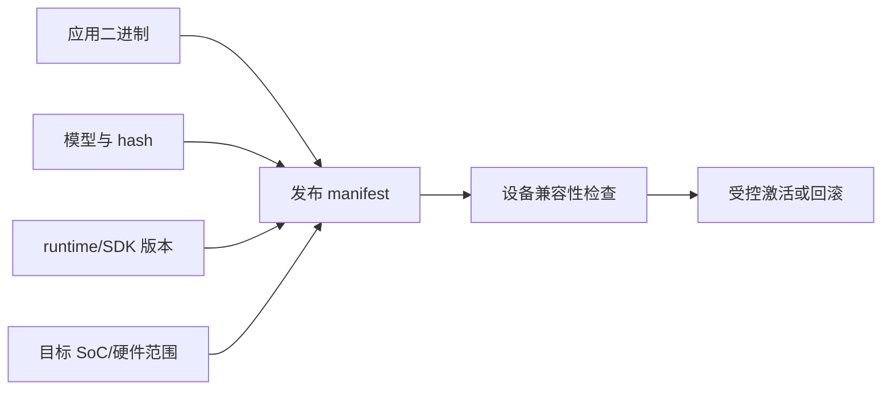

先在 canary 设备或隔离环境运行固定回归。

监测窗口通过后再扩大部署范围。

回滚不是复制旧文件即可完成，还要确保旧模型与仍在运行的 runtime/驱动兼容。

## 13. 项目目录与交付物建议

```text
edge-ai-riscv/
  platform/       device tree、驱动配置、SDK 适配
  runtime/        NPU 封装、buffer 与 job 管理
  kernels/        RVV/标量预处理和后处理
  app/            pipeline controller、业务策略、通信
  models/         manifest、hash、转换报告
  tests/          固定输入集、tensor 比较、压力脚本
  observability/  指标、fault record、日志协议
  docs/           架构、版本矩阵、已知限制
```

每个目录都有可独立测试的职责。

不要把 NPU 调用、camera 驱动、向量内核和业务阈值写在一个巨大源文件中。

## 14. 验收测试矩阵

| 范围 | 核心测试 | 通过证据 |
| --- | --- | --- |
| 平台 | 设备节点、时钟、输入 DMA | 系统日志与驱动自检 |
| 数据 | format/stride/所有权转换 | buffer 状态与 tensor dump |
| RVV | VLA kernel 与 fallback | 标量参考对比 |
| NPU | 模型加载、job、output tensor | runtime 返回码与固定样本 |
| 管线 | 背压、timeout、降级 | queue depth 和错误计数 |
| 性能 | p50/p95/p99、FPS、带宽 | 阶段 profile 报告 |
| 发布 | manifest、兼容、回滚 | canary 和回归日志 |

每项测试绑定版本化输入。

这样升级硬件、模型或 runtime 时能准确判断受影响范围。

## 15. 常见失败模式

| 症状 | 先检查 | 典型原因 |
| --- | --- | --- |
| 结果正确但延迟持续增大 | backpressure/queue | 输入速率超过处理能力 |
| 结果偶发陈旧 | buffer 所有权/sync | CPU/NPU/DMA 提前复用或 cache 未同步 |
| RVV kernel 在部分设备失败 | VLEN/扩展检查 | 无 VLA/fallback 或非法 ISA |
| NPU timeout 后全管线卡住 | job 回收与 buffer 状态 | 没有取消/超时回收路径 |
| 升级模型后准确率下降 | tensor/量化契约 | 前处理/后处理或转换报告变化 |
| 长时间运行内存增长 | buffer/queue 生命周期 | error path 忘记释放 |
| 回滚仍不工作 | runtime/driver 组合 | 只回滚模型文件 |

## 16. 练习与验收

### 练习

1. 为输入、预处理、NPU、后处理和业务事件写出版本化数据契约。
2. 画出多 buffer 状态机，并实现 ownership 断言与超时回收。
3. 用 RVV VLA 实现一个前处理热点，并保留标量 fallback 和结果对比。
4. 封装具体 NPU runtime，使应用只看模型、tensor、job 和错误码接口。
5. 对固定数据集运行四层正确性回归，并保存模型/runtime/设备版本。
6. 在输入突发和 NPU timeout 下验证 backpressure、轻量模型或降帧策略。
7. 打包 manifest 和回滚版本，在 canary 设备上完成一次受控升级。

### 本篇验收清单

- [ ] 能从产品延迟、准确率和运维目标定义边缘 AI 系统范围。
- [ ] 能以设备、数据、执行、业务和运维五层组织代码与接口。
- [ ] 能为所有 buffer 定义状态、所有者、同步和回收策略。
- [ ] 能基于 profile 决定 CPU、RVV 与 NPU 的职责。
- [ ] 能让 RVV 内核不依赖固定 VLEN，并保留 fallback。
- [ ] 能把 NPU 提交封装为可检查的模型/tensor/job 协议。
- [ ] 能在输入过载和硬件错误时执行明确的背压与降级策略。
- [ ] 能用正确性、性能、故障记录和回滚共同验收发布包。

完成这个项目，意味着 RISC-V 不再只是一个 ISA 或软核实验。

它成为一套能承载真实数据路径、异构加速、系统软件与长期运维的边缘计算平台。

> 🏷️ RISC-V · RVV · NPU · 边缘 AI · SoC · 综合项目 · 部署
