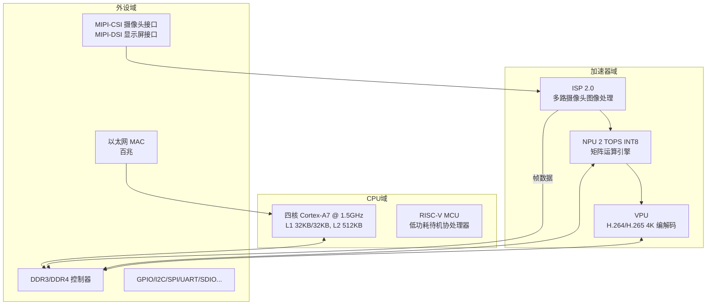
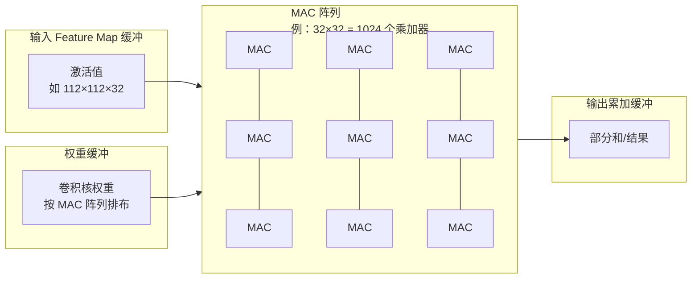
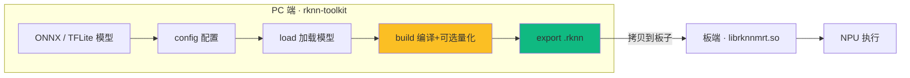
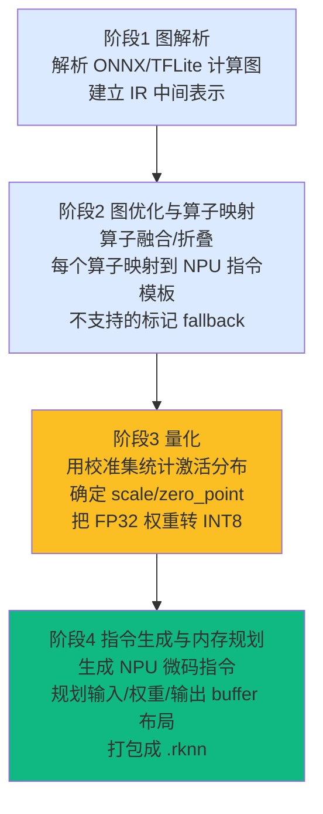
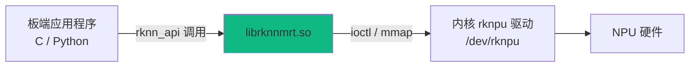
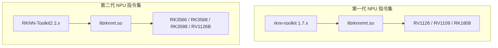

> 系列：RKNN 端侧部署实战：基于 RV1126 的模型转换与部署
> 配套硬件：正点原子 RV1126 开发板（已下架，最新为 RV1126B）+ IMX415 + 5.5' MIPI LCD
> 参考文档：正点原子官方；瑞芯微 RKNN 官方文档
> 参考视频：[从ARM到AI视觉：基于RV1126B的嵌入式AI开发](https://space.bilibili.com/519718611/channel/collectiondetail?sid=7928216&spm_id_from=333.788.0.0)

## 0. 本期目标

假设你是一个嵌入式软件工程师：会 C/C++、懂 MCU、RTOS、Linux，玩过摄像头和显示屏，但**第一次接触 AI 模型部署**。你手上有一块 RV1126 开发板，被"RKNN""NPU""量化""TOPS"这些词淹没。

本期不做"名词解释式"的浅层介绍，而是把四个问题**从原理层面**讲透：

1. **RV1126 的 NPU 到底长什么样？** 2 TOPS 这个数字是怎么算出来的，为什么它只能跑"神经网络算子"；
2. **INT8 为什么比 FP32 快？** 从硬件乘法器的面积讲起；
3. **RKNN 工具链在 PC 上到底做了什么？** 从 ONNX/TFLite 到 `.rknn`，中间经过了哪几道工序，最终文件里装的是什么；
4. **第一代工具链和第二代差在哪？** 为什么 RV1126 必须用 1.x，`librknnmrt.so` 和 `librknnrt.so` 的本质区别。

读完本期，你脑子里应该有一张"从模型到 NPU 硬件"的完整地图——后面所有篇目（转换、量化、板端部署）都是在这张地图上填细节。

## 1. RV1126：一颗"专为摄像头而生"的视觉 SoC

### 1.1 SoC 全景与总线拓扑

**定义 1（SoC, System on Chip）**：把 CPU、内存控制器、各种外设控制器集成到一颗芯片上的系统级芯片。

RV1126 是一颗典型的**智能视觉 SoC**——为 IPC（网络摄像机）、智能门禁、视觉盒子这类产品设计。它的关键不是"CPU 多快"，而是**多类异构计算单元协同**：



| 模块 | 规格 | 职责 | 嵌入式类比 |
|:---|:---|:---|:---|
| CPU | 四核 Cortex-A7 @ 1.5GHz | 跑 Linux、业务逻辑、调度各加速器 | 工厂的"总管" |
| RISC-V MCU | 内置协处理器 | 待机低功耗场景的轻量任务 | "看门小弟" |
| **NPU** | **2 TOPS（INT8）** | 神经网络矩阵乘加 | 专用"算力车间" |
| ISP 2.0 | 多路摄像头处理 | 去噪、白平衡、3A（AE/AF/AWB） | 图像的"暗房" |
| VPU | 4K H.264/H.265 | 视频编解码 | 视频的"压缩打包机" |

**关键认知：数据不经过 CPU。** 摄像头数据流是 `Sensor → MIPI-CSI → ISP → DDR → NPU → VPU`，CPU 只在中间做配置和调度（设置寄存器、管理 buffer）。这是 IPC 产品能在四核 A7 上做到 4K/30fps 的原因——**数据面走硬件直通，CPU 只碰控制面**。这个思维在后面的 RKMedia 全链路篇会反复出现。

### 1.2 为什么叫"视觉 SoC"而不是"普通 Linux SoC"

普通 Linux SoC（比如全志/瑞芯微的非视觉型号）也有 CPU、GPU、编解码器。RV1126 的差异点在于**为视觉应用做了三件事**：

1. **ISP 深度集成**：Sensor 出来的 RAW 数据直接进 ISP 完成去噪/3A，不需要 CPU 干预；
2. **NPU 贴近 ISP 数据路径**：ISP 输出可以零拷贝直达 NPU，省掉"CPU 搬运 + 格式转换"；
3. **VPU 承接编码**：NPU 检测结果叠加到画面后，VPU 直接编码成 H.264 走网络。

也就是说：**采集（ISP）、理解（NPU）、压缩（VPU）三条硬件流水线首尾相接**，CPU 只当调度员。理解这一点，你就明白为什么"嵌入式 AI 部署"的工程核心不是算法，而是**把这些硬件流水线正确地串起来**。

## 2. NPU 架构深潜：2 TOPS 是怎么算出来的

### 2.1 NPU 是什么：不是"又一个 CPU"，而是"可编程的乘法器阵列"

**定义 2（NPU, Neural-network Processing Unit）**：为神经网络计算（主要是矩阵乘加）设计的专用处理器。

CPU 是"冯·诺依曼"的：取指 → 译码 → 执行，一条指令算一次（顶多 SIMD 算几次）。神经网络的核心运算是**矩阵乘法**：

```
输出[i][j] = Σ_k 输入[i][k] × 权重[k][j]
```

一次 4×4×4 的矩阵乘法要 64 次乘加。CPU 要循环 64 次；NPU 呢？**把 64 个乘法器同时摆出来，一拍算完**。

**定义 3（MAC, Multiply-Accumulate）**：乘加单元，`d = a × b + c` 一次操作。NPU 的核心是**由成百上千个 MAC 组成的阵列**，它们被硬连线成一个"二维脉动结构"，数据从一侧流入、权重从另一侧广播，结果从底部流出。



**硬件直觉**：MAC 阵列越多，一拍算的乘加越多，算力越高；MAC 阵列频率越高，每秒拍数越多，算力越高。**TOPS 就是这两个量的乘积**——这就是下面要推导的公式。

### 2.2 TOPS 公式推导：从 MAC 数到 2 TOPS

**定义 4（TOPS, Tera Operations Per Second）**：每秒执行的万亿次运算（Tera = 10¹²）。

计算公式：

```
算力(TOPS) = MAC数量 × 工作频率(Hz) × 2 ÷ 10¹²
```

为什么乘 2？因为一次 `a×b+c` 的**乘加**操作，硬件层面实际完成了**一次乘法 + 一次加法**——行业惯例按两次运算（Operation）计数。所以"2 TOPS"意味着每秒 10¹² × 2 次乘加操作，即每秒 10¹² 次 MAC。

反推 RV1126 的 NPU 规模（公开资料口径）：

```
假设 MAC 阵列 = 32 × 32 = 1024 个 MAC
工作频率 ≈ 1 GHz（NPU 时钟，实际以芯片手册为准）
算力 = 1024 × 1e9 × 2 = 2.048e12 = 2.048 TOPS ≈ 2 TOPS ✅
```

这个推导说明两件事：

1. **2 TOPS 是一个"标称峰值"**：只有当数据布局、指令调度都完美时才能达到。实际跑模型通常只能到峰值的 50%~80%（后面性能篇实测）；
2. **TOPS 数字本身没意义，要结合精度看**：RV1126 的 2 TOPS 是 **INT8** 精度下的。如果算 FP16/FP32，因为硬件单元不同，数字会大幅缩水——**这就是为什么"模型必须量化成 INT8 才能吃满 NPU"**。

### 2.3 为什么 NPU 只能跑"神经网络算子"

看 MAC 阵列的结构：它擅长的是"数据规整、规律流动"的运算——卷积、全连接、池化、元素级激活。NPU 里每一类算子都对应一块**固定硬件电路**：

| 算子类别 | 硬件实现方式 | 例子 |
|:---|:---|:---|
| 矩阵乘加 | MAC 阵列 | Conv2D、MatMul、FC |
| 池化 | 专用取最大/平均电路 | MaxPool、AvgPool |
| 拼接/切分 | 内存搬移电路（DMA 辅助） | Concat、Split |
| 元素级激活 | 查找表（LUT）或分段线性电路 | ReLU、Sigmoid（近似）、Tanh |
| 归一化 | 乘加电路复用 | BatchNorm（推理期折叠为乘加） |

**推论**：如果一个算子**不属于任何硬件单元**（比如动态 shape 的循环、任意自定义函数），NPU 就无法执行。这时工具链有两个选择：报错，或者**把这个算子丢给 CPU 跑**（混合调度，后面转换篇细讲）。这就是"模型不是都能转"的硬件根源——**不是工具链刁难你，是 MAC 阵列物理上做不到**。

嵌入式类比：这就像你的 MCU 没有硬件除法器——`/` 要么报错，要么编译器帮你调一个软件除法库（慢）。NPU 的"软件除法库"就是 CPU 兜底。

## 3. INT8 为什么快：从乘法器面积说起

### 3.1 硬件乘法器的面积随位宽平方增长

嵌入式工程师都接触过 DSP 的定点运算。硬件乘法器的面积/功耗与位宽的关系近似：

```
乘法器面积 ≈ O(位宽²)
INT8 乘法器 ≈ 8² = 64 个单位面积
INT16 乘法器 ≈ 16² = 256
INT32 乘法器 ≈ 32² = 1024
```

也就是说，**同样一片硅片面积，INT8 能放 16 个 8 位乘法器，而 INT32 只能放 1 个 32 位乘法器**。NPU 设计者在固定面积里放尽量多的 MAC 阵列，所以**位宽越低，能塞下的 MAC 越多，峰值算力越高**。

### 3.2 一次 INT8 卷积，硬件怎么算

假设卷积核是 3×3，输入 8 位、权重 8 位：

```
硬件执行：acc = acc + input[8bit] × weight[8bit]
乘积：8bit × 8bit = 16bit（无溢出）
累加：acc 用 32bit 累加器（防止多次累加溢出）
输出：累加完成后做 scale + shift，回到 8bit
```

对比 FP32 卷积：FP32 乘法器面积大、延迟高，而且**没有"位宽截断"的免费午餐**——浮点乘加电路比定点复杂得多（要处理指数对齐、尾数规格化）。

### 3.3 量化的本质：把浮点换成定点，把硬件面积换成算力

```text
FP32 模型：    每个权重 32bit，硬件 1 个 32 位 MAC → 算力低
INT8 模型：    每个权重 8bit，硬件 16 个 8 位 MAC  → 算力高 16 倍
              ↑ 这不是夸大——面积换算力是硬件决定的
```

所以"INT8 量化"在嵌入式部署里的真实含义是：**牺牲一点点精度，换取 NPU 硬件面积能放更多 MAC、从而获得数倍算力**。这就是为什么 RKNN 系列的重头戏是量化——它直接决定你的模型在 RV1126 上是"跑得动"还是"跑不动"。

**一个容易误解的点**：量化不是"把模型变小顺便提速"，而是**改变 NPU 执行模型时用的硬件路径**。浮点模型虽然也能转成 `.rknn` 在 NPU 上跑，但走的是"伪定点/模拟"路径，吃不到硬件 MAC 阵列的 INT8 峰值。量化到位，才算真正用上这块芯片。

## 4. RKNN 工具链内部：PC 上那几秒钟发生了什么

### 4.1 整体定位：深度学习版的"交叉编译工具链"

你训练（或下载）的模型是 TensorFlow / PyTorch / ONNX 格式——这是"通用世界"的描述。但 NPU 不认这些格式，它只认自己的指令和内存布局。必须有一个工具把模型翻译成 NPU 能跑的格式。



**定义 5（RKNN）**：瑞芯微 NPU 的模型格式与运行时总称。模型文件后缀 `.rknn`，板端通过 `librknnmrt.so` 加载执行。

**嵌入式类比（升级版）**：交叉编译时 `gcc-arm` 把 C 源码变成 ARM 指令，RKNN 工具链把神经网络模型变成 NPU 指令。但 RKNN 的"编译器"比 gcc 复杂得多——它不仅要翻译算子，还要**规划内存、选择量化策略、做图优化**。下面拆开看。

### 4.2 工具链内部四阶段（build 时真正发生的事）

调用 `rknn.build()` 时，工具链内部依次执行四个阶段：



| 阶段 | 输入 → 输出 | 关键动作 | 常见现象（日志里能看到） |
|:---|:---|:---|:---|
| 图解析 | 原始模型 → IR | 解析算子节点、张量 shape、数据类型 | `Parsing model ...` |
| 图优化 | IR → 优化后 IR | Conv+BN+ReLU 融合、常量折叠、死节点删除 | `Optimize graph ...` |
| 量化（可选） | 浮点权重 → INT8 | 校准集前向、统计激活分布、求 scale/zp | `Quantizing ...` |
| 指令生成 | IR → NPU 指令 | 算子 → 微码、内存地址规划 | `Building ...` |

**为什么要做算子融合**：一个 Conv+BN+ReLU 的经典组合，如果硬件分别执行要三次访存；融合后（BatchNorm 在推理期可以折叠进卷积的权重偏置里，ReLU 是元素级操作直接并进输出），一次访存就完成。访存是 NPU 的瓶颈——**融合的本质是减少数据搬运**。

**为什么需要内存规划**：NPU 的执行方式是"指令流 + 数据流"，指令里直接带内存地址（偏移）。工具链在编译期就把每层输入/输出/权重的地址安排好，运行时 NPU 按指令里的地址直接 DMA 取数，不需要 CPU 参与寻址。这就是 `.rknn` 文件里除了权重还有"内存布局信息"的原因。

### 4.3 `.rknn` 文件里到底装了什么

```text
.rknn 文件（二进制）≈
├── 文件头：魔数、版本、目标平台、模型元信息
├── 权重段：量化后的 INT8 权重（或浮点权重，视是否量化）
├── 指令段：NPU 微码指令（算子在硬件上的执行序列）
├── 内存布局：每层输入/输出/权重的地址偏移表
└── 预处理信息：mean/std、通道顺序、量化参数（烘焙在模型里）
```

**重点理解最后一项**：你在 PC 端 `config()` 里填的 `mean_values/std_values`，**不是运行时才传的**——它们被工具链**编译进 `.rknn` 文件**，板端 `librknnmrt.so` 加载模型时自动读取并应用于输入数据。这就是为什么板端 C 代码只需要喂 0~255 原始像素（后面板端篇会验证这一点）。**config 填错 = 模型文件里烧录了错误的预处理参数，板端怎么改代码都救不回来。**

### 4.4 运行时 librknnmrt.so 的职责

板端运行时（`librknnmrt.so`）不是"一个库"，而是三个职责的集合：

1. **加载器**：解析 `.rknn` 文件，把权重/指令装载到 NPU 可访问的内存；
2. **驱动层**：通过内核驱动操作 NPU 寄存器，提交指令、管理 DMA；
3. **预处理引擎**：按模型内烘焙的 mean/std/通道顺序对输入数据做归一化（`pass_through=0` 时）。



**内核驱动的作用**：NPU 是 DMA 设备。应用程序通过 `rknn_init` 打开 `/dev/rknpu`，通过 ioctl 把指令缓冲区地址、权重地址、输入输出地址告诉驱动，驱动完成地址映射后触发 NPU 执行。`/dev/rknpu` 不存在 = 驱动没加载 = 一切推理无法进行（后面板端篇第一件事就是验证它）。

## 5. 第一代 vs 第二代工具链：坑的本质

### 5.1 为什么"不通用"

瑞芯微 NPU 分两代硬件：

- **第一代**：RV1109 / RV1126 / RK1808 —— 指令集 A，工具链 `rknn-toolkit` 1.x，运行时 `librknnmrt.so`
- **第二代**：RV1126B / RK3566 / RK3568 / RK3588 / RK3576 —— 指令集 B，工具链 `RKNN-Toolkit2` 2.x，运行时 `librknnrt.so`

**坑的本质**：`.rknn` 文件里装的是**针对特定指令集生成的 NPU 指令**。一代工具链生成的指令，二代 NPU 硬件不认识；反之亦然。就像 ARM 编译的二进制不能跑在 x86 上——**这是硬件指令集不兼容，不是软件版本问题**。



| 项目 | 第一代 rknn-toolkit | 第二代 RKNN-Toolkit2 |
|:---|:---|:---|
| 适用芯片 | RV1109 / RV1126 / RK1808 | RV1126B / RK3566 / RK3568 / RK3588 / RK3576 |
| 版本号 | 1.7.x | 2.x |
| Python 包名 | `rknn-toolkit` | `rknn-toolkit2` |
| 转换 API | `load_tensorflow / load_tflite / load_caffe / load_onnx` | 另有 `load_pytorch` 等 |
| 板端运行时 | `librknnmrt.so` | `librknnrt.so` |
| 支持框架 | TF / TFLite / Caffe / ONNX | 更多（PyTorch 直转） |

### 5.2 常见的"装错工具链"症状

如果教程混用，你一定会遇到这些症状之一：

| 症状 | 原因 |
|:---|:---|
| `import rknn` 报错（`rknn-toolkit2` 包名不对） | 装了一代，教程是二代的 |
| 板端 `rknn_init` 返回 -1 | 模型是一代转的，但运行库是二代的 `librknnrt.so`（或反之） |
| 转换时 `target_platform='rv1126'` 报无效 | 用了 Toolkit2 的转换脚本（Toolkit2 没有 rv1126 平台） |
| 网上教程 API 对不上 | 一代 `rknn.config` / 二代 `rknn.config` 参数名有差异 |

**铁律**：RV1126 开发板 → 认准 `rknn-toolkit` 1.7.x + `librknnmrt.so`。遇到任何教程先看它用的工具链版本，再决定能不能照抄。

## 6. SDK 全景：拿到开发板后先看什么

### 6.1 SDK 是什么

RV1126 的 SDK 是瑞芯微 **Linux SDK**（Buildroot 方案），一次构建产出整个板端系统镜像。**SDK 不是"开发环境"，而是一个完整嵌入式 Linux 发行版构建系统**。

### 6.2 目录逐项详解

```text
~/RV1126/atk-rv1126-sdk/
├── u-boot/          # 引导加载程序：初始化 DDR、加载内核
├── kernel/          # Linux 内核：含 NPU/ISP/VPU 驱动、设备树
├── buildroot/       # 根文件系统构建：busybox、库、应用
├── device/          # 板级配置：设备树 dts、分区表、打包脚本
├── external/        # 第三方/瑞芯微组件：rknn-toolkit、RKMedia、ISP tuning
├── rkbin/           # 瑞芯微私有二进制：DDR 初始化、安全固件
├── prebuilts/       # 预编译工具链：gcc、交叉工具
├── app/             # 板端示例应用（含摄像头/RKMedia 示例）
├── docs/            # 官方文档
├── IMAGE/           # 构建产物（内核、rootfs、完整固件）
├── rockdev/         # 打包后的烧录镜像（update.img 等）
├── Makefile         # 顶层入口（链接到 buildroot）
└── build.sh         # 一键构建脚本
```

| 目录 | 什么时候要碰它 | 嵌入式工程师视角 |
|:---|:---|:---|
| `kernel/` | 改设备树（点亮 sensor、调 GPIO） | 你的"板级配置中心" |
| `external/rknn-toolkit/` | 找 `rknn_api.h`、`librknnmrt.so`、示例代码 | **本系列的主战场** |
| `external/rkmedia/` 或 SDK 内 Rockit | 摄像头取流/显示 | 全链路篇的主战场 |
| `device/` | 看 dts 里 sensor/NPU 是否使能 | 排查"设备没起来" |
| `app/` | 找官方示例抄代码 | 最快上手的起点 |

### 6.3 系统启动流程（从按下电源到应用运行）


**对部署的意义**：你的 `.rknn` 模型和推理程序跑在最后一步。前面任何一步出问题（DDR 初始化失败、内核没编译 NPU 驱动、rootfs 缺库），你的程序都起不来——所以排查问题要从启动流程逐级往上查。

### 6.4 学习路径建议（先 PC 后板子）

**模型转换、量化和 PC 模拟推理不需要板子**——`rknn-toolkit` 在 PC 上就能完成转换和模拟执行。强烈建议先把 PC 端跑通（第 2 期内容），再买板/上板。理由：

1. PC 端没有硬件依赖，环境搭建快，能立刻看到"模型 → .rknn → 推理结果"的完整链路；
2. 板端调试（串口、驱动、交叉编译）会引入大量环境噪音，先排除模型层问题，再面对硬件层问题；
3. 转换/量化占了部署工作量的 70%，这些都不依赖板子。

## 7. 小结

本期的核心收获是一张"从模型到硬件"的地图：

- **RV1126** = 四核 A7 + RISC-V MCU + **2 TOPS INT8 NPU** + ISP2.0 + 4K 编解码，数据流（ISP→NPU→VPU）硬件直通，CPU 只做调度；
- **2 TOPS 的来历** = MAC 数量 × 频率 × 2，峰值算力，实际只能到 50%~80%；
- **NPU 的本质** = MAC 阵列 + 少量专用电路，只认神经网络算子，不支持的就 fallback 到 CPU 或报错；
- **INT8 为什么快** = 乘法器面积随位宽平方增长，低位宽 = 同面积更多 MAC = 更高算力，量化就是拿精度换算力；
- **工具链四阶段** = 图解析 → 图优化/算子映射 → 量化 → 指令生成与内存规划，mean/std 被编译进 `.rknn`；
- **一代 vs 二代** = 硬件指令集不同，RV1126 认准 `rknn-toolkit` 1.7.x + `librknnmrt.so`；
- **SDK** = u-boot/kernel/buildroot/device/external 各司其职，模型转换不依赖板子，建议先 PC 后板端。

> 🏷️ 标签：#RV1126 #RKNN #NPU #TOPS #INT8 #MAC阵列 #瑞芯微 #智能视觉
