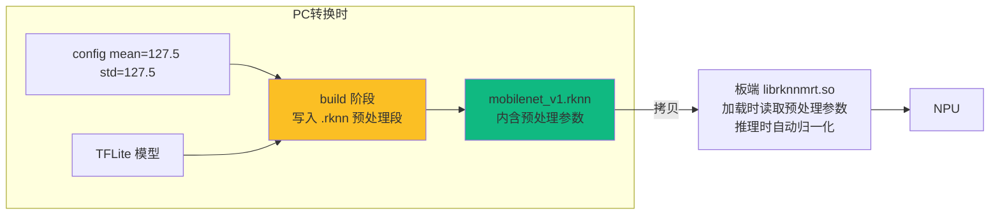

> 系列：RKNN 端侧部署实战：基于 RV1126 的模型转换与部署
> 前置：已完成平台与工具链总览（RV1126 硬件、第一代工具链、RKNN 全流程）
> 配套环境：x86_64 PC + Ubuntu 18.04/20.04（本文以 18.04 为例）、Python 3.6；本节**不需要 RV1126 板子**

## 0. 本期目标

上一期建立了"从模型到硬件"的地图。本期动手走通第一段流水线：**在 PC 上把一个小型分类模型（TFLite 格式）转换成 `.rknn` 文件，并用 PC 模拟器跑一次推理**。

与常见的"照抄脚本"教程不同，本期会**逐行解释转换日志**，让你看到 `config → load → build → export` 每一步在工具链内部真正做了什么；同时把两个最容易被忽视的机制讲透：

1. **`mean_values/std_values` 是怎么被"烘焙"进模型的**——它藏在 `.rknn` 文件的哪里，为什么板端代码不需要手动归一化；
2. **PC 模拟器是怎么"假装"成 NPU 的**——为什么它精度和板端一致、速度却慢得多。

完成本期，你不仅会"转模型"，还知道转换的每一步在干什么。

## 1. 环境准备：为什么版本卡得这么死

### 1.1 三个硬性约束的根源

| 约束 | 表面原因 | 深层原因 |
|:---|:---|:---|
| x86_64 架构 | 官方 wheel 只发布 x86_64 | 工具链包含 C 扩展（量化/模拟器核心），只编译了 x86_64 版本 |
| Ubuntu 18.04/20.04 | 官方 CI 环境 | 依赖库（onnx/protobuf）与系统 glibc 版本绑定 |
| Python 3.6 | wheel 标签 `cp36` | 工具链用了较老 API，官方只对 3.6（部分版本 3.7）发布 |

**为什么 numpy/onnx/protobuf 要锁版本**：rknn-toolkit 1.7.x 是 2021 年前后的产物，当时 `onnx 1.7.0` / `protobuf 3.12.x` / `numpy 1.16.x` 是主流。新版本库的 API 有破坏性变更（比如 protobuf 4.x 移除了很多旧接口，onnx 1.8+ 改了算子定义方式），工具链内部直接调用旧 API，装新版就会 `ImportError` 或静默行为异常。

**嵌入式类比**：这就像你的老项目依赖 `libopencv 3.4`，系统 apt 源里默认是 4.x——直接 `apt install libopencv-dev` 会得到 4.x，代码编译报错。解决办法同样是锁定版本。

### 1.2 安装步骤（完整可照抄）

```bash
# 1. 系统依赖
sudo apt update
sudo apt install -y python3-pip python3-dev

# 2. 锁定工具链依赖版本（顺序很重要：先装依赖再装 wheel）
pip3 install numpy==1.16.6 onnx==1.7.0 protobuf==3.12.2

# 3. 下载 rknn-toolkit 1.7.x wheel（瑞芯微官方 GitHub releases）
#    网址：https://github.com/rockchip-linux/rknn-toolkit/releases
#    选择 1.7.x，下载对应 Python 版本的 wheel，例如：
#    rknn-toolkit-1.7.5-cp36-cp36m-linux_x86_64.whl（Python 3.6）
pip3 install rknn-toolkit-1.7.5-cp36-cp36m-linux_x86_64.whl

# 4. 验证安装
python3 -c "from rknn.api import RKNN; print('RKNN 工具链 OK')"
```

**⚠️ 版本红线**：这里是 `rknn-toolkit`（一代，1.7.x），**不是 `rknn-toolkit2`**。装错包，后续所有 API 都对不上——上一期第 5 节已解释这是硬件指令集差异导致的。

**排查顺序（装不上时）**：

```text
import rknn 失败
  ├─ No module named 'rknn'        → wheel 没装上或平台标签不对（确认 cp36/cp37 + linux_x86_64）
  ├─ ImportError: onnx ...         → onnx/protobuf 版本太新，按第 2 步重装锁定版本
  ├─ ImportError: numpy ...        → numpy 版本不兼容，降到 1.16.6
  └─ GLIBCXX 相关报错              → 系统 gcc 库太新/太旧，考虑换 Ubuntu 18.04 容器
```

### 1.3 准备模型与测试图

用 TensorFlow 官方 MobileNetV1 分类模型（TFLite 格式）：

```bash
# 下载 MobileNetV1 1.0 224（TensorFlow 官方 model zoo）
wget https://storage.googleapis.com/download.tensorflow.org/models/mobilenet_v1_2018_02_22/mobilenet_v1_1.0_224.tgz
tar xzf mobilenet_v1_1.0_224.tgz
ls -la mobilenet_v1_1.0_224.tflite   # 约 4.2 MB

# 下载 ImageNet 标签（核对类别索引用，含背景类共 1001 行，索引要减 1）
wget https://storage.googleapis.com/download.tensorflow.org/data/ImageNetLabels.txt
```

再准备一张测试图片（类别明显的即可，比如猫的照片），命名为 `test.jpg`，放在同目录。

**先看一眼模型输入要求**（后面解释 mean/std 时要对照）：

```python
# 查看 TFLite 模型的输入/输出信息（可选，帮助理解）
import tensorflow as tf
interp = tf.lite.Interpreter(model_path='mobilenet_v1_1.0_224.tflite')
interp.allocate_tensors()
inp = interp.get_input_details()[0]
out = interp.get_output_details()[0]
print('输入:', inp['shape'], inp['dtype'])     # [1, 224, 224, 3] float32, NHWC
print('输出:', out['shape'], out['dtype'])     # [1, 1000] float32
```

## 2. 第一个转换脚本：完整可照抄

创建 `convert.py`：

```python
# convert.py —— MobileNetV1 (TFLite) → .rknn
from rknn.api import RKNN

# 1. 创建 RKNN 对象（verbose=True 打开详细日志，务必开启）
rknn = RKNN(verbose=True)

# 2. 配置：目标平台 + 输入预处理参数
ret = rknn.config(
    mean_values=[[127.5, 127.5, 127.5]],   # 每个通道的均值
    std_values=[[127.5, 127.5, 127.5]],    # 每个通道的标准差
    target_platform='rv1126')              # ⚠️ 一代平台，不能写 rk3568 等
if ret != 0:
    print('config 失败，退出'); exit(ret)

# 3. 加载 TFLite 模型
ret = rknn.load_tflite(model='mobilenet_v1_1.0_224.tflite')
if ret != 0:
    print('load_tflite 失败，退出'); exit(ret)

# 4. 构建（第一步先不量化，跑通流程）
ret = rknn.build(do_quantization=False)
if ret != 0:
    print('build 失败，退出'); exit(ret)

# 5. 导出 .rknn 文件
ret = rknn.export_rknn('mobilenet_v1.rknn')
if ret != 0:
    print('export 失败，退出'); exit(ret)

print('✅ 转换完成：mobilenet_v1.rknn')
rknn.release()
```

运行：

```bash
python3 convert.py
```

### 2.1 转换日志逐段解读（关键！）

正常运行时你会看到类似下面的日志。**每一段对应上一期讲的工具链四阶段之一**：

```text
E RKNN: [01:23:45.678] Loading model file ...          ← 阶段1 开始：图解析
I RKNN: [01:23:45.700] Model loaded successfully
I RKNN: [01:23:45.700] ==============================================
I RKNN: [01:23:45.700]   Create target: rv1126          ← 目标平台确认
I RKNN: [01:23:45.700] ==============================================
I RKNN: [01:23:46.120] Optimize graph ...               ← 阶段2 图优化（算子融合/折叠）
I RKNN: [01:23:46.320] Total tests: 0
I RKNN: [01:23:46.320] Total configs: 0
I RKNN: [01:23:46.320] Total ops: 100                   ← 图里共有 100 个算子
I RKNN: [01:23:46.340] Total memory: 4.23MB             ← 权重+中间结果的内存预算
I RKNN: [01:23:47.010] Building ...                     ← 阶段4 指令生成与内存规划
I RKNN: [01:23:47.210] Exporting ...                    ← 打包 .rknn
I RKNN: [01:23:47.230] Done.
```

| 日志行 | 对应阶段 | 说明 |
|:---|:---|:---|
| `Loading model file` | 图解析 | 读取 TFLite 文件，解析算子图 |
| `Create target: rv1126` | 平台绑定 | 决定用哪套 NPU 指令集 |
| `Optimize graph` | 图优化 | Conv+BN+ReLU 融合、常量折叠 |
| `Total ops: 100` | 图优化产物 | 优化后剩余算子数（融合后通常比原始少） |
| `Total memory: 4.23MB` | 内存规划 | 权重 + 中间缓冲的预估内存 |
| `Building` | 指令生成 | 每个算子翻译成 NPU 微码 |
| `Exporting` | 打包 | 生成最终 .rknn 文件 |

**没有日志输出 = 环境有问题**：如果 `verbose=True` 却没有任何 `I RKNN:` 日志，说明工具链没有真正执行 build（可能 config 失败但你没检查返回值）。**每个 `ret` 都要检查**——这是嵌入式开发的纪律，转换脚本也不例外。

## 3. config 深潜：mean/std 是怎么"烘焙"进模型的

### 3.1 mean/std 的数学本质

`mean_values` 和 `std_values` 定义了一个**固定的输入预处理**：

```text
预处理后的像素 = (原始像素 - mean) / std
```

MobileNetV1 官方训练时的预处理是归一化到 [-1, 1]，即 `(x / 255 - 0.5) / 0.5`。用 mean=127.5、std=127.5 展开：

```text
(原始 0~255 像素 - 127.5) / 127.5
= 原始像素 / 127.5 - 1
= [0, 255] 映射到 [-1, 1]        ← 与模型训练时一致
```

**为什么必须一致**：模型的权重是在"特定输入分布"下训练出来的。训练时输入是 [-1,1]，推理时你却喂 [0,1] 或 [0,255]，激活值分布完全偏离，Softmax 输出会失真。这就像 ADC 量程设错——采集的数据对不上算法的假设。

### 3.2 烘焙机制：参数编译进模型，不是运行时传入

这是 RKNN 最容易误解的点。**转换时配置的 mean/std 被工具链写进了 `.rknn` 文件的预处理段**（上一期 4.3 节的"预处理信息"段）。板端运行时加载模型时读取这段配置，在喂给 NPU 前自动执行归一化。



**推论（重要）**：

1. 板端代码只需要喂 **0~255 原始像素**，不需要手动归一化——库会按烘焙参数处理；
2. 如果你在板端又手动归一化一次（除以 255 再乘 128），结果必错——**相当于预处理做了两遍**；
3. config 填错 = 模型文件里烧录了错误参数，**板端怎么改代码都救不回来**，只能回 PC 重新转换。

**验证方法**：同一个模型，config 用 `[127.5,127.5,127.5]` 和 `[0,0,0]/[1,1,1]` 各转一次，PC 模拟推理同一张图，结果会显著不同——这就是"参数被编译进去了"的直接证据。

### 3.3 输入数据的完整旅程

```mermaid
flowchart TD
    A[原始图像<br/>JPEG 0~255 整数] -->|PIL 读取| B[RGB 数组<br/>H×W×3]
    B -->|resize| C[224×224×3<br/>float32]
    C -->|rknn.inference 传入| D[librknnmrt 预处理引擎<br/>应用烘焙的 mean/std<br/>像素' = 像素-127.5 /127.5]
    D -->|范围 [-1,1]| E[NPU 推理]
    E --> F[输出 1000 类得分]

    style D fill:#fbbf24
```

**注意 PC 模拟与板端走的是同一套预处理引擎**：PC 模拟器同样读取 `.rknn` 里的预处理段，所以 PC 模拟结果与板端一致（这正是模拟器的价值）。

## 4. 模拟推理：PC 上先看到分类结果

### 4.1 模拟器原理：不是"模拟速度"，是"模拟数值路径"

`init_runtime()` 不传 `target` 时，工具链使用 **PC 模拟器**执行模型。它的本质是：

```text
模拟器 = 按 .rknn 指令逐层在 CPU 上计算
         但严格使用与 NPU 相同的量化参数和数据路径
```

也就是说：模拟器**模拟的是数值行为**（量化 scale、数据布局、算子实现），而不是速度。所以：

- **精度一致**：PC 模拟的 top1/top5 结果与板端 NPU 基本一致（差异在最后 1~2 位小数的浮点舍入级别）；
- **速度慢**：CPU 逐层算，比 NPU 慢几十到上百倍——这是正常的，不是故障。

**模拟器的定位**：验证"模型转得对不对、量化掉不掉精度"。它不能替代板端性能测试（性能必须上板测）。

### 4.2 推理脚本（完整可照抄）

创建 `infer.py`：

```python
# infer.py —— 用 PC 模拟器跑 .rknn
import numpy as np
from PIL import Image
from rknn.api import RKNN

rknn = RKNN(verbose=True)

# 加载之前转换好的模型
ret = rknn.load_rknn('mobilenet_v1.rknn')
if ret != 0:
    print('load_rknn 失败'); exit(ret)

# 初始化运行时：不带 target 参数 = PC 模拟
ret = rknn.init_runtime()
if ret != 0:
    print('init_runtime 失败'); exit(ret)

# 读图并 resize 到 224×224，保持 0~255 整数范围
img = Image.open('test.jpg').convert('RGB').resize((224, 224))
img = np.array(img).astype(np.float32)   # 0~255，与 config 匹配

# 推理：TFLite 模型输入是 NHWC（1,224,224,3）
outputs = rknn.inference(inputs=[img])
print('输出 shape:', outputs[0].shape)   # (1, 1000)

# 取 top5
scores = outputs[0].flatten()
top5 = np.argsort(scores)[::-1][:5]
for i, idx in enumerate(top5):
    print(f'  Top{i+1}: 类别 {idx}  得分 {scores[idx]:.4f}')

rknn.release()
```

运行：

```bash
pip3 install pillow
python3 infer.py
```

**预期输出**（猫图）：

```text
输出 shape: (1, 1000)
  Top1: 类别 281  得分 0.9132
  Top2: 类别 282  得分 0.0411
  ...
```

类别 281 在 ImageNet 标签里是 tabby cat（虎斑猫）。核对标签时注意：`ImageNetLabels.txt` 第一行是 `background`（背景类），所以**标签文件第 N+1 行对应类别 N**。

### 4.3 常见结果分析

| 现象 | 含义 | 处理 |
|:---|:---|:---|
| Top1 与图片内容相符 | 转换 + 模拟链路正常 | 继续下一步 |
| Top1 置信度很低（<0.3） | mean/std 与训练不一致 | 核对 config 参数 |
| 输出全是 NaN | 输入类型不对（如传了 uint8 给需要 float 的配置） | 检查 `astype(np.float32)` |
| 结果与 TensorFlow 直跑差异大 | 转换过程中算子被替换/优化导致数值路径变化 | 用精度评估工具逐层对比（量化篇） |

## 5. .rknn 文件：里面到底有什么

用十六进制看一眼生成的模型文件：

```bash
ls -la mobilenet_v1.rknn          # 约 4~5 MB（比原始 TFLite 略大）
xxd mobilenet_v1.rknn | head -20  # 看文件头
```

**文件构成**（上一期 4.3 节的落地验证）：

```text
mobilenet_v1.rknn（二进制）
├── 文件头：魔数、版本、目标平台（rv1126）、输入/输出数量与 shape
├── 权重段：按层组织的权重（未量化时是 float32；量化后是 int8 + scale）
├── 指令段：NPU 微码（工具链阶段4 生成的执行序列）
├── 内存布局：每层输入/输出/权重的地址偏移表
└── 预处理段：mean/std、通道顺序、量化类型（config 烘焙在这里）
```

**验证"烘焙"最直接的办法**：把 `convert.py` 里的 mean/std 改成 `[0,0,0]/[1,1,1]` 重新转换，对比两个 `.rknn` 文件大小——后者明显更小（因为 `[0,0,0]/[1,1,1]` 是"无预处理"，工具链可以省略归一化电路参数）。文件大小差异就是预处理段存在的证据。

## 6. 换成 ONNX 模型：只需改两行

一代工具链同样支持 ONNX 导入。把 `convert.py` 的两行替换即可：

```python
# 替换 load_tflite 这一行：
ret = rknn.load_onnx(model='mobilenetv2-7.onnx')   # 从 ONNX Model Zoo 下载
```

其余（config / build / export）完全不变。**转换入口换框架只是换一个 load 函数**——工具链内部统一转成 IR 后再走四阶段，这是 RKNN 设计得好的地方。

四类 load 函数对应：

| 框架 | load 函数 | 备注 |
|:---|:---|:---|
| TFLite | `load_tflite(model=...)` | 输入布局通常 NHWC |
| ONNX | `load_onnx(model=...)` | 输入布局通常 NCHW，注意 config 的 reorder_channel |
| Caffe | `load_caffe(model=..., proto=...)` | 需要 .caffemodel + .prototxt 两个文件 |
| TensorFlow | `load_tensorflow(tf_pb=...)` | 需要 frozen pb 图 |

**注意布局差异**：ONNX 模型输入一般是 NCHW（通道在前），TFLite 是 NHWC（通道在后）。工具链会处理布局转换，但**输入图片数组的维度顺序**必须与模型一致——ONNX 模型要传 `[1,3,224,224]` 的数组。后面板端篇会细讲。

## 7. 常见报错与排查（深挖）

| 报错 | 原因 | 处理 |
|:---|:---|:---|
| `No module named 'rknn'` | 没装好 / wheel 平台不对 | 确认 wheel 是 cp36/cp37 且 linux_x86_64；重装 |
| `ImportError: onnx ...` | onnx/protobuf 版本过新 | 按 1.2 节锁定 numpy/onnx/protobuf 版本 |
| `load_tflite` 失败 | 模型算子不在支持列表 | 换官方模型；或用 ONNX 格式转换 |
| `build` 报 `unsupported op` | 模型里有 NPU 不支持的算子 | 后面转换篇专门讲算子约束与规避 |
| `init_runtime` 报错 | 模型与工具链版本不匹配 | 确认 .rknn 是本机 1.7.x 转的 |
| 推理结果全是垃圾 | mean/std 与模型训练预处理不一致 | 核对 config 的 mean/std 与模型说明 |
| 模拟推理很慢 | 正常，PC 模拟比 NPU 慢 | 用小型模型（MobileNet 级别）即可 |

**一个关键区分**：`unsupported op` 是**硬件不支持**（上一期 2.3 节：MAC 阵列没有对应电路），不是代码 bug。处理思路是改模型结构（换算子）而不是改代码——具体方法在转换篇展开。

## 8. 练习与里程碑

### 练习

1. **跑通全流程**：按 1.2 装环境 → 下载 MobileNet → 运行 `convert.py` → 运行 `infer.py`，确认 top1 类别与测试图内容相符；
2. **观察日志**：重跑 `convert.py`，对照 2.1 节的表格，说出每段日志对应工具链哪个阶段；
3. **验证烘焙**：把 config 的 mean/std 改成 `[0,0,0]/[1,1,1]` 重新转换推理，对比结果和文件大小变化，体会"预处理必须匹配"这条规则；
4. **ONNX 复现**：从 ONNX Model Zoo 下载 mobilenetv2，按第 6 节改两行完成转换，注意输入布局 NCHW 与 TFLite NHWC 的差异；
5. **查看文件头**：用 `xxd` 观察 `.rknn` 文件前几行，找到版本和平台相关的可读字符串。

### 里程碑自检

- [ ] 能独立装好 rknn-toolkit 1.7.x 并验证 import
- [ ] 能把 TFLite 模型转成 .rknn 并导出
- [ ] 能解释转换日志每段对应工具链哪个阶段
- [ ] 能用 PC 模拟器跑通一次推理并看到正确的 top1
- [ ] 能解释 mean/std 的作用和"烘焙进模型"的机制
- [ ] 知道 TFLite 与 ONNX 入口只需换 load 函数

## 9. 小结

本期跑通了 RKNN 转换流水线的第一段，并且看到了"地图"上的两个机制：

- **环境**：PC（x86_64 Ubuntu）+ rknn-toolkit **1.7.x**（一代，RV1126 专用）；版本锁定是因为工具链依赖旧版 onnx/protobuf/numpy；
- **转换四步**：`config`（目标平台 + mean/std）→ `load_tflite/load_onnx` → `build` → `export_rknn`，`verbose=True` 的日志分别对应图解析 → 图优化 → 指令生成 → 打包；
- **烘焙机制**：mean/std 被编译进 `.rknn` 的预处理段，板端与 PC 模拟共用同一套预处理引擎，所以板端代码只需要 0~255 原始像素；
- **模拟推理**：`init_runtime()` 无参即 PC 模拟，模拟数值路径不模拟速度，结果与板端一致、速度慢几十倍；
- **换框架**：TFLite/ONNX/Caffe/TF 只换 load 函数，注意输入布局 NHWC/NCHW 差异。

现在你手里的 `.rknn` 是**未量化的浮点版本**——转换跑通了，但还没发挥 NPU 的真正实力（2 TOPS 是 INT8 算力）。接下来要面对部署流程里技术含量最高的部分：**量化**——用校准数据集把模型变成 INT8，同时保证精度不塌。

> 🏷️ 标签：#RKNN #模型转换 #TFLite #ONNX #模拟推理 #环境搭建 #mean_std
