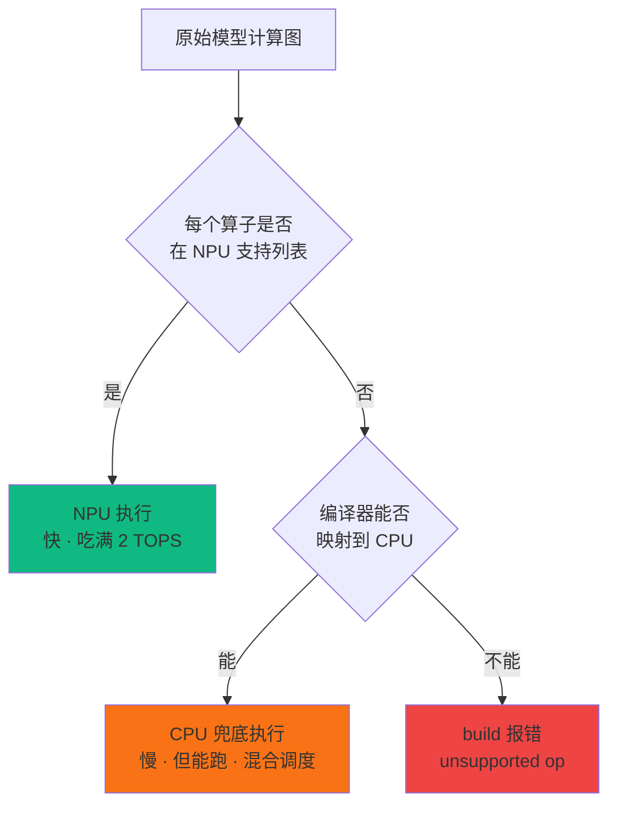

> 系列：RKNN 端侧部署实战：基于 RV1126 的模型转换与部署
> 前置：已完成 PC 环境搭建与第一个转换（TFLite MobileNet → .rknn → PC 模拟推理）
> 配套环境：PC（x86_64 Ubuntu + rknn-toolkit 1.7.x），无需板子

## 0. 本期目标

上一期跑通了"Hello World"。但真实项目里的模型五花八门：ResNet、YOLO、轻量 Transformer，转换时经常遇到"报错、转出来结果全错、性能莫名变慢"。

本期把转换这件事讲透，重点回答三个"为什么"：

1. **为什么有的模型转不过去？** ——算子约束的根源在 NPU 硬件本身，不是工具链 bug；
2. **为什么同样的模型，别人转完 60fps 你只有 10fps？** ——算子调度机制（NPU/CPU 混合执行）在起作用；
3. **为什么 config 参数填错，转出来全错？** ——每个参数对应模型里的一个数值路径，填错等于改模型。

## 1. 框架入口与 load 函数

### 1.1 四类入口

一代工具链（1.7.x）支持四种模型入口：

| 框架 | 加载函数 | 典型后缀 | 说明 |
|:---|:---|:---|:---|
| TensorFlow | `load_tensorflow` | `.pb` | 冻结的 TF 图（frozen graph） |
| TFLite | `load_tflite` | `.tflite` | 推荐入口，算子最规整 |
| Caffe | `load_caffe` | `.prototxt` + `.caffemodel` | 需要两个文件 |
| ONNX | `load_onnx` | `.onnx` | 生态最通用，工具最多 |

**选型建议**：

- 模型从 PyTorch 训练来的 → **先导出 ONNX 再转**（一代工具链不支持 PyTorch 直转）；
- 模型从 TensorFlow 来的 → 优先转 TFLite（量化信息更完整）；
- 拿不准 → 用 ONNX 做统一入口，Netron 可视化、onnx-simplifier 图简化都方便。

### 1.2 load 函数签名

```python
# ONNX 入口
ret = rknn.load_onnx(
    model='mobilenetv2-7.onnx',   # 模型文件路径
    inputs=None)                  # 可选：输入节点名列表，默认自动识别

# TFLite 入口
ret = rknn.load_tflite(model='mobilenet_v1_1.0_224.tflite')

# Caffe 入口（两个文件）
ret = rknn.load_caffe(model='deploy.prototxt', proto='deploy.caffemodel')
```

**什么情况下要填 `inputs`**：只有当模型有多个输入、或输入名在导出时丢失（比如某些 TF 模型的输入叫 `input:0`，重命名后工具链识别不了）才需要显式指定。大部分情况留空即可。

**Caffe 的坑**：`load_caffe(model=..., proto=...)` 两个参数顺序容易搞反——第一个是 `.prototxt`（网络结构），第二个是 `.caffemodel`（权重）。填反了会报"文件格式错误"或解析失败。这是最常见的低级错误。

## 2. config 参数深潜：每个参数到底改了什么

`rknn.config()` 是转换的"总开关"。上一期只用了 mean/std + target_platform，本期把高频参数逐个拆开，**每个参数都对应模型文件里的一段数据**。

| 参数 | 作用 | 默认 | 建议 |
|:---|:---|:---|:---|
| `mean_values` | 各通道均值（烘焙进预处理段） | 无 | 必须与训练预处理一致 |
| `std_values` | 各通道标准差（烘焙进预处理段） | 无 | 必须与训练预处理一致 |
| `target_platform` | 目标芯片（决定指令集） | 无 | **必须填 `'rv1126'`** |
| `reorder_channel` | 通道顺序重排 | `'0 1 2'` | 输入是 BGR 时填 `'2 1 0'` |
| `quantized_dtype` | 量化数据类型 | 一代与平台相关 | 常用 `'asymmetric_quantized-8'` |
| `quantized_algorithm` | 量化算法 | `'normal'` | 精度敏感模型用 `'kl_divergence'` |
| `batch_size` | 转换时的 batch | 1 | 部署推理一般保持 1 |
| `optimization_level` | 图优化强度 | 3 | 一般不动 |

### 2.1 mean_values / std_values：数值路径的"零点校准"

上一期已讲烘焙机制。这里补一个容易忽略的细节：**mean/std 影响的不仅是输入层，还决定量化时输入张量的数值范围**。如果模型要量化（第 4 期），输入层的 scale/zero_point 就是从 `(x-mean)/std` 之后的分布算出来的。mean/std 填错，等于量化基准错，误差会被放大到所有层。

一代 API 的格式是**嵌套列表**（因为支持多输入模型）：

```python
# 单输入模型：每个输入一个 [c1, c2, c3]
rknn.config(mean_values=[[127.5, 127.5, 127.5]],
            std_values=[[127.5, 127.5, 127.5]],
            target_platform='rv1126')

# 双输入模型（例如双目深度估计）：
rknn.config(mean_values=[[127.5,127.5,127.5],[127.5,127.5,127.5]],
            std_values=[[127.5,127.5,127.5],[127.5,127.5,127.5]],
            target_platform='rv1126')
```

### 2.2 target_platform：指令集的"方言选择器"

**必须填写，且必须是 `'rv1126'`**。它决定编译器生成哪一代 NPU 指令。填错（比如填 `'rk3568'`）会直接报错（`unsupported target`）或生成跑不了的模型。

**为什么一代不能兼容二代平台**：RV1126 的 NPU（一代，RKNPU1）和 RK3568 的 NPU（二代，RKNPU2）指令集、内存布局、算子实现完全不同。工具链是绑平台的，就像交叉编译器必须选对 `-march`——用 ARMv8 的编译选项编 ARMv7 的代码，跑起来就是非法指令。

### 2.3 reorder_channel：通道顺序的"位序约定"

一个特别容易踩的坑：**模型训练时输入是 RGB，但摄像头采集链路常给 BGR**（比如 OpenCV 读图默认 BGR；V4L2 采集 NV12 转 RGB 后顺序也可能和你的预处理代码不一致）。

```python
reorder_channel='0 1 2'   # 不重排（输入已经是模型需要的顺序）
reorder_channel='2 1 0'   # 把 BGR 重排成 RGB（或反之）
```

**用不用、怎么用，取决于你的输入数据通道顺序和模型要求的差异**，不是随便填。判断方法：用一张"已知内容"的图（比如纯红色方块）做模拟推理，如果输出类别错误，大概率就是通道顺序问题。

**嵌入式类比**：这就像 SPI 的 MSB/LSB 位序——发送方和接收方必须约定一致，否则数据全是乱的。通道顺序错 = 红蓝通道互换，模型看到的是"伪彩色"图像。

### 2.4 quantized_dtype 与 quantized_algorithm：量化的两个旋钮

量化相关的两个参数（量化原理第 4 期专讲，这里先建立概念）：

- **`quantized_dtype`**：量化成什么类型。一代常用 **`asymmetric_quantized-8`**（8 位非对称量化，带零点和缩放，对分布不均匀的激活值友好）；还有 `dynamic_fixed_point-8/16` 等选项（定点化，更古老，一般项目用不到）；
- **`quantized_algorithm`**：怎么找量化参数。`normal`（默认）快但粗略（直接统计 min/max）；`kl_divergence` 用 KL 散度最小化量化前后的分布差异，精度更好、耗时略长。**精度敏感的模型建议用 `kl_divergence`**。

### 2.5 optimization_level：编译器优化强度

`optimization_level`（1~3，默认 3）控制图优化阶段做多少变换：

- 级别 3（默认）：尽量合并算子、折叠常量、消除冗余，**追求最少算子和最小内存**；
- 级别低：保留更多原始结构，用于排查"优化后数值变了"的极端情况。

一般不动。如果怀疑优化导致精度异常（极少数情况），可以降到 1 对比，确认后再恢复。

## 3. 算子约束：为什么模型不是"都能转"

### 3.1 根源：NPU 是专用电路，不是图灵机

NPU 的硬件本质是**一组 MAC 阵列 + 固定数据流**（第 1 期讲过）。它只实现了神经网络常用算子的硬件电路：卷积、池化、全连接、激活（ReLU 系列）、拼接、Softmax 等。**任何不在电路清单里的算子，NPU 都没有对应硬件**——这不是工具链的问题，是芯片设计时的取舍（面积、功耗、成本）。

### 3.2 不支持的算子有两条出路



**两种结果都要理解**：

1. **落到 CPU（混合调度）**：工具链把不支持的算子标记为 CPU 算子，板端运行时由 `librknnmrt` 调度 ARM CPU 执行，结果再送回 NPU 继续。**能跑，但 CPU 算子是瓶颈**；
2. **直接报错（unsupported op）**：连 CPU 兜底都做不了（或者工具链没实现该算子的 CPU 版本），build 阶段直接失败。

### 3.3 "转换成功但很慢"的真相

**这是混合调度的直接后果**。看 build 日志里的 CPU 算子列表：

```text
I RKNN: [..] Note: [Op: ReduceMean:0] has been placed on CPU   ← 该算子落 CPU
I RKNN: [..] Total CPU ops: 12 / Total ops: 100                ← 12% 的算子在 CPU
```

如果模型里 CPU 算子占比高，NPU 优势发挥不出来——这就是"同样的模型，别人转换后 60fps，你转换后只有 10fps"的最常见原因。

**一个实际案例**：YOLO 系列模型的 **后处理算子**（`NMS`、`TopK`）一代工具链通常不支持，会落到 CPU。这其实是合理设计——NMS 这类动态逻辑（循环、排序、条件分支）本来就不适合 MAC 阵列，CPU 上跑反而更灵活。所以 YOLO 部署的常见做法是：**NPU 只算骨干+检测头，输出裸张量，NMS 自己在板端 CPU 上写**（第 7 期专门讲）。

### 3.4 典型不支持/低效场景

| 场景 | 现象 | 处理思路 |
|:---|:---|:---|
| 自定义算子（自定义激活等） | build 报错或落 CPU | 改写为标准算子组合 |
| 动态 shape（输入尺寸运行时变化） | 转换失败 | 固定输入尺寸 |
| 超大模型（几十 MB 权重） | 内存不足 | 剪枝/蒸馏/换轻量模型 |
| 模型里的 RNN/LSTM | 部分支持或落 CPU | 换 CNN 方案或确认支持情况 |
| 训练时才有的节点（dropout 等） | 转换报错 | 导出前冻结/移除训练节点 |
| 输入输出的动态维度标记 | 转换失败 | 用 onnx-simplifier 固定 shape |

**实操原则**：转换前用 Netron（`https://netron.app`）打开模型看一眼结构，遇到不认识的算子先查官方支持列表（`rknn-toolkit/docs/` 下有算子支持文档）。不确定就查文档，不要猜。

## 4. 完整转换示例：ONNX + 全参数

把上一期的 MobileNet 换成 ONNX 入口，同时把常用参数用齐：

```python
# convert_onnx.py —— 带完整参数的 ONNX → RKNN
from rknn.api import RKNN

rknn = RKNN(verbose=True)

# 1. 配置：全参数版本
ret = rknn.config(
    mean_values=[[127.5, 127.5, 127.5]],
    std_values=[[127.5, 127.5, 127.5]],
    target_platform='rv1126',
    reorder_channel='0 1 2',          # 输入已是 RGB 则不重排
    quantized_dtype='asymmetric_quantized-8',
    quantized_algorithm='kl_divergence',
    optimization_level=3,
    batch_size=1)
if ret != 0:
    print('config 失败'); exit(ret)

# 2. 加载 ONNX 模型（从 ONNX Model Zoo 下载 mobilenetv2-7.onnx）
ret = rknn.load_onnx(model='mobilenetv2-7.onnx')
if ret != 0:
    print('load_onnx 失败'); exit(ret)

# 3. 构建：先不量化（第 4 期再量化）
ret = rknn.build(do_quantization=False)
if ret != 0:
    print('build 失败'); exit(ret)

# 4. 导出
ret = rknn.export_rknn('mobilenetv2.rknn')
if ret != 0:
    print('export 失败'); exit(ret)

print('✅ 转换完成')
rknn.release()
```

## 5. 高频报错与真实案例深挖

### 5.1 报错排查表

| 报错/现象 | 原因 | 排查方向 |
|:---|:---|:---|
| `load_onnx 返回非 0` | ONNX 文件损坏 / 版本过旧 | 用 Netron 打开确认；`python3 -c "import onnx; onnx.checker.check_model(onnx.load('m.onnx'))"` |
| `build: unsupported op: XXX` | 算子不支持 | 查官方算子列表；换模型；改写算子 |
| 转换成功但推理结果全错 | mean/std 或通道顺序不匹配 | 核对 config 与训练预处理、reorder_channel |
| 推理速度异常慢 | 大量算子落 CPU | 看转换日志中 CPU 算子列表，改写网络 |
| `numpy/onnx 版本冲突` | 依赖版本过新 | 按环境篇锁定 numpy==1.16.6 onnx==1.7.0 |
| 转换时内存不足 | 模型太大 | 换轻量模型；batch_size=1 |
| `load_caffe` 报格式错误 | model/proto 参数顺序填反 | 第一个参数是 .prototxt |
| 模拟推理输出 shape 不对 | 输入维度与模型不一致 | 检查 NHWC/NCHW 布局，ONNX 模型传 [1,3,H,W] |

### 5.2 案例 1：`unsupported op`（YOLO 的 NMS）

**现象**：转换 YOLOv5 的 ONNX 导出文件时，build 报 `unsupported op: NonMaxSuppression`。

**处理流程**：

1. 用 Netron 定位该算子在哪一层——通常在检测头之后、输出之前；
2. 查官方支持列表——一代工具链不支持 `NonMaxSuppression`；
3. 用 onnx-simplifier 简化图：`python3 -m onnxsim yolov5s.onnx yolov5s_sim.onnx`——很多"纸面算子"（导出时附带、实际不用的节点）会被合并消除；
4. 仍不支持的话，**改导出策略**：导出时把 NMS 从图里去掉（`--no-nms` 或自定义导出脚本），让 NPU 只算到检测头输出（形状 `[1, 25200, 85]`），NMS 在板端用 C 写。这是业界标准做法。

**教训**：遇到 unsupported op 先分清"这算子真需要吗"——训练/导出框架加的辅助节点往往可以安全去掉。

### 5.3 案例 2：推理结果全错但转换成功

**现象**：转出来的模型在 PC 模拟上 top1 是垃圾（随机类别）。

**排查顺序**（按概率从高到低）：

1. **mean/std 与训练不一致**（最常见）——比如模型训练时用 `ImageNet 均值 [0.485,0.456,0.406]` 和标准差 `[0.229,0.224,0.225]`（PyTorch 标准做法），你按 127.5 填，输入分布完全错位；
   ```python
   # PyTorch ImageNet 模型的正确填法（注意：一代 API 用 0~255 域）
   rknn.config(mean_values=[[123.675, 116.28, 103.53]],
               std_values=[[58.395, 57.12, 57.375]],
               target_platform='rv1126')
   # 推导：mean=0.485*255≈123.675, std=0.229*255≈58.395
   ```
2. **通道顺序错**——OpenCV 读的 BGR 图直接喂给 RGB 模型；
3. **输入尺寸错**——模型要 224×224，你 resize 成 256×256 又没 center crop；
4. **输入布局错**——ONNX 模型是 NCHW，你按 NHWC 传了 `[1,224,224,3]`。

**单步排查法**：用一张"已知答案"的图（如 ImageNet 猫图）做 PC 模拟推理，每次只改一个参数，观察 top1 是否恢复。这是嵌入式调试的老办法——二分定位，一次只动一个变量。

### 5.4 案例 3：转换日志大量 CPU 算子

**现象**：build 日志里出现多行 `has been placed on CPU`。

**处理**：

1. 把 CPU 算子名单打印出来（日志里有），按出现次数排序；
2. 分析共性：是不是同一种算子（比如 `Reshape` 太多、`Split` 太多）？
3. 优先换网络结构（用 NPU 友好的算子）；其次考虑模型简化（onnx-simplifier 能合并大量 Reshape/Transpose）；
4. 最后才接受现状并做 CPU 侧优化（比如后处理算子本来就是 CPU 干活的）。

**注意**：`Reshape/Transpose/Split` 这类"布局算子"即使有 NPU 实现，一代平台上也可能落 CPU，因为它们本质是内存搬运，MAC 阵列帮不上忙。**减少布局算子**是让模型跑得快的重要技巧——比如用 `channels_last` 训练的模型，转换时布局算子会少很多。

## 6. 练习与里程碑

### 练习

1. **参数实验**：分别用 `reorder_channel='0 1 2'` 和 `'2 1 0'` 转换同一个 RGB 输入模型，模拟推理同一张图，对比结果差异（预期：不匹配时结果错误）。
2. **算子实验**：找一个带 GELU/自定义激活的模型尝试转换，记录报错信息，然后用标准激活（ReLU/SiLU）替换后重新转换。
3. **Netron 练习**：用 Netron 打开 MobileNetV2 的 ONNX 文件，数一数里面有多少种算子，找出可能不受支持的。
4. **排查表实操**：故意把 mean/std 填错（如填 0/1），转换并模拟推理，验证"结果全错"的现象，然后修正。
5. **CPU 算子观察**：转换一个带 NMS 的检测模型，记录 build 日志里 `placed on CPU` 的行数，理解混合调度。

### 里程碑自检

- [ ] 能说出四种框架入口及各自适用场景
- [ ] 能解释 config 里 mean/std、target_platform、reorder_channel 的作用
- [ ] 知道 NPU 不支持的算子会怎样（落 CPU 或报错）
- [ ] 遇到 unsupported op 知道完整排查流程
- [ ] 能用 Netron 查看模型结构
- [ ] 知道"转换成功但慢"的根源是混合调度

## 7. 小结

本期把"转换"这个环节从"会跑"提升到"懂原理"：

- **入口**：TF/TFLite/Caffe/ONNX 四选一，PyTorch 先导 ONNX；Caffe 注意参数顺序；
- **config**：mean/std 必须匹配训练预处理（PyTorch 模型要换算 0~255 域），`target_platform='rv1126'` 必填，`reorder_channel` 管通道顺序，量化参数决定精度与性能的平衡；
- **算子约束**：根源是 NPU 专用电路；不支持的算子落 CPU 或报错；"转换成功但慢"= CPU 算子多；NMS 这类后处理本来就该在 CPU 写；
- **报错排查**：按表逐项核对；onnx-simplifier 是消除"纸面算子"的利器；单步排查法一次只动一个变量。

到目前为止，你转换的都是**浮点模型**——能跑，但没吃满 NPU 的 2 TOPS（那是 INT8 算力）。接下来进入整个部署流程技术含量最高的环节：**量化**——为什么浮点转 8 位整数精度不会崩、校准数据集怎么准备、量化后精度掉了怎么定位。

> 🏷️ 标签：#RKNN #模型转换 #算子约束 #ONNX #Netron #混合调度 #排错
