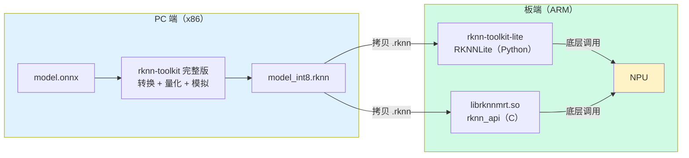
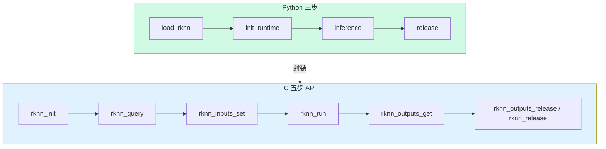

> 系列：RKNN 端侧部署实战：基于 RV1126 的模型转换与部署
> 前置：已有一代工具链转出的 .rknn 模型
> 场景：快速验证模型效果、写原型脚本、调试数据流

## 0. 本期目标

上一期我们用 C 语言写了完整的五步 API，那是生产级路线。但日常开发中，**验证一个模型在板子上跑出来的效果**，用 C 太重：编译、拷贝、部署，改一行参数就要重来一遍。

板端 Python 推理（`rknn-toolkit-lite`）把 C 的五个 API 封装成三个方法，让你**在板子上直接跑 Python 脚本推理**：

```python
rknn_lite.load_rknn("model.rknn")   # 1. 加载模型
rknn_lite.init_runtime()            # 2. 初始化运行时
outputs = rknn_lite.inference([img])  # 3. 推理
```

本期完成三件事：

1. 搞清楚 `rknn-toolkit-lite` 和 PC 端 `rknn-toolkit` 的关系；
2. 在板子上装好 Python 推理环境，跑通 MobileNetV2；
3. 对比 C 版与 Python 版，理解什么时候该用哪个。

## 1. 三个"rknn"到底谁是谁

RKNN 生态里有三样名字很像的东西，先彻底分清：

| 名字 | 运行位置 | 干什么 | 对应你的用法 |
|:---|:---|:---|:---|
| **rknn-toolkit**（完整版） | PC（x86） | 模型转换、量化、PC 模拟推理 | `RKNN()`，你在 PC 上转换时用的 |
| **rknn-toolkit-lite** | 板子（ARM） | 板端 Python 推理 | `RKNNLite()`，本期主角 |
| **librknnmrt.so** | 板子（ARM） | C 推理运行时库 | C 程序链接它；lite 底层也是它 |

一句话：**`rknn-toolkit-lite` 是 `librknnmrt.so` 的 Python 封装**，专门为板子设计。



> ⚠️ **版本红线**：RV1126 是第一代 NPU 平台，配套的是 **rknn-toolkit 1.7.x 与 rknn-toolkit-lite 1.7.x**。RKNN-Toolkit2 是 RK3566/3568/3588 等二代平台的工具，**不能混用**。装 lite 时务必下载 1.x 版本，否则 `import rknnlite` 会失败或行为异常。

## 2. 板端 Python 环境搭建

### 2.1 准备 .whl 文件

在 PC 端从官方 release 下载 `rknn-toolkit-lite-1.7.x-cp38-cp38-linux_armv7l.whl`（一代平台是 armv7l，32 位 Python 3.8/3.9 视 SDK 而定）。

**注意 Python 版本匹配**：板子烧录的 SDK 镜像里 Python 版本是多少，就下对应 cp 版本的 whl。RV1126 SDK 常见内置 Python 3.8。

### 2.2 安装（板子上执行）

```bash
# 拷贝 whl 到板子后
pip3 install rknn-toolkit-lite-1.7.x-cp38-cp38-linux_armv7l.whl

# 验证
python3 -c "from rknnlite.api import RKNNLite; print('RKNNLite OK')"
```

如果板子没有 pip3，先装：

```bash
# 一些 SDK 镜像不带 pip
sudo apt update && sudo apt install -y python3-pip
```

> 如果 whl 安装报 `is not a supported wheel on this platform`，检查两件事：① 文件名里的 `cp38` 是否匹配板子 Python 版本；② 是否 `armv7l`（RV1126 是 32 位，别下成 aarch64）。

## 3. 完整代码：板端 Python 图像分类

创建 `classify_lite.py`：

```python
# classify_lite.py —— 板端 Python 推理（RKNNLite）
import sys
import numpy as np
from rknnlite.api import RKNNLite

def load_labels(path):
    """读取 ImageNet 标签文件，一行一个类别名"""
    with open(path, "r") as f:
        return [line.strip() for line in f.readlines()]

def main(model_path, image_path, label_path):
    # 1. 创建并加载模型
    rknn = RKNNLite()
    ret = rknn.load_rknn(model_path)          # 对应 C 的 rknn_init
    if ret != 0:
        print("load_rknn 失败:", ret)
        exit(-1)
    print("[1/3] load_rknn OK")

    # 2. 初始化运行时（对应 C 的 rknn_init 后半段 + query）
    ret = rknn.init_runtime()
    if ret != 0:
        print("init_runtime 失败:", ret)
        exit(-1)
    print("[2/3] init_runtime OK")

    # 3. 读图 + 预处理 + 推理（对应 C 的 inputs_set + run + outputs_get）
    import cv2
    img = cv2.imread(image_path)              # BGR 顺序，cv2 默认
    img = cv2.cvtColor(img, cv2.COLOR_BGR2RGB)
    img = cv2.resize(img, (224, 224))
    img = np.expand_dims(img, 0).astype(np.uint8)

    outputs = rknn.inference(inputs=[img])    # 返回 list[ndarray]
    print("[3/3] inference OK")

    # 4. 后处理：softmax + topk
    scores = outputs[0][0]                    # (1000,)
    exp_scores = np.exp(scores - np.max(scores))
    probs = exp_scores / np.sum(exp_scores)
    top5 = np.argsort(probs)[::-1][:5]

    labels = load_labels(label_path)
    for i, idx in enumerate(top5):
        print(f"Top{i+1}: {labels[idx]} ({probs[idx]:.4f})")

    rknn.release()                            # 对应 C 的 rknn_release

if __name__ == "__main__":
    main(sys.argv[1], sys.argv[2], sys.argv[3])
```

运行：

```bash
python3 classify_lite.py mobilenetv2_int8.rknn test.jpg labels.txt
```

**预期输出**：

```text
[1/3] load_rknn OK
[2/3] init_runtime OK
[3/3] inference OK
Top1: tiger cat (0.9021)
Top2: tabby cat (0.0712)
...
```

## 4. RKNNLite 三方法与 C 五步 API 的对应

| RKNNLite（Python） | C 五步 API | 说明 |
|:---|:---|:---|
| `load_rknn(path)` | `rknn_init` | 加载 .rknn 文件 |
| `init_runtime()` | `rknn_init` + `rknn_query` | 初始化 NPU 运行时，绑定 core |
| `inference(inputs)` | `inputs_set` + `run` + `outputs_get` | 喂数据、推理、取结果一步到位 |
| `release()` | `rknn_release` | 释放资源 |

**`inference` 帮你做的事**（C 版要自己写）：

1. 根据模型输入 shape 自动做尺寸/类型检查；
2. 自动把 `np.ndarray` 拷给 NPU；
3. 执行推理；
4. 自动做反量化，返回 float32 的 numpy 数组。

所以在 Python 里你不需要关心 `pass_through`、`want_float`、`fmt`——默认行为对原型开发最友好。



## 5. Python 版 vs C 版：怎么选

| 维度 | Python（RKNNLite） | C（rknn_api） |
|:---|:---|:---|
| 开发速度 | 极快，改代码即跑 | 慢，编译部署一轮 |
| 单帧推理耗时 | 接近 C（推理本身在 C 层） | 最快 |
| 帧率上限 | 受 Python 解释器/拷贝开销拖累 | 高，适合多线程流水线 |
| 依赖 | Python3 + numpy + opencv | 无 |
| 适用场景 | 原型验证、算法调试、离线跑批 | 量产、嵌入式产品、视频管线 |

**关键认知**：`inference` 里 NPU 执行本身和 C 一样快，Python 的额外开销主要在**数据拷贝、numpy 包装、解释器调度**。对"单张图分类"这种低频任务，Python 完全够用；对"摄像头 30fps 实时检测"，Python 版通常扛不住，要回到 C + 多线程流水线（后面专题讲）。

**开发策略建议**：


## 6. 常见问题

| 现象 | 原因 | 处理 |
|:---|:---|:---|
| `ModuleNotFoundError: rknnlite` | whl 没装对 | 确认装了 lite（不是 toolkit），且版本匹配 |
| wheel 平台不匹配 | 下了 aarch64 版 | RV1126 用 armv7l |
| `load_rknn` 失败 | 模型是 Toolkit2 转的 | 用 1.x 工具链重转 |
| `init_runtime` 报找不到设备 | 驱动未加载 | `ls /dev/rknpu`，确认内核配置 |
| 推理结果全错 | cv2 默认 BGR 而模型要 RGB | `cv2.cvtColor` 转 RGB（或训练时就用 BGR） |
| 速度比 C 慢很多 | Python 拷贝/解释开销 | 评估是否该转 C 版；或减少输入预处理在 Python 里做 |

## 7. 练习与里程碑

### 练习

1. **跑通分类**：板子上跑通 `classify_lite.py`，输出 top5 与 C 版对比，确认一致；
2. **批量测试**：写循环对 50 张图批量推理，统计平均耗时和 top1 准确率（注意每次调用 `inference` 的开销）；
3. **帧率测试**：循环推理 100 次测总耗时，算平均 FPS，记录 Python 版的实际吞吐上限；
4. **对比实验**：同一模型分别用 C 版和 Python 版跑 100 次，对比平均耗时差距，验证"推理本身一样快、开销在拷贝"的结论。

### 里程碑自检

- [ ] 能说出 toolkit / toolkit-lite / librknnmrt 三者的关系
- [ ] 能独立完成板端 Python 环境安装
- [ ] 能用 RKNNLite 三方法跑通分类
- [ ] 知道 Python 版和 C 版各自的适用场景
- [ ] 能解释"Python 慢在哪、NPU 快在哪"

## 8. 小结

- **rknn-toolkit-lite** 是板端 Python 推理库，底层封装 `librknnmrt.so`，用 `RKNNLite` 类三方法搞定：`load_rknn → init_runtime → inference`；
- **版本**：一代平台（RV1126）用 1.7.x，armv7l + Python3.8，别和 Toolkit2 混用；
- **定位**：Python 版适合原型验证、算法调试、离线跑批；实时摄像头流水线要回 C 版；
- **数据格式**：cv2 默认 BGR，模型要 RGB 时记得 `cvtColor`。

分类模型只能回答"这是什么"。实际产品里更常用的是**检测模型**——框出目标在哪。下一程我们进入 YOLO：从 ONNX 转换到板端后处理，把"会分类"升级成"会定位"。

> 🏷️ 标签：#RKNN #RKNNLite #板端Python #原型开发 #推理
