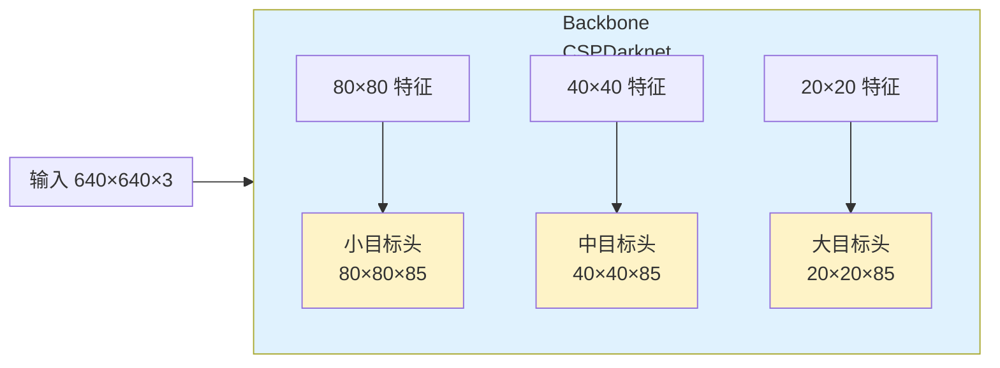
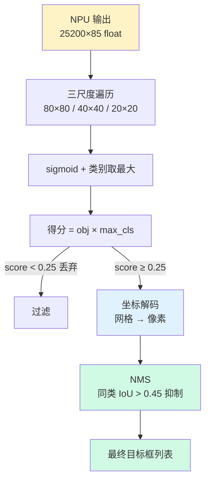
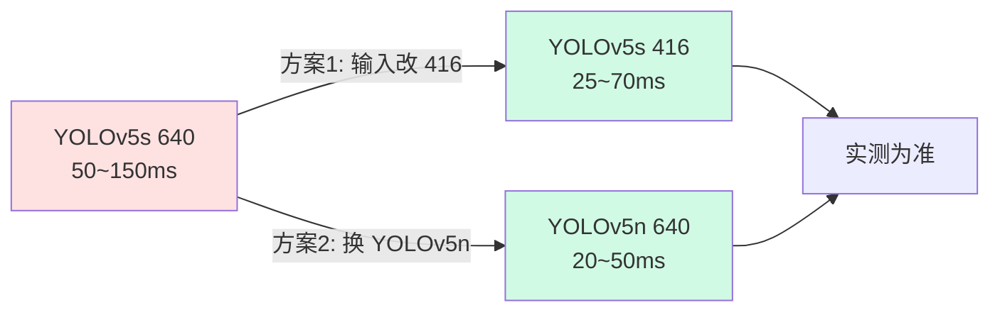

> 系列：RKNN 端侧部署实战：基于 RV1126 的模型转换与部署
> 前置：已会 PC 端模型转换（rknn-toolkit 1.x）与板端 C 推理（五步 API）
> 模型：YOLOv5s（一代平台兼容性最好的检测模型之一）

## 0. 本期目标

分类模型输出一个 1000 维向量，取最大值就是类别。**检测模型**输出的是"目标在哪里 + 是什么"：一组候选框（中心点、宽高）加类别概率。

本期完成三件事：

1. 导出检测模型：把 PyTorch 的 YOLOv5s 转成 ONNX，再转成一代平台 .rknn；
2. 看懂输出：理解 YOLO 三个尺度头的输出张量结构；
3. 板端后处理：解码 → 置信度过滤 → NMS，用 C 实现完整检测链路。

## 1. YOLO 输出长什么样

以 YOLOv5s 为例（输入 640×640，COCO 80 类）。网络有**三个检测头**，分别负责大/中/小目标：

| 输出头 | 特征图尺寸 | 感受野/负责目标 |
|:---|:---|:---|
| 大目标头 | 20×20 | 大目标（每格感受野大） |
| 中目标头 | 40×40 | 中目标 |
| 小目标头 | 80×80 | 小目标（每格感受野小） |

每个头的每个格子输出 `5 + 80 = 85` 个数：

```text
[x, y, w, h, obj_conf, cls0, cls1, ..., cls79]
```

其中 `x, y` 是中心点相对格子的偏移，`w, h` 是宽高相对先验框的缩放，`obj_conf` 是"这里有目标"的置信度，后面 80 个是各类别分数。



**三个头的输出会被拼接**成一个大张量：`(1, 25200, 85)`，其中：

```text
25200 = 80×80 + 40×40 + 20×20
```

所以在板端，你拿到的就是 `[1, 25200, 85]` 的数组，后处理要做的：

```text
1. 对每个候选：sigmoid 得到有效概率
2. 解码坐标：从网格偏移还原成像素坐标
3. 过滤：obj_conf × max(cls) > 阈值才保留
4. NMS：同类别高置信度框抑制重叠框
```

## 2. 模型导出与转换

### 2.1 导出 ONNX（PC 端，PyTorch 环境）

```bash
git clone https://github.com/ultralytics/yolov5
cd yolov5
pip install -r requirements.txt
```

导出（yolov5s.pt → yolov5s.onnx）：

```bash
python export.py --weights yolov5s.pt --img 640 --batch 1 \
    --include onnx --opset 11
```

**opset 注意**：一代工具链对 opset 版本兼容有限，**opset 11 最稳**。opset 13+ 可能引入不支持的算子导致转换失败或推理错误。

### 2.2 ONNX → RKNN（PC 端）

转换脚本（一代工具链 rknn-toolkit 1.x）：

```python
# convert_yolov5.py
from rknn.api import RKNN

rknn = RKNN()

# 1. 配置：注意 mean/std 是 RGB 顺序（YOLOv5 训练用 RGB）
rknn.config(
    mean_values=[[0, 0, 0]],       # YOLOv5 归一化在模型内部，这里不再减
    std_values=[[255, 255, 255]],  # 只做 /255
    target_platform="rv1126",
    reorder_channel="0 1 2",       # RGB，与训练一致
)

# 2. 加载 ONNX
ret = rknn.load_onnx(model="yolov5s.onnx")
assert ret == 0, "load_onnx 失败: %d" % ret

# 3. 构建
ret = rknn.build(do_quantization=True, dataset="./dataset.txt")
assert ret == 0, "build 失败: %d" % ret

# 4. 导出
ret = rknn.export_rknn("yolov5s_int8.rknn")
assert ret == 0, "export 失败: %d" % ret
print("转换完成")
```

`dataset.txt` 是量化校准图片列表（每行一个图片路径，20~100 张代表真实场景的图即可）。

> ⚠️ **不导出 NMS**：YOLOv5 的 ONNX 导出默认带一个 NMS 分支（`--include onnx` 不带 `nms` 参数时一般不带，但**确认输出节点只有 3 个检测头或 1 个拼接张量**）。RKNN 一代平台不支持在 NPU 里跑 NMS，**NMS 必须在 CPU 后处理里自己写**。转换后用 Netron 打开 onnx 检查输出节点数量。

### 2.3 转换后先 PC 模拟验证

```python
# 模拟推理，确认转换正确再上板
rknn.init_runtime()   # 默认 PC 模拟（需要 x86 的 rknn-toolkit）
img = cv2.imread("bus.jpg")   # YOLOv5 官方测试图
img = cv2.cvtColor(img, cv2.COLOR_BGR2RGB)
img = cv2.resize(img, (640, 640))
img = np.expand_dims(img, 0).astype(np.uint8)
outputs = rknn.inference(inputs=[img])
print("输出 shape:", [o.shape for o in outputs])
# 预期: [(1, 25200, 85)] 或 [(1,25200,85)] 单输出
```

## 3. 板端后处理：完整 C 实现

### 3.1 数据结构

```c
#define MAX_BOXES 1000

typedef struct {
    float x1, y1, x2, y2;   // 像素坐标（左上/右下）
    float score;            // 最终得分
    int class_id;           // 类别
} Box;

// 按得分降序排序（qsort 用）
int cmp_box(const void *a, const void *b) {
    Box *ba = (Box *)a, *bb = (Box *)b;
    return (bb->score > ba->score) ? 1 : -1;
}
```

### 3.2 解码 + 置信度过滤

YOLOv5 的坐标解码公式（`x,y` 是中心点相对网格的偏移，`w,h` 是先验框的缩放）：

```c
// 输入: output 为 (25200, 85) 的 float 数组（板端拿到的拼接张量）
// stride[3] = {8, 16, 32} 对应 80/40/20 网格
// anchors 为每个尺度的 3 组先验框（YOLOv5s 默认锚）
static int decode_yolov5(const float *output, int grid0, int grid1,
                         float stride, const float *anchors,
                         float conf_thresh, Box *boxes, int max_boxes) {
    int count = 0;
    int h = grid1, w = grid0;          // 该尺度网格
    for (int gy = 0; gy < h; gy++) {
        for (int gx = 0; gx < w; gx++) {
            for (int a = 0; a < 3; a++) {           // 3 个锚
                const float *p = output + (gy * w + gx) * 3 * 85 + a * 85;
                float obj = sigmoid(p[4]);           // 目标置信度
                // 找 80 个类别中最高分
                int cls_id = 0; float max_cls = 0;
                for (int c = 0; c < 80; c++) {
                    float s = sigmoid(p[5 + c]);
                    if (s > max_cls) { max_cls = s; cls_id = c; }
                }
                float score = obj * max_cls;         // 最终得分
                if (score < conf_thresh) continue;

                // 解码（YOLOv5 公式）
                float cx = (gx + sigmoid(p[0])) * stride;
                float cy = (gy + sigmoid(p[1])) * stride;
                float bw = anchors[a * 2]     * expf(p[2]);
                float bh = anchors[a * 2 + 1] * expf(p[3]);

                boxes[count].x1 = cx - bw / 2;
                boxes[count].y1 = cy - bh / 2;
                boxes[count].x2 = cx + bw / 2;
                boxes[count].y2 = cy + bh / 2;
                boxes[count].score = score;
                boxes[count].class_id = cls_id;
                count++;
                if (count >= max_boxes) return count;
            }
        }
    }
    return count;
}
```

> 说明：`sigmoid` 和 `expf` 是标准数学函数；`(1, 25200, 85)` 的输出在内存里正好按"80×80 头在前、40×40 中间、20×20 在后"的顺序排布，循环时用不同 `stride` 分别遍历三段即可（代码里以单个尺度为例，三个尺度调用三次）。

### 3.3 NMS

```c
// 简单 NMS：按得分从高到低，抑制与已选框 IoU 超过阈值的框
static int nms(Box *boxes, int count, float iou_thresh, Box *result) {
    qsort(boxes, count, sizeof(Box), cmp_box);
    int keep = 0;
    char removed[MAX_BOXES] = {0};
    for (int i = 0; i < count; i++) {
        if (removed[i]) continue;
        result[keep++] = boxes[i];
        for (int j = i + 1; j < count; j++) {
            if (removed[j]) continue;
            if (boxes[j].class_id != boxes[i].class_id) continue; // 仅同类抑制
            float iou = calc_iou(&boxes[i], &boxes[j]);
            if (iou > iou_thresh) removed[j] = 1;
        }
    }
    return keep;
}

// IoU：交集面积 / 并集面积
float calc_iou(const Box *a, const Box *b) {
    float ix1 = fmaxf(a->x1, b->x1);
    float iy1 = fmaxf(a->y1, b->y1);
    float ix2 = fminf(a->x2, b->x2);
    float iy2 = fminf(a->y2, b->y2);
    float iw = fmaxf(0, ix2 - ix1);
    float ih = fmaxf(0, iy2 - iy1);
    float inter = iw * ih;
    float area_a = (a->x2 - a->x1) * (a->y2 - a->y1);
    float area_b = (b->x2 - b->x1) * (b->y2 - b->y1);
    return inter / (area_a + area_b - inter);
}
```

### 3.4 主流程（板端五步 API + 后处理）

```c
// 伪代码：完整检测流程
rknn_init(&ctx, "yolov5s_int8.rknn", 0, 0, NULL);
rknn_query(ctx, RKNN_QUERY_IN_OUT_NUM, &io_num, sizeof(io_num));

// 取一帧（摄像头/图片），缩放到 640×640，RGB
unsigned char *frame = get_frame();          // 见摄像头专题
unsigned char *resized = malloc(640*640*3);
resize_bilinear(frame, w, h, resized, 640, 640, 3);

// 喂数据
rknn_input inputs[1] = {0};
inputs[0].index = 0;
inputs[0].type = RKNN_TENSOR_UINT8;
inputs[0].fmt = RKNN_TENSOR_NHWC;
inputs[0].size = 640*640*3;
inputs[0].buf = resized;
inputs[0].pass_through = 0;
rknn_inputs_set(ctx, 1, inputs);

// 推理
rknn_run(ctx, NULL);

// 取输出（want_float=1 拿 float）
rknn_output outputs[1] = {0};
outputs[0].want_float = 1;
rknn_outputs_get(ctx, 1, outputs, NULL);
float *pred = (float *)outputs[0].buf;      // (25200, 85)

// 后处理
Box boxes[MAX_BOXES];
int n = 0;
n += decode_yolov5(pred, 80, 80, 8,  anchors0, 0.25, boxes+n, MAX_BOXES-n);
n += decode_yolov5(pred + 80*80*3*85, 40, 40, 16, anchors1, 0.25, boxes+n, MAX_BOXES-n);
n += decode_yolov5(pred + (80*80+40*40)*3*85, 20, 20, 32, anchors2, 0.25, boxes+n, MAX_BOXES-n);

Box result[100];
int keep = nms(boxes, n, 0.45, result);

// 画框/上报
for (int i = 0; i < keep; i++) {
    printf("class=%d score=%.3f box=(%.0f,%.0f,%.0f,%.0f)\n",
           result[i].class_id, result[i].score,
           result[i].x1, result[i].y1, result[i].x2, result[i].y2);
}

rknn_outputs_release(ctx, 1, outputs);
rknn_release(ctx);
```

## 4. 后处理全流程



### 4.1 为什么 obj × max(cls) 而不是直接用 obj

`obj_conf` 表示"这里有目标"，`max(cls)` 表示"最可能是哪类"。两者相乘是**联合概率**：既要有目标、又要类别置信度高。只用 `obj_conf` 过滤会把"低置信度但恰好有个类别分数"的误检放进来。**这是检测后处理最容易忽略的细节**。

### 4.2 阈值怎么选

| 阈值 | 作用 | 建议值 | 调高/调低影响 |
|:---|:---|:---|:---|
| conf_thresh | 候选框过滤 | 0.25 | 调高少框快但漏检；调低多框慢但误检多 |
| iou_thresh | NMS 抑制 | 0.45 | 调高保留重叠框；调低抑制更狠（适合密集目标） |

**实践**：先固定 iou=0.45，用 conf 调召回；再用 iou 调精度。看你的应用是"宁缺毋滥"（报警类）还是"宁可多报"（辅助标注类）。

## 5. 性能观察

| 环节 | 量级（YOLOv5s INT8 @640） | 说明 |
|:---|:---|:---|
| NPU 推理 | 50~150 ms | 一代平台跑 640 输入偏重，可用 416 输入降一半以上 |
| 解码+过滤 | 2~10 ms | 纯 CPU，25200 候选是主要开销 |
| NMS | 1~5 ms | 候选少则快 |

**优化提示**：YOLOv5s 在 RV1126 上 640 输入比较吃力。两个常用招：

1. **换小输入**：`--img 416` 重训练/重导出，帧率翻倍，精度略降；
2. **换小模型**：YOLOv5n / YOLOv5s 的剪枝版。



## 6. 常见问题

| 现象 | 原因 | 处理 |
|:---|:---|:---|
| 转换报不支持算子 | ONNX opset 太高 / 模型带了 NMS | 用 opset 11；导出时去掉 NMS 分支 |
| 板端输出 shape 不对 | 转换时输出节点没确认 | Netron 检查 ONNX，确认 3 头或 1 个拼接张量 |
| 检测框全偏 | mean/std 或通道顺序错 | YOLOv5 用 RGB + mean 0 + std 255 |
| 框在但类别错 | 类别顺序与 COCO 标签不一致 | 核对 labels.txt 与训练时类别顺序 |
| 大量重复框 | NMS 没做 / iou 阈值太高 | 检查后处理是否调用了 NMS |
| 小目标全漏 | 输入太小 / conf 阈值太高 | 提高输入分辨率；降低 conf_thresh |
| 帧率太低 | 640 输入太重 | 改 416 输入或换小模型 |

## 7. 练习与里程碑

### 练习

1. **转换**：完成 YOLOv5s → ONNX(opset11) → .rknn 全流程，Netron 确认输出节点；
2. **PC 模拟**：用 bus.jpg 模拟推理，检查输出 shape 是 (1,25200,85)；
3. **板端跑通**：把解码 + 过滤 + NMS 移植到板子，对 bus.jpg 输出检测框坐标，与 PC 端模拟结果对比（坐标应一致）；
4. **调参实验**：改变 conf_thresh（0.1/0.25/0.5）和 iou_thresh（0.3/0.45/0.6），观察检测结果和耗时变化，记录成表；
5. **画框**：用 OpenCV 在图上画出检测框并保存，肉眼验证检测正确性。

### 里程碑自检

- [ ] 能解释 YOLOv5 三尺度输出结构和 25200 的来历
- [ ] 能独立完成检测模型的 ONNX→RKNN 转换
- [ ] 能写出解码 + 过滤 + NMS 的 C 实现
- [ ] 知道 obj × max(cls) 的含义和必要性
- [ ] 能说出两个提升帧率的思路

## 8. 小结

- **YOLOv5 输出**：三尺度头拼接成 (1, 25200, 85)，85 = 5 + 80（坐标 + 目标置信度 + 类别）；
- **转换要点**：opset 11、不导出 NMS、RGB + mean 0 / std 255；
- **后处理三步**：sigmoid 解码 → obj×max(cls) 过滤 → 同类 NMS；
- **性能**：一代平台 640 输入偏重，416 输入或 YOLOv5n 是实战常用折中；
- **阈值**：conf 调召回，iou 调精度，按应用场景取舍。

检测链路在单帧上跑通了，但"检测一张图"和"实时检测摄像头视频流"是两回事。下一程把摄像头接进来：RKMedia 的 VI→VPSS→NPU 数据流，让 YOLO 真正"看起来"。

> 🏷️ 标签：#RKNN #YOLOv5 #目标检测 #NMS #后处理 #模型转换
