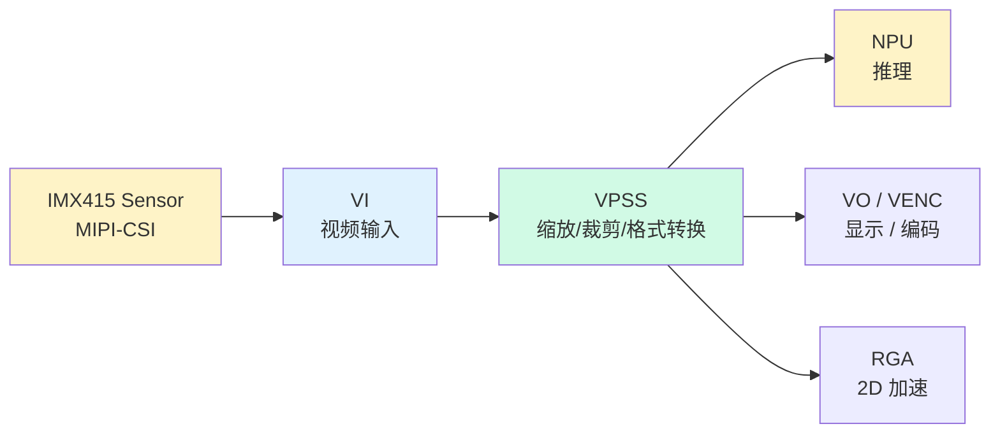
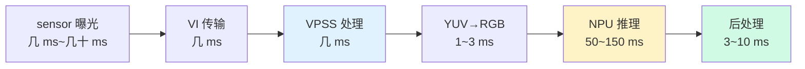

> 系列：RKNN 端侧部署实战：基于 RV1126 的模型转换与部署
> 前置：板端 C 推理五步 API + YOLOv5 后处理已跑通
> 目标：把"检测一张图"升级为"实时检测摄像头视频流"

## 0. 本期目标

前几期我们都是拿一张图片喂给 NPU。真实产品是**摄像头画面实时进、检测结果实时出**。RV1126 的媒体通路由 Rockchip 的 **RKMedia** 框架管理。

本期完成三件事：

1. 搞懂 RKMedia 的 VI / VPSS / VO 三大模块和它们的分工；
2. 打通数据流：sensor → VI 取帧 → VPSS 缩放 → NPU 推理 → VO 显示；
3. 写出第一个"带眼睛"的检测程序。

## 1. RKMedia 是什么

RKMedia 是 Rockchip 多媒体中间件，抽象了芯片的视频输入/处理/输出硬件。对 RV1126 来说，核心模块：

| 模块 | 全称 | 职责 | 类比 |
|:---|:---|:---|:---|
| **VI** | Video Input | 从 sensor 接收原始图像 | 眼睛的视网膜 |
| **VPSS** | Video Processing Subsystem | 缩放、裁剪、格式转换、帧率控制 | 大脑视觉皮层（预处理） |
| **VO** | Video Output | 把图像输出到显示设备 | 屏幕/HDMI |
| **VENC** | Video Encoder | H.264/H.265 硬编码 | 录像机 |
| **RGA** | Raster Graphic Acceleration | 2D 加速：缩放/旋转/格式转换 | 图像加速卡 |

**最常用的链路**：



**为什么 VPSS 很重要**：YOLOv5s 要 640×640 输入，sensor 输出可能是 1920×1080。如果每次都在 CPU 上做双线性缩放，会吃掉大量算力。VPSS 是**硬件缩放**，几乎不占 CPU——这是嵌入式视频管线的核心思想：**能用硬件做的事，别用 CPU 做**。

## 2. 打通前的准备：sensor 已点亮

前置条件：摄像头已经能被系统识别（`cat /proc/rkisp*` 能看到 sensor，或 SDK 示例 `rkisp_demo` 能出图）。

> 如果 sensor 还没点亮，先回到采集篇：检查设备树 I2C 地址、MCLK 频率、上电时序、MIPI 通道配置。**采集篇解决了"有没有图像"，本期解决"图像怎么流动"。**

## 3. 数据流打通：代码框架

RKMedia 编程套路是固定的四步：**初始化 → 绑定链路 → 启动 → 取帧**。

### 3.1 初始化 RKMedia

```c
#include <rk_comm_video.h>
#include <rk_comm_vi.h>
#include <rk_comm_vpss.h>
#include <rk_comm_vo.h>
#include <rk_mpi_vi.h>
#include <rk_mpi_vpss.h>
#include <rk_mpi_vo.h>
#include <rk_mpi_sys.h>

#define VI_CHN    0
#define VPSS_GRP  0
#define VPSS_CHN  0

static RK_S32 init_rkmedia(void) {
    RK_MPI_SYS_Init();          // 1. 初始化系统

    // 2. 配置 VI（从 sensor 取流）
    VI_ATTR_S vi_attr;
    memset(&vi_attr, 0, sizeof(vi_attr));
    vi_attr.enIntfSync = VI_INTF_SYNC_720P;  // 按 sensor 实际能力
    vi_attr.enWorkMode = VI_WORK_MODE_NORMAL;
    vi_attr.enPixFmt = RK_FMT_YUV420SP;      // NV12
    vi_attr.u32Width = 1920;
    vi_attr.u32Height = 1080;
    RK_MPI_VI_SetChnAttr(VI_CHN, &vi_attr);
    RK_MPI_VI_EnableChn(VI_CHN);

    // 3. 配置 VPSS（缩放给 NPU）
    VPSS_GRP_ATTR_S vpss_attr;
    memset(&vpss_attr, 0, sizeof(vpss_attr));
    vpss_attr.u32MaxW = 1920;
    vpss_attr.u32MaxH = 1080;
    vpss_attr.enPixFmt = RK_FMT_YUV420SP;
    vpss_attr.enDieMode = VPSS_DIE_MODE_NODIE;
    RK_MPI_VPSS_CreateGrp(VPSS_GRP, &vpss_attr);
    RK_MPI_VPSS_EnableGrp(VPSS_GRP);

    // 4. 绑定 VI → VPSS（通道绑定）
    MPP_CHN_S stSrcChn, stDstChn;
    stSrcChn.enModId = RK_ID_VI;
    stSrcChn.s32DevId = 0;
    stSrcChn.s32ChnId = VI_CHN;
    stDstChn.enModId = RK_ID_VPSS;
    stDstChn.s32DevId = 0;
    stDstChn.s32ChnId = VPSS_GRP;
    RK_MPI_SYS_Bind(&stSrcChn, &stDstChn);

    // 5. 使能 VPSS 通道（输出到 NPU 的缩放通道）
    VPSS_CHN_ATTR_S vpss_chn_attr;
    memset(&vpss_chn_attr, 0, sizeof(vpss_chn_attr));
    vpss_chn_attr.u32Width = 640;     // 模型输入宽
    vpss_chn_attr.u32Height = 640;    // 模型输入高
    vpss_chn_attr.enPixFmt = RK_FMT_YUV420SP;
    vpss_chn_attr.enChnMode = VPSS_CHN_MODE_USER;
    vpss_chn_attr.enFrameRate = 0;    // 不限帧率
    RK_MPI_VPSS_SetChnAttr(VPSS_GRP, VPSS_CHN, &vpss_chn_attr);
    RK_MPI_VPSS_EnableChn(VPSS_GRP, VPSS_CHN);

    return 0;
}
```

### 3.2 主循环：取帧 → NPU → 后处理

```c
int main(void) {
    init_rkmedia();
    init_rknn(&ctx, "yolov5s_int8.rknn");   // 上一期的五步 API 封装

    VIDEO_FRAME_INFO_S frame;
    while (1) {
        // 1. 从 VPSS 取一帧（640×640 NV12）
        RK_MPI_VPSS_GetChnFrame(VPSS_GRP, VPSS_CHN, &frame, -1);

        // 2. NV12 → RGB（VPSS 出来是 YUV，NPU 要 RGB）
        //    用 RGA 硬件转换，别用 CPU 逐像素转
        unsigned char *rgb = malloc(640*640*3);
        rga_nv12_to_rgb(frame.virt_addr, rgb, 640, 640);  // 见 4.2

        // 3. 喂 NPU + 推理 + 后处理（复用上期代码）
        rknn_input_set(ctx, rgb, 640, 640);
        rknn_run(ctx, NULL);
        rknn_outputs_get(ctx, 1, outputs, NULL);
        int n = yolov5_postprocess(outputs[0].buf, boxes, MAX_BOXES);

        // 4. 打印/上报检测结果
        for (int i = 0; i < n; i++)
            printf("person %.2f at (%d,%d,%d,%d)\n", ...);

        // 5. 释放帧（必须，否则内存耗尽）
        RK_MPI_VPSS_ReleaseChnFrame(VPSS_GRP, VPSS_CHN, &frame);
        free(rgb);
    }
    return 0;
}
```

## 4. 三个关键细节

### 4.1 帧必须 Release

RKMedia 的帧是**从缓冲池借出来的**。`GetChnFrame` 借帧，`ReleaseChnFrame` 还帧。忘记 Release 会导致缓冲池耗尽，几秒钟后取帧失败、画面卡死。**这是新手最常见的问题**。

```c
RK_MPI_VPSS_GetChnFrame(VPSS_GRP, VPSS_CHN, &frame, -1);
// ... 使用 frame ...
RK_MPI_VPSS_ReleaseChnFrame(VPSS_GRP, VPSS_CHN, &frame);  // 必须调用
```

### 4.2 YUV → RGB：用 RGA 而不是 CPU

VPSS 输出常见 NV12（YUV420SP），而 NPU 输入通常要 RGB888。**不要自己写逐像素转换循环**（640×640×3 的转换在 CPU 上要 10+ ms）。RV1126 有 RGA 硬件，一行调用搞定：

```c
// 示意：RGA 把 NV12 转 RGB888（实际用 librga 的 im2d API）
#include <rga/RgaApi.h>
int rga_nv12_to_rgb(const void *nv12, void *rgb, int w, int h) {
    rga_info_t src, dst;
    memset(&src, 0, sizeof(src));
    memset(&dst, 0, sizeof(dst));
    src.fd = -1;
    src.virAddr = (void *)nv12;
    src.mmuFlag = 1;
    dst.fd = -1;
    dst.virAddr = rgb;
    dst.mmuFlag = 1;
    // 源格式 NV12，目标格式 RGB888
    src.rect.x = 0; src.rect.y = 0;
    src.rect.w = w; src.rect.h = h;
    dst.rect.x = 0; dst.rect.y = 0;
    dst.rect.w = w; dst.rect.h = h;
    return RK_MPI_RGA_QuickResize(src, dst);  // 或 im2d 系列 API
}
```

> 更进一步的优化是**让 VPSS 通道直接输出 RGB**（部分平台 VPSS 支持输出 RGB888），省掉 RGA 这一步。以 SDK 实际支持为准。

### 4.3 全链路时延构成



**瓶颈是 NPU 推理**（YOLOv5s @640 在一代平台是 50~150 ms 量级）。这意味着：
- 单线程循环下 FPS ≈ 1/(推理时间 + 其他开销)；
- 要提高帧率，必须让"取帧/预处理"和"推理/后处理"**重叠执行**（流水线），这是下一期的核心主题。

## 5. 常见问题

| 现象 | 原因 | 处理 |
|:---|:---|:---|
| `GetChnFrame` 一直超时 | sensor 没出图 / 链路没绑定 | 先单独跑 rkisp_demo 验证出图；检查 bind 顺序 |
| 跑一会取帧失败 | 帧没 Release | 检查是否每一帧都 Release |
| 画面花屏/绿屏 | 格式不匹配 | 核对 NV12 布局、宽高对齐（YUV 要求 16 对齐） |
| NPU 输入全黑/全灰 | YUV→RGB 转换错误 | 先用单帧 dump 验证转换结果 |
| 推理结果慢 | 640 输入太重 | 改 416 输入 / 换小模型 / 后续流水线优化 |

## 6. 练习与里程碑

### 练习

1. **跑通取帧**：只做 VI→VPSS，把 640×640 帧 dump 成文件，用 PC 看图确认内容正确；
2. **接上 NPU**：把 YOLOv5 检测接进循环，实时打印检测结果坐标；
3. **测帧率**：统计 1 分钟内的平均 FPS（取帧+推理+后处理全链路），记录数值；
4. **验证 Release**：故意去掉 ReleaseChnFrame 跑 30 秒，观察失败现象，加深记忆；
5. **RGA 实验**：分别用 RGA 和 CPU 循环做 YUV→RGB，计时对比。

### 里程碑自检

- [ ] 能画出 VI→VPSS→NPU→VO 的数据流图
- [ ] 能说出 VPSS 的作用（硬件缩放/格式转换）
- [ ] 能写出 RKMedia 四步套路（初始化→绑定→启动→取帧）
- [ ] 记得每帧必须 Release
- [ ] 知道 YUV→RGB 要用 RGA 而不是 CPU

## 7. 小结

- **RKMedia** 是 Rockchip 媒体框架，核心模块 VI（取流）/ VPSS（处理）/ VO（显示）/ VENC（编码）/ RGA（2D 加速）；
- **管线思想**：VPSS 做缩放、RGA 做格式转换，硬件干活、CPU 解放；
- **四步套路**：`RK_MPI_SYS_Init` → 配置 VI/VPSS → `SYS_Bind` 绑定 → 循环 `GetChnFrame`；
- **铁律**：取帧后必须 `ReleaseChnFrame`；
- **瓶颈**：NPU 推理占大头，单线程 FPS 有限。

链路通了，能"看见"了，但帧率还不行——单线程串行执行，NPU 干活时 CPU 在等。下一程解决性能：多线程流水线、绑核、丢旧帧策略，把 FPS 提上去。

> 🏷️ 标签：#RKNN #RKMedia #VI #VPSS #RGA #摄像头 #视频管线
