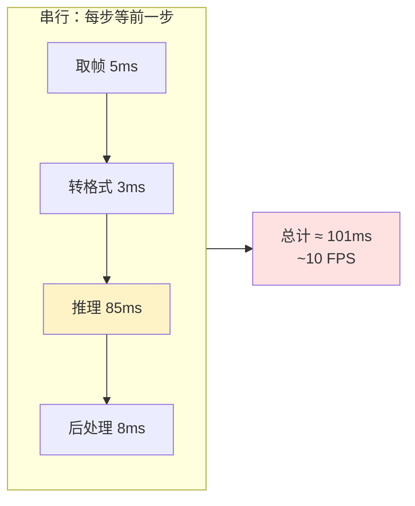
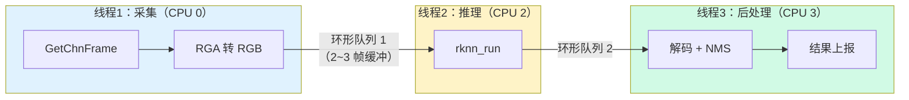
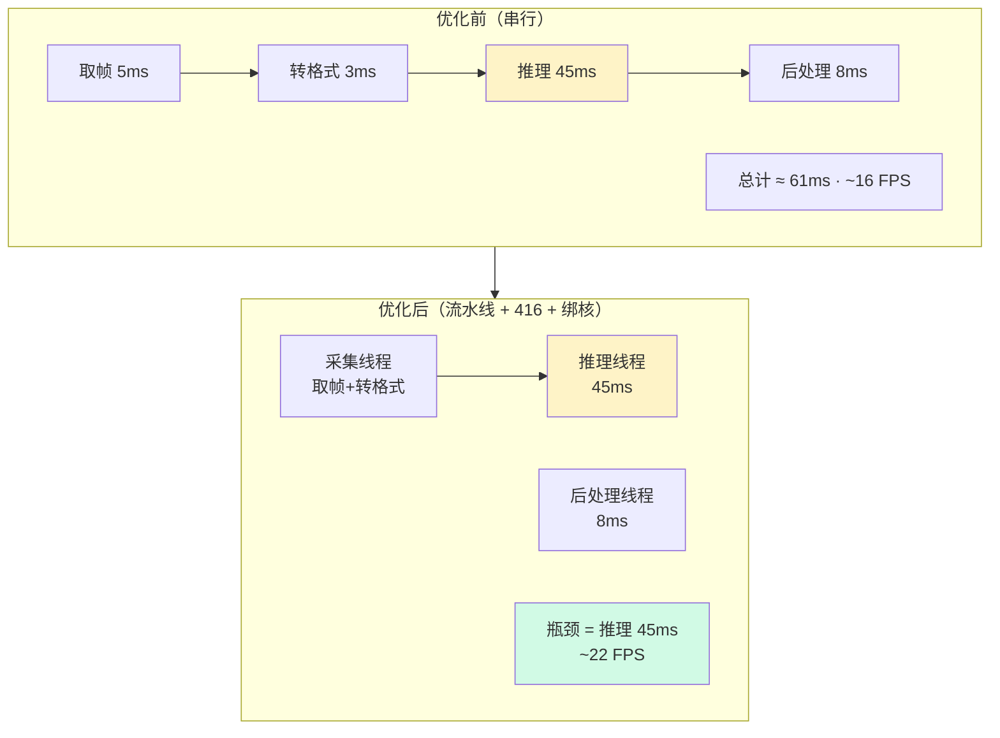

> 系列：RKNN 端侧部署实战：基于 RV1126 的模型转换与部署
> 前置：摄像头全链路已跑通，但帧率不理想
> 目标：把"能跑"优化成"跑得快、跑得稳"

## 0. 本期目标

上一期的串行循环：取帧 → 转格式 → NPU 推理 → 后处理，每一步都等上一步完成。NPU 推理 60 ms 时，CPU 全程空闲等待。

本期完成三件事：

1. 学会**量化性能**：找到瓶颈在哪一环；
2. 用**多线程流水线**让取帧、推理、后处理重叠执行；
3. 掌握**绑核**与**丢旧帧**两个工程技巧，让系统稳定。

## 1. 先量化：你的时间花在哪

不量化就优化是瞎忙。先用一个简单的性能剖面打印出每一环耗时：

```c
// perf_profile.c 核心片段
struct timespec t0, t1, t2, t3, t4;

clock_gettime(CLOCK_MONOTONIC, &t0);
RK_MPI_VPSS_GetChnFrame(VPSS_GRP, VPSS_CHN, &frame, -1);   // 取帧
clock_gettime(CLOCK_MONOTONIC, &t1);
rga_nv12_to_rgb(...);                                       // 转格式
clock_gettime(CLOCK_MONOTONIC, &t2);
rknn_run(ctx, NULL);                                        // NPU 推理
clock_gettime(CLOCK_MONOTONIC, &t3);
yolov5_postprocess(...);                                    // 后处理
clock_gettime(CLOCK_MONOTONIC, &t4);

printf("取帧=%ldus 转格式=%ldus 推理=%ldus 后处理=%ldus\n",
       ms(t1,t0), ms(t2,t1), ms(t3,t2), ms(t4,t3));
```

**典型剖面（YOLOv5s @640，一代平台）**：

```text
取帧=5ms 转格式=3ms 推理=85ms 后处理=8ms   → 串行总耗时 ≈ 101ms → ~10 FPS
```

推理占 84%，优化顺序明确：**先降推理时间，再重叠其余环节**。



## 2. 第一刀：砍推理时间

### 2.1 换输入分辨率（收益最大）

YOLOv5s @416 比 @640 推理时间大约降一半（一代平台 40~70 ms 量级）。代价是精度略降，小目标更难检。**先用 416 跑通，再评估精度是否够**。

### 2.2 换模型

| 模型 | 640 输入推理（一代平台量级） | 特点 |
|:---|:---|:---|
| YOLOv5s | 85 ms | 精度好，重 |
| YOLOv5n | 40 ms | 快，精度略降 |
| YOLOv5s @416 | 45 ms | 折中 |

**原则**：模型选择是精度/速度的工程权衡，没有银弹。用你的测试集实测，别猜。

### 2.3 NPU 频率

部分 SDK 支持通过 sysfs 调整 NPU 频率（以实际 SDK 为准）：

```bash
# 查看当前 NPU 频率
cat /sys/class/misc/rknpu/device/devfreq/*/cur_freq
# 调到最高档
echo userspace > /sys/class/misc/rknpu/device/devfreq/*/governor
echo <max_freq> > /sys/class/misc/rknpu/device/devfreq/*/userspace/set_freq
```

注意：提高频率会带来功耗和发热，IPC 类产品要结合散热评估。

## 3. 第二刀：多线程流水线

砍完推理时间后，下一个目标是把**取帧/转格式**和**推理/后处理**重叠。经典做法是**生产者-消费者流水线**：



**为什么有效**：NPU 推理时（85 ms），采集线程同时准备下一帧；后处理线程同时处理上一帧。理想情况下单帧吞吐 ≈ 最慢环节（推理），而不是各环节之和。

### 3.1 环形队列实现要点

```c
#define Q_SIZE 3   // 2~3 帧足够，太多反而增加延迟

typedef struct {
    unsigned char *buf[Q_SIZE];
    int head, tail, count;
    pthread_mutex_t lock;
    pthread_cond_t not_empty, not_full;
} FrameQueue;

// 生产者：采集线程
void queue_push(FrameQueue *q, unsigned char *frame) {
    pthread_mutex_lock(&q->lock);
    while (q->count == Q_SIZE)            // 队列满：阻塞或丢旧帧
        pthread_cond_wait(&q->not_full, &q->lock);
    q->buf[q->head] = frame;
    q->head = (q->head + 1) % Q_SIZE;
    q->count++;
    pthread_cond_signal(&q->not_empty);
    pthread_mutex_unlock(&q->lock);
}

// 消费者：推理线程
unsigned char *queue_pop(FrameQueue *q) {
    pthread_mutex_lock(&q->lock);
    while (q->count == 0)
        pthread_cond_wait(&q->not_empty, &q->lock);
    unsigned char *f = q->buf[q->tail];
    q->tail = (q->tail + 1) % Q_SIZE;
    q->count--;
    pthread_cond_signal(&q->not_full);
    pthread_mutex_unlock(&q->lock);
    return f;
}
```

**要点**：
- 队列深度 2~3 就够；太深 → 帧积压 → 延迟变大；
- 满时"阻塞等待" vs "丢旧帧"二选一，见下节；
- 帧 buffer 需要复用：推理线程用完还回空闲池，避免反复 malloc。

### 3.2 生产者-消费者时序

```text
时间轴 →

采集: [帧1]        [帧2]        [帧3]
推理:      [帧1推理]     [帧2推理]
后处理:          [帧1后处理]     [帧2后处理]

第1帧: 取帧→转格式→推理→后处理 仍是串行
第2帧起: 推理与采集重叠，吞吐提升
```

**注意**：流水线提升的是**吞吐量（FPS）**，但单帧**延迟（latency）** 不变甚至略增（排队）。安防报警类应用更关心吞吐；交互类应用更关心延迟。**两个指标要分开看**。

## 4. 第三刀：绑核与丢旧帧

### 4.1 线程绑核（pthread_setaffinity_np）

RV1126 是四核 A7。把不同线程绑到不同核，避免线程在核间迁移造成缓存失效：

```c
void bind_cpu(int core) {
    cpu_set_t set;
    CPU_ZERO(&set);
    CPU_SET(core, &set);
    pthread_setaffinity_np(pthread_self(), sizeof(set), &set);
}

// 采集线程绑核 0
// 推理线程绑核 2（尽量别和采集挤一个核）
// 后处理线程绑核 3
```

**推荐分配**：

| 线程 | 绑核 | 理由 |
|:---|:---|:---|
| 采集（GetChnFrame + RGA） | CPU 0 | 与 ISP 驱动交互，尽量固定 |
| 推理（rknn_run） | CPU 2 | NPU 本身是独立硬件，CPU 侧开销小，但保持稳定 |
| 后处理（解码+NMS） | CPU 3 | 计算密集，独占一核 |
| 系统/网络 | CPU 1 | 留给 RTSP 推流等 |

> 绑核不是银弹：如果某个核过载而其他核空闲，反而浪费。绑核前先 `top` 观察各核负载。

### 4.2 丢旧帧策略

检测类应用对实时性敏感。如果采集速度 > 推理速度，队列会积压——**处理旧帧毫无意义**，应该丢旧帧、只处理最新帧：

```c
// 队列满时：直接丢掉最旧的一帧（覆盖写）
unsigned char *queue_push_latest(FrameQueue *q, unsigned char *frame) {
    pthread_mutex_lock(&q->lock);
    unsigned char *dropped = NULL;
    if (q->count == Q_SIZE) {
        dropped = q->buf[q->tail];          // 拿走最旧的
        q->tail = (q->tail + 1) % Q_SIZE;   // 腾出位置
    } else {
        q->count++;
    }
    q->buf[q->head] = frame;
    q->head = (q->head + 1) % Q_SIZE;
    pthread_mutex_unlock(&q->lock);
    return dropped;                          // 归还空闲池
}
```

**对比**：

| 策略 | 行为 | 适用 |
|:---|:---|:---|
| 阻塞（wait） | 采集线程等推理跟上 | 需要每帧都处理（录像、计数） |
| 丢旧帧（latest） | 只保留最新帧 | 实时检测、安防告警（时效 > 完整） |

**安防告警场景选丢旧帧**：目标 0.5 秒后还在，比 0.3 秒前的一帧更有意义。

## 5. 优化前后对比



> 数字为量级示意，实际以你的板子实测为准。思路：**先砍大头（推理），再重叠其余（流水线），最后稳定系统（绑核/丢帧）。**

## 6. 常见问题

| 现象 | 原因 | 处理 |
|:---|:---|:---|
| 流水线后 FPS 没提升 | 瓶颈不在推理 / 锁竞争严重 | 先测剖面确认瓶颈；检查队列锁粒度 |
| 画面延迟大 | 队列太深 | 队列深度降到 2，或改丢旧帧 |
| 线程互相抢核 | 没绑核或绑错核 | 按上表绑核，top 观察负载 |
| 内存越用越多 | 帧 buffer 没复用 | 用完归还空闲池，避免反复 malloc/free |
| 推理时间波动大 | NPU 频率动态调节 / 温度 | 固定频率；检查散热 |

## 7. 练习与里程碑

### 练习

1. **剖面**：打印各环节耗时，画出你自己的耗时饼图，找出瓶颈；
2. **降分辨率**：YOLOv5s @416 vs @640 实测推理时间与精度差异，记录数据；
3. **流水线**：把串行循环改造成三线程流水线，测 FPS 提升百分比；
4. **绑核实验**：分别测"不绑核 / 按推荐表绑核"的 FPS 和抖动，用数据验证；
5. **丢帧实验**：故意让采集 30 FPS、推理只能处理 15 FPS，对比阻塞与丢旧帧两种策略下的"画面新鲜度"。

### 里程碑自检

- [ ] 能说出性能优化的正确顺序（先量化 → 砍大头 → 重叠 → 稳定）
- [ ] 能画出三线程流水线结构图
- [ ] 能区分吞吐（FPS）与延迟（latency）
- [ ] 能写出绑核代码
- [ ] 能说出丢旧帧 vs 阻塞的适用场景

## 8. 小结

- **先量化**：剖面打印各环节耗时，优化要有数据支撑；
- **砍大头**：推理占 80%+，换分辨率/换模型/调 NPU 频率；
- **重叠**：采集 / 推理 / 后处理三线程流水线，队列深度 2~3；
- **稳定**：绑核减少迁移抖动；实时场景丢旧帧保新鲜；
- **指标**：吞吐（FPS）和延迟（latency）分开看，别混淆。

优化到这里，单帧检测、实时管线、性能调优三块能力已经齐了。把这些能力组装成一个完整的产品原型——人形检测周界报警，从需求分析到演示交付，就是收官实战的练习场。

> 🏷️ 标签：#RKNN #性能优化 #多线程 #流水线 #绑核 #丢帧
